## 01. （掌握）开发自己的第一个网页

### 记事本开发网页

- 新建一个 `.txt` 文件

	- 在其中添加一些文字，比如：“**Hello, World!**”；
	- **保存文件**；
	- 将文件的**扩展名修改为 `.html`**；
	- 使用**浏览器打开文件**；

	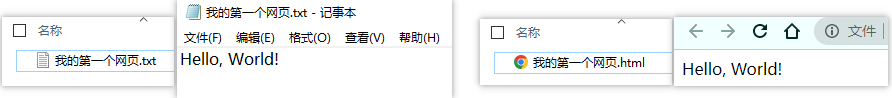

- 这个网页有什么缺点？

	- 只能显示**一段普通的文本**；

	- 浏览器不知道是否要对这段**文本加粗、放大、段落之间添加间距**；

		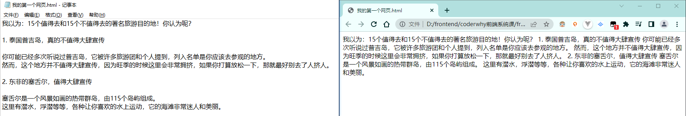

### 案例——显示一条新闻

- 如果我们现在**有一条新闻需要显示**，那么可以通过**某些“元素”**来告知浏览器这部分**内容如何显示**：

	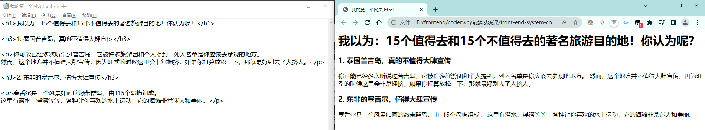

- 而我们编写的 `<h1></h1>`、`<h3></h3>`、`<p></p>` 就是 `HTML` 元素。

## 02. （掌握）`HTML` 语言和基本结构

### 认识 `HTML`

- **超文本标记语言**（`HyperText Markup Language`，简称：`HTML`）是一种用于创建**网页**的标准**标记语言**；
	- `HTML` 元素是构建网站的基石；
- 什么是**标记语言**（`markup language`）？
	- 由**标记（标签、`tag`）**组成；
	- 是**对某些内容进行特殊地标记**，以供其它**解释器识别处理**；
	- 比如使用 **`<h2></h2>`** 标记的文本会被识别为“**标题**”进行**加粗、文字放大**显示；
	- **标签和内容**共同组成了**元素**（`element`）；
	- 标记语言不是编程语言，但属于计算机语言，因为它可以和计算机进行沟通；
- 什么是超文本（`HyperText`）？
	- 表示不仅仅可以插入**普通的文本（`Text`）**，还可以插入**图片、音频、视频**等内容；
	- 还可以表示**超链接**（`HyperLink`），从一个网页跳转到另一个网页；

### `HTML` 文件的特点

#### 扩展名（后缀名）

- `HTML` 文件的扩展名是 **`.htm` 或者 `.html`**
	- 因历史遗留问题，早期的操作系统（比如 `Win95`、`Win98`）的文件扩展名不能超过 `3` 个字符，所以使用 `.htm`；
	- 现在统一使用 **`.html`**；

#### 结构

- 京东官网：

	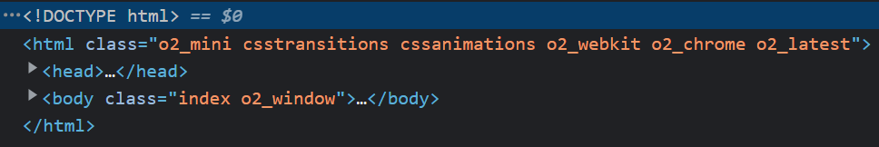

- 小米官网：

	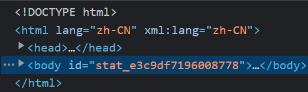

- 英雄联盟官网：

	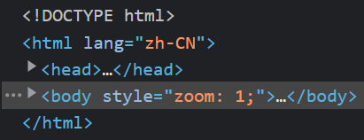

- 它们有什么共同点呢？

	- 最外层都是一个 `html` 元素，`html` 元素里面又包含了一个 `head` 元素和一个 `body` 元素；

	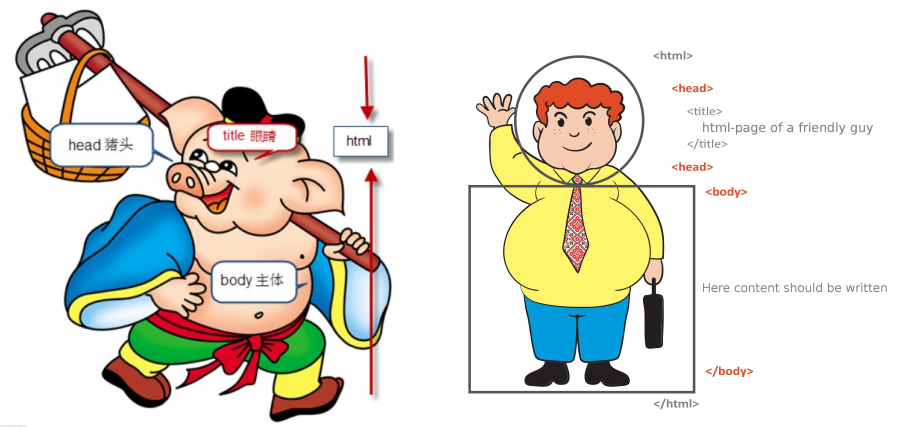

### 改进自己的网页

- 修改自己的网页代码，让自己的网页也具备正确的结构：

	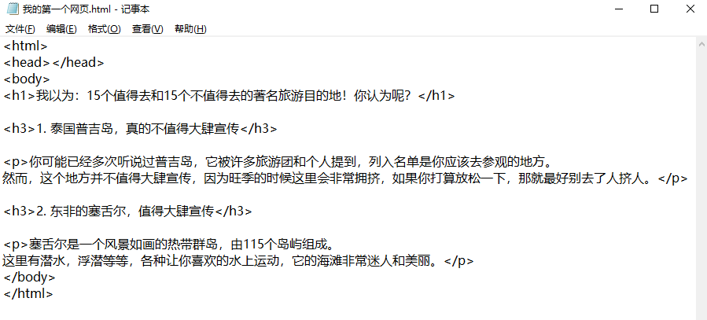

- 虽然运行效果和修改前的一样，但是现在我们的网站也有正确的结构了（修改前网站也可能有正确的结构，但那是浏览器帮我们自动加上去的）：

	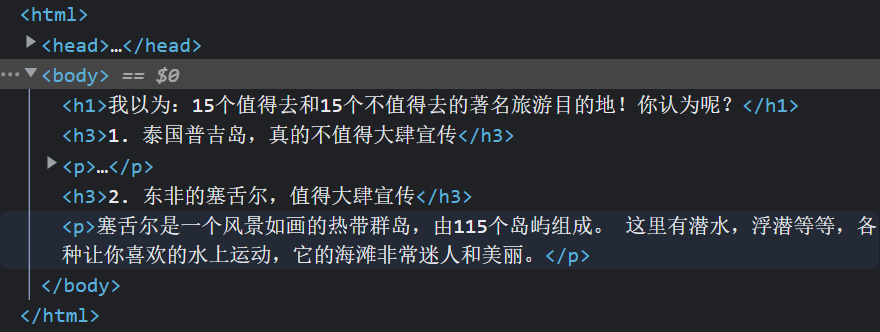

- 那么，`head` 元素用来干嘛呢？

	- `head` 元素中一般会放一些网页的**元数据**（`metadata`，即描述数据的数据），就是说在对整个网页中的某些东西进行描述时就可以在 `head` 中写一些元数据，比如网页的标题：

		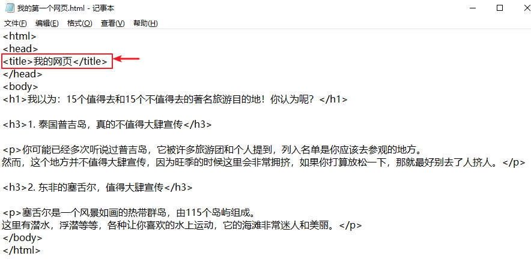

		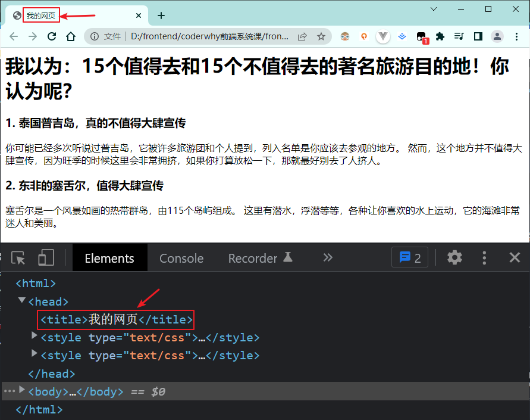

### 小结

一个完整的 `HTML` 文档最基本的结构是这样的：

- 最外层是一个 `html` 元素；
- `html` 元素中包含两个东西：一个是 `head` 元素，一个是 `body` 元素；
- `head` 元素中放网页的元数据，`body` 元素中放网页展示的内容；

## 03. （掌握）`VS Code` 的安装-插件-配置

我们会发现，如果按照前面的方式（记事本编写网页）来开发网页，效率太低了，阅读性也很差。所以我们会选择专业的开发工具来进行开发。

### 开发工具的选择

- **记事本可以开发一个网页吗？**答案：**可以**。但是有很多的缺点：
	- 创建和管理文件不方便；
	- 没有颜色标识，没有智能提示，也无法调试程序；
- **专业的前端开发工具**：
	- **`WebStorm`、`Sublime Text`、`Visual Studio Code`**、`Atom`、`HBuilder`、`IntelliJ IDEA`、`Dreamweaver`；
	- 优势：智能提示、高亮识别、语法检测、集成环境、开发效率高；
- **上课推荐的开发工具**：
	- `WebStorm`
		- 优点：集成开发工具，包罗万象；
		- 缺点：重（占用系统资源多），收费；
	- **`VS Code`（上课使用）**
		- 优点：轻（相当于一个编辑器），免费；
		- 缺点：需要安装一些插件来辅助开发；

### `VS Code` 工具安装

- `VS Code` 编辑器下载安装地址：https://code.visualstudio.com/
- 安装插件（增加功能）：点击左侧图标最后一项（`Extensions`），查找需要的插件（需要联网）
	- 中文插件：`Chinese`；
	- 颜色主题：`Atom One Dark`；
	- 文件图标主题：`VSCode Great Icons`；
	- 在浏览器中打开网页：`open in browser`、`Live Server`；
	- 自动重命名标签：`Auto Rename Tag`；
- `VS Code` 的配置：
  - `Auto Save`：自动保存；
  - `Font Size`：修改代码字体大小；
  - `Word Wrap`：代码自动换行；
  - `Render Whitespace`：空格的渲染方式（个人推荐）；
  - `Tab Size`：代码缩进
    - 推荐 `2` 个空格（公司开发项目基本都是 `2` 个空格）


### 中文时使用英文标点

开发中，很多标点符号都需要是英文标点符号，为了方便我们在输入中文时还是使用英文标点，可以对输入法进行设置（以搜狗输入法为例）：

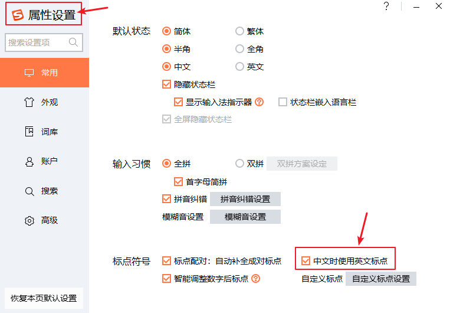

## 04. （掌握）`HTML` 元素的结构分析和单双标签分类

### 认识元素

- 我们会发现 `HTML` 本质上是由一系列的**元素（`Element`）**构成的；
- 什么是元素（`Element`）呢？
	- **元素**是网页的一部分；
	- 一个元素可以**包含一个数据项，或是一块文本，或是一张图片，亦或是什么也不包含**；
- 那么 `HTML` 有哪些元素呢？
	- https://developer.mozilla.org/zh-CN/docs/Web/HTML/Element
- 我们会发现元素非常多，这么多能记得住吗？
	- **常用的**，用得多了自然就记住了；
	- **不常用的**，知道在哪里查找即可；

### 元素的组成

- 剖析一个 `HTML` 元素的组成[^1]：

	

- 这个元素的主要部分有：

	1. **开始标签（`Opening tag`）**：包含元素的名称（本例为 `p`），被左、右尖括号所包围。表示元素从这里开始或者开始起作用——在本例中即段落由此开始。
	2. **结束标签（`Closing tag`）**：与开始标签相似，只是其在元素名之前包含了一个**斜杆**。这表示着元素的结尾——在本例中即段落在此结束。初学者常常会**犯忘记包含结束标签的错误**，这可能会产生一些奇怪的结果。
	3. **内容（`Content`）**：元素的内容，本例中就是所输入的文本本身。
	4. **元素（`Element`）**：开始标签、结束标签与内容相结合，便是一个完整的元素。


### 单标签元素 - 双标签元素

- **双标签元素**：我们会发现前面看到的大部分元素都是双标签的：

	- `html`、`head`、`body`、`h2`、`p`、`a` 元素等等；

- **单标签元素**：也有一些元素是只有一个标签：

	- `meta`、`img`、`input`、`hr`、`br` 等等；

		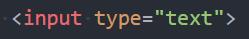

- 注意事项：

	1. `HTML` 元素不区分大小写，但是**推荐小写**，因为大写阅读性稍微差了点；

	2. 单标签元素可以在结束标签的右尖括号前添加 `/`：

		```html
		
		<!-- 或者： -->
		
		```

		但这是早期的写法（特别是在 `XHTML` 中，规定必须这样写），但现在**不需要加 `/`** 了。

## 05. （掌握）`HTML` 元素的属性和属性分类

### 元素的属性

- **元素也可以拥有属性（`Attribute`）**[^1]：

	

- 属性包含元素的额外信息，这些信息不会出现在实际的内容中（即属性包含的信息在一般情况下浏览器是不会展示出来的）。

- 什么时候写到属性中，什么时候写到内容中呢？

	- 内容一般是在页面中会实际展示出来的东西；
	- 属性一般是对当前元素做得一些补充信息；
	- 比如说我们现在想要识别出上图中的 `p` 元素，我们可以给它添加一个 `class` 属性，后面我们就可以使用 `CSS` 里的类选择器来找到这个 `p` 元素，那么这里添加的 `class` 属性相当于给 `p` 元素添加了一个标记，但这个 `class` 属性包含的信息本身不会在浏览器页面中被展示出来；
	- 但也有一些特殊情况，比如 `img` 元素，它属于可替换元素（`replaced element`），它的 `src` 属性包含的信息就会在浏览器页面中被展示出来；
	- 一般情况下，我们给元素增加属性都是为了给它添加一些标记，或者给它额外设置一些东西；
	- 一般没有属性的情况下，不影响元素要展示的内容，因为内容是写在开始和结束标签之间的；

- **一个属性必须包含如下内容**：

	1. **空格**，在元素名称和属性之间（如果已经有一个或多个属性，就与前一个属性之间有一个空格）；
	2. **属性名称**，后面跟着一个等于号；
	3. **属性值**，由一对引号（`""`）引起来（也可以使用单引号 `''`，但一般使用双引号 `""` 会更多一点）；
	
- 创建一个超链接元素 `a`：

  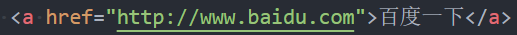

### 属性的分类

- 有些属性是**公共的，每一个元素**都可以设置；
	- 比如 **`class`、`id`、`title`** 属性；
- 有些属性是**某个或某些元素特有的，不是每一个元素**都可以设置；
	- 比如 **`meta` 元素的 `charset` 属性、`img` 元素的 `alt` 属性**；
- 不用去记忆，后续学到的时候自然就知道了；

### 元素的结构总结

- 元素的结构[^2]回顾：

	

## 06. （掌握）`HTML` 元素的嵌套和关系

- 某些元素的内容除了可以是文本之外，还可以是其它元素，这样就形成了**元素的嵌套**。

	

- 元素之间的关系：

	- **父子关系**
		- 比如上图中的 `ul` 和 `li`、`li` 和 `div` 之间；
	- **兄弟关系**
		- 比如上图中的两个 `div` 之间、两个 `span` 之间；
		- 注意：两个元素必须有同一个父元素时，才是兄弟关系；

## 07. （掌握）注释的作用和 `HTML` 的注释

### 为什么需要注释

- 程序员才懂的笑话：

	- 在我写这段代码的时候，只有我和上帝知道这段代码是什么意思；
	- 一段时间之后，只有上帝知道是什么意思了；

	

- 为什么会出现这样的情况呢？

	- 随着学习的深入，你的一个程序**不再是几行代码**就可以搞定的了；
	- 我们可能需要写出有**上千行，甚至上万行**的程序；
	- 某些代码完成某个功能后，你写的时候思路很清晰，但是**过段时间会出现忘记为什么这样写的情况**，这很正常；

- 如何防止这种情况呢？

	- 最好在写代码时，命名的时候命名的非常规范，做到见名知意；
	- 给代码加上注释；
	- 等等

- 协同开发

	- 在实际工作中，一个项目通常是**多人协作完成**的，可能是**几个或者十几个人**；
	- 这个时候，你可能需要**使用别人写出的代码功能，别人也可能使用你的代码功能**；
	- 如果你的代码**自己都看不懂**了，更何况**你的同事**呢？

### `HTML` 的注释

- 什么是注释？
	- 简单来说，注释就是一段代码说明；
	- **`<!-- 注释内容 -->`**
	- 注释是只给开发者看的，浏览器并不会把注释显示给用户看；
- 注释的意义：
	- 帮助我们自己理清代码的思路，方便以后进行查阅；
	- 与别人合作开发时，添加注释可以减少沟通成本（同事之间分模块开发）；
	- 开发自己的框架时，加入适当的注释，方便别人使用和学习（开源精神）；
	- 可以临时注释掉一段代码（暂时不用，以后可能会用），方便调试；
- 注释快捷键：`Ctrl` + `/`


[^1]: https://developer.mozilla.org/zh-CN/docs/Learn/Getting_started_with_the_web/HTML_basics#html_%E5%85%83%E7%B4%A0%E8%AF%A6%E8%A7%A3
[^2]: https://developer.mozilla.org/zh-CN/docs/Glossary/Element


[^1]: 
[^2]: 
