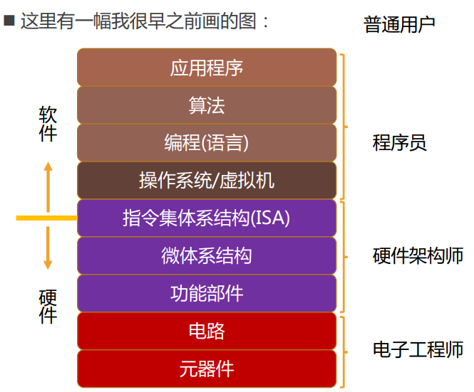
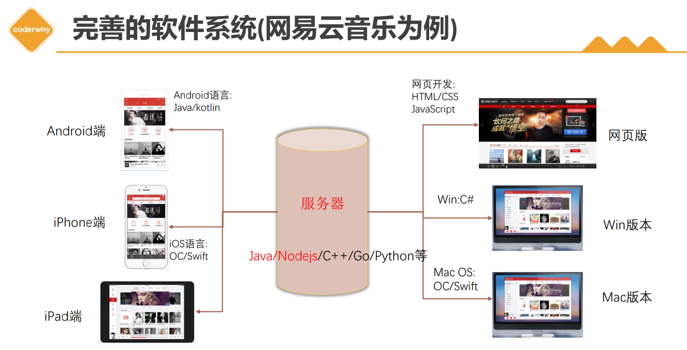
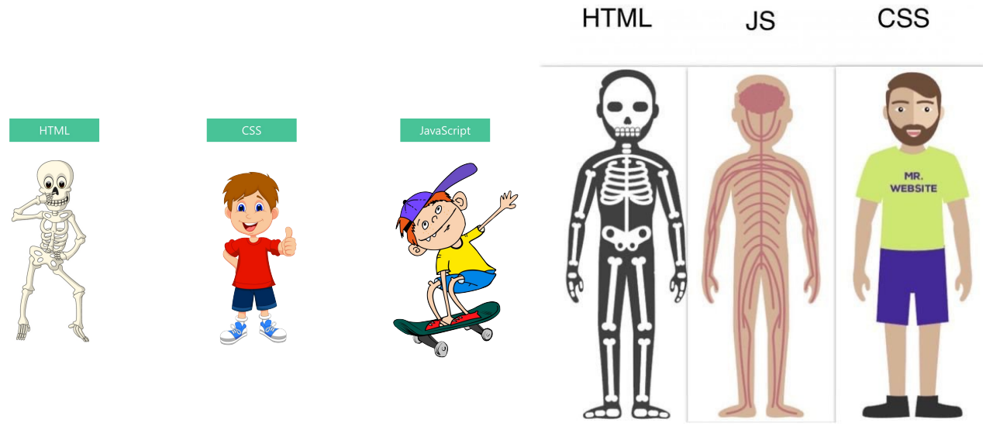

# day01 作业布置

## 一. 说出软件和应用程序的区别？（自己整理）

生活中的软件：微信、抖音、淘宝、`PPT`、`VS Code` 等等；

- 首先，软件的专业定义是这样的：一系列按照特定顺序组织的**计算机数据和指令**，是计算机的**非有型部分**；
- 那么软件开发是什么呢？就是**告诉计算机一系列的指令**，这些指令也称之为**程序**；
- 开发软件的人就称之为**软件开发工程师**，也称之为**程序员**；

那么，软件和应用程序有什么区别？

- 软件是一个体系，包括从操作系统/虚拟机往上，我们使用的编程语言，编写代码时用到的算法，到最上层的应用程序，都属于软件中的内容；
- 所以软件可以理解为是面向程序员的；
- 而应用程序属于软件中最上层的一部分，是面向普通用户的。




## 二. 说出一个完善的应用系统包含哪些环节？

- 服务器开发；
- `Web` 端开发；
- 移动端（`Android`、`iOS`）开发；
- 桌面端（`Windows`、`macOS`）开发；




## 三. 整理出网页从编写到浏览器显示的整个过程（重要）。

- 首先，前端工程师开发项目（`HTML`、`CSS`、`JavaScript`、`Vue`、`React`），然后打包、部署项目到服务器中；
- 之后用户就可以在浏览器中**输入一个网站**（`URL`）；
- 浏览器会找到对应的**服务器地址**（实际上是经域名系统（`DNS`）解析后获得目标 `ip` 地址，然后会找到该 `ip` 地址对应的主机（即前面我们部署了前端项目的那台服务器））；
- 向这台服务器请求**静态资源**（`HTML`、`CSS`、`JS`）；
- 服务器**返回静态资源给浏览器**，浏览器下载静态资源；
- 浏览器**对静态资源进行解析和展示**；


## 四. 服务器是什么？说出你的理解

- 我们在**日常生活**中接触到的基本上都属于**客户端、前端**的内容：

	- 比如浏览器、微信、`QQ	`、小程序；

- 我们知道自己的**手机不可能存放那么多的数据和资源**：

	- 比如你用 `QQ` 音乐，音乐数据大部分都是存储在**服务器**中的；

- 那么服务器到底是什么呢？

	- 服务器是用来提供服务的，可以存储大量数据；

	- 服务器本质上也是一台类似于你电脑一样的主机，但是这个主机有几个特点：
		- `24` 小时不关机的（稳定运行）；
		- 没有显示器的；
		- 一般安装的是 `Linux` 操作系统（比如 `CentOS`）；


	- 开发中，我们可能会使用公司（一些大公司、国企）自己的服务器，以保证数据的安全，也可能使用云服务器（中小企业用得较多），以节省成本；


## 五. 网页的三大组成部分是哪些？分别说出他们的作用。

- `HTML`
	- 网页的**内容结构**；
- `CSS`
	- 网页的**视觉效果**；
- `JavaScript`
	- 网页的**交互处理**；




## 六. 浏览器内核是什么？有哪些常见的浏览器内核？

浏览器内核也称为浏览器的渲染引擎，负责**解析网页语法**（`HTML`、`CSS`、`JavaScript`），并**渲染（显示）网页**，它是浏览器最核心的部分。

- 常见的浏览器内核：
	- `Trident`：`IE` 浏览器、`360` 安全浏览器、搜狗高速浏览器、百度浏览器、`UC` 浏览器；
	- `Gecko`：`Firefox` 浏览器；
	- `Presto`：`Opera` 浏览器；
	- `Webkit`：`Safari`、`360` 极速浏览器、搜狗高速浏览器、移动端浏览器；
	- `Blink`：`Chrome` 浏览器、`Edge` 浏览器等等；

不同的浏览器内核有不同的解析、渲染规则，所以同一网页在不同内核的浏览器中的渲染效果也可能不同。


## 七. 手动编写出HTML页面的结构（不利用开发工具提示）

```html
<html>
	<head>
    <title>我的第一个网页</title>
  </head>
  <body>
    <h1>我是一级标题</h1>
  </body>
</html>
```


## 八. 元素的结构是什么？有哪些单标签元素、双标签元素？

- 元素的结构是这样的：
	- 一个开始标签和一个结束标签以及它们中间的内容，然后开始标签上还可以添加一些元素的属性；
- 单标签元素：
	- `meta`、`input`、`img`、`hr`、`br` 等等；
- 双标签元素：
	- `html`、`head`、`body`、`a`、`p`、`div` 等等；


## 九. 元素之间有哪些关系？写出一个例子，并且说明他们的关系。

- 元素之间有哪些关系

	- 父子关系；
	- 兄弟关系；

- 举例：

	```html
	<html>
		<head></head>
	  <body>
	  	<ul>
	      <li>
	      	<div>
	          <span>篮球</span>
	          <span>足球</span>
	          <span>排球</span>
	        </div>
	        <div></div>
	        <div></div>
	      </li>
	    </ul>
	  </body>
	</html>
	```
	
	父子关系：比如上面的 `ul` 和 `li`，`li` 和 `div`，`div` 和 `span`；
	
	兄弟关系：比如上面的 `head` 和 `body`，`div` 和 `div`，`span` 和 `span`；
	
- 注意：两个元素必须有同一个父元素时，才是兄弟关系；


## 十. 注释的作用，HTML的注释如何编写。

- 为什么需要注释？
	- 实际开发中，我们可能需要写**上千甚至上万行**代码的程序；
	- 在编写某段代码完成某个功能时，你的思路很清晰，但是**过了段时间你可能会出现忘记这段代码为什么这样写**的情况；
	- 使用注释就可以避免这种情况的发生；

- 注释的作用
	- 给一段代码添加说明，方便了解一段代码的作用；
	- 帮助我们自己理清代码的思路，方便以后进行查阅；
	- 与别人协同开发时，添加注释，可以减少沟通成本；
	- 方便调试，有些代码可能暂时不需要，但后面可能会用到，那么可以临时注释掉这段代码；
	- 开发自己的框架时，加入适当的注释，方便别人学习和使用；
- `HTML` 的注释：
	- `<!-- 这里写注释的内容 -->`
	- `VS Code` 中 `HTML` 注释的快捷键是：`Ctrl` + `/`
- 注释只是给开发者看的，浏览器并不会把注释显示给用户看；


