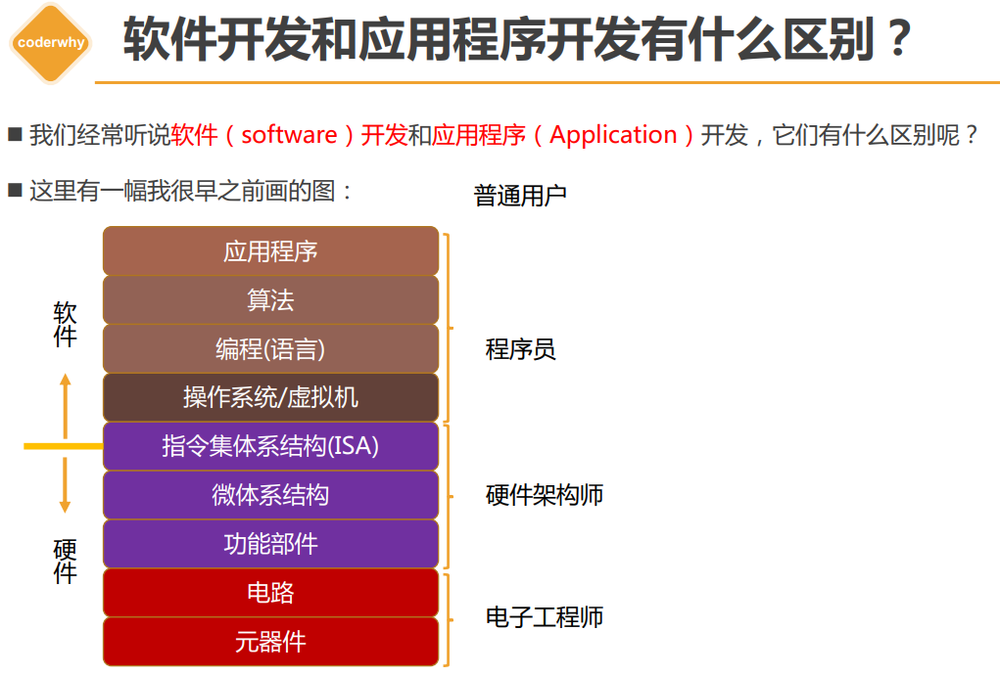
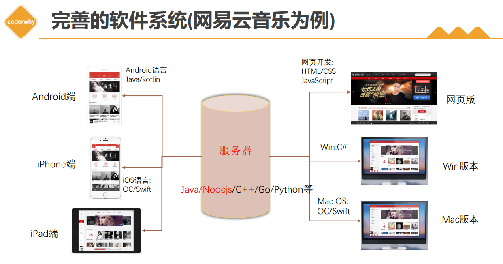
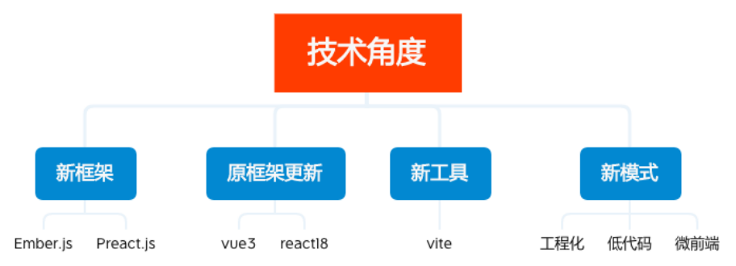
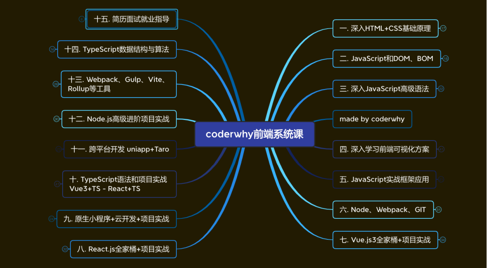
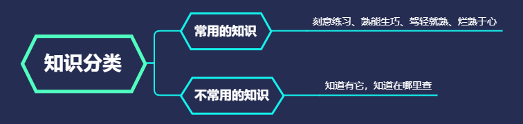

## 01. 自我介绍和课前提醒

- 软件开发和应用程序开发之间的关系和区别是什么？
- 你的职业规划是什么？
- 什么是**软件开发**？什么是**应用程序**？什么是**前端工程师**？
- 一个网页从你开始**编写的那一刻**到**用户浏览器**上可以显示，它**经历了什么样的一段旅程**？
- 什么是 `HTML`、什么是 `CSS`，这些东西给到浏览器后，**浏览器到底是如何给你显示**的？
- 技术的历史是什么样的？为什么会变成现在的模样？

注意：

- 开发规范、代码规范、封装思想；

补充：

- 网络协议、操作系统、编译原理、数据结构；

保持“空杯”心态，才能持续不断的进步。

## 02. （了解）软件开发和程序员

软件开发包含了操作系统/虚拟机、编程（语言）、算法、应用程序等内容，它是面向程序员；应用程序属于软件开发的一部分，它是面向普通用户的。

## 03. （理解）软件体系划分和前端开发工程师

完善的软件系统：

开发系统中各个环节的不同部分都属于**软件开发**，这些开发者我们称之为**软件开发工程师**。

按照**职能的不同**，可以划分为两类：

- **后端**（**back-end**）开发，称之为**后端开发工程师**；
- **前端**（**front-end**）开发，称之为**前端开发工程师**；

前端开发工程师：

- 主要负责 `Web` 端（网站、后台管理系统、手机 **H5**）和**小程序**端；
- 也可以做：移动端（**Uniapp**、**Reactive Native**）、桌面端（**Electron**）、服务器开发（**Node.js**）；

## 04. （了解）前端发展路线和课程大纲

### 前端行业发展怎么样？

- 为什么要聊这个话题？

	- 时代的一粒灰，落在个人头上，就是一座山；
	- 如果行业发展已经停滞，甚至是倒退，没有需求，那么你如何努力也改变不了现状；

- 技术角度：

	- 新框架（`Ember.js`、`Preact.js`）、框架更新迭代（`Vue 3`、`React 18`）、新工具（`Vite`）、新模式（工程化、低代码、微前端）层出不穷；

		

- 市场需求：

	- 人才需求大、薪资高（前端开发要求变高）；

### 技术发展线路

- 初级程序员（薪资 `6k~10k`，`1~2` 年）
	- 写一些**简单的业务**，负责项目某些**模块的开发、维护**；
	- 遇到**很多问题不知道如何处理**，需要**查询资料或者交流后**可以解决；
	- 代码通常写得杂乱无章，**能用就行**！
- 中级程序员（薪资 `10k~20k`，`2-4` 年）
	- 可以**独立负责中小型项目**，负责**公司项目核心业务的开发、维护**；
	- 遇到大多数问题可以**自行查到解决方案**，有一定的**自学能力**，通过**官网文档可以自学**；
	- 代码**质量较高**，遵守**代码规范**，并且会对**组内其他人的代码有要求**；
- 高级程序员（薪资 `20k~50k`，`4~6` 年）
	- 独立**负责中大型项目**，可以为公司项目**搭建架构**，创建**内部的脚手架**、公司**内部的 `UI` 框架**；
	- 可以**读懂框架源码**，并且从**一些开源框架中借鉴优秀的设计、架构和思想**；
	- 公司的**核心员工**，具备**不可替代性**，成为**公司技术不可或缺**的一部分；
- 系统架构师（`50k~`）
	- 可以对**大型项目进行系统架构**，**不再局限于某个领域**（前端、后端？）或者**某项技术**（`JavaScript`、`Java`、`C++`？）；
	- 对技术领域**现有技术方案进行评估**，对**不同的场景给出对应的解决方案**；
	- 确定**项目最终方案**，并且对整个项目进行“**核心架构**”（包括完成**核心架构实现的能力**）；
	- 保证项目的**各个环节有序进行**，包括项目的**高性能**、**高可用**、**可扩展能力**；
- 资深技术专家（`50k~`）
	- 专注于某一个特定领域
		- 比如前端包括但不限于**对框架源码、`Node.js`、`js` 引擎进行定制化需求、优化**；
		- 比如后端包括但不限于 **`JVM`、线程池、`SQL` 调试、优化**；
		- 比如可以主导公司项目**某些特定领域技术的落地**，类似**流媒体、即时通信技术**等；
	- 某些人在行业内有一定的影响力，是某一块技术领域的 Top 人物；

核心：`HTML`、`CSS`、`JS`

`Vue` 和 小程序学好，北上广 `16k ~ 18k`

`Vue`、`React`、`TS`、小程序学好，`20k+` 没有问题

进阶：`Webpack`、`Node`、数据结构、算法

## 05. （掌握）学习方法 - 学习建议

智商：认真、努力、专注（大多数人还不到拼天赋的程度）

`《JavaScript 高级程序设计》` 的作者 `Nicholas C.Zakas` 在他的博客中有说到：**想要全面地掌握 `JavaScript`，关键在于弄清楚它的历史、局限性和本质。**

不仅仅局限于 `JavaScript`，而是对任何技术都是适用的（学习任何新的东西，最好了解它的历史、局限性、本质）。

自己整理的东西才是真正属于你自己的。

自己要多种分类归纳总结。

“自觉”：自己觉得自己知道，但要真正掌握它，需要“觉它”：亲身去感受它，去实践。

标注：

- 掌握：必须完全掌握，烂熟于心；
- 理解：理解过程原理（面试有可能会问到的）；
- 了解：知道有这么回事；

每天进步一点点。

