## 01. （掌握）电脑配置和安装的软件

### 电脑配置——显示隐藏文件和扩展名

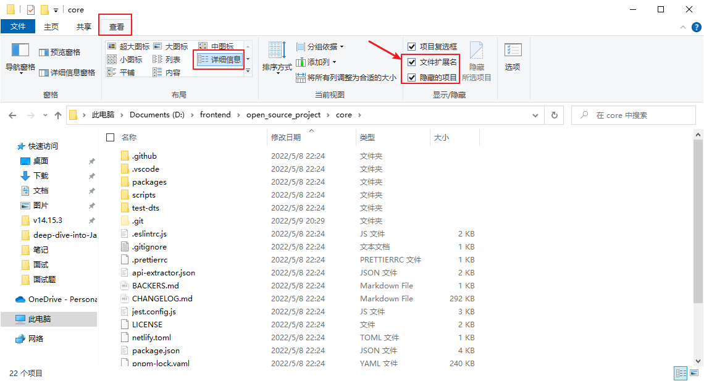

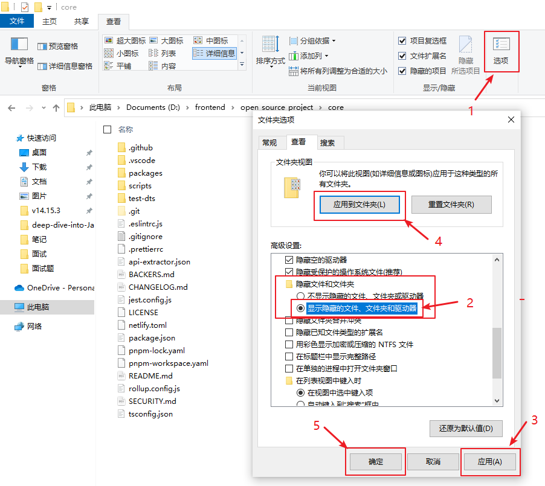

### （暂时）推荐安装的软件

- `Chrome` 浏览器：开发必备浏览器
	- 下载地址：https://www.google.cn/chrome/index.html
- `VS Code` 编辑器：开发推荐编辑器（编写代码）
	- 下载地址：https://code.visualstudio.com/
- `XMind` 思维导图：思维导图笔记
	- 下载地址：https://xmind.cn/
- `Typora`：`Markdown` 笔记软件
	- 下载地址：https://typora.io/releases/all

## 02. （掌握）网页显示的过程和服务器

### 认识网页和网站

什么是网页？

- 网页的专业术语叫做 **`Web Page`**；
- 打开浏览器**查看到的页面**，就是网页，即网页中的**一“页”**；
- 网页的内容可以非常丰富：包括**文字、链接、图片、音乐、视频**等等；

什么是网站？

- 网站是由**多个网页组成**的；
- 通常一个网站由 `n` 个网页组成（`n >= 1`）；

### 网页的显示过程（用户角度）：

1. 用户在浏览器中**输入一个网站地址**（域名）；
2. 通过 `DNS`（**Domain Name System**，域名系统）服务器把域名解析成 `ip` 地址；
3. 浏览器会**找到该 `ip` 地址对应的服务器**，向它请求**静态资源**（`HTML`、`CSS`、`JavaScript` 等文件，后续将它们下载下来后一般都是不会再去修改它们的，所以称之为静态资源，这里的静态是相对于动态而言的，比如后面我们会讲到 `API` 服务器，它提供的资源通常就是动态的数据）；
4. 服务器**返回静态资源给浏览器**，浏览器下载静态资源；
5. 浏览器**对静态资源进行解析和展示**（浏览器的渲染引擎会解析 `HTML` 和 `CSS`，浏览器的 `JS` 引擎会解析 `JS` 代码，等到把这些东西解析完之后，就会把页面展示出来了）；

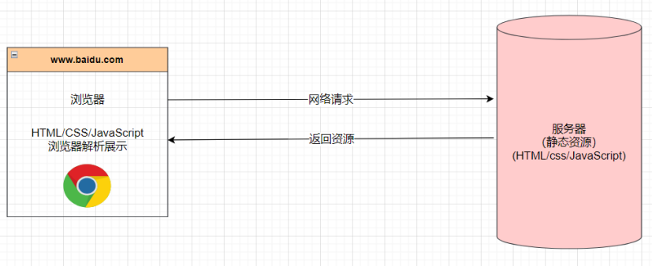

那么，**服务器上的静态资源从哪里来**呢？

这就需要从前端工程师的角度来看了。

### 网页的显示过程（前端工程师角度）：

1. **开发项目**（`HTML`、`CSS`、`JavaScript`、`Vue`、`React`...）；
2. **打包、部署项目**到服务器里面；

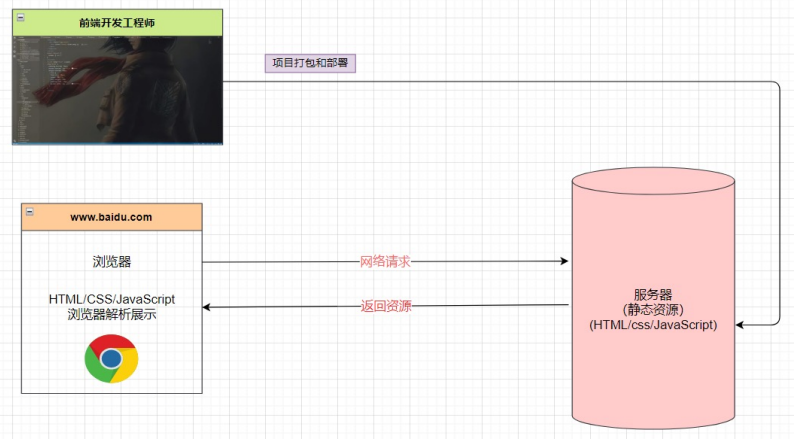

那么，服务器是什么？

### 服务器是什么

- 我们**日常生活**中接触到的基本都属于**客户端、前端**的内容：

	- 比如浏览器、微信、`QQ`、小程序；

- 我们知道自己的**手机不可能存放那么多的数据和资源；**

	- 比如你用 `QQ` 音乐，音乐数据大部分都是存放在**“服务器”**中的；

- 那么**服务器到底是什么**呢？

	- 服务器本质上也是一台**类似于你电脑的主机**；
	- 但是这个主机有**几个特点**：
		- `24` 小时不关机的（稳定运行）；
		- 没有显示器的；
		- 一般装的是 `Linux` 操作系统（比如 `CentOS`）；

	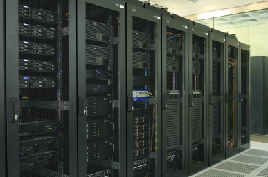

- 那么我以后到公司是不是就能看见服务器了呢？

	- 目前大部分公司用的是**云服务器**（比如阿里云、腾讯云、华为云）；

## 03. （掌握）网页的三大组成部分分析

#### 世界上第一个网站

世界上第一个网站：http://info.cern.ch，作者：`Tim Berners-Lee`：

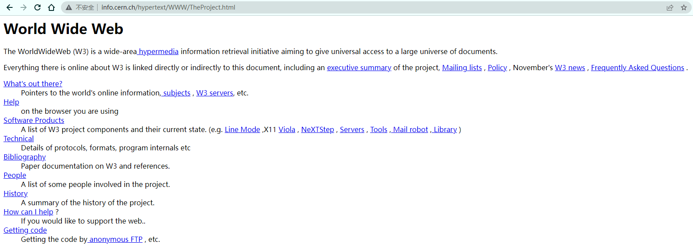

虽然目前我们会认为这个网页简单到不值一提，但是在当时它的发明是“天才之作”。

#### 现代的网页已经非常复杂

#### 网页的组成

那么网页是由什么开发出来的呢？

- 阶段一：`HTML` 元素；
- 阶段二：`HTML` 元素 + `CSS` 样式;
- 阶段三（也是目前所处的阶段）：`HTML` 元素 + `CSS` 样式 + `JavaScript` 语言；

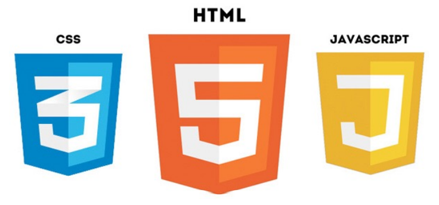

1. `HTML`：网页的**内容结构**；
2. `CSS`：网页的**视觉体验**（即为网页添加样式，让网页变得更加好看些）；
3. `JavaScript`：网页的**交互处理**（比如通过 `js` 的 `ajax` 向服务器请求数据来展示网页中的一些动态数据），可以认为是前端的灵魂；

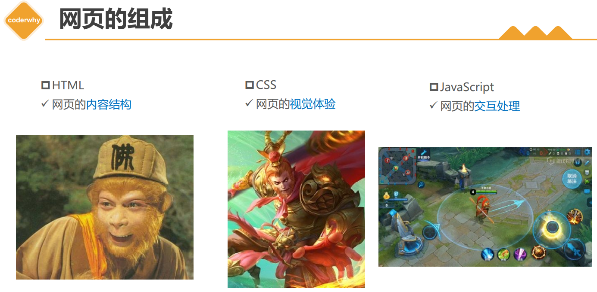

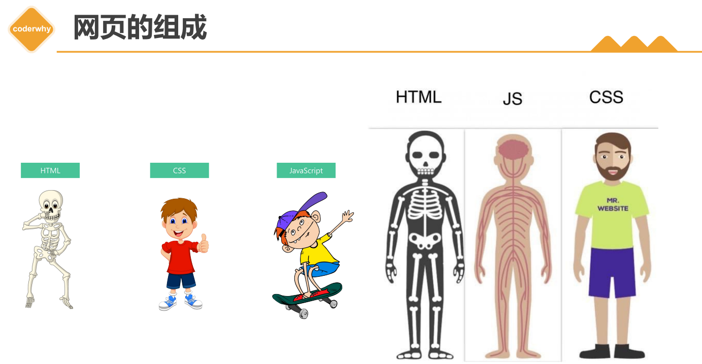

##### 网页源代码的角度

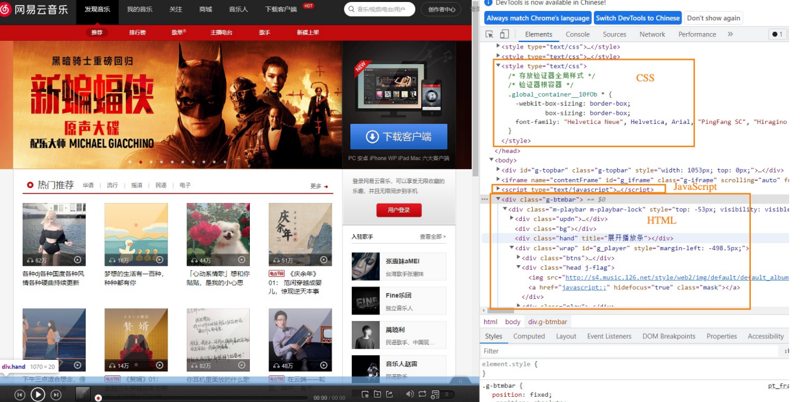

##### 网页开发的角度

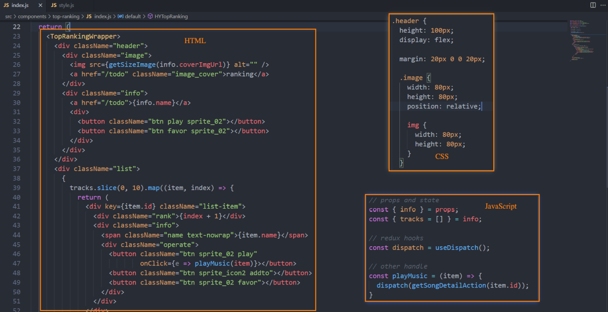

## 04. （掌握）`Typora` 工具的使用和内容回顾

## 05. （掌握）浏览器和浏览器内核

### 浏览器的作用

- 我们已经明确知道了**网页的组成部分**：`HTML` + `CSS` + `JavaScript`；

- 那么这些**看起来枯燥的代码**，是如何**被渲染成多彩的网页**的呢？

	- 我们知道是通过**浏览器**来完成的；

	

- 而浏览器最核心的部分其实是“**浏览器内核**”。

### 浏览器的渲染引擎

- 浏览器最核心的部分是**渲染引擎**（`Rendering Engine`），一般也称为“浏览器内核”；

	- 负责**解析网页语法**（主要是 `HTML`、`CSS`、`JavaScript`），并**渲染（显示）网页**；

- 常见的浏览器有很多：

	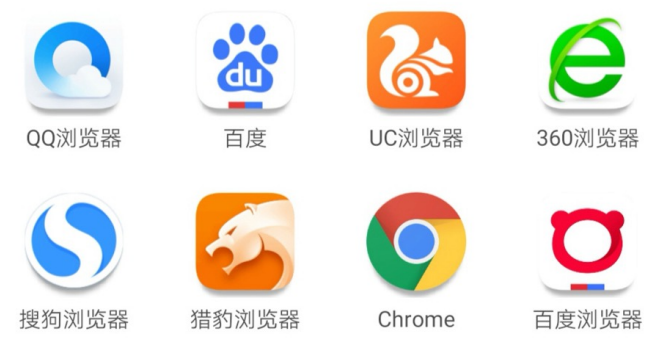

- 课堂上必须安装的浏览器：**`Chrome` 浏览器**（所有讲解也会基于这个浏览器）；

### 不同浏览器的内核

- 常见的浏览器内核有：

	- **`Trident`**（三叉戟）：`IE`、`360` 安全浏览器、搜狗高速浏览器、百度浏览器、`UC` 浏览器；
	- **`Gecko`**（壁虎）：`Mozilla Firefox`；
	- **`Presto`**（急板乐曲）**`-> Blink`**（眨眼）：`Opera`；
	- **`WebKit`**：`Safari`、`360` 极速浏览器、搜狗高速浏览器、移动端浏览器（`Android`、`iOS`）；
	- **`WebKit -> Blink`**：`Google Chrome`；

	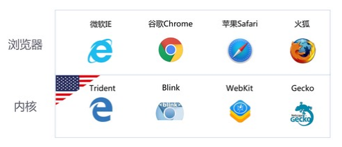

- 不同的浏览器内核有不同的解析、渲染规则，所以同一网页在不同内核的浏览器中的渲染效果也可能不同。这也引出了另一个概念：浏览器适配，即让代码在多个浏览器中显示一样的效果，不过现在已经有很多工具能够帮助我们做到适配了（后面我们讲到 `npm`、`Webpack` 时会讲到）。

补充：`Blink` 渲染引擎是开源引擎 `WebKit` 中 `WebCore` 组件的一个分支，并且在 `Chrome`（`28` 及往后版本）、`Opera`（`15` 及往后版本）、`Yandex`、`Vivaldi` 及 `Microsoft Edge`（`79` 及往后版本）等诸多**基于`Chromium`** 的浏览器中使用[^1]。

[^1]: https://zh.wikipedia.org/wiki/Blink

