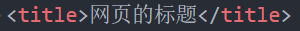
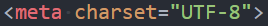

## 01. （掌握）`HTML` 结构分析

### 完整的 `HTML` 结构

- 一个完整的 `HTML` 结构包括哪几部分呢？
	- **文档声明**
	- **`html` 元素**
		- `head` 元素
		- `body` 元素

### 文档声明

- `HTML` 最上方的一段文本我们称之为**文档类型声明**，用于声明**文档类型**；

	

- **`<!DOCTYPE html>`**

	- `HTML` 文档声明，告诉浏览器当前页面是 **`HTML5` 页面**；
	- 让浏览器用 **`HTML5` 的标准去解析识别**内容；
	- 必须**放在 `HTML` 文档的最前面，不能省略**，省略了会出现兼容性问题；

- `HTML5` 的文档声明比 `HTML 4.01`、`XHTML 1.0` 简洁很多（了解即可）

	

### `html` 元素

- `<html>` 元素表示一个 `HTML` 文档的**根**（顶级元素），所以它也被称为**根元素**；

	- 所有其它元素必须是**此元素的后代**

		

- `W3C` 标准建议为 `html` 元素增加一个 `lang` 属性[^1]，作用是：

	- 帮助**语音合成工具**确定要使用的发音；
	- 帮助**翻译工具**确定要使用的翻译规则；

- 比如常用的规则：

	- `lang="en"`：表示这个 `HTML` 文档的语言是英文；
	- `lang="zh-CN"`：表示这个 `HTML` 文档的语言是中文；

注意：`html` 元素和 `HTML` 元素是不同的，`HTML` 元素是指 `HTML` 语言中的所有元素，而 `html` 元素是指 `HTML` 元素中一个具体的元素，这个元素叫 `html`。

### `head` 元素

- **`HTML` `head` 元素**规定文档相关的**配置信息（也称之为元数据）**，包括**文档的标题**、**引用的文档样式**和**脚本**等

	- 什么是元数据（`meta data`）？元数据是描述数据的数据；
	- 这里我们可以理解成对**整个页面的配置**；

- **常见的设置有哪些呢？一般至少包含如下两个设置：**

	- 网页的标题：**`title` 元素**

		

	- 网页的编码：**`meta` 元素**

		- 可以用于设置网页的**字符编码**，让浏览器更精准地显示每一个文字，**不设置或者设置错误会导致乱码**；
		- 一般会使用 `utf-8` 编码，涵盖了世界上几乎所有的文字；

		

		

### `body` 元素

- `body` 元素里面的内容将是你**在浏览器窗口中看到的东西**，也就是**网页的具体内容和结构**。
	- 之后学习的**大部分 `HTML` 元素都是在 `body` 中**编写呈现的；

### `HTML` 元素

- `HTML` 元素本身有很多，但是**常用的元素就是那么几个**。
	- https://developer.mozilla.org/zh-CN/docs/Web/HTML/Element
	- 我们只需要记住**常用的**，不常用的学会查看文档即可；
- 常用的元素（暂时掌握下面几个就够了，`90%` 时间都在写这几个）：
	- `h` 元素（`h1` ~ `h6`）、`p` 元素；
	- `img` 元素、`a` 元素、`iframe` 元素；
	- `div` 元素、`span` 元素；
- 下阶段学习的元素：
	- `ul`、`ol`、`li` 元素；
	- `button` 元素、`input` 元素；
	- `table`、`thead`、`tbody`、`tfoot`、`th`、`tr`、`td`；
- `HTML5` 新增元素（后续学习）

## 02. （掌握）`h1`~`h6`、`p` 元素

### 案例分析 - 使用什么元素

文章地址：https://www.toutiao.com/article/7075122482247664128

### 常见元素 - `h` 元素

- 在页面中通常会有一些比较**重要的文字**作为标题，这个时候我们可以使用 **`h` 元素**（`h1` ~ `h6`）。

- `<h1>` - `<h6>` **标题（`Heading`）元素**呈现了六个不同级别的标题

	- `Heading` 是头部的意思，通常会用来做标题；
	- `<h1>` 级别最高，而 `<h6>` 级别最低；

	

	

- 注意：**`h` 元素通常和 `SEO` 优化有关系**（什么是 `SEO` 优化，后续再介绍）

### 常见元素 - `p` 元素

- 如果我们想表示一个段落，这个时候可以使用 `p` 元素。
- `HTML` `
` 元素（或者说 `HTML` 段落元素）表示**文本的一个段落**；
	- **`p` 元素**是 `paragraph` 单词的缩写，是**段落、分段**的意思；
	- **`p` 元素**多个段落之间会有一定的间距；

### 案例练习

## 03. （掌握）`img`、`a`、`iframe` 元素

### 常见元素 - `img` 元素

- 我们应该如何告诉浏览器来**显示一张图片**呢？使用 **`img` 元素**；
- `HTML` `` 元素**将一张图片嵌入文档**
	- `img` 是 `image` 单词的缩写，是**图片、图像**的意思；
	- 事实上，`img` 是一个**可替换元素（`replaced element`）**；
		- 可替换：浏览器会用相应的资源或形式替换掉元素原来所占据的位置
- `img` 有两个常见的属性：
	- **`src` 属性**：`source` 单词的缩写，表示源
		- 是**必须的**，它包含了你想嵌入的图片的文件路径；
	- **`alt` 属性**：不是强制性需要的，**有两个作用**：
		1. 当**图片加载不成功**时（错误的地址或者图片资源不存在），会显示这段文本（`alt` 属性的值）；
		2. **屏幕阅读器**会将这些描述读给需要使用阅读器的使用者听，让他们知道图像的含义；
	- 某些其它属性目前已经不再使用
		- 比如 `width`、`height`、`border` 等等；

### `img` 元素 - 图片的路径

- 设置 `img` 的 `src` 时，需要给图片设置路径：

	- **网络图片**：一个 `URL` 地址（后续会专门讲 `URL`）；
		- 网络图片的设置非常简单，给一个地址即可；
	- **本地图片**：本地电脑上的图片，后续会和 `html` 一起部署到服务器上；

- **本地图片的路径有两种方式：**

	1. **绝对路径**（几乎不用）：

		- 从电脑的根目录开始一直找到资源的路径；

			

	2. **相对路径**（常用）：

		- 相对于当前文件的一个路径；

			

		- `.` 代表当前文件所在的文件夹（`1` 个 `.`），可以省略

		- `..` 代表当前文件所在的文件夹的上一级文件夹（`2` 个 `.`）

		- 相对路径更常用的原因有 `2` 个：

			1. 相较于绝对路径，写法更简洁；
			2. 文件最终会部署到服务器上，到时候服务器上也是会使用相对路径来进行文件引用的；

- 对于网页来说，不管什么操作系统（`Windows`、`Mac`、`Linux`），路径分隔符都是 **`/`**（正斜杆），而**不是 `\`**（反斜杠），虽然 `Windows` 上可以使用 `\`。

- 注意：在服务器中通过 `file` 协议加载文件是不可以的，我们可以直接双击打开 `html` 文件（或者通过 `VS Code` 的 `open in browser` 扩展打开，那么这个 `html` 文件本身就是以 `file` 协议打开的，里面再通过 `file` 协议加载其它文件就没问题了）：

	

	

### `img` 元素 - 图片的格式

- `img` 元素支持的图片格式非常多：

	

### 常见元素 - `a` 元素

- 在网页中我们经常需要**跳转到另外一个链接**，这个时候就可以使用 **`a` 元素**；
- `HTML` `<a>` 元素（或称锚（`anchor`）元素）；
	- 定义**超链接**，用于**打开新的 `URL`**；
- **`a` 元素有两个常见的属性：**
	1. **`href`**：`Hypertext Reference` 的简称
		- 指定要打开的 `URL` 地址；
		- 也可以是一个本地地址；
	2. **`target`**：该属性指定在何处显示链接的资源；
		- `_self`：默认值，在当前窗口中打开 `URL`；
		- `_blank`：在一个新的窗口中打开 `URL`；
		- 其它不常用，后面讲 `iframe` 时可以讲一下；

### `a` 元素 - 锚点链接

- 锚点链接可以实现：跳转到**网页中的具体位置**；
- 锚点链接有两个重要步骤：
	1. 在要跳到的元素上**定义一个 `id` 属性**；
	2. 定义 **`a` 元素**，并且 `a` 元素的 **`href` 指向对应的 `id`**；

### `a` 元素 - 图片链接

- 在很多网站中，我们会发现**图片**也是可以点击**进行跳转**的；

	- **`img` 元素和 `a` 元素**一起使用，可以实现**图片链接**；

	

- 实现思路：

	- `a` 元素中不存放文字，而是**存放一个 `img` 元素**；
	- 也就是把 `img` 元素作为 `a` 元素的内容；

	

### `a` 元素 - 其它 `URL` 地址

- `a` 元素一定是用来跳转到新网页（`html` 文件）的么？

	- 不一定；
	- 也有可能是指向下载链接：
		- https://github.com/coderwhy/HYMiniMall/archive/master.zip
	- 还有可能是指向其它协议地址，比如 `mailto`：
		- mailto:12345@qq.com

	

### `iframe` 元素

- 利用 `iframe` 元素可以实现：在一个 `HTML` 文档中**嵌入其它 `HTML` 文档**；
- `frameborder` 属性
	- 用于规定是否显示边框
	- `1`：显示
	- `0`：不显示

- `a` 元素 `target` 的其它值：
	- `_parent`：在父窗口中打开 `URL`
	- `_top`：在顶层窗口中打开 `URL`

#### 不允许网页在 `iframe` 元素中展示所使用的技术

在使用 `iframe` 元素嵌入某些页面时，某些网站会拒绝我们的连接请求：

这是因为这些网站在 `HTTP` 请求的响应头中设置了 `X-Frame-Options`[^2]：

如果设置了 `X-Frame-Options: SAMEORIGIN`，那么要显示的网页必须在同源的网页中才能被展示出来。

## 04. （掌握）`div`、`span` 元素

### `div` 元素、`span` 元素的历史

- 在 `HTML` 中**有两个特殊的元素：`div` 元素、`span` 元素**；

	- **`div` 元素**：`division`，分开、分配的意思；
	- **`span` 元素**：跨域、涵盖的意思；

- 这两个元素有什么作用呢？

	- **无所用、无所不用**；

- 产生的历史：

	- 网页发展的早期**没有 `CSS`**，那时必须通过**语义化元素**来告知浏览器一段文字如何展示；
		- 最开始只有一些 `HTML` 基本元素；
		- 后来为了增加样式，又添加了各种各样包含样式的 `HTML` 元素（`strong`、`i`、`del` 等等）；
	- 后来**出现了 `CSS`**，**结构和样式需要分离**，这个时候 **`HTML` 只需要负责结构**即可；
		- 比如 `h1` 元素可以是一段**普通的文本 + `CSS` 修饰样式**；
	- 于是就出现了 **`div`、`span` 来编写 `HTML` 结构所有的结构，样式都交给 `CSS` 来处理**；
		- 相当于从早期的一个极端（结构样式都交给 `HTML` 实现），发展成了另一个极端（样式都交给 `CSS` 实现），两个极端都不好
	- 所以现在，我们通常会把结构和样式交给 `HTML` 语义化元素处理，有地方需要修改样式的，再用 `CSS` 处理。

	

- 所以，理论上来说：

	- 我们的页面可以**没有 `div`、`span`**；
	- 我们的页面也可以**全部都是 `div`、`span`**；

### `div` 元素、`span` 元素的区别

- 这个时候有一个问题：**我出现一个不就可以了吗？**
- `div` 元素和 `span` 元素都是**“纯粹的”容器**，也可以把它们理解成**“盒子”**，它们都是用来**包裹内容**的；
	- **`div` 元素**：多个 `div` 元素包裹的内容会在**不同的行**显示；
		- 一般作为其它元素的父容器,把其它元素包住，以代表一个整体；
		- 用于把网页分割为多个独立的部分；
	- **`span` 元素**：多个 `span` 元素包裹的内容会**在同一行**显示；
		- 默认情况下，跟普通文本几乎没差别；
		- 用于区分特殊文本和普通文本，比如用来显示一些关键字；

## 05. （理解）不常用元素

- `strong` 元素：内容加粗、强调；
	- 通常加粗会使用 `CSS` 样式来完成；
	- 开发中会偶尔使用一下；
- `i` 元素：内容倾斜；
	- 通常斜体会使用 `CSS` 样式来完成；
	- 开发中偶尔会用它来做字体图标（因为看起来像是 `icon` 的缩写）；
- `code` 元素：用于显示代码；
	- 偶尔会使用，用来显示等宽字体；
- `br` 元素：换行元素；
	- 开发中已经不再使用；
	- 通常换行可以使用 `div` 实现；
- 更多元素详解，查看 `MDN` 文档：
	- https://developer.mozilla.org/zh-CN/docs/Web/HTML/Element

## 06. （掌握）`HTML` 全局属性

- 我们发现**某些属性只能设置在特定的元素**中：
	- 比如 `img` 元素的 `src`、`a` 元素的 `href`；
- 也**有一些属性是所有 `HTML` 都可以设置和拥有**的，这样的属性我们称之为**“全局属性（`Global Attributes`）”**（共同拥有的属性）
	- 全局属性有很多：https://developer.mozilla.org/zh-CN/docs/Web/HTML/Global_attributes
- 常见的全局属性如下：
	- **`id`**：定义唯一标识符（`ID`），该标识符在整个文档中必须是唯一的。其目的是在链接（使用片段标识符），脚本或样式（使用 `CSS`）时标识元素；
	- **`class`**：一个以空格分隔的元素的类名（`classes`）列表，它允许 `CSS` 和 `JavaScript` 通过类选择器或者 `DOM` 方法来选择和访问特定的元素；
	- **`style`**：给元素添加内联样式；
	- **`title`**：包含表示与其所属元素相关信息的文本。这些信息通常可以作为提示呈现给用户，但不是必须的；

[^1]: https://html.spec.whatwg.org/multipage/semantics.html#the-html-element:~:text=Authors%20are%20encouraged%20to%20specify%20a%20lang%20attribute%20on%20the%20root%20html%20element%2C%20giving%20the%20document%27s%20language.%20This%20aids%20speech%20synthesis%20tools%20to%20determine%20what%20pronunciations%20to%20use%2C%20translation%20tools%20to%20determine%20what%20rules%20to%20use%2C%20and%20so%20forth.
[^2]: https://developer.mozilla.org/en-US/docs/Web/HTTP/Headers/X-Frame-Options