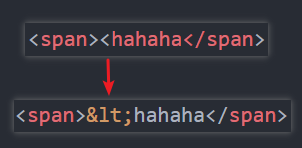
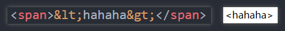
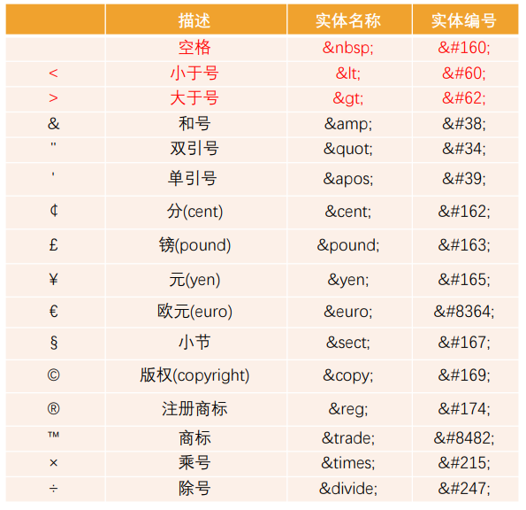
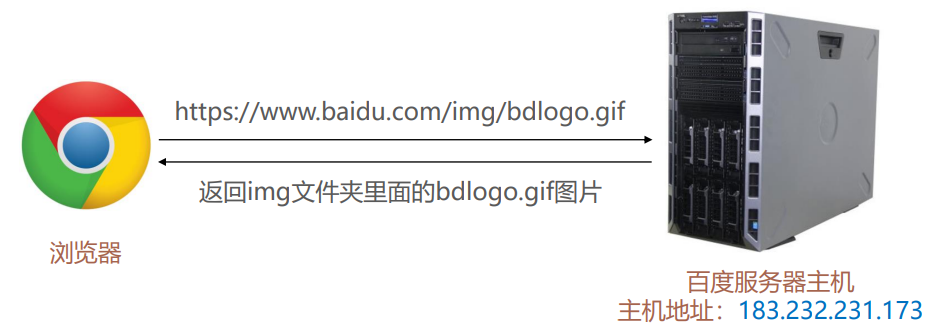
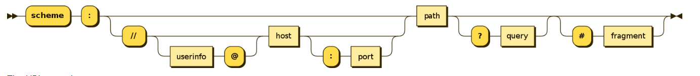
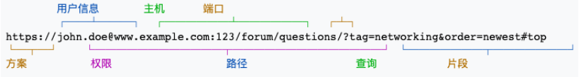

## 1. （掌握）字符实体

- 思考：**我们编写的 `HTML` 代码会被浏览器解析**。

- 如下代码是**如何被解析**的呢？

	- 如果你使用小于号（`<`），浏览器会将其后的文本解析为一个 `tag`；

	- 但是某些情况下，我们确实需要编写一个小于号（`<`）；

	- 这个时候我们就可以使用**字符实体**；

		

- `HTML` 实体是一段**以连字号（`&`）开头，以分号（`;`）结尾的文本**（字符串）；

	- 实体常常用于显示**保留字符**（这些字符会被解析为 `HTML` 代码）和**不可见的字符**（如“不换行空格”）；

	- 你也可以用实体来代替**其它难以用标准键盘键输入的字符**；

		

### 常见的字符实体

## 2. （掌握）`URL` 地址

### 认识 `URL`

- `URL` 代表的是统一资源定位符（`Uniform Resource Locator`）；
- 通俗点说：`URL` 就是一个给定的资源在 `Web` 上的地址；
	- 理论上说，每个有效的 `URL` 都指向一个唯一的资源；
	- 这个资源可以是一个 `HTML` 页面，一个 `CSS` 文档，一幅图像等等；

### `URL` 的格式

- `URL` 的标准格式如下：

	`[协议类型]://[服务器地址]:[端口号]/[文件路径]/[文件名]?[查询]#[片段ID]`

	- 协议：以什么样的方式和服务器进行沟通；
	- 服务器地址：`ip` 地址/域名（域名最终会被解析为 `ip` 地址），用来找到唯一的一台主机；
	- 端口号：用来找到目标主机上的提供某个服务（服务会通过主机的某个端口提供）的应用程序；
	- 文件路径：请求特定资源时，可以通过文件路径来定位资源所在的位置；
	- 文件名：用于请求具体的资源（比如一张图片）；
	- 查询（`query`）有两个用途：
		1. 向服务器请求资源时，用来传递一些参数给服务器，服务器根据参数决定要返回哪些数据；
		2. 前端路由中，用来在组件之间传递数据；
	- 片段 `ID`：用于在页面中进行锚点链接；
	
	

### 和 `URI` 的区别

- `URL` 和 `URI` 的区别：
  - `URI = Uniform Resource Identifier` 统一资源**标志符**，用于标识 **`Web` 技术使用的逻辑或物理资源**；
  - `URL = Uniform Resource Locator` 统一资源**定位符**，俗称**网络地址**，相当于**网络中的门牌号**；
- `URI` 在某一个规则下能把一个资源独一无二地识别出来；
  - `URL` 作为一个网络 `Web` 资源的地址，可以唯一地将一个资源识别出来，所以 `URL` 是一个 `URI`；
  - 所以 `URL` 是 `URI` 的一个子集；
  - 但是 `URI` 并不一定是 `URL`；
- `Locators are also identifiers, so every URL is also a URI, but there are URIs which are not URLs.`

