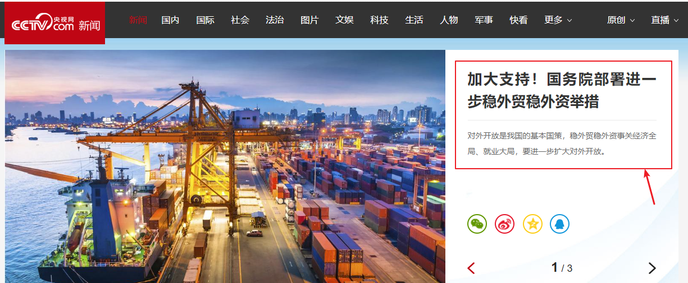
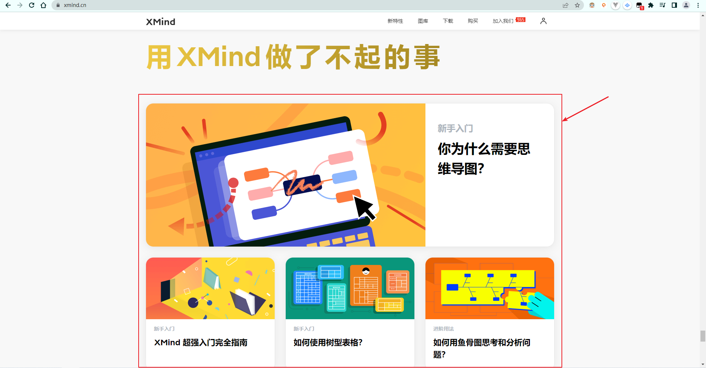
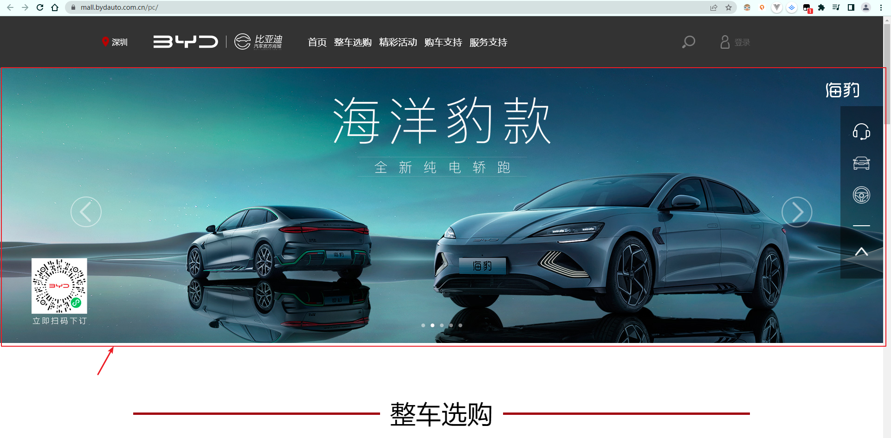
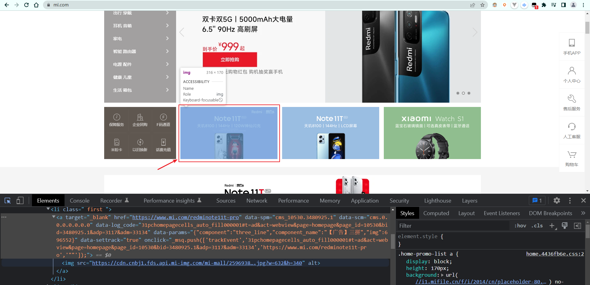

# day02 作业布置

## 一. 完成课堂所有的代码练习（必须全部自己实现）

已完成


## 二. 寻找h元素和p元素的案例，并且实现

比如央视网（https://news.cctv.com/）首页的新闻：



```html
<div>
  <h3>
    <a href="https://news.cctv.com/2022/06/09/ARTIk1TpQ9u2UDGblMdaoGsr220609.shtml?spm=C94212.P4YnMod9m2uD.E7v7lEZZ0WEM.4" target="_blank">加大支持！国务院部署进一步稳外贸稳外资举措</a>
  </h3>
  <p>
    <a href="https://news.cctv.com/2022/06/09/ARTIk1TpQ9u2UDGblMdaoGsr220609.shtml?spm=C94212.P4YnMod9m2uD.E7v7lEZZ0WEM.5" target="_blank">对外开放是我国的基本国策，稳外贸稳外资事关经济全局、就业大局，要进一步扩大对外开放。</a>
  </p>
</div>
```


## 三. 寻找a元素结合img元素的案例（3个）

比如 `XMind` 官网（https://xmind.cn/）首页：



```html
<a href="https://xmind.cn/blog/cn/usage-of-mindmap/" target="_blank">
  
</a>
```

又比如比亚迪汽车官方商城（https://mall.bydauto.com.cn/pc/）首页的轮播图：



```html
<a href="https://mall.bydauto.com.cn/pc/activityDetail?id=Y015QG22EG" target="_blank">
  
</a>
```

再比如小米官网首页：



```html
<a href="https://www.mi.com/redminote11t-pro" target="_blank">
  
</a>
```


## 四. 说出div元素和span元素的作用和区别

在早期的网页中是没有 `CSS` 的，只有一些 `HTML` 基本元素，后来为了增加样式，又添加了各种各样包含样式的语义化的 `HTML` 元素（`strong`、`i`、`del` 等等）。后来出现了 `CSS`，结构和样式需要分离，这个时候，`HTML` 只需要负责结构即可（比如 `h1` 元素可以是一段普通的文本 + `CSS` 样式），于是就出现了 `div`、`span` 来编写 `HTML` 结构所有的结构，样式都交给 `CSS`。

那么，不是只需要一个元素就可以了吗？`div` 元素和 `span` 元素有什么区别吗？

首先，`div` 元素和 `span` 元素都是”纯粹“的容器，可以把它们理解成”盒子“，它们都是用来包裹内容的。区别在于：

- 对于 `div` 元素来说，多个 `div` 元素包裹的内容会在不同的行显示；
  - 一般会把 `div` 元素作为其它元素的父容器，把其它元素包住，以代表一个整体；
  - 用于把网页分割成多个独立的部分；
- 对于 `span` 元素来说，多个 `span` 元素包裹的内容会在同一行显示；
  - 默认情况下，和普通文本几乎没差别；
  - 用于区分特殊文本和普通文本，比如用来显示一些关键字；


## 五. HTML全局属性有哪些？分别是什么作用。

- `id`
  - 定义唯一标识符，该标识符在整个文档中必须是唯一的。其目的是在链接（使用片段标识符），脚本或样式（使用 `CSS`）时标识元素；
- `class`
  - 一个以空格分隔的元素的类名列表，它允许 `CSS` 和 `JavaScript` 通过类选择器或者 `DOM` 方法来选择和访问特定的元素；
- `style`
  - 给元素添加内联样式；
- `title`
  - 包含表示与其所属元素相关信息的文本。这些信息通常可以作为提示呈现给用户，但不是必须的。


## 六.预习CSS（按照MDN文档）

https://developer.mozilla.org/zh-CN/docs/Learn/CSS/First_steps

