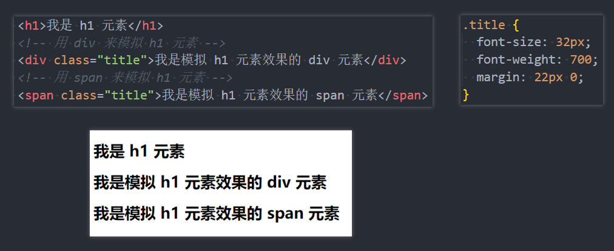
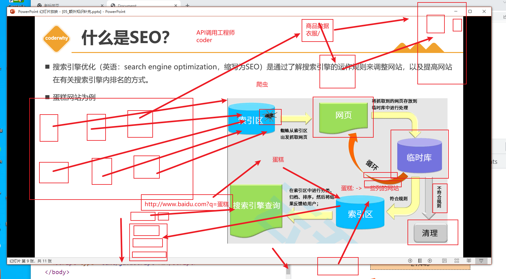
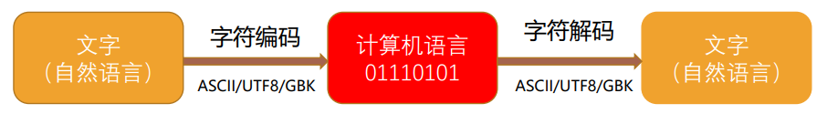

## 1. （理解）元素语义化及其作用

- 元素的语义化：用正确的元素做正确的事；

- 理论上来说，所有的 `HTML` 元素，我们都能实现相同的事情：

  

- 元素（标签）语义化的好处：

  - 方便代码维护；
  - 减少开发者之间的沟通成本；
  - 能让语音合成工具正确识别网页元素的用途，以便做出正确的反应；
  - 有利于 `SEO`；
  - ......

## 2. （理解）`SEO` 优化和爬虫原理

- 搜索引擎优化（英语：`search engine optimization`，缩写为 `SEO`）是通过了解搜索引擎的运作规则来调整网站，以提高网站在有关搜索引擎内排名的方式。

- 蛋糕网站为例；

  

- 后续我们还会讲解 `SPA` 以及 `SSR` 相关的概念

  - 它们也与 `SEO`、首屏渲染速度有关；
  - 到时候会具体补充；

## 3. （理解）字符编码的由来以及历史

- 计算机是干什么的？

  - 计算机一开始发明出来时是用来**解决数字计算**问题的，后来人们发现，计算机还可以做更多的事，例如**文本处理**。
  - 但计算机其实挺笨的，它只“认识”010110111000...这样由 **`0` 和 `1` 两个数字组成的二进制**数字；
  - 这是因为**计算机的底层硬件实现就是用电路的开和闭**两种状态来表示 `0` 和 `1` 两个数字的；
  - 因此，计算机只可以直接存储和处理二进制数字。

- 为了在计算机上也**能表示、存储和处理像文字、符号等等之类的字符**，就必须将这些**字符转换成二进制**数字；

  - 当然，肯定不是我们想怎么转换就怎么转换，否则就会造成同一段二进制数字在不同计算机上显示出来的字符不一样的情况，因此必须得定一个统一的、标准的转换规则；

    

- 字符编码的的发展历史可以阅读下面这篇文章：

  - https://www.jianshu.com/p/899e749be47c

