## 1. （掌握）认识 `CSS`

- `CSS` 表示层叠样式表（`Cascading Style Sheets`，简称：`CSS`，又称为串样式列表、级联样式表、串接样式表、阶层式样式表），是为网页添加**样式的代码**；

  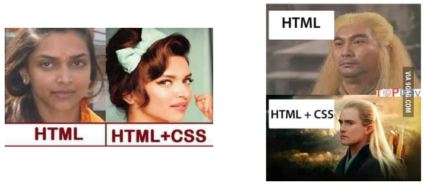

- `CSS` 是一种语言吗？

  - `MDN` 解释：`CSS` 也不是真正的编程语言，甚至不是标记语言。它是一门样式表语言。
  - 维基百科解释：是一种计算机语言，但是不算是一种编程语言。

  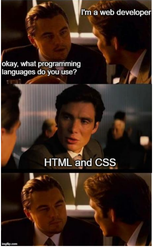

### `CSS` 的历史和作用

- 早期的网页都是**通过 `HTML` 来编写**的，但是我们希望 **`HTML` 页面可以更加丰富**：
  - 这个时候就增加了很多**具备特殊样式的元素**：比如 `i`、`strong`、`del` 等等；
  - 后来也有不同的浏览器**实现各自的样式语言**，但是没有统一的规划；
  - `1994` 年，哈肯·维姆·莱和伯特·波斯一起**合作设计了 `CSS`**，在 `1996` 年的时候发布了 **`CSS1`**；
  - 直到 `1997` 年初，`W3C` 组织才专门**成立了 `CSS` 的工作组**，`1998` 年 `5` 月发布了 **`CSS2`**；
  - 在 `2006` 年到 `2009` 年间非常流行**“`DIV + CSS`”布局**的方式来替代所有的 `HTML` 标签；
  - 从 `CSS3` 开始，所有的 `CSS` 分成了**不同的模块（`modules`）**，每一个“module” 都添加了新功能或扩展了 `CSS 2` 中定义的特性，并保留了向后兼容性；
  - 直到 `2011` 年 `6` 月 `7` 日，**`CSS 3 Color Module`** 终于发布为 `W3C Recommendation`。
- 总结：`CSS` 的出现是**为了美化 `HTML`** 的，并且让**结构（`HTML`）与样式（`CSS`）分离**；
  - **美化方式一**：为 `HTML` **添加各种各样的样式**，比如颜色、字体、大小、下划线等等；
  - **美化方式二**：对 `HTML` **进行布局**，按照某种结构显示（`CSS` 进行布局：浮动、`flex`、`grid`）；

## 2. （掌握）编写 `CSS` 样式

### `CSS` 如何编写呢？

- `CSS` 这么重要，那么它的语法规则是怎么样的呢？

  

- **声明（`Declaration`）**一个**单独的 `CSS` 规则**，如 `color: red;` 用来指定添加的 `CSS` 样式。

  - **属性名（`Property name`）**：要添加的 `CSS` 规则的名称；
  - **属性值（`Property value`）**：要添加的 `CSS` 规则的值；

- 但是有个问题：我们会编写了，要编写到什么位置呢？

### 如何将 `CSS` 样式应用到元素上？

- `CSS` 提供了 `3` 种方法，可以将 `CSS` 样式应用到元素上：
  - **内联**样式（`inline style`）；
  - **内部**样式表（`internal style sheet`）/文档样式表（`document style sheet`）/内嵌样式表（`embed style sheet`）；
  - **外部**样式表（`external style sheet`）；
- 疑问：三种方式，学号哪一个呢？
  - 每一个都很重要，目前开发中不同的场景都会用到；

### 内联样式（`inline style`）

- **内联样式（`inline style`）**，也有人翻译为行内样式。

  - 内联样式表存在于 **`HTML` 元素的 `style` 属性**之中；

  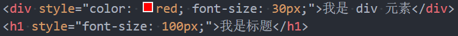

- `CSS` 样式之间用分号 `;` 隔开，建议每条 `CSS` 样式后面都加上分号 `;`

- 很多资料不推荐这种写法：

  - 在**原生的 `HTML` 编写**过程中这种写法确实是不推荐的；
  - 但在 **`Vue` 的 `template`** 中某些动态的样式是会使用内联样式的；

- 所以，内联样式的写法依然需要掌握。

### 内部样式表（`internal style sheet`）

- 内部样式表（`internal style sheet`）

  - 将 `CSS` 放在 `HTML` 文件 **`<head>` 元素里的 `<style>` 元素**之中；

  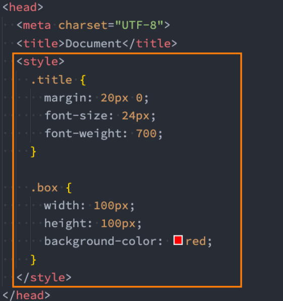

- 在 `Vue` 的开发过程中，**每个组件也会有一个 `style` 元素，和内部样式表非常的相似（原理并不相同）**；

### 外部样式表（`external style sheet`）

- 外部样式表（`external style sheet`）是将 `CSS` 编写到一个独立的文件中，并且**通过 `<link>` 元素引入**进来；

- 使用外部样式表主要分成两个步骤：

  1. 在一个独立的 `CSS` 文件中编写 `CSS` 样式（后缀名为 `.css`）；
  2. 通过 `<link>` 元素引入进来；

  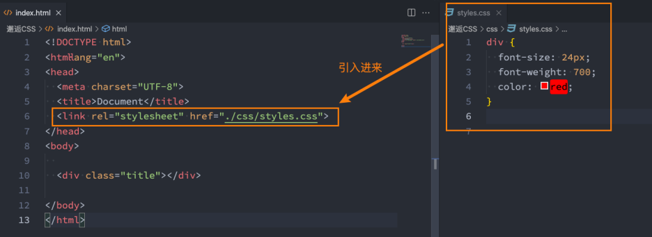

- `link` 元素的作用，后续在额外知识补充时再进行讲解。

### `@import`

- 可以在 `style` 元素或者 `CSS` 文件中使用 `@import` 导入其它的 `CSS` 文件：

  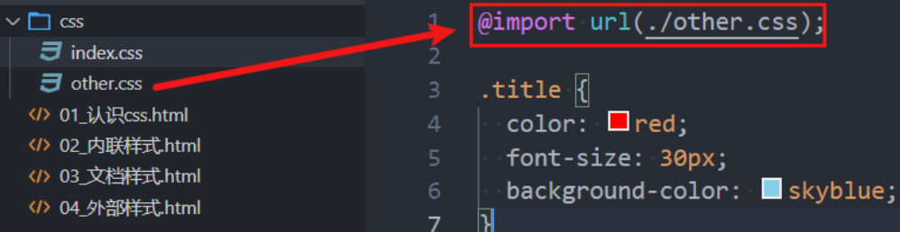

还有一种写法是这样的：`@import 'xxx';`，它和 `@import url(xxx);` 在使用效果上没有区别，但是在内部来说，`url()` 是 `CSS` 里面的函数，这个函数是用来引入其它资源的，我们后面讲到给某个元素设置背景图片时就会用到 `url()` 这个函数。但是在 `css` 文件的顶层，可以加 `url()`，也可以不加。

`@import` 方式引入 `CSS` 和 `link` 元素引入 `CSS` 相比有一个比较大的区别是 `link` 元素在链接一个资源时是不会阻塞 `HTML` 文档的解析的，它会单独去下载这个资源，而 `@import` 则会等待整个资源拿到后再继续进行解析。所以不建议在 `HTML` 中用 `@import` 去引入 `CSS`。

## 3. （掌握）`CSS` 注释

- `CSS` 代码也可以添加注释来方便阅读：

  - `CSS` 的注释和 `HTML` 的注释是不一样的；
  - `CSS` 的注释语法是这样的：`/* 注释内容 */`

  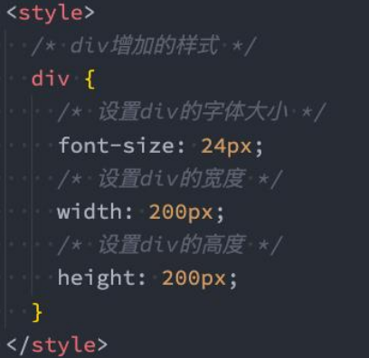

- 对于初学者来说，建议在编写 `CSS` 样式（特别是不熟练的样式）时多添加一些注释，方便学习和回忆；

- 对于有经验的同学，有可能会担心这样的问题：代码中添加了太多的注释也会占据文件的大小，那用户在浏览器中浏览该文件时，要下载的东西不就更多了吗（可能会带来两个问题：占用更多的带宽以及增加浏览器的负担）？

  - 首先，代码中的注释当然不是越多越好；
  - 学习阶段，注释越多越好，这有利于你阅读代码并且巩固记忆；
  - 项目阶段以及真实开发中，我们一般只会在关键的地方添加注释，因为我们写代码会尽量做到见名知意，不需要注释，阅读下代码就知道是什么意思了；
  - 事实上，我们不需要担心这个问题，因为真实开发中我们会通过一些打包工具对代码进行打包的，也就是说真正部署给用户的代码其实并不是我们编写的代码，打包工具会给我们的代码进行优化和压缩的。

## 4. （掌握）常见的 `CSS` 属性

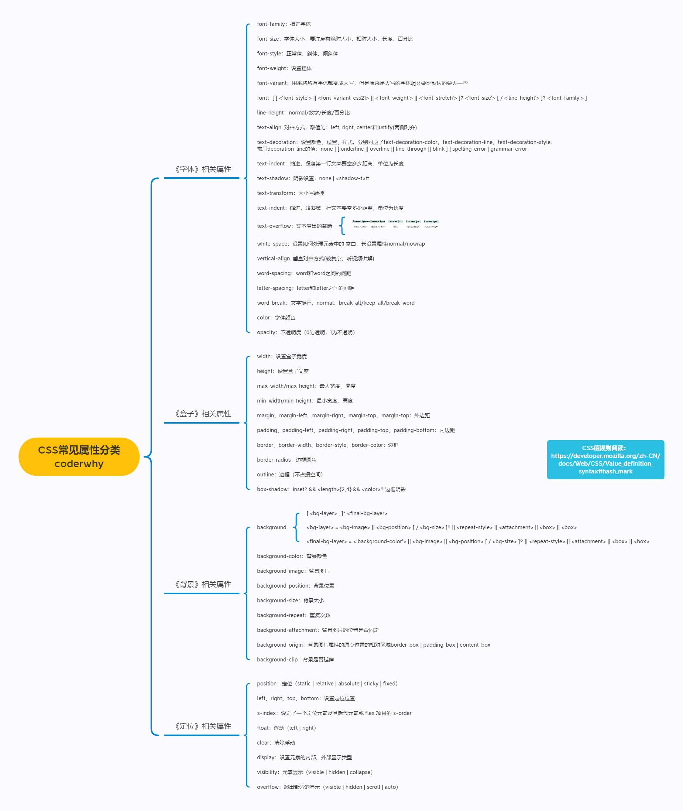

详细内容见 `xmind` 文件

### 必须掌握的 `CSS` 属性

- 必须掌握的 `CSS` 属性

  - 在开发中 `90+%` 的时间写的都是这些属性；

  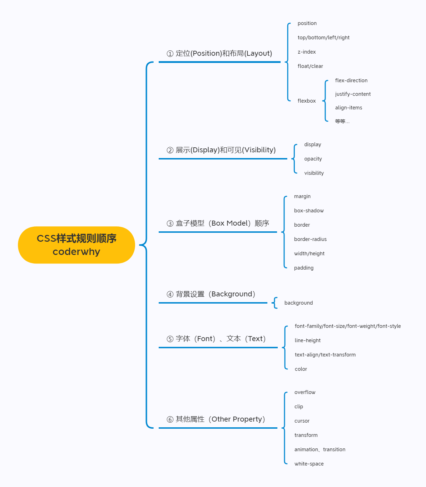

- 赶紧开始？

- 不要小看这几个 `CSS` 属性，里面涉及到的概念是非常多的；

- 你必须了解 `CSS` 的很多特性，才能真正理解里面的每个属性；

- 并且在遇到一些问题的时候知道如何去调试；

### `CSS` 属性的官方文档

- `CSS` 官方文档地址：
  - https://www.w3.org/TR/?tag=css
- `CSS` 推荐文档地址：
  - https://developer.mozilla.org/zh-CN/docs/Web/CSS/Reference#%E5%85%B3%E9%94%AE%E5%AD%97%E7%B4%A2%E5%BC%95
- 由于浏览器版本、`CSS` 版本等问题，查询某些 `CSS` 是否可用：
  - 可以到 https://caniuse.com/ 这个网站查询 `CSS` 属性的可用性；
  - 这个网站在后续的 `browserslist` 工具中我们再详细说明；

### 目前需要掌握的 `CSS` 属性

- 要想深刻理解所有常用 `CSS` 属性，最好先学会以下 `5` 个最基础最常用的 `CSS` 属性：
  - `font-size`：文字大小；
  - `color`：**前景色**（文字颜色，包括**文字、装饰线、边框、外轮廓**等的颜色）；
  - `background-color`：背景色；
  - `width`：宽度；
  - `height`：高度；

补充：文字默认的字体大小是浏览器默认设置了的：

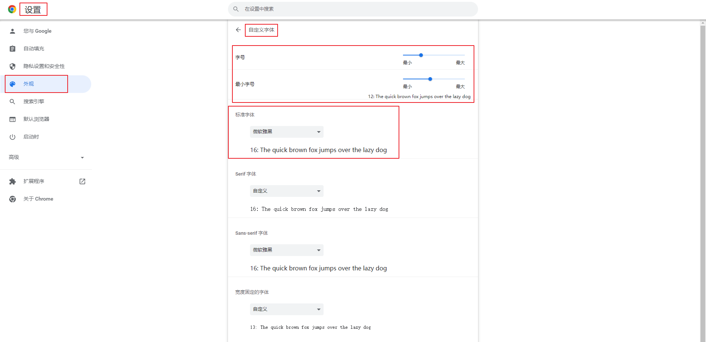

## 5. （掌握）案例练习 - 星球介绍

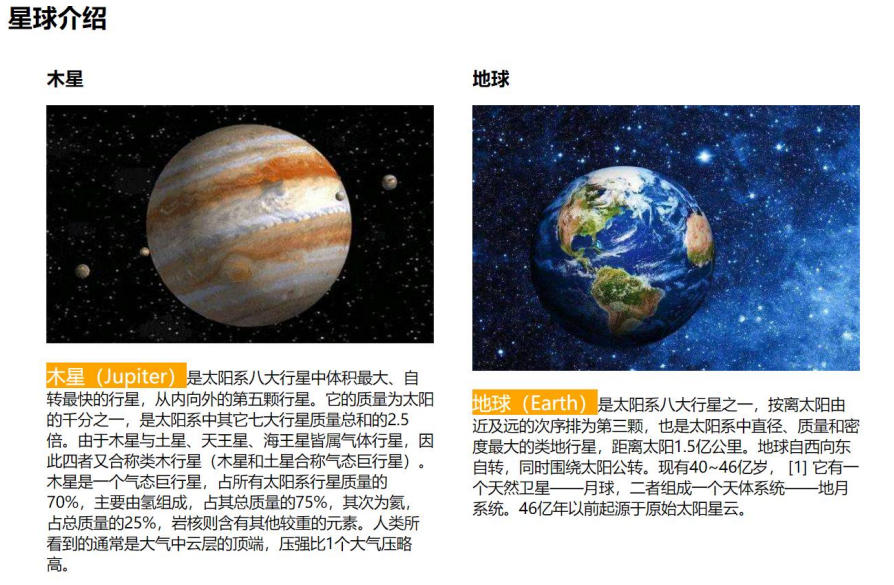

