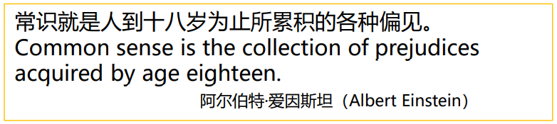
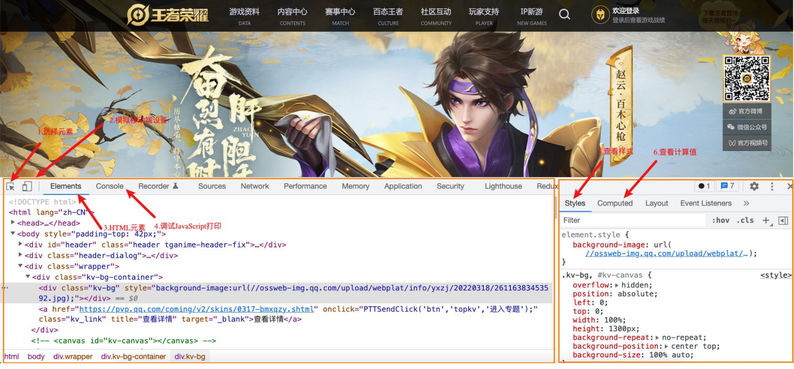
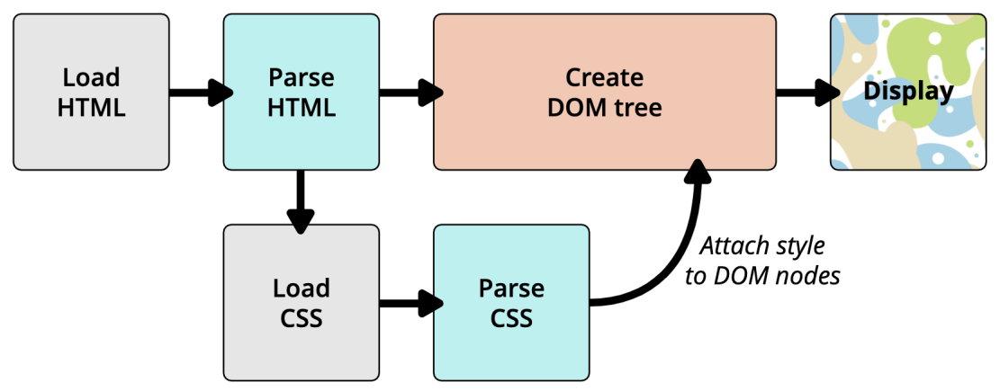
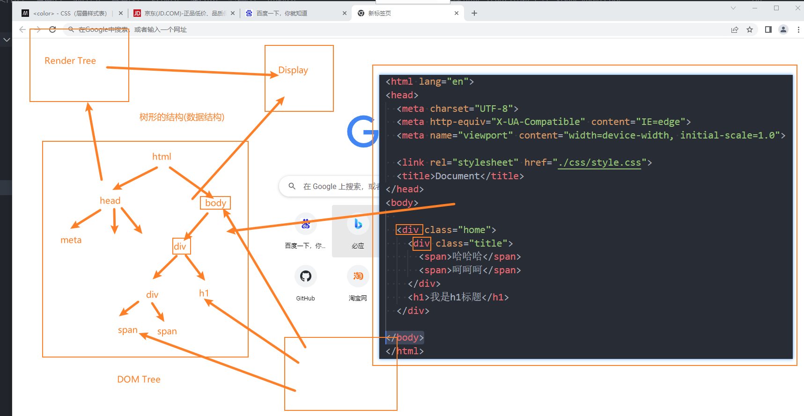

## 1. （掌握）`link` 元素

- `link` 元素是**外部资源链接**元素，规范了**文档与外部资源**的关系；
  - `link` 元素通常是在 `head` 元素中；
- 最常用的链接是**样式表（`CSS`）**：
  - 此外也可以被用来创建**站点图标**（比如 `favicon` 图标）；
- `link` 元素常见的属性：
  - `href`：指定被链接资源的 `URL`。`URL` 可以是绝对的，也可以是相对的；
  - `rel`：指定链接类型，常见的链接类型：https://developer.mozilla.org/zh-CN/docs/Web/HTML/Link_types
    - `icon`：站点图标；
    - `stylesheet`：`CSS` 样式；

扩展：`link` 元素的 `rel` 属性还可以设置一个实验性的属性值——**`dns-prefetch`**，作用是提前进行 `DNS` 解析。如果浏览器支持该实验性的特性，那么通过设置 `rel="dns-prefetch"`，可以实现在用户真正需要获取链接资源之前，浏览器就先进行 `DNS` 查询和协议握手，已便提前做好域名到 `ip` 的解析，节省下真正需要获取链接资源时再做 `DNS` 解析所需的时间，使访问速度得到一定的提升。因此，这也属于**网站性能优化**的一点。

## 2. （了解）计算机进制

### 认识进制

- 进制的概念：
  - 维基百科：**进位制**是一种计数方式，亦称**进位计数法**或**位值计数法**；
  - 通俗理解：当数字达到某个值时，进一位（比如从 `1` 位变成 `2` 位）。
- 按照进制的概念，来**理解一下十进制**：
  - 当数字到 `9` 的时候，用一位已经表示不了了，那么就进一位变成 `2` 位；
  - 在东北没有什么是一顿烧烤不能解决的，如果有，那就两顿；
- 按照上面的来理解，**二进制、八进制、十六进制**：
  - **二进制**：当数字到 `1` 的时候，用一位已经表示不了了，那么就进一位；
  - **八进制**：当数字到 `7` 的时候，用一位已经表示不了了，那么就进一位；
  - **十六进制**：用一位如何表示十六个数字呢？**a（10）、b（11）、c（12）、d（13）、e（14）、f（15）**；
- 下面我们就来简单学习一下计算机中的二进制、八进制、十六进制；

### 人类的十进制

- 学习编程语言，需要了解进制的概念：

  - 我们平时使用的数字都是**十进制**的，当我写下一个数字的时候，你会**默认当做十进制**来使用；
  - 从发明数字开始，**人类就使用十进制**，原因可能是**人类正好有十根手指**；
  - 如果人类有**八根手指,**现在用的可能就是**八进制**。

  

- 那么，十进制就是放之四海而皆准的常理吗？

  - 并不见得，计算机就认为二进制、八进制、十六进制更符合自己的思维；

  

### 计算机中的进制

- 为什么计算机更喜欢**二进制**呢？
  - 因为计算机的底层原理是电路的开和关，当关的时候，我们就可以用 `0` 来表示，当开的时候，就可以用 `1` 来表示。
- 如何表示二进制、八进制、十六进制？
  - 二进制（**`0b` 开头**，`binary`）：其中的数字由 `0`、`1` 组成，可以回顾之前学习过的机器语言；
  - 八进制（**`0o` 开头**，`octonary`）：其中的数字由 `0` ~ `7` 组成；
  - 十六进制（**`0x` 开头**，`hexadecimal`）：其中的数字由 `0` ~ `9`，字母 `a` ~ `f` 组成（大小写都可以）；
- 十进制 `or` 二进制：
  - 虽然计算机更喜欢二进制，但是编程中我们还是以十进制为主；
  - 因为高级编程语言的目的就是更加接近自然语言，让我们人类更容易理解；

### 进制之间的转换

- 十进制转其它进制：
  - 整除，取余数；
- 其它进制转十进制：
  - 比如二进制的 `1001` 转成十进制：**1 * 2^3^ + 0 * 2^2^ + 0 * 2^1^ + 1 = 9**
  - 比如八进制的 `1234` 转成十进制：**1 * 8^3^ + 2 * 8^2^ + 3 * 8 + 4 = 668**
  - 比如十六进制的 `522` 转成十进制：**5 * 16^2^ + 2 * 16 + 2 = 1314**
- 二进制转八进制：
  - 三位转成一位八进制
- 二进制转十六进制：
  - 四位转成一位十六进制
- 如果 `520` 情人节忘记了，给大家一个建议，在 `522` 那天过，因为十六进制的 `522`，对应的十进制是 `1314`。

## 3. （掌握）`CSS` 表示颜色

### `CSS` 颜色的表示方法

- 在 `CSS` 中，颜色有以下几种表示方法：

  - 颜色关键字（`color keywords`）：

    - 是不区分大小写的标识符，它表示一个具体的颜色；
    - 可以表示哪些颜色呢？
    - https://developer.mozilla.org/zh-CN/docs/Web/CSS/color_value#%E8%AF%AD%E6%B3%95

  - `RGB` 颜色：

    - `RGB` 是一种色彩空间，通过 `R`（`red`，红色）、`G`（`green`，绿色）、`B`（`blue`，蓝色）三原色来组成不同的颜色；

      - 也就是通过调整这三个颜色不同的比例，可以组合成其它的颜色；

    - `RGB` 各个原色的取值范围是 `0` ~ `255`；

      

### `RGB` 的表示方法

- `RGB` 颜色可以通过以 `#` 为前缀的十六进制字符或函数（`rgb()`、`rgba()`）标记表示；
- 方式一：十六进制符号：`#RRGGBB[AA]`
  - `R`（红）、`G`（绿）、`B`（蓝）和 `A`（`alpha`）是十六进制字符（`0` ~ `9`、`A` ~ `F`）；`A` 是可选的；
    - 比如，`#ff0000` 等价于 `#ff0000ff`；
- 方式二：十六进制符号：`#RGB[A]`
  - `R`（红）、`G`（绿）、`B`（蓝）和 `A`（`alpha`）是十六进制字符（`0` ~ `9`、`A` ~ `F`）；
  - 三位数符号（`#RGB`）是六位数形式（`#RRGGBB`）的缩减版；
    - 比如，`#f09` 和 `#ff0099` 表示同一颜色；
  - 四位数符号（`#RGBA`）是八位数形式（`#RRGGBBAA`）的缩减版；
    - 比如，`#0f38` 和 `#00ff3388` 表示相同颜色；
- 方式三：函数：`rgb[a](R, G, B[, A])`
  - `R`（红）、`G`（绿）、`B`（蓝）可以是 `<number>`（数字），或者 `<percentage>`（百分比），`255` 相当于 `100%`；
  - `A`（`alpha`）可以是 `0` 到 `1` 之间的数字，或者百分比，数字 `1` 相当于 `100%`（完全不透明）；

## 4. （掌握）`Chrome` 浏览器开发者工具

- 打开 `Chrome` 调试工具：
  - 方式一：右键——检查；
  - 方式二：快捷键——`F12`
- 其它技巧：
  - 快捷键：`Ctrl` + `+`/`-` 可以调整页面或者调试工具的字体大小；
  - 可以通过删除某些元素来查看网页结构；
  - 可以通过增删 `CSS` 来调试网页样式；

## 5. （理解）浏览器渲染流程（`HTML`、`CSS`）

浏览器首先会加载 `HTML` 文件，然后解析 `HTML`，解析的过程中遇到 `CSS` 了，就会加载 `CSS`，然后解析 `CSS`，并且，加载解析 `CSS` 的时候不会影响（阻塞）`HTML` 的解析（因为解析 `HTML` 的时候是不需要用到 `CSS` 的），`HTML` 还是会继续正常解析。等到解析完 `HTML` 的时候，会生成一颗 `DOM` 树，然后大多数浏览器都会等待 `CSS` 解析完成（因为如果此时就进行渲染，那么等到 `CSS` 解析完了还是需要再渲染一次，这样是影响性能的，没有这个必要，所以干脆等到解析完 `CSS` 后再渲染），再将 `CSS` 样式附加到 `DOM` 树上，形成一颗 `render` 树，浏览器根据这个渲染树最终将页面展示出来。

