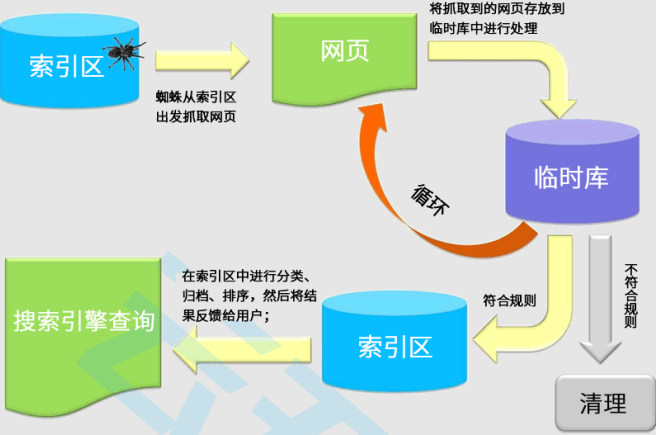
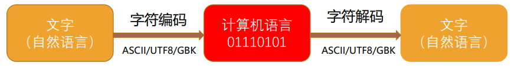
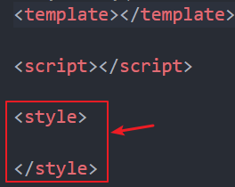
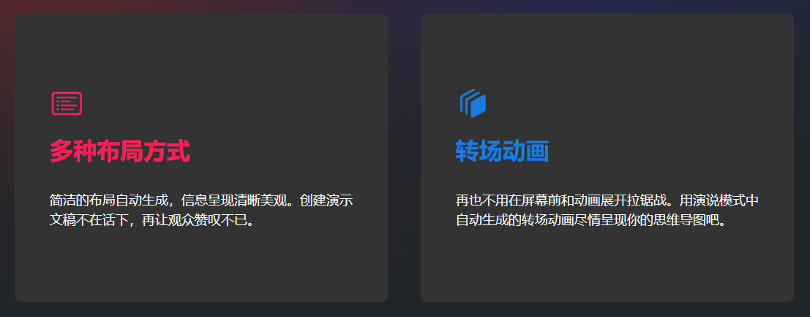
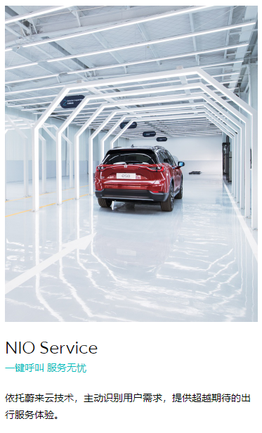

# day03 作业布置

## 一. 说说你对元素语义化的理解

- 元素语义化就是**用正确的元素做正确的事**。
  - 比如要编写一个标题，正确的做法应该是用 `h` 元素（`<h1>-<h6>`）实现，而不是用其它元素配合 `CSS` 样式实现相同的效果（虽然最后的视觉效果是一样的）。

- 元素语义化有以下好处：
  - 方便代码维护；
  - 减少开发者之间的沟通成本；
  - 方便语音合成工具正确识别网页元素的用途，以便做出正确的反应；
  - 有利于 `SEO`；
    - 比如将重要的关键字放在 `h1` 元素中，相比于放在 `div` 或 `p` 元素中，搜索引擎搜索该关键字时，该网页更有可能被搜索到，排名可能更靠前。
    - 当然，也不能滥用 `h` 元素，否则网站可能会被定义为 `k` 站，也就是有作弊行为的网站，那么搜索引擎以后就可能不再收录这个网站了；
  - ......

## 二. 说说你对SEO的理解

- `SEO` 是 `Search Engine Optimization` 英文的缩写，也就是“搜索引擎优化”，就是**通过了解搜索引擎的运作规则来调整网站，以提高网站在有关搜索引擎内的排名、曝光度**；
  
  - 搜索引擎：百度、`Bing`、`Google` 等等
  - 搜索引擎是人家公司的，我们还能对它做优化吗？并不是我们要对它里面的算法做优化，而是说我们可以通过做一些事，让搜索引擎把我们的网站尽可能地放到搜索结果中靠前的位置，那么我们做这件事情的过程就叫做搜索引擎优化；
  
- 举个例子
  - 假如有一家公司是做蛋糕的销售的，那么公司肯定是希望让更多的用户知道公司都有哪些蛋糕，做出来的效果是什么样子的，让用户可以浏览到，用户就有可能在公司的网站中下单购买，为公司带来更多的营收。
  - 而在一般情况下，用户可能不知道有这家公司，那么他可能会在搜索引擎（比如百度）中直接输入“蛋糕”这个关键字进行搜索。搜索结果的前面几个一般都是广告，我们排除这些加钱了的广告。搜索引擎会有自己的算法，以决定搜索结果谁靠前，谁靠后，谁对用户更有帮助。那么我们可以**通过一些方法，让搜索引擎把我们的网站尽可能地放到搜索结果中靠前的位置，而不是在第几十页甚至第几百页中，那么我们做这件事情的过程就叫做搜索引擎优化**；
  
- 开发中，我们做的很多事情都是为了 `SEO`，包括：
  - 元素语义化
  - `SSR`（服务端渲染）
  
- 那么我们该怎么提高搜索结果中网站的排名呢？搜索引擎的算法是什么我怎么知道呢？
  - 其实，搜索引擎的算法绝对是没有对外公开的，因为如果它公开了，那大家都可以根据它的规则来做很多很多事情了。但是，**经过大家长期地对搜索引擎的了解之后，有总结出来一套提高 `SEO` 的方案**。
  - 比如说，如果我们做到了元素语义化，搜索引擎就可以尽量地把我们的网站收录到其系统中，那么之后用户在搜索时，就可能搜索到你的网站，并且如果你的网站中有很多的词都符合用户搜索的内容，它就有可能尽量地将你的网站放到靠前的位置。
  
- 类似于百度的搜索引擎内部的算法大致的流程：
  - 通过爬虫**爬取**互联网上各种各样的网页；
  - 把爬取到的网页存放到**临时库**中进行处理（不符合规则的网页会被清理掉）；
  - 临时库中符合规则的网页会被存放到**索引区**（比如一些关键字索引，“蛋糕”这一关键字会对应一系列的网站）；
  - 在**索引区中会进行分类、归档、排序**；
  - 那么在用户搜索内容的时候，索引区就知道将有关结果按照相应的排序**反馈给用户**了；
  
  

## 三. 什么是字符编码？

- 我们知道，计算机一开始发明出来是用来解决**数学计算**问题的，后来人们发现，计算机还可以做更多的事，比如文本处理。

  - 但因为计算机底层的硬件实现是用电路的开和闭两种状态来表示 `0` 和 `1` 两个数字的，所以计算机只认识由 `0` 和 `1` 两个数字组成的二进制数，只能直接存储和处理二进制数。

- **为了在计算机上也能表示、存储和处理像文字、符号之类的字符，就必须将这些字符转换成二进制数，所以就有了字符编码。**

  - 当然，肯定不是我们想怎么转换就怎么转换，否则我们按照自己的规则转换完后，别人如果不知道我们的规则，那就还原不出转换前的内容，就会出现同一段二进制数字在不同计算机上显示出来的字符不一样的情况，因此必须制定一个统一的、标准的转换规则；
  - 这些转换规则其实就是字符编码和字符解码（以某种方式进行编码，就需要以相应的方式进行解码）；

  

  - 字符编码将我们的文字（自然语言）编码成二进制给计算机看，计算机再把这些二进制解码为我们的文字（自然语言）给我们看；


- 开发中，`HTML` 文件中 `head` 元素下的 `meta` 元素上就可以设置该文件的字符编码（一般都会设置为 `UTF-8` 编码）：

  - ```html
    <meta charset="UTF-8">
    ```

- 字符编码的发展历史

  - `ASCII` -> `GB2312` -> `GBK` -> `Unicode`（`UTF-32`、`UTF-16`、`UTF-8`）
  - 参考文章：https://www.jianshu.com/p/899e749be47c

## 四. CSS编写样式的方式以及应用场景

- `CSS` 编写样式的方式及应用场景：
  
  1. 内联样式
     - 直接在元素上添加 `style` 属性，在 `style` 属性中编写样式；
     
       ```html
       <div style="color: red; font-size: 30px;">我是 div 元素</div>
       <h1 style="font-size: 100px;">我是标题</h1>
       ```
     
     - 应用场景：比如 `Vue` 的 `template` 中某些动态的样式是会使用到内联样式的；
     
  2. 内部样式表
     - 在 `head` 元素中的 `style` 元素里面编写样式；
     
       ```html
       <head>
         <style>
           .first-div {
             color: red;
             font-size: 32px;
             background-color: orange;
           }
         </style>
       </head>
       <body>
         <div class="first-div">我是 div 元素</div>
       </body>
       ```
     
     - 应用场景：在使用 `Vue` 进行开发时，每个组件也会有一个 `style` 元素，和内部样式表非常相似（只不过原理并不相同）；
     
       
     
  3. 外部样式表
     - 在 `head` 元素中通过 `link` 元素引入样式文件；
     
       ```html
       <head>
       	<link rel="stylesheet" href="./css/style.css">
       </head>
       ```
     
     - 应用场景：有些样式在多个页面中都会被使用到时，这时就可以把这些样式编写到独立的 `CSS` 文件中，再在需要这些样式的页面中通过 `link` 元素引入进来；
     
       - 一般情况下，对于全局都需要使用的 `CSS`，我们会把它单独抽取到 `CSS` 文件中；

## 五. 最常见的CSS样式以及作用

- `font-size`：设置字体大小；
- `color`：设置前景色（文本、文本装饰线颜色）；
- `background-color`：设置背景色；
- `width`：设置宽度；
- `height`：设置高度；

## 六. 自行查找2个案例练习

根据之前学习的HTML元素和CSS样式找2个案例练习

案例 `1`：比如 `XMind` 官网（https://xmind.cn/）首页：



```html
<!DOCTYPE html>
<html lang="en">
<head>
  <meta charset="UTF-8">
  <meta http-equiv="X-UA-Compatible" content="IE=edge">
  <meta name="viewport" content="width=device-width, initial-scale=1.0">
  <title>Document</title>
  <style>
    .box {
      display: inline-block;
      vertical-align: top;
      width: 520px;
      background-color: #333;
    }

    .box .layout {
      font-size: 32px;
      color: #fd1b5b;
    }

    .box .animation {
      font-size: 32px;
      color: #157ddf;
    }

    .box p {
      font-size: 18px;
      color: #fff;
    }
  </style>
</head>
<body>

  <div class="box">
    <div class="icon">
      
    </div>
    <h3 class="layout">多种布局方式</h3>
    <p>简洁的布局自动生成，信息呈现清晰美观。创建演示文稿不在话下，再让观众赞叹不已。</p>
  </div>
  <div class="box">
    <div class="icon">
      
    </div>
    <h3 class="animation">转场动画</h3>
    <p>再也不用在屏幕前和动画展开拉锯战。用演说模式中自动生成的转场动画尽情呈现你的思维导图吧。</p>
  </div>

</body>
</html>
```

案例 `2`：比如蔚来官网（https://www.nio.cn/）首页：



```html
<!DOCTYPE html>
<html lang="en">
<head>
  <meta charset="UTF-8">
  <meta http-equiv="X-UA-Compatible" content="IE=edge">
  <meta name="viewport" content="width=device-width, initial-scale=1.0">
  <title>Document</title>
  <style>
    .item {
      width: 300px;
    }

    .item img {
      width: 300px;
      height: 400px;
    }

    .item a {
      color: #000;
    }

    .item .item-title {
      font-size: 24px;
    }

    .item .item-subtitle {
      font-size: 14px;
      color: #00bebe;
    }

    .item .description {
      font-size: 14px;
    }
  </style>
</head>
<body>

  <div class="item">
    
    <a href="https://www.nio.cn/nio-service">
      <p class="item-title">NIO Service</p>
      <p class="item-subtitle">一键呼叫 服务无忧</p>
    </a>
    <p class="description">依托蔚来云技术，主动识别用户需求，提供超越期待的出行服务体验。</p>
  </div>

</body>
</html>
```

## 七. 颜色的表示方式

* 每个同学自己总结;

`CSS` 颜色的表示方式有：

1. 颜色关键字
2. `RGB` 表示方法
   1. 十六进制符号：`#RRGGBB[AA]`
   2. 十六进制符号：`#RGB[A]`
   3. 函数方式：`rgb[a](R, G, B[, A])`

