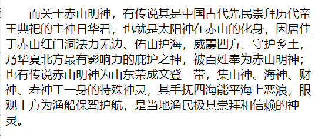
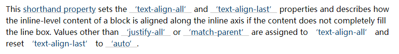

## 1. （掌握）文本属性 - `text-decoration`（常用）

- `text-decoration` 用于设置文本的装饰线
  - `decoration` 是装饰，装饰品的意思；
- `text-decoration` 常见的取值如下：
  - `none`：无任何装饰线
    - 可以去除 `a` 元素默认的下划线
  - `underline`：下划线
  - `overline`：上划线
  - `line-through`：中划线（删除线）
- `a` 元素有下划线的本质是被添加了 `text-decoration` 属性

## 2. （了解）`text-transform`

- `text-transform` 用于设置文本的大小写转换
  - `transform` 是是变形、变换的意思；
- `text-transform` 有几个常见的值：
  - `capitalize`：（把...首字母大写，资本化的意思）将每个单词的首字母变为大写；
  - `uppercase`：（大写字母）将每个单词的所有字符变为大写
  - `lowercase`：（小写字母）将每个单词的所有字符变为小写
  - `none`：没有任何影响
- 实际开发中用 `JavaScript` 代码转换的更多，因为用 `JavaScript` 可以更精准、更灵活地进行转换；

## 3. （了解）`text-indent`

- `text-indent` 用于设置第一行内容的缩进

- `text-indent: 2em;` 刚好是缩进两个文字

  

## 4. （掌握）`text-align`（重要）

- `text-align`：直接翻译过来的意思是设置（块容器中）文本的对齐方式；

- `MDN` 中的解释：定义行内内容（例如文字）如何相对它的块父元素对齐；

- 常用的值：

  - `left`：左对齐
  - `right`：右对齐
  - `center`：正中间显示
  - `justify`：两端对齐

- `W3C` 中的解释：

  

  可以看到，`text-align` 属性设置的是**行内级内容（`inline-level content`）**在其块父元素中的对齐方式。

  因此，`img`、`input` 等行内级元素都可以用 `text-align` 属性设置对齐方式。

## 5. （了解）`letter-spacing`、`word-spacing`

- `letter-spacing`、`word-spacing` 分别用于设置字符（字母）、单词之间的间距
  - 默认是 `0`，可以设置为负数；
