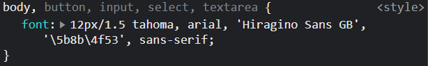
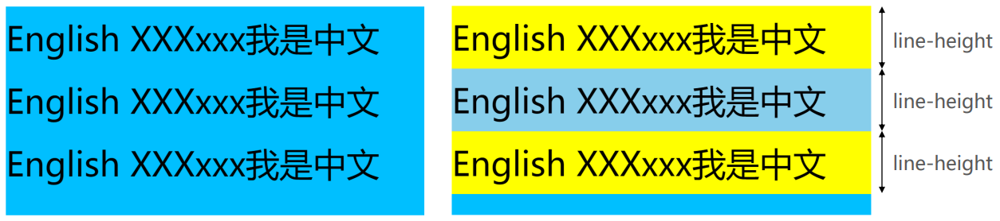
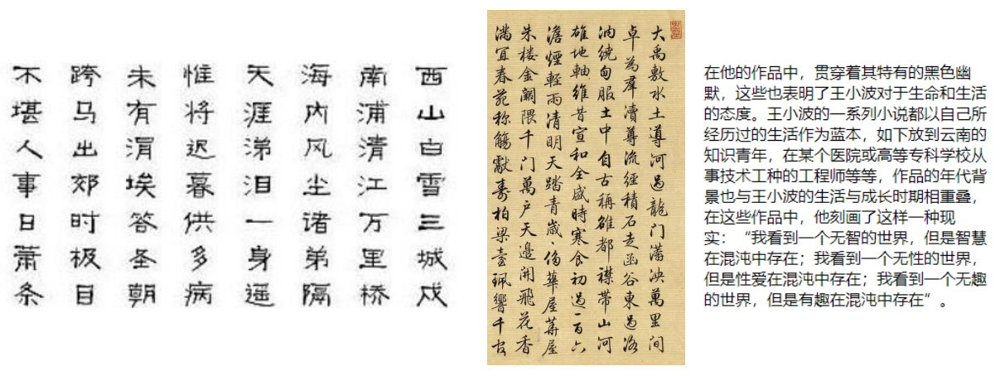
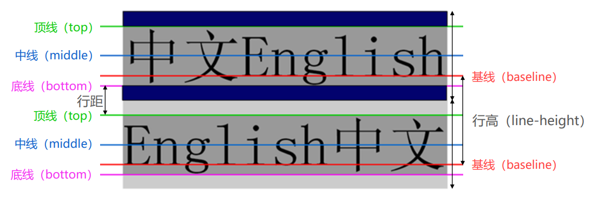
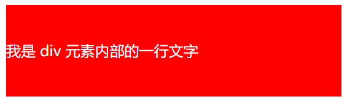
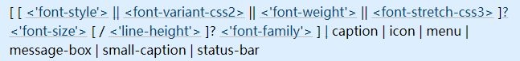

## 1. （掌握）`font-size`（重要）

- `font-size` 决定文字的大小
- 常用的设置：
  - **具体的数值 + 单位**：
    - 比如 `100px`
    - 也可以使用 `em` 单位（不推荐）：`1em` 代表 `100%`，`2em` 代表 `200%`，`0.5em` 代表 `50%`
      - 某个 `CSS` 属性设置为 `em` 单位时可以这样理解：如果这个 `CSS` 属性是 `font-size`，那么相当于是先继承了父元素的 `font-size` 的值，然后在这个值的基础上再进行计算，而对于其他 `CSS` 属性，则相当于是根据当前元素自己的 `font-size` 进行计算。
  - `百分比`
    - 基于父元素的 `font-size` 计算，比如 `50%` 表示等于父元素 `font-size` 的一半

## 2. （掌握）`font-family`（重要但一般只设置一次）

- `font-family` 用于设置文字的字体名称

  - 可以设置 **`1` 个或者多个**字体名称；
  - 浏览器会选择列表中第一个该计算机上有安装的字体；
  - 或者是通过 **`@font-face` 指定的可以直接下载的字体**；

- 淘宝使用的字体：

  

  可以发现，淘宝首页（https://www.taobao.com/）除了给 `body` 元素设置了字体，还给 `button`、`input`、`select` 和 `textarea` 元素设置了字体，这是因为虽然在 `body` 元素上设置了字体以后其后代元素都可以继承该字体，但考虑到有些浏览器可能会额外给这些元素添加字体，那么继承的字体就被覆盖了，所以如果想在这些元素上也使用我们想用的字体，就需要我们明确设置一下，把浏览器设置的字体覆盖掉。

## 3. （掌握）`font-weight`（重要）

- `font-weight` 用于设置文字的粗细（重量）
- 常见的取值：
  - **100 | 200 | 300 | 400 | 500 | 600 | 700 | 800 | 900**：每一个数字表示一个重量
  - `normal`：等于 `400`
  - `bold`：等于 `700`
- `strong`、`b`、`h1~h6` 等元素的 `font-weight` 默认值就是 `bold`

## 4. （了解）`font-style`

- `font-style` 用于设置文字的常规/斜体显示：
  - `normal`：常规显示；
  - `italic`（斜体）：用字体的斜体显示（通常会有专门的字体）；
  - `oblique`（倾斜）：文本倾斜显示（仅仅是让文字倾斜）；
- `em`、`i`、`cite`、`address`、`var`、`dfn` 等元素的 `font-style` 默认就是 `italic`；

## 5. （了解）`font-variant`

- `font-variant` 可以影响小写字母的显示形式
  - `variant` 是变形的意思；
- 可以设置的值如下：
  - `normal`：常规显示；
  - `small-caps`：将小写字母替换为缩小过的大写字母；

## 6. （掌握）`line-height`（常用）

在这里讲 `line-height` 属性，是因为下面要讲的 `font` 属性中可以设置 `line-height` 属性，尽管 **`line-height` 是文本属性，而不是字体属性**。

- `line-height` 用于设置文本的行高

  - 行高可以先简单**理解为一行文字所占据的高度**

  

- 为什么需要行高？

  - 行高的出现最主要是为了方便文本的阅读和理解，让用户的阅读体验更好。
  - 主段落内容的 `line-height` 至少应为 `1.5`。 这将有助于改善低可视条件下的体验，也对认知阻碍者，如阅读困难者，有帮助。[^1]。

  

- 行高的严格定义是：**两行文字基线（`baseline`）之间的距离**

  - 基线（`baseline`）：**与小写字母 `x` 最底部对齐的线**

  

- 注意区分 `height` 和 `line-height` 的区别
  - `height`：元素的整体高度；
  - `line-height`：元素中每一行文字所占据的高度；
  
- 应用场景：**单行文本垂直居中显示**
  - 假设 `div` 中只有一行文字，如何让这行文字在 `div` 内部垂直居中？
    - 让 `line-height` 等同于 `height`
    
    

## 7. （掌握）`font` 简写属性

- `font` 是一个缩写属性

  - `font` 属性可以用来作为 `font-style`，`font-variant`，`font-weight`，`font-size`，`line-height` 和 `font-family` 属性的简写；
  - **`font-style` `font-variant` `font-weight` `font-size`/`line-height` `font-family`**

- 规则

  - `font-style`、`font-variant`、`font-weight` 可以随意调换顺序，也可以省略；
  - `/line-height` 可以省略，如果不省略，必须跟在 `font-size` 后面；
  - `font-size` 和 `font-family` 不可以调换顺序，不可以省略；

  

[^1]: https://developer.mozilla.org/zh-CN/docs/Web/CSS/line-height#%E6%97%A0%E9%9A%9C%E7%A2%8D%E6%96%B9%E9%9D%A2