## 1. （掌握）`CSS` 选择器（`selector`）

- 开发中经常需要**找到特定的网页元素进行样式的设置**
  - 思考：如何找到特定的那个元素？
- 什么是 `CSS` 选择器
  - 按照一定的规则**选出符合条件的元素**，为之添加 `CSS` 样式
- 选择器种类繁多，大概可以这么归类
  - 通用选择器（`universal selector`）
  - 元素选择器（`type selector`）
  - 类选择器（`class selectors`）
  - `id` 选择器（`id selectors`）
  - 属性选择器（`attribute selectors`）
  - 组合（`combinators`）
  - 伪类（`pseudo-classes`）
  - 伪元素（`pseudo-elements`）

## 2. （了解）通用选择器

- 通用选择器（`universal selector`）
  - 所有元素都会被选中
- 一般用来给所有元素做一些通用性的设置
  - 比如内边距、外边距；
  - 比如重置一些内容；
- **效率比较低，尽量不要使用**
  - 对于通用选择器，一般的浏览器（当然，有些浏览器会做一些优化）的做法是会将 `HTML` 中的所有元素都遍历一遍，挨个进行样式设置，所以效率较低。

## 3. （掌握）简单选择器

- 这里所说的简单选择器指的是以下三种选择器，它们是开发中用得最多的选择器：
  - **元素选择器（`type selector`）**，使用**元素的名称**；
  - **类选择器（`class selectors`）**，使用 **`.`类名**；
  - **`id` 选择器（`id selectors`）**，使用 **`#id`**；

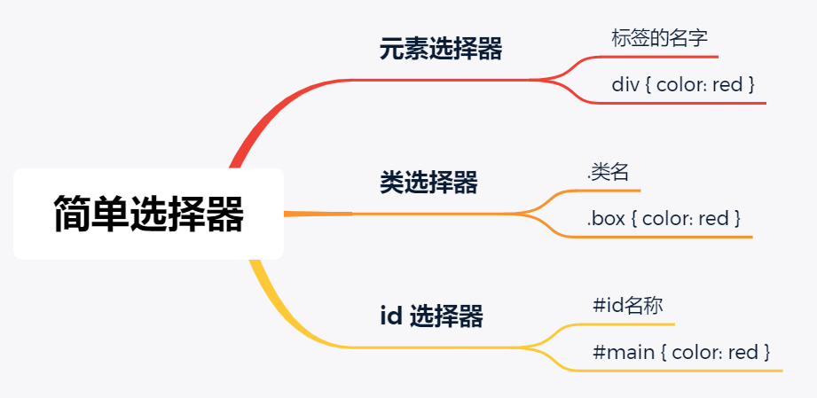

### `id` 注意事项

- 一个 `HTML` 文档里面的 `id` 值应该**是唯一的，不要重复**
  - `id` 值如果由多个单词组成，单词之间可以用**中划线`-`**、**下划线`_`** 连接，也可以使用**驼峰标识**
    - 在 `HTML` 中写名称时，通常用**中划线`-`**、**下划线`_`** 连接的较多，相对来说，使用**中划线`-`** 连接的更多
  - 最好**不要用标签名作为 `id` 值**
- 中划线又叫做**连字符（`hyphen`）**

## 4. （理解）属性选择器（`attribute selectors`）

- 拥有某一个属性：`[att]`

  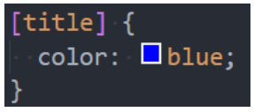

- 属性等于某个值：`[att=val]`

  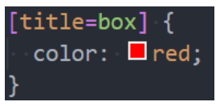

- 其它的了解即可（不用记）

  - `[attr*=val]`：属性值包含某一个值 `val`；
  - `[attr^=val]`：属性值以 `val` 开头；
  - `[attr$=val]`：属性值以 `val` 结尾；
  - `[attr|=val]`：属性值等于 `val` 或者以 `val` 开头后面紧跟连字符 `-`；
  - `[attr~=val]`：属性值包含 `val`，如果有其它值必须以空格和 `val` 分隔；

## 5. （掌握）后代选择器（`descendant combinator`）

- 后代选择器一：所有的后代（直接/间接的后代）

  - 选择器之间以**空格**分隔

  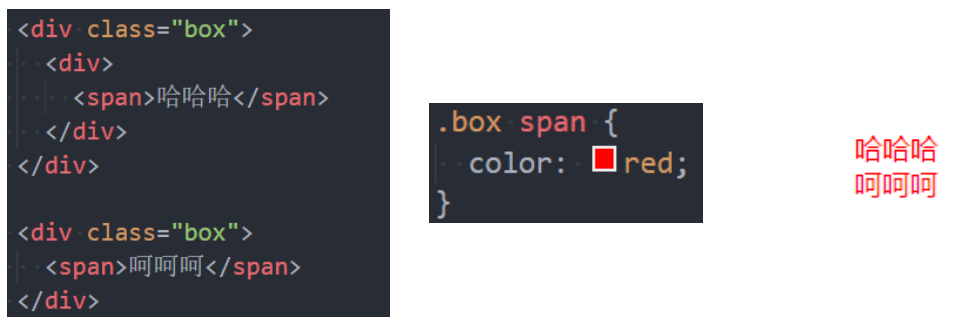

- 后代选择器二：直接子代选择器（必须是直接子代）

  - 选择器之间以 **`>`** 分隔

  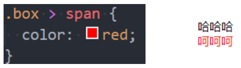

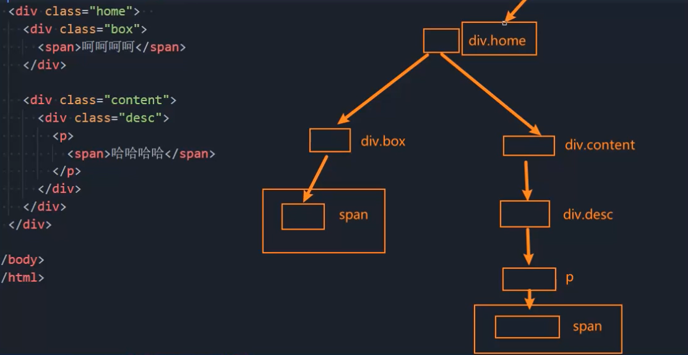

## 6. （理解）兄弟选择器（`sibling combinator`）

- 兄弟选择器一：相邻兄弟选择器

  - 使用符合 `+` 连接
  - 比如：`A + B`，表示选择**紧跟**在 `A` 元素**后面的那一个** `B` 元素，并且 `A` 和 `B` 元素在同一个父节点下；

  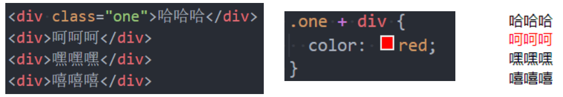

- 兄弟选择器二：一般兄弟选择器

  - 使用符合 `~` 连接
  - 比如：`A ~ B`，表示选择在 `A` 元素**后面的所有** `B` 元素，并且 `A` 和 `B` 元素在同一个父节点下；

  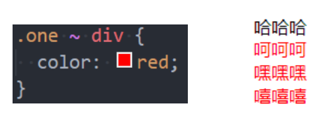

## 7. （掌握）选择器组

- **交集选择器：需要同时满足两个选择器条件（两个选择器紧密连接）**

  - 在开发中通常为了**精准地选择某一个元素**

  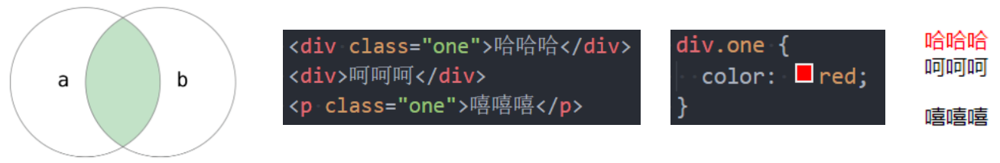

- **并集选择器：满足一个选择器条件即可（选择器之间以 `,` 分隔）**

  - 在开发中通常为了**给多个元素设置相同的样式**

  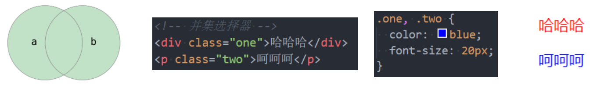

## 8. （理解）认识伪类和常见的伪类

- 什么是伪类呢？

  - `Pseudo-classes`：翻译过来是**伪类**；
  - 伪类是**选择器的一种**，它用于选择处于**特定状态**的元素；

- 比如我们经常会实现的：当手指放在一个元素上时，显示另外一个颜色

  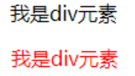

- 常见的伪类有：

  1. **动态伪类**（`dynamic pseudo-classes`）

     - `:link`、`:visited`、`:hover`、`:active`、`:focus`

  2. **目标伪类**（`target pseudo-class`）

     - `:target`

       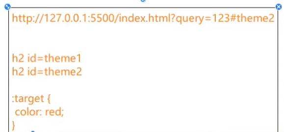

  3. **语言伪类**（`language pseudo-class`）

     - `:lang()`

       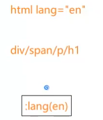

  4. **元素状态伪类**（`UI element states pseudo-classes`）

     - `:enabled`、`:disabled`、`:checked`

  5. **结构伪类**（`structural pseudo-classes`）（后续学习）

     - `:nth-child()`、`:nth-last-child()`、`:nth-of-type()`、`:nth-last-of-type()`
     - `:first-child`、`:last-child`、`:first-of-type`、`:last-of-type`
     - `:root`、`:only-child`、`:only-of-type`、`:empty`

  6. **否定伪类**（`negation pseudo-class`）（后续学习）

     - `:not()`

- 所有的伪类：https://developer.mozilla.org/en-US/docs/Web/CSS/Pseudo-classes

## 9. （掌握）伪类 - 动态伪类 - `:hover`

- 使用举例
  - `a:link`：未访问的链接
  - `a:visited`：已访问的链接
  - **`a:hover`：鼠标挪动到链接上**
  - `a:active`：激活的链接（鼠标在链接上长按住未松开）
- 使用注意
  - `:hover` 必须放在 `:link` 和 `:visited` 后面才能完全生效；
  - `:active` 必须放在 `:hover` 后面才能完全生效；
  - 所以建议的编写顺序是：`:link`、`:visited`、`:hover`、`:active`
    - `LVHA`
- **除了 `a` 元素，`:hover`、`:active` 也能用在其它元素上**

## 10. （掌握）伪类 - 动态伪类 - `:focus`

- `:focus` 指当前**拥有输入焦点的元素**（能接收键盘输入）
  - 比如可以实现文本输入框一聚焦后，背景就会变红色
- 因为链接 `a` 元素可以**被键盘的 `Tab` 键选中聚焦，所以 `:focus` 也适用于 `a` 元素**
- 动态伪类编写顺序建议为：
  - `:link`、`:visited`、`:focus`、`:hover`、`:active`
- 直接给 `a` 元素设置样式，相当于给 `a` 元素的所有动态伪类都设置了样式
  - 比如给 `a` 元素设置了 `color: red;`，相当于 `a:link`、`a:visited`、`a:hover`、`a:active`、`a:focus` 的 `color` 都是 `red`
  - 但如果有单独设置动态伪类，动态伪类的样式的优先级更高

