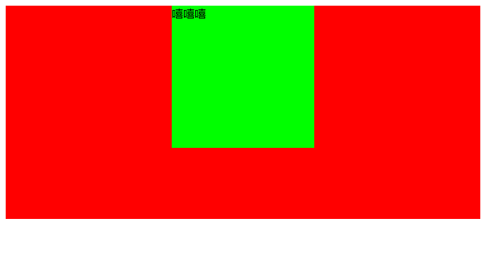
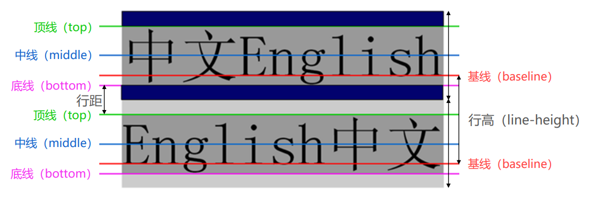
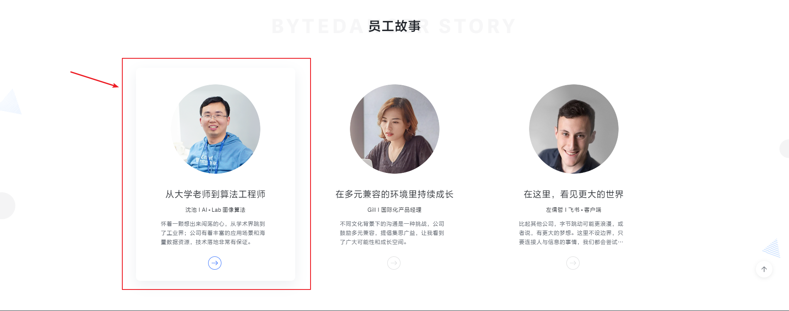

# day04 作业布置

## 一. 完成课堂所有代码（总结、整理）

见 `Learn_HTML_CSS`

### `text-decoration`

- `text-decoration` 这个 `CSS` 属性用来设置文本的修饰线的外观；

- 它是 `text-decoration-line`、`text-decoration-color`、`text-decoration-style` 以及新出现的 `text-decoration-thickness` 属性的简写属性，它可以以任意顺序使用上述四个普通属性中的任何一个或多个；

  - 比如：

    ```css
    /* 下划线 天空蓝 波浪线 3px */
    text-decoration: underline skyblue wavy 3px;
    ```

- 它不是继承属性；

- `text-decoration` 有如下常见取值：

  - `none`：无任何装饰线

    - 可以用来去除 `a` 元素默认的下划线

    - `a` 元素有下划线的本质是用户代理（比如浏览器）为其添加了 `text-decoration: underline;` 这一样式

    - 开发中，我们一般会建一个样式重置的文件（比如 `reset.css`），重置浏览器默认添加的样式：

      ```css
      /* 消除 a 元素默认的下划线 */
      a {
        text-decoration: none;
      }
      ```

  - `underline`：下划线

  - `overline`：上划线

  - `line-through`：中划线（删除线）

## 二. 具体说明text-align居中的条件

- `text-align` 的字面意思是设置文本的对齐方式；

- 但准确来说，`text-align` 是设置**行内级内容（`the inline-level content`，比如文字、`input`、`img` 等）**在其**块父元素中**的对齐方式；

- 因此，要想让 `text-align: center;` 生效，块元素中的内容必须是**行内级内容**；

- 而如果想让块级元素居中，可以改变其特性来实现，比如设置 `display: inline-block;` 将块级元素转换为行内块元素；

  - 或者设置其左、右 `margin` 的值为 `auto`：`margin: 0 auto;`，这也是居中一个块级元素且不居中它的行内内容的标准兼容的方法：

    ```css
    .box {
      height: 300px;
      background-color: #f00;
    
      /* text-align: center; */
    }
    
    .content {
      /* display: inline-block; */
      /* 块级元素设置自身居中，也可以通过设置 margin 实现 */
      margin: 0 auto;
    
      width: 200px;
      height: 200px;
      background-color: #0f0;
    }
    ```

    ```html
    <div class="box">
      <div class="content"><div>嘻嘻嘻</div></div>
    </div>
    ```

    

## 三. line-height为什么可以让文字居中？



- `line-height` 用来设置文本的行高（行盒的高度）；
- 行高可以理解为一行文字所占据的高度；
- 行高的出现是为了方便阅读和理解；
- 而行高严格的定义是：**两行文字基线之间的距离**；
  - 基线也就是与小写字母 `x` 底部对齐的线
- 也就是说：行高 = 两行文本基线之间的距离 =  一行文本的高度（顶线到底线的距离，`font-size` 的值） + 行距
- 而行距会进行平分，文本的上下方都会留出一半的行距；
- 所以当一个 `div` 的 `line-height` = `height` 时，如果这个 `div` 中只有一行文本，那么这行文本就会在该 `div` 中垂直居中了。

## 四. 总结目前所学过的所有选择器？思考它们的应用场景。

- 通用选择器：`*`
- 元素选择器：`元素的名称`
- 类选择器：`.类名`
- `ID` 选择器：`#ID名称`
- 属性选择器：`[attr]`、`[attr=“val”]` 等等
- 后代选择器：`A B`
- 子代选择器：`A > B`
- 一般兄弟选择器：`A ~ B`
- 紧邻兄弟选择器：`A + B`
- 交集选择器：`ABC`（比如 `div.box.one`）
  - 需要同时满足多个选择器条件（多个选择器条件之间紧密连接），通常**用来精准地选中某一个元素**；
- 并集选择器：`A, B, C`
  - 只需符合多个选择器条件中的一个即可（多个选择器条件之间用 `,` 分隔），通常**用来给多个元素设置相同的样式；**
- 伪类选择器：
  - 动态伪类：
    - `:link`
    - `:visited`
    - `:focus`
    - `:hover`
    - `:active`
  - 目标伪类：
    - `:target`
  - 语言伪类：
    - `:lang()`
  - 元素状态伪类：
    - `:enabled`
    - `:disabled`
    - `:checked`
  - 结构伪类：
    - `:nth-child()`、`:nth-last-child()`、`:nth-of-type()`、`:nth-last-of-type()`
    - `:first-child`、`:last-child`、`:first-of-type`、`:last-of-type`
    - `:root`、`:only-child`、`:only-of-type`、`:empty`
  - 否定伪类：
    - `:not()`

## 五. 预习结构伪类的使用方法。

- `:nth-child()`：使用 `An+B` 表示法从同级元素列表中选择元素；
- `:nth-last-child()`：使用 `An+B` 表示法从同级元素列表中选择元素，从列表末尾倒数；
- `:nth-of-type()`：根据元素在相同类型（标签名称）的兄弟元素中的位置来匹配元素；
- `:nth-last-of-type()`：根据元素在相同类型（标签名称）的兄弟元素中的位置匹配元素，从末尾开始计数；
- `:first-child`：匹配一个元素，它是其兄弟元素中的第一个；
- `:last-child`：匹配一个元素，它是其兄弟元素中的最后一个；
- `:first-of-type`：匹配一组兄弟元素中指定类型的第一个元素；
- `:last-of-type`：匹配一组兄弟元素中指定类型的最后一个元素；
- `:root`：表示作为文档根的元素。在 `HTML` 中，这通常是 `<html>` 元素；
- `:only-child`：匹配没有任何兄弟元素的元素。等价于 `:first-child:last-child` 或者 `:nth-child(1):nth-last-child(1)`，当然，`:only-child` 的权重会低一点；
- `:only-of-type`：匹配没有相同类型的兄弟元素的元素；
- `:empty`：匹配没有任何后代元素（元素节点或文本（`Selectors Level 4` 草案中包括空格，而 `Selectors Level 3` 中不包括空格））的元素；

## 六. 使用所学的HTML、CSS知识查找一个案例练习

比如字节跳动招聘网页中的员工故事：



```html
<!DOCTYPE html>
<html lang="en">
<head>
  <meta charset="UTF-8">
  <meta http-equiv="X-UA-Compatible" content="IE=edge">
  <meta name="viewport" content="width=device-width, initial-scale=1.0">
  <title>Document</title>
  <style>
    body {
      margin: 0;
      padding: 0;
      font-family: Gilroy-regular,-apple-system,BlinkMacSystemFont,Segoe UI,PingFang SC,Hiragino Sans GB,Microsoft YaHei,Helvetica Neue,Helvetica,Arial,sans-serif,Apple Color Emoji,Segoe UI Emoji,Segoe UI Symbol;
    }

    a {
      text-decoration: none;
      color: #3370ff;
    }

    .item {
      display: flex;
      flex-direction: column;
      align-items: center;

      box-sizing: border-box;
      width: 384px;
      padding: 40px 60px 27px;
      margin: 50px 0 0 50px;
    }

    .item:hover {
      box-shadow: 0 10px 30px 0 rgb(136 150 171 / 15%);
    }

    .item:hover .employeeCard-more {
      opacity: 1;
      border: 1px solid #3370ff;
      color: #3370ff;
    }

    .item .avatar {
      height: 216px;
      margin-bottom: 32px;
      text-align: center;
    }

    .item .avatar > img {
      width: 216px;
      height: 216px;
    }

    .item .employeeCard-name {
      margin-bottom: 8px;
      font-size: 22px;
      color: #1f2329;
      text-align: center;
    }

    .item .employeeCard-title {
      margin-bottom: 12px;
      font-size: 14px;
      color: #1f2329;
      text-align: center;
    }

    .item .employeeCard-description {
      margin-bottom: 24px;
      font-size: 14px;
      color: #646a73;
      text-align: left;
    }

    .item .employeeCard-more {
      display: inline-block;
      opacity: .2;
      width: 32px;
      height: 32px;
      border: 1px solid #51565d;
      border-radius: 50%;
      color: #51565d;
      text-align: center;
    }

    .item .employeeCard-more svg {
      width: 16px;
    }
  </style>
</head>
<body>

  <a class="item" href="https://jobs.bytedance.com/experienced/story/1">
    <div class="avatar">
      
    </div>
    <div class="employeeCard-name">从大学老师到算法工程师</div>
    <div class="employeeCard-title">沈池 I AI - Lab 图像算法</div>
    <div class="employeeCard-description">
      怀着一颗想出来闯荡的心，从学术界跳到了工业界；公司有着丰富的应用场景和海量数据资源，技术落地非常有保证。
    </div>
    <div class="employeeCard-more">
      <svg class="arrow-more_svg__icon" viewBox="0 0 1450 1024" width="32" height="32"><path fill="currentColor" d="M1390.933 546.133L972.8 964.267c-17.067 17.066-51.2 17.066-68.267 0L896 955.733c-17.067-17.066-17.067-51.2 0-68.266l324.267-332.8H76.8c-25.6 0-42.667-17.067-42.667-42.667v-8.533c0-25.6 17.067-42.667 42.667-42.667h1160.533L896 119.467c-17.067-17.067-17.067-51.2 0-68.267l8.533-8.533c17.067-17.067 51.2-17.067 68.267 0L1390.933 460.8c8.534 8.533 8.534 17.067 17.067 25.6v8.533c0 34.134-8.533 42.667-17.067 51.2z"></path></svg>
    </div>
  </a>

</body>
</html>
```

