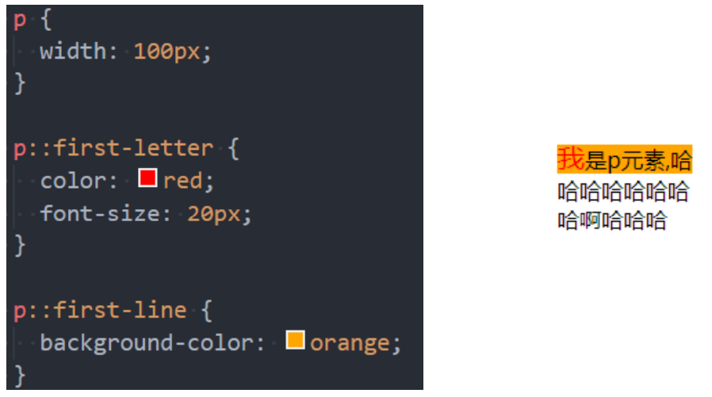
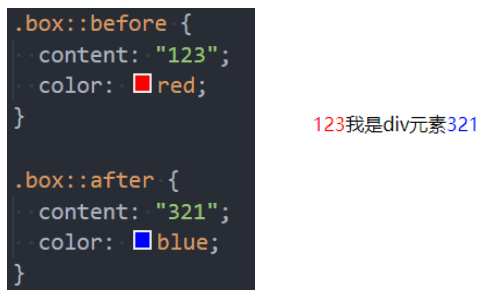

## 1. （掌握）伪元素（`Pseudo-elements`）

- 伪元素是一个附加至选择器末的关键词，允许你对**被选择元素的特定部分**修改样式。
- 常见的伪元素有：
  - `:first-line`、`::first-line`
  - `:first-letter`、`::first-letter`
  - `:before`、**`::before`**
  - `:after`、**`::after`**
- 为了区分伪元素和伪类，建议伪元素使用 `2` 个冒号，比如 `::first-line`

## 2. （了解）伪元素 - `::first-line`、`::first-letter`

- `::first-line` 可以为**块级元素的第一行内容**设置样式；
- `::first-letter` 可以为块级元素的**第一行第一个字母**设置样式；

## 3. （掌握）伪元素 - `::before`、`::after`

- `::before` 和 `::after` 用来在一个元素的**内容之前或之后插入其它内容**（可以是文字、图片）

  - 常通过 **`content` 属性**来为一个元素添加修饰性的内容；
  - `::before` 会创建一个伪元素，它将成为被选中的元素的第一个子元素，并且默认为行内元素；
  - `::after` 会创建一个伪元素，它将成为被选中的元素的最后一个子元素，并且默认为行内元素；

  

