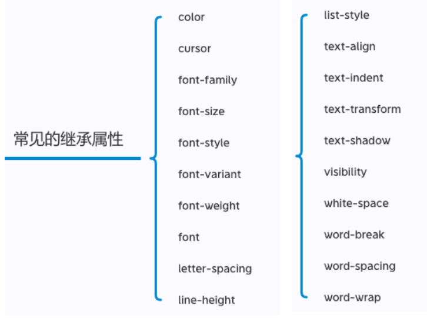
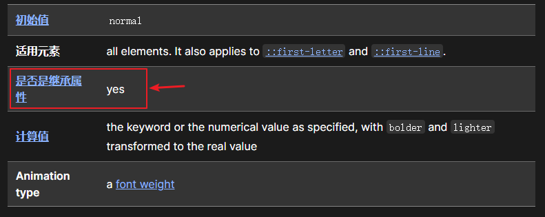
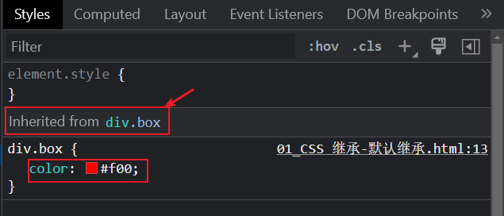
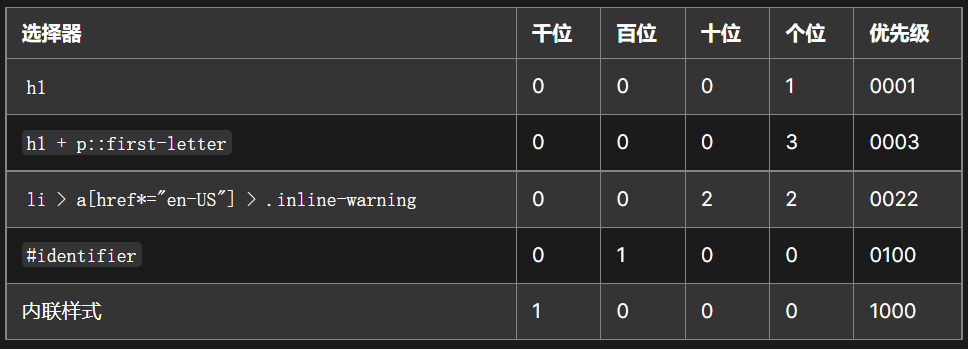
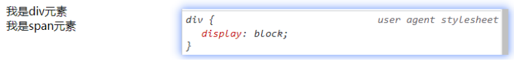
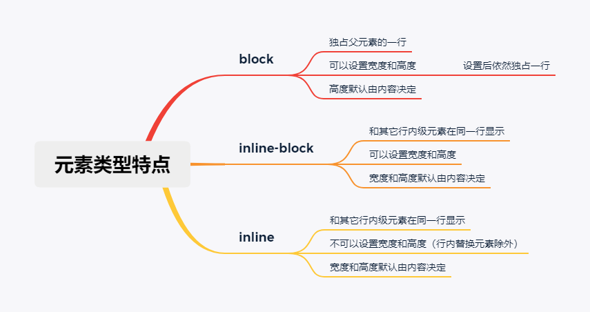

## 1. （掌握）`CSS` 属性的特性——继承性

- `CSS` 的某些属性具有继承性（`inherited`）：

  - **如果一个 `CSS` 属性具备继承性**，那么**在某个元素上设置后**，该元素的**后代元素都可以继承这个属性**；
  - 当然，如果**后代元素自己有设置该属性**，那么**优先使用后代元素自己的属性**（不管继承过来的属性权重有多高）;

- 如何知道一个 `CSS` 属性是否具有继承性呢？

  - 常见的 `font-size`、`font-family`、`font-weight`、`line-height`、`color`、`text-align` 都具有继承性；

    - 很多字体、文本属性都具有继承性；

      

  - 这些**不用刻意去记**，用得多自然就记住了；

- 另外要多学会查阅文档，文档中每个属性都有标明其继承性：

  

  此外，浏览器中调试也能看到 `CSS` 属性是否被继承：

  

- 注意（了解）：**继承过来的是计算值，而不是设置的值**

## 2. （掌握）`CSS` 属性的特性——层叠性

- `CSS` 的翻译是层叠样式表，什么是**层叠**呢？

  - 对于一个元素来说，**相同的一个属性**可以**通过不同的选择器给它进行多次设置**；
  - 那么属性的值会被**一层层覆盖上去**；
  - 最终**只会有一个生效**；

- 那么多个样式属性覆盖上去，哪一个会生效呢？

  - 判断一：**选择器的权重，权重大的生效，根据权重可以判断出优先级**；
  - 判断二：**先后顺序，权重相同时，后面设置的生效**；

- 那么如何知道元素的权重呢？[^1]

  - 按照经验，为了方便比较 `CSS` 属性的优先级，可以给 `CSS` 属性所处的环境定义一个权值（权重）：

    - `!important`：`10000`
    - 内联样式：`1000`
    - `id` 选择器：`100`
    - 类选择器、属性选择器、伪类：`10`
    - 元素选择器、伪元素：`1`
    - 通配选择器：`0`

    

## 3. （掌握）`HTML` 元素的类型——块级、行内级

- 在前面我们经常提到 `div` 元素是**块级元素**，会独占一行，`span` 元素是**行内级元素**，会在同一行显示；
  - 那么到底什么是**块级元素**，什么是**行内级元素**呢？
- `HTML` 定义元素类型的思路：
  - **`HTML` 元素有很多**，比如 `h` 元素、`p` 元素、`div` 元素、`span` 元素、`img` 元素、`a` 元素等等；
  - 当我们把这个元素**放到页面上**时，这个元素**到底占据页面中一行的多大空间**呢？
    - 为什么我们这里**只说一行**呢？因为**垂直方向的高度通常是由内容决定**的；
  - 比如一个 `h1` 元素的标题，它是**比较重要**的，我们必然是希望它**独占一行**的，其它的内容不应该和标题放在一起；
  - 比如一个 `p` 元素的段落，它也是**比较重要**的，也应该**独占一行**，其它的内容不应该和段落放在一起；
  - 而诸如 `img`、`span`、`a` 元素等元素，通常是对**内容的某一个细节的特殊描述，没有必要独占一行**；
- 所以，**为了区分哪些元素需要独占一行，哪些元素不需要独占一行，`HTML` 将元素区分（本质是通过 `CSS` 实现的）成了两类**：
  - **块级元素**（`block-level elements`）：独占**父元素的一行**；
  - **行内级元素**（`inline-level elements`）：**多个行内级元素可以在父元素的同一行中显示**；

## 4. （掌握）通过 `CSS` 的 `display` 属性修改元素类型

- 前面我们说过，事实上元素没有本质的区别：

  - `div` 是块级元素，`span` 是行内级元素；
  - `div` 之所以是块级元素仅仅是因为浏览器默认**设置了 `display` 属性**而已；

  

- 那么我们是否可以通过 `display` 属性来改变元素的特性呢？

  - 当然可以

- `CSS` 中有个 `display` 属性，能修改元素的显示类型，有 `4` 个常用值：

  - `block`：让元素显示为块级元素；
  - `inline`：让元素显示为行内级元素；
  - `inline-block`：让元素同时具备行内级、块级元素的特征；
  - `none`：隐藏元素；

- 事实上 `display` 还有其它的值，比如 `flex`，后续会专门学习；

### `display` 值的特性（非常重要）

- `block` 元素：
  - 独占父元素的一行
  - 可以随意设置宽高
  - 高度默认由内容决定
- `inline-block` 元素
  - 跟其它行内级元素在同一行显示
  - 可以随意设置宽高
  - 宽度、高度默认由内容决定
  - 可以这样理解：
    - 对外来说，它是一个行内级元素
    - 对内来说，它是一个块级元素
- `inline` 元素
  - 跟其它行内级元素在同一行显示
  - 不可以设置宽高（行内替换元素除外）
  - 宽高都由内容决定

## 5. （理解）编写 `HTML` 元素时的注意事项

- **块级元素、`inline-block` 元素**
  - **一般情况下，可以包含其它任何元素**（比如块级元素、行内级元素、`inline-block` 元素）
  - 特殊情况：`p` 元素不能包含其它块级元素；
- **行内级元素**（比如 `a`、`span`、`strong` 等）
  - 一般情况下，只能**包含行内级元素**

## 6. （掌握）`HTML` 元素的隐藏方法

- 方法一：`display` 设置为 `none`
  - 元素不显示出来，并且也不占据位置（但在 `DOM` 中依然存在），**不占据任何空间**（和不存在一样）；
- 方法二：`visibility` 设置为 `hidden`
  - 设置为 `hidden`，虽然元素不可见，但是**会占据元素应该占据的空间**；
  - 默认为 `visible`，元素是可见的；
- 方法三：`rgba` 设置颜色，将 `a` 的值设置为 `0`
  - `rgba` 的 `a` 设置的是 `alpha` 值，可以设置透明度，**不影响子元素**；
- 方法四：`opacity` 设置不透明度，设置为 `0`
  - 设置**整个元素**的透明度，**会影响所有的子元素**；

## 7. （掌握）`HTML` 元素的内容溢出——`overflow` 属性

- `overflow` 属性用于控制内容溢出时的行为
  - `visible`：默认值，溢出的内容照样可见；
  - `hidden`：溢出的内容直接裁剪掉；
  - `scroll`：溢出的 内容被裁剪，但可以通过滚动机制查看
    - 会一直显示滚动条区域，滚动条区域占用的空间属于 `width`、`height`
  - `auto`：自动根据内容是否溢出来决定是否提供滚动机制

## 8. （理解）`CSS` 样式不生效的原因

- 有时候编写的 `CSS` 属性不好使，有可能是因为：
  - 选择器**没选中对应的元素**；
  - 选择器的**优先级太低**；
  - `CSS` 属性的使用**形式不对**
    - **元素不支持此 `CSS` 属性**，比如 `span` 默认是不支持 `width` 和 `height` 的；
    - **浏览器不支持此 `CSS` 属性**，比如旧版本的浏览器不支持一些 `CSS Module Level 3` 的某些属性；
    - **被同类型的 `CSS` 属性覆盖**，比如 `font` 属性覆盖 `font-size`；
- 建议：
  - 充分利用**浏览器的开发者工具进行调试（增加、修改样式）、查错**

[^1]: https://developer.mozilla.org/zh-CN/docs/Learn/CSS/Building_blocks/Cascade_and_inheritance#%E7%90%86%E8%A7%A3%E5%B1%82%E5%8F%A0