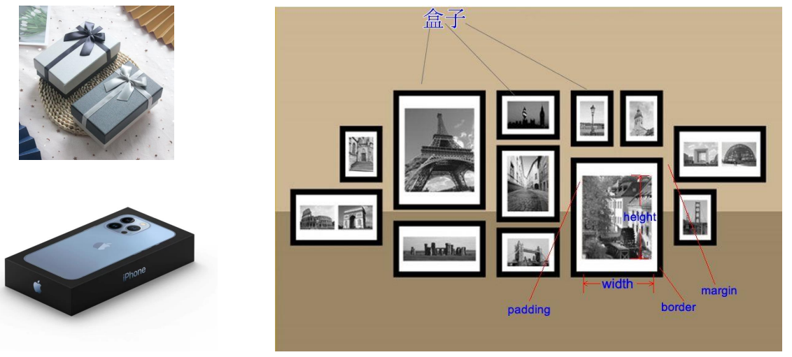
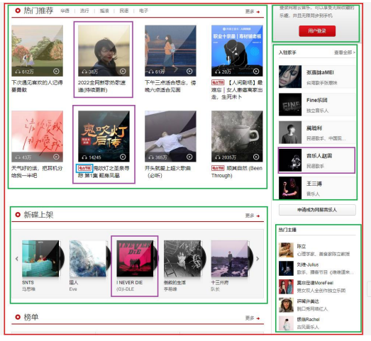
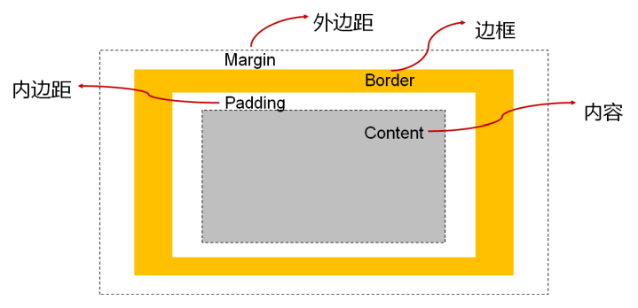
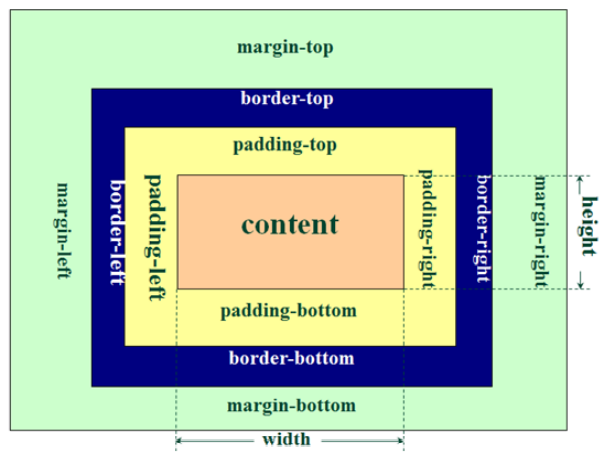
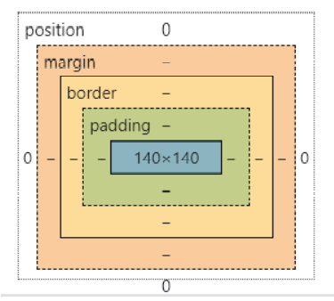
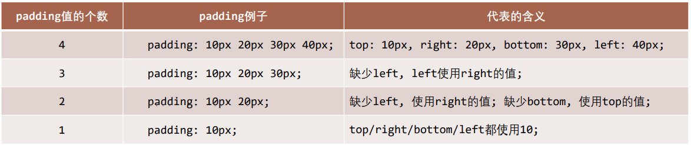
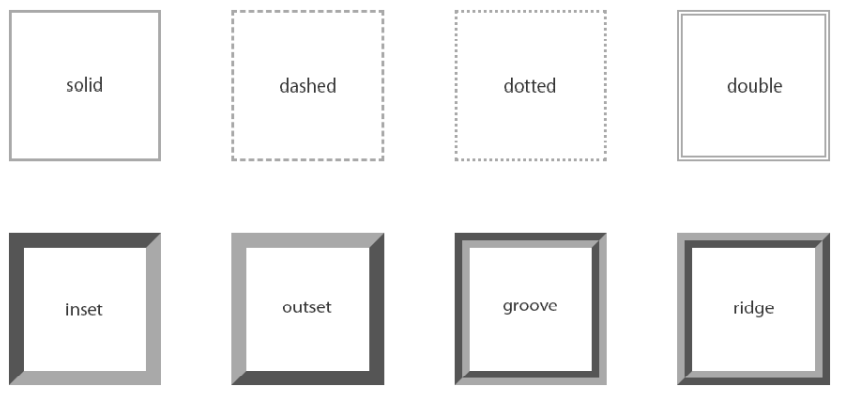
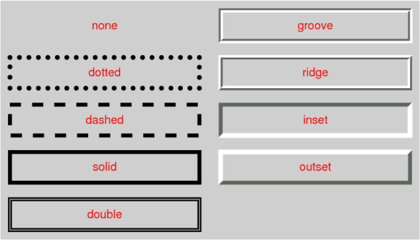
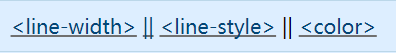
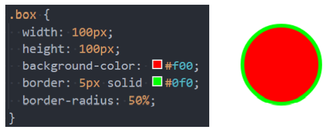

## 1. （掌握）认识盒子模型

### 认识盒子

- 生活中，我们经常会看到各种各样的盒子：

  

### `HTML` 的每个元素都是盒子

- 事实上，我们可以把 `HTML` 的每一个元素都看成一个的盒子：

  

### 盒子模型（`Box Model`）

- `HTML` 中的每一个元素都可以看做是一个盒子（如下图所示），可以具备 `4` 个属性（`4` 部分）：

  - 内容（`content`）
    - 元素的内容，具有 `width` 和 `height`
  - 内边距（`padding`）
    - 元素和内容之间的间距
  - 边框（`border`）
    - 元素自己的边框
  - 外边距（`margin`）
    - 元素和其它元素之间的间距

  

### 盒子模型的四边

- 因为盒子有四边，所以 `padding`、`border`、`margin` 都包括 `top`、`right`、`bottom`、`left` 四个边：

  

### 在浏览器的开发工具中

## 2. （掌握）内容的 `width` 和 `height`

- 内容的宽度和高度是通过 `width` 和 `height` 设置的：
  - 宽度设置：**`width`**
  - 高度设置：**`height`**
- 注意：对于**行内非替换元素**来说，设置**宽高是无效**的！
- `width` 和 `height` 的默认值都是 `auto`，不是 `0`，也不是 `100%`
- 另外，我们还可以设置如下属性：
  - **`min-width`**：**最小宽度**，无论内容多少，宽度都**大于或等于 `min-width`**
  - **`max-width`**：**最大宽度**，无论内容多少，宽度都**小于或等于 `max-width`**
  - **移动端适配**时，可以设置内容的最大宽度和最小宽度；
- 下面两个属性不常用：
  - `min-height`：最小高度，无论内容多少，高度都大于或等于 `min-height`
  - `max-height`：最大高度，无论内容多少，高度都小于或等于 `max-height`

## 3. （掌握）内边距 `padding`

- **`padding` 属性**用于设置盒子的内边距，即设置**边框和内容之间的间距**；

- `padding` 包括四个方向，所以有如下的取值：

  - **`padding-top`**：上内边距
  - **`padding-right`**：右内边距
  - **`padding-bottom`**：下内边距
  - **`padding-left`**：左内边距

- `padding` 单独编写是一个缩写属性：

  - **`padding-top`**、**`padding-right`**、**`padding-bottom`**、**`padding-left`** 的简写属性
  - `padding` 缩写属性是**从零点钟方向开始**，沿着**顺时针转动**的，也就是**上右下左**；

- `padding` 并非必须是 `4` 个值,也可以有其它值：

  

## 4. （掌握）边框 `border`、圆角 `border-radius`

### 边框 - `border`

- `border` 用于设置盒子的边框

  

- **边框**相对于 `content`、`padding`、`margin` 来说特殊一些：

  - 边框具备**宽度** `width`；
  - 边框具备**样式** `style`；
  - 边框具备**颜色** `color`；

### 设置边框的方式

- 边框宽度
  - **`border-top-width`**、**`border-right-width`**、**`border-bottom-width`**、**`border-left-width`**
  - **`border-width`** 是上面 `4` 个属性的简写属性
- 边框样式
  - **`border-top-style`**、**`border-right-style`**、**`border-bottom-style`**、**`border-left-style`**
  - **`border-style`** 是上面 `4` 个属性的简写属性
- 边框颜色
  - **`border-top-color`**、**`border-right-color`**、**`border-bottom-color`**、**`border-left-color`**
  - **`border-color`** 是上面 `4` 个属性的简写属性

### 边框样式的设置值

- 边框的样式有很多，我们可以了解如下的几个：

  - **`groove`**：凹槽，沟槽，边框看上去好像是雕刻在画布之内；
  - **`ridge`**：山脊，和 `groove` 相反，边框看上去好像是从画布中凸出来；

  

  

### 同时设置的方式

- 如果我们相对某一边同时设置“宽度”、“样式”、”颜色“，可以进行如下设置：

  - **`border-top`**
  - **`border-right`**
  - **`border-bottom`**
  - **`border-left`**
  - **`border`**：统一设置 `4` 个方向的边框

- 边框宽度、样式、颜色的编写顺序任意：

  

### 圆角 - `border-radius`

- `border-radius` 用于设置盒子的圆角

  

- `border-radius` 常见的值：

  - **数值**：通常用来设置小的圆角，比如 `6px`；
  - **百分比**：通常用来设置一定的弧度或者圆形；

- `border-radius` 事实上是一个缩写属性：

  - 将这四个属性 `border-top-left-radius`、`border-top-right-radius`、`border-bottom-right-radius`、`border-bottom-left-radius` 简写为一个属性；
  - 开发中比较少见一个个圆角设置；

- 如果一个元素是正方形，设置 `border-radius` 大于或等于 `50%` 时，就会变成一个圆：

  

