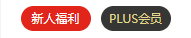

# Day05作业布置

## 一. 写出案例，证明CSS属性的继承性

- `CSS` 属性的继承性：
  - `CSS` 的某些属性具有继承性，就是说如果一个 `CSS` 属性是可继承属性，那么当我们在某个元素上设置了该属性之后，这个元素的后代元素都可以继承这个 `CSS` 属性；
  - 当然，如果后代元素有设置相同的属性，那么优先使用后代元素自己的属性（不管继承过来的属性的权重有多高）；

```html
<!DOCTYPE html>
<html lang="en">
<head>
  <meta charset="UTF-8">
  <meta http-equiv="X-UA-Compatible" content="IE=edge">
  <meta name="viewport" content="width=device-width, initial-scale=1.0">
  <title>Document</title>
  <style>
    .box {
      width: 300px;
      height: 300px;
      background-color: pink;

      font-size: 32px;
      font-weight: 700;
      text-align: center;
      color: green;
    }
  </style>
</head>
<body>

  <div class="box">
    我是 div 元素
    <p>
      我是 p 元素
      <span>我是 span 元素</span>
    </p>
  </div>

</body>
</html>
```

## 二. 写出案例，证明CSS属性的层叠性

- `CSS` 属性的层叠性：
  - `CSS` 翻译过来是层叠样式表，层叠的意思是对于一个元素来说，同一个 `CSS` 属性可以通过不同的选择器进行多次设置；
  - 那么这个 `CSS` 属性的值会被一层层覆盖上去；
  - 最终只会有一个生效；
- 最终生效的样式（优先级最高的样式）根据以下方式得出：
  - 判断选择器的权重，权重最大的生效；
  - 如果权重相同，判断样式出现的先后顺序，最后面的生效；
- 选择器的权重：
  - 根据经验，为了方便比较 `CSS` 属性值的优先级，可以给 `CSS` 属性所处的环境定义一个权值（权重）：
    - `!important`：`10000`
    - 内联样式：`1000`
    - `ID` 选择器：`100`
    - 类选择器、伪类选择器、属性选择器：`10`
    - 元素选择器、伪元素选择器：`1`
    - 通配选择器：`0`

```html
<!DOCTYPE html>
<html lang="en">
<head>
  <meta charset="UTF-8">
  <meta http-equiv="X-UA-Compatible" content="IE=edge">
  <meta name="viewport" content="width=device-width, initial-scale=1.0">
  <title>Document</title>
  <style>
    * {
      font-size: 36px;
      color: green;
    }

    div {
      color: blue;
    }

    .box {
      color: pink;
    }

    #home {
      color: orange;
    }

    div.box {
      color: red !important;
    }
  </style>
</head>
<body>

  <div id="home" class="box" style="color: skyblue;">
    我是 div 元素
  </div>

</body>
</html>
```

## 三. 默写出display常见的值，并且说出对应的特性，并且写出测试案例

- `display` 常见的值如下：
  - `block`：让元素显示为块级元素
    - 元素独占父元素的一行；
    - 可以设置宽度和高度；
    - 高度默认由元素的内容决定；
  - `inline-block`：让元素显示为行内块级元素，使之同时具备行内级、块级元素的特征
    - 元素和其它行内级元素在同一行中显示；
    - 可以设置宽度和高度；
    - 宽度和高度默认由元素的内容决定；
  - `inline`：让元素显示为行内级元素
    - 元素和其它行内级元素在同一行中显示；
    - 不可以设置宽度和高度（行内替换元素除外）；
    - 宽度和高度默认由元素的内容决定；
  - `none`：隐藏元素

```html
<!DOCTYPE html>
<html lang="en">
<head>
  <meta charset="UTF-8">
  <meta http-equiv="X-UA-Compatible" content="IE=edge">
  <meta name="viewport" content="width=device-width, initial-scale=1.0">
  <title>Document</title>
  <style>
    .box {
      display: inline;

      /* width: 300px;
      height: 100px; */

      background-color: skyblue;
    }

    .content {
      display: block;

      background-color: limegreen;
    }

    a {
      background-color: pink;
    }

    .poetry::after {
      content: "";

      display: inline-block;

      width: 20px;
      height: 10px;
      background-color: #f66;
    }

    p {
      display: none;
    }
  </style>
</head>
<body>

  <div class="box">我是 div 元素，我要变成行内级元素</div>
  <span class="content">我是 span 元素，我要变成块级元素</span>
  <a href="#">我是 a 元素</a>
  <span class="poetry">蒹葭苍苍</span>
  <p>我是 p 元素，我要隐藏起来</p>

</body>
</html>
```

## 四. 总结元素隐藏的方法，并且说出他们的区别

- 设置 `display: none;`
- 设置 `visibility: hidden;`
- 设置 **rgba()** 中的 `alpha` 值为 `0`
- 设置 `opacity: 0;`

它们之间的区别：

- 设置 `display` 或 `visibility` 时，没有涉及透明度，元素要么完全可以看见，要么完全看不到；而设置 `alpha` 或 `opacity` 时，设置的是透明度，可以调节元素可见的程度；
- 设置 `display: none;` 后，元素不会再占据空间（但在 `DOM` 中仍然存在）；而设置 `visibility: hidden;` 后，元素依然会占据原来所占据的空间；
- `alpha` 是对元素的某个属性进行设置，不会影响元素的后代元素；而 `opacity` 是针对整个元素起作用，所以会影响后代元素；

## 五. 案例作业 - 京东首页的两个按钮



```html
<!DOCTYPE html>
<html lang="en">
<head>
  <meta charset="UTF-8">
  <meta http-equiv="X-UA-Compatible" content="IE=edge">
  <meta name="viewport" content="width=device-width, initial-scale=1.0">
  <title>Document</title>
  <style>
    a {
      text-decoration: none;
    }

    .btn-box {
      width: 190px;
      margin: 100px auto 0;
      /* background-color: skyblue; */
      text-align: center;
    }

    .btn-box .btn {
      display: inline-block;
      margin: 0 3px;
      width: 70px;
      height: 25px;
      /* border: 1px solid #000; */
      border-radius: 13px;
      font-size: 12px;
      line-height: 25px;
    }

    .btn-box .btn:hover {
      background-color: #c81623;
      color: #fff;
    }

    .btn-box .btn-left {
      background-color: #e1251b;
      color: #fff;
    }

    .btn-box .btn-right {
      background-color: black;
      color: gold;
    }
  </style>
</head>
<body>

  <div class="btn-box">
    <a class="btn btn-left" href="https://xinren.jd.com/?channel=99" target="_blank">新人福利</a>
    <a class="btn btn-right" href="https://plus.jd.com/index?flow_system=appicon&flow_entrance=appicon3&flow_channel=pc" target="_blank">PLUS会员</a>
  </div>

</body>
</html>
```

## 六. 进行下面的案例练习

* 可以先不做两行显示不全的...
* 可以先不做评论的靠右内容


```html
<!DOCTYPE html>
<html lang="en">
<head>
  <meta charset="UTF-8">
  <meta http-equiv="X-UA-Compatible" content="IE=edge">
  <meta name="viewport" content="width=device-width, initial-scale=1.0">
  <title>Document</title>
  <style>
    .item {
      margin: 100px auto 0;
      width: 300px;
      height: 400px;
      background-color: #eaeaea;
    }

    .item img {
      margin: 10px 10px 5px 10px;
      width: 280px;
    }

    .item .content {
      margin: 0 10px;
    }

    .item .content .title {
      display: -webkit-box;
      font-size: 19px;
      font-weight: 700;
      word-break: break-all;
      /* text-overflow: ellipsis; */
      -webkit-line-clamp: 2;
      /* line-clamp: 2; */
      -webkit-box-orient: vertical;
      overflow: hidden;
    }

    .item .content .price-comments {
      margin-top: 8px;
      color: #666;
    }

    .item .content .price-comments .price,
    .item .content .price-comments .comments {
      display: inline-block;
    }

    .item .content .price-comments .comments {
      margin-left: 49px;
    }

    .item .content .price-comments .price .current {
      font-size: 26px;
      font-weight: bold;
      color: red;
    }

    .item .content .price-comments .price .original {
      margin-left: 5px;
      font-size: 16px;
      text-decoration: line-through;
    }
  </style>
</head>
<body>

  <div class="item">
    
    <div class="content">
      <div class="title">【轻烟蜜粉】MAKE UP FOR EVER 玫珂菲 HD清晰无痕蜜粉哈哈哈</div>
      <div class="price-comments">
        <div class="price">
          <span class="current">¥275</span>
          <span class="original">¥380</span>
        </div>
        <div class="comments">4934 人已评价</div>
      </div>
    </div>
  </div>

</body>
</html>
```