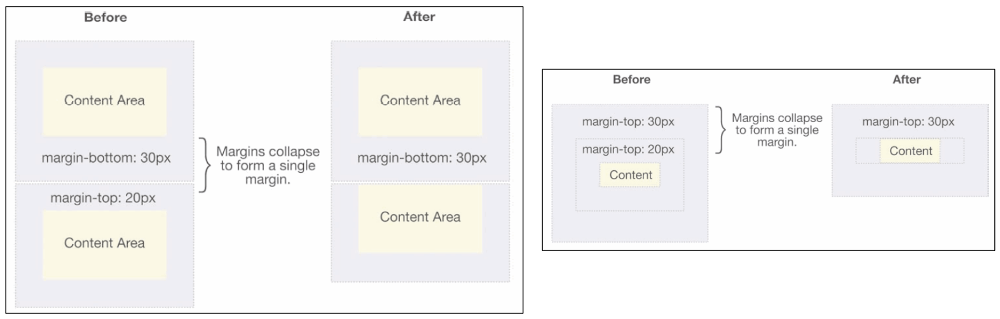

## 1. （掌握）外边距 `margin`

- **`margin` 属性**用于设置盒子的**外边距**，通常用于设置**元素和元素之间的间距**

- `margin` 包括四个方向，所以有如下取值：
  - **`margin-top`**：上外边距
  - **`margin-right`**：右外边距
  - **`margin-bottom`**：下外边距
  - **`margin-left`**：左外边距
  
- `margin` 单独编写是一个简写属性：
  
  - `margin-top`、`margin-right`、`margin-bottom`、`margin-left` 的简写属性；
  - `margin` 简写属性是**从零点钟方向开始**，沿着**顺时针方向转动**，也就是“**上右下左**”；
  
- `margin` 并非必须是 `4` 个值，也可以有其它值：
  
  

### `margin` 和 `padding` 的对比

- **`margin`** 一般是用来**设置兄弟元素之间**的间距；
- **`padding`** 一般是用来**设置父子元素之间**的间距；

### 上下 `margin` 的传递

- `margin-top` 的传递
  - 如果**块级元素的顶部线和父元素的顶部线重叠**，那么**这个块级元素的 `margin-top` 值会传递给父元素**；
- `margin-bottom` 的传递
  - 如果**块级元素的底部线和父元素的底部线重叠**，并且**父元素的高度是 `auto`**，那么**这个块级元素的 `margin-bottom` 值会传递给父元素**；
- 如何防止出现上下 `margin` 的传递问题呢？有以下 `3` 种方案：
  - （推荐）改用 `padding-top`、`padding-bottom`，在父元素上进行设置；
  - 给父元素设置 `border`
  - 在父元素上触发 `BFC`（比如在父元素上设置 `overflow: auto;`）
- 建议：
  - **`margin`** 一般是用来**设置兄弟元素之间**的间距；
  - **`padding`** 一般是用来**设置父子元素之间**的间距；

### 上下 `margin` 的折叠

- 垂直方向上相邻的两个 `margin`（`margin-top`、`margin-bottom`）有可能会合并为 `1` 个 `margin`，这种现象叫做 **`collapse`（折叠）**；
- 水平方向上的 `margin`（`margin-left`、`margin-right`）不会发生 `collapse`；
- 折叠后最终值的计算规则：
  - 两个值进行比较，**取较大的值**；
- 如何防止 `margin` 折叠呢？
  - **只设置其中一个元素的 `margin`**；

### 上下 `margin` 折叠的两种情况

- **两个兄弟块级元素**之间**上下 `margin` 的折叠**；
- **父子块级元素**之间 **`margin` 的折叠**；

## 2. （掌握）块级元素的水平居中

- 对于块级元素的水平居中，通常可以设置其左右 `margin` 的值为 `auto`；
- 因为块级元素会独占父元素的一行；
- 再根据计算公式：`margin-left` + `border-left-width` + `padding-left` + `width` + `padding-right` + `border-right-width` + `margin-right` = `width of containing block`，当 `border` 和 `padding` 都为 `0` 时，`margin-left` + `width` + `margin-right` 的值等于包含块的宽度；
- 而 `margin-left` 和 `margin-right` 都设置为 `auto` 时，它们会被设置相同的值，在水平方向上该块级元素就能相对于其包含块的边缘水平居中了[^1]；

## 3. （掌握）轮廓 `outline`

- `outline` 表示元素的**轮廓**
  - **不占用空间**
  - 默认**显示在 `border` 的外面**
- `outline` 相关的属性有：
  - **`outline-width`**：轮廓的宽度
  - **`outline-style`**：轮廓的样式，取值跟 `border` 的样式一样，比如 `solid`、`dotted` 等
  - **`outline-color`**：轮廓的颜色
  - **`outline`**：`outline-width`、`outline-style`、`outline-color` 的简写属性，跟 `border` 用法类似
- 应用实例
  - **去除 `a` 元素、`input` 元素的 `focus` 轮廓效果**

## 4. （掌握）盒子阴影和文字阴影

### 盒子阴影 - `box-shadow`

- **`box-shadow` 属性可以设置一个或多个阴影**

  - 每个阴影用 **`<shadow>`** 表示
  - 多个阴影之间用**逗号 `,` 隔开，从前到后叠加**

- `box-shadow` 的常见格式如下：

  

  

  - 第 `1` 个 `<length>`：**`offset-x`**，水平方向的偏移，正数往右偏移；
  - 第 `2` 个 `<length>`：**`offset-y`**，垂直方向的偏移，正数往下偏移；
  - 第 `3` 个 `<length>`：**`blur-radius`**，模糊半径；
  - 第 `4` 个 `<length>`：**`spread-radius`**，扩散半径；
  - `<color>`：**阴影的颜色**，如果没有设置，就跟随 `color` 属性的值；
  - `inset`：**外框阴影变成内框阴影**

- 我们可以通过一个网站测试盒子的阴影：

  - https://html-css-js.com/css/generator/box-shadow/

  

### 文字阴影 - `text-shadow`

- `text-shadow` 用法类似于 `box-shadow`，用于给文字添加阴影效果

- `text-shadow` 的常见格式如下：

  

  - 相较于 `box-shadow`，`text-shadow` 没有 `spread-radius` 和 `inset` 两个值；

- 我们可以通过一个网站测试盒子的阴影：

  - https://html-css-js.com/css/generator/text-shadow/

  

## 5. （掌握）行内非替换元素的注意事项

- 以下属性**对行内非替换元素不起作用**
  - `width`、`height`、`margin-top`、`margin-bottom`
- 以下属性**对行内非替换元素的效果比较特殊**
  - `padding-top`、`padding-bottom`、上下方向的 `border`

## 6. （掌握）盒子尺寸计算 - `boxing-sizing`

- **`box-sizing` 用来设置盒子模型中宽高的行为**
- **`content-box`**
  - `padding`、`border` 都布置在 `width`、`height` 外边；
- **`border-box`**
  - `padding`、`border` 都布置在 `width`、`height` 里边；

### `box-sizing: content-box;`

- 元素的实际占用宽度 = `border` + `padding` + `width`
- 元素的实际占用高度 = `border` + `padding` + `height`

### `box-sizing: border-box;`

- 元素的实际占用宽度 = `width`
- 元素的实际占用高度 = `height`

### `IE` 盒子模型

- `W3C` 标准盒子模型

  

- `IE` 盒子模型（`IE8` 以下浏览器）

  

## 7. （掌握）元素的水平居中方案

- 在一些需求中，需要元素在父元素中水平居中显示（父元素一般都是块级元素、`inline-block`）
- 行内级元素（包括 `inline-block` 元素）
  - 水平居中：**在父元素上设置 `text-align: center;`**
- 块级元素
  - 水平居中：**设置 `margin: 0 auto;`**

## 8. 补充

[^1]: https://www.w3.org/TR/CSS2/visudet.html#blockwidth:~:text=If%20both%20%27margin%2Dleft%27%20and%20%27margin%2Dright%27%20are%20%27auto%27%2C%20their%20used%20values%20are%20equal.%20This%20horizontally%20centers%20the%20element%20with%20respect%20to%20the%20edges%20of%20the%20containing%20block.