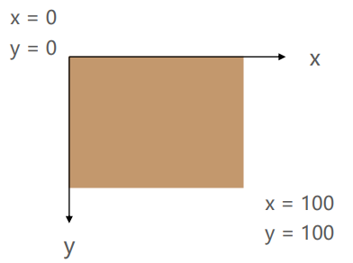
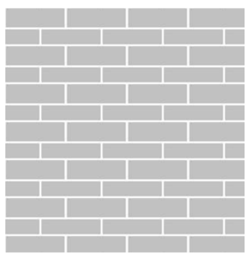
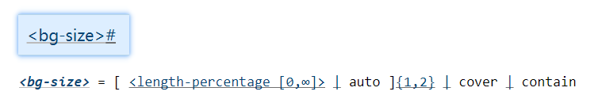
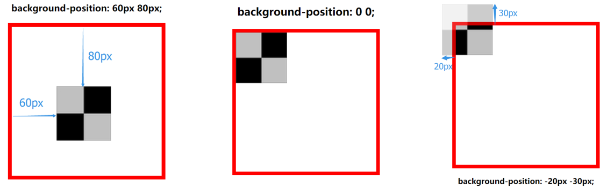
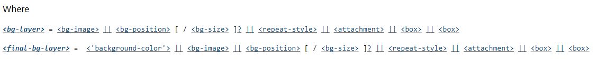
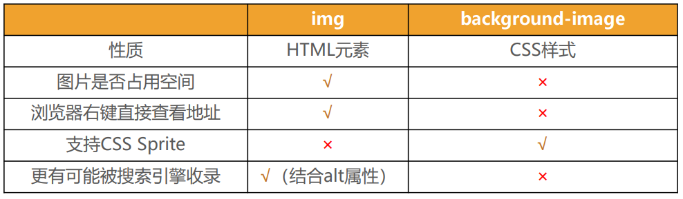

## 1. （掌握）背景图片 - `background-image`

### 认识网页的背景

- 在开发中，为了让网页更加美观，我们经常会设置各种各样的背景：
  - 我们前面已经学习了如何**设置背景颜色**，这里我们要学习**设置背景的更多知识**；

### `background-image`

- **`background-image` 用于设置元素的背景图片**
  - 会**盖在（不是覆盖）`background-color` 的上面**
- 如果设置了多张图片
  - 设置的**第一张图片将显示在最上面，其它图片按顺序层叠在下面**
- 注意：如果设置了背景图片后，**元素没有具体的宽高，背景图片是不会显示出来的**

## 2. （掌握）背景图片的重复方式 - `background-repeat`

- `background-repeat` 用于设置背景图片是否要平铺
- 常见的取值有：
  - `repeat`：平铺
  - `no-repeat`：不平铺
  - `repeat-x`：只在水平方向平铺

## 3. （掌握）背景图片的大小 - `background-size`

- `background-size` 用于设置背景图片的大小
  - `auto`：默认值，以背景图本身大小显示；
  - `cover`：缩放背景图，以完全覆盖铺满元素，可能背景图片部分看不见，图片保持宽高比；
  - `contain`：缩放背景图，宽度或高度铺满元素，但是图片保持宽高比；
  - `<percentage>`：百分比，相对于背景区（`background positioning area`，默认情况下是 `padding box`）；
  - `<length>`：具体的大小，比如 `100px`；

## 4. （掌握）背景图片的初始位置 - `background-position`

- `background-position` 用于设置背景图片在水平、垂直方向上的具体位置
  - 可以设置**具体的数值**，比如 `20px 30px;`
  - 水平方向还可以设值：**`left`、`center`、`right`**
  - 垂直方向还可以设值：**`top`、`center`、`bottom`**
  - 如果只**设置了一个方向，另一个方向默认是 `center`**

## 5. （掌握）背景附加方式 - `background-attachment`

- `background-attachment` 决定背景图像的位置是在视口内固定，或者随着包含它的区块滚动；
- 可以设置以下 `3` 个值：
  - **`scroll`**：表示背景相对于元素本身固定，而不是随着它的内容滚动；
  - **`local`**：表示背景相对于元素的内容固定，如果一个元素拥有滚动机制，背景将会随着元素的内容滚动；
  - **`fixed`**：表示背景相对于视口固定，即使一个元素拥有滚动机制，背景也不会随着元素的内容滚动；

## 6. （掌握）背景相关属性的简写属性 - `background`

- `background` 是一系列背景相关属性的简写属性；

- 常用格式是：

  

  

- `background-size` 可以省略，如果不省略，`/background-size` 必须紧跟在 `background-position` 的后面；

- 其它属性也都可以省略，而且顺序任意；

## 7. （掌握）`background-image` 和 `` 的对比

- 利用 `background-image` 和 `` 都能够实现显示图片的需求，在开发中该如何选择呢？

  

- 总结：

  - ``，作为网页内容的重要组成部分，比如广告图片、`LOGO` 图片、文章配图、产品图片；
  - `background-image`，可有可无。有，能让网页更加美观；无，也不影响用户获取完整的网页内容信息。

