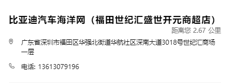

# Day06 作业布置

## 一. 完成课堂所有的代码

见 `Learn_HTML_CSS`

## 二. 写出盒子模型包含的内容以及如何设置

盒子模型从内到外依次包含：

- 内容（`content`）
  - `width`
  - `height`
- 内边距（`padding`）
  - `padding-top`
  - `padding-right`
  - `padding-bottom`
  - `padding-left`
  - `padding`
- 边框（`border`）
  - `border-width`
  - `border-style`
  - `border-color`
  - `border`
  - `border-top`
  - `border-right`
  - `border-bottom`
  - `border-left`
- 外边距（`margin`）
  - `margin-top`
  - `margin-right`
  - `margin-bottom`
  - `margin-left`
  - `margin`

## 三. 说说你对margin的传递和折叠的理解

- `margin` 的传递：
  - `margin` 的传递指的是 `margin-top`、`margin-bottom` 在父子元素之间会存在传递现象；
  - 当块级元素的顶部线和其父元素的顶部线重叠时，该块级元素的 `margin-top` 值会传递给其父元素；
  - 当块级元素的底部线和其父元素的底部线重叠，并且父元素的 `height` 为 `auto` 时，该块级元素的 `margin-bottom` 值会传递给其父元素；
- `margin` 的折叠：
  - `margin` 的折叠指的是垂直方向上相邻的两个 `margin`（`margin-top`、`margin-bottom`）在兄弟元素之间或父子元素之间会存在折叠现象；
  - 两个兄弟块级元素之间上下 `margin` 的折叠；
  - 父子块级元素之间 `margin` 的折叠；
  - 折叠后最终的计算值为两个值中的较大值；
- 如何防止 `margin` 的传递呢？
  - （推荐）改用 `padding-top`、`padding-bottom`，在父元素上设置；
  - 给父元素设置 `border`；
  - 在父元素上触发 `BFC`（比如在父元素上设置 `overflow: auto;`）；
- 如何防止 `margin` 的折叠呢？
  - 只给两个元素中的其中一个设置 `margin-top` 或 `margin-right`；
- 建议：
  - 父子元素之间设置间距使用 `padding`；
  - 兄弟元素之间设置间距使用 `margin`；

## 四. 行内非替换元素在设置padding/border的上下时，有什么特殊的地方？

- 给行内非替换元素设置 `padding-top`、`padding-bottom`、`border-top`、`border-bottom` 时，看起来有效果（上下会被“撑起来”），但不会占据空间；
- 此外，如果给行内非替换元素设置 `width`、`height`、`margin-top`、`margin-bottom`，则不会生效；

## 五. 整理box-sizing的作用，以及content-box和border-box的区别

- `box-sizing` 用来设置元素宽高的计算方式，或者说设置盒子模型中宽高的行为；
- `box-sizing: content-box;` 时，元素的实际占用宽度 = `width` + `padding` + `border`，元素的实际占用高度 = `height` + `padding` + `border`，也就是说 `padding`、`border` 都布置在 `width`、`height` 外边；
- `box-sizing: border-box;` 时，元素的实际占用宽度 = `width`，元素的实际占用高度 = `height`，也就是说 `padding`、`border` 都布置在 `width`、`height` 里边；

## 六. 说出元素水平居中的方案以及对应的场景

- 对于行内（块）元素，可以通过在其块（即 `block` 或者 `inline-block`）父元素上设置 `text-align: center;` 来使其在块父元素中水平居中显示；
  - 比如一个 `div` 元素中有一段文本，那么就可以在这个 `div` 元素上设置 `text-align: center;` 让这段文本在这个 `div` 中水平居中；
- 对于块级（即 `block`）元素，可以通过设置 `margin: 0 auto;` 让其在块（即 `block` 或者 `inline-block`）父元素中水平居中显示；
  - 比如一个 `div` 元素中有一个子 `div` 元素，那么就可以在这个子 `div` 上设置 `margin: 0 auto;` 让这个子 `div` 在这个 `div` 中水平居中；

## 七. 练习background-position和background-size（为精灵图做准备）

```html
<!DOCTYPE html>
<html lang="en">
<head>
  <meta charset="UTF-8">
  <meta http-equiv="X-UA-Compatible" content="IE=edge">
  <meta name="viewport" content="width=device-width, initial-scale=1.0">
  <title>Document</title>
  <style>
    .box {
      width: 600px;
      height: 500px;
      background-color: #1BA784;
      background-image: url(./images/kobe01.jpg);
      background-repeat: no-repeat;
      background-size: contain;
      background-position: center;
    }
  </style>
</head>
<body>

  <div class="box"></div>

</body>
</html>
```

## 八. 找出三个盒子模型的综合案例进行练习

案例 `1`：比如比亚迪官网的门店信息（https://www.bydauto.com.cn/pc/buyCarSupport）：



```html
<!DOCTYPE html>
<html lang="en">
<head>
  <meta charset="UTF-8">
  <meta http-equiv="X-UA-Compatible" content="IE=edge">
  <meta name="viewport" content="width=device-width, initial-scale=1.0">
  <title>Document</title>
  <style>
    html {
      font-family: fangzheng,Microsoft YaHei;
    }

    h3 {
      margin: 0;
    }

    .item {
      box-sizing: border-box;
      margin: 100px auto;
      padding: 20px 0;
      width: 425px;
      height: 160px;
      /* background-color: #93D5DC; */
    }

    .item .title {
      font-size: 18px;
    }

    .item .info {
      font-size: 13px;
    }

    .item .info .distance {
      margin: 3px 0 6px;
      padding-right: 30px;
      text-align: right;
      color: #666;
    }

    .item .info .location {
      display: flex;
      margin-bottom: 15px;
    }

    .item .location span:first-child {
      position: relative;
      top: 2px;
      margin-right: 8px;
      width: 20px;
      /* background-color: green; */
    }

    .item .location span:last-child {
      display: inline-block;
    }

    .item .info .tel::before {
      content: url(./images/telephone.png);
      position: relative;
      top: 2px;
      display: inline-block;
      margin-right: 7px;
      width: 20px;
      height: 14px;
      /* background-color: red; */
    }
  </style>
</head>
<body>

  <div class="item">
    <h3 class="title">比亚迪汽车海洋网（福田世纪汇盛世开元商超店）</h3>
    <div class="info">
      <div class="distance">距离您 2.67 公里</div>
      <div class="location">
        <span>
          
        </span>
        <span>广东省深圳市福田区华强北街道华航社区深南大道3018号世纪汇商场一层</span>
      </div>
      <div class="tel">电话: 13613079196</div>
    </div>
  </div>

</body>
</html>
```

案例 `2`：比如华为官网的新闻与活动展示（https://www.huawei.com/cn/）：


```html
<!DOCTYPE html>
<html lang="en">
<head>
  <meta charset="UTF-8">
  <meta http-equiv="X-UA-Compatible" content="IE=edge">
  <meta name="viewport" content="width=device-width, initial-scale=1.0">
  <title>Document</title>
  <style>
    a {
      outline: none;
      text-decoration: none;
      color: #333;
      font-family: Microsoft YaHei, Arial, Helvetica, sans-serif;
    }

    h4 {
      margin: 0;
    }

    .item {
      width: 450px;
      height: 500px;
      background-color: #f8f8f8;
    }

    .item > a {
      display: inline-block;
      width: 100%;
      height: 100%;
    }

    .item .img-box img {
      width: 100%;
    }

    .item .text-box {
      box-sizing: border-box;
      padding: 25px 28px 36px;
      height: 230px;
      font-size: 16px;
      color: #666;
    }

    .item .text-box .title {
      margin-bottom: 10px;
      font-size: 18px;
      color: #333;
    }

    .item .text-box .info {
      margin-bottom: 20px;
    }

    .item .info .address,
    .item .info .time {
      display: inline-block;
    }

    .item .info .address {
      margin-right: 10px;
    }

    .item .info .icon-address,
    .item .info .icon-time {
      margin-right: 6px;
    }

    .item .info .icon-address::before,
    .item .info .icon-time::before {
      content: "";
      position: relative;
      top: 4px;
      display: inline-block;
      width: 20px;
      height: 20px;
      /* background-color: red; */
      background-size: contain;
    }

    .item .info .icon-address::before {
      background-image: url(./images/location.svg);
    }

    .item .info .icon-time::before {
      background-image: url(./images/calendar.png);
    }

    .item .text {
      line-height: 26px;
    }
  </style>
</head>
<body>

  <div class="item">
    <a href="https://e.huawei.com/topic/2022-data-storage-user-forum/index.html" target="_blank">
      <div class="img-box">
        <!--  -->
        
      </div>
      <div class="text-box">
        <h4 class="title">2022数据存储用户精英论坛</h4>
        <div class="info">
          <div class="address">
            <span class="icon-address"></span>
            中国，广州
          </div>
          <div class="time">
            <span class="icon-time"></span>
            2022年7月28日 - 29日
          </div>
        </div>
        <div class="text">
          本届论坛将邀请资深行业用户，围绕数据存储的AI智能管理、多云连接等产业热点话题分享洞察与实践，探讨如何通过联合创新，共同定义产业方向。
        </div>
      </div>
    </a>
  </div>

</body>
</html>
```

案例 `3`：比如考拉官网的猜你喜欢（https://www.kaola.com/）：


```html
<!DOCTYPE html>
<html lang="en">
<head>
  <meta charset="UTF-8">
  <meta http-equiv="X-UA-Compatible" content="IE=edge">
  <meta name="viewport" content="width=device-width, initial-scale=1.0">
  <title>Document</title>
  <style>
    body {
      margin: 0;
      background-color: #f0f0f0;
      font: 12px/1.5 Helvetica Neue,Helvetica,Arial,Hiragino Sans GB,\5FAE\8F6F\96C5\9ED1,tahoma,simsun,\5b8b\4f53;
    }

    a {
      text-decoration: none;
      color: #333;
    }

    a:hover {
      text-decoration: underline;
    }

    .item {
      margin: 0 10px;
      width: 260px;
      height: 382px;
      /* background-color: #93D5DC; */
    }

    .item .item-img img {
      width: 100%;
    }

    .item .title {
      margin: 7px 0 7px;
      padding-right: 30px;
      font-size: 16px;

      display: -webkit-box;
      -webkit-line-clamp: 2;
      -webkit-box-orient: vertical;
      overflow: hidden;
    }

    .item .info {
      font-size: 12px;
    }

    .item .price .new {
      margin-right: 5px;
      font-size: 20px;
      font-weight: 700;
      color: #f00;
    }

    .item .price .old {
      text-decoration: line-through;
    }

    .item .info .comment {
      float: right;
      line-height: 32px;
    }
  </style>
</head>
<body>

  <div class="item">
    <div class="item-img">
      <a href="https://goods.kaola.com/product/2413943.html?spm=a2v0d.13659821.0.0.725cb0d8NJ6WAt&rp=home&zp=cnxh&zn=rec&recId=0%7CND_HOT_GLOBAL%7C2%7Crc%3DND_HOT_GLOBAL%7C2413943%7C957.0%7C957&istext=0" target="_blank">
        
      </a>
    </div>
    <h3 class="title">
      <a href="https://goods.kaola.com/product/2413943.html?rp=home&zp=cnxh&zn=rec&recId=0%7CND_HOT_GLOBAL%7C2%7Crc%3DND_HOT_GLOBAL%7C2413943%7C957.0%7C957&istext=1" target="_blank">LION狮王 儿童泡沫洗手液 250毫升/瓶 全植物弱酸性全植物弱酸性全植物弱酸性</a>
    </h3>
    <div class="info">
      <span class="price">
        <span class="new">¥29</span>
        <span class="old">¥68</span>
      </span>
      <a class="comment" href="https://goods.kaola.com/product/2413943.html?rp=home&zp=cnxh&zn=rec&recId=0%7CND_HOT_GLOBAL%7C2%7Crc%3DND_HOT_GLOBAL%7C2413943%7C957.0%7C957&istext=2#mainBtmWrap" target="_blank">2937 人已评价</a>
    </div>
  </div>

</body>
</html>
```

