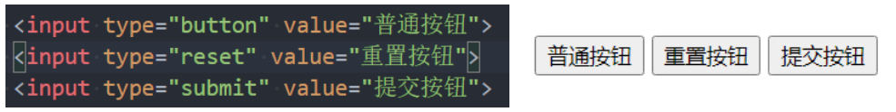
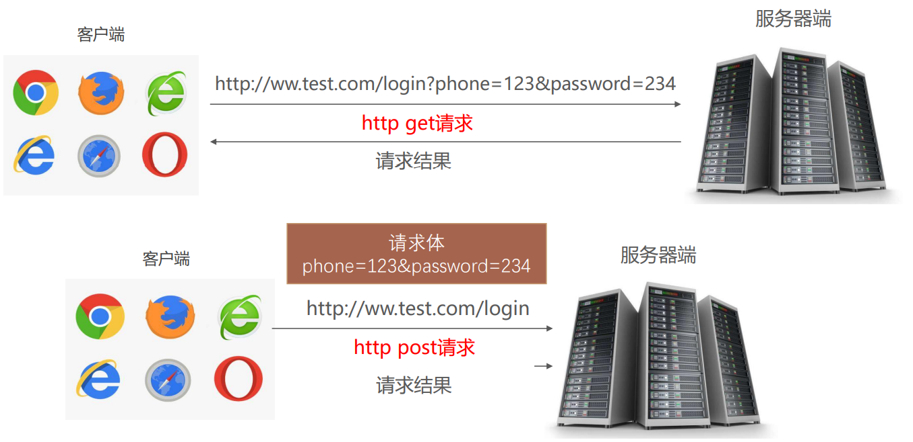

## 1. （掌握）列表元素

### 认识列表元素

- 在开发一个网页的过程中，很多数据都是以列表的形式存在的：

  

### 列表的实现方式

- 事实上现在很多的列表功能采用了不同的方案来实现：
  - 方案一：使用 **`div` 元素**来实现（比如汽车之家、知乎上的很多列表）；
  - 方案二：使用**列表元素**，使用元素语义化的方式实现；
- 事实上现在很多的网站对于列表元素没有很强烈的偏好，而是不拘一格，**按照自己的风格来布局**：
  - 原因是**列表元素默认的 `CSS` 样式**，让它**用起来不是很方便**；
  - 比如**列表元素往往有很多的限制，`ul/ol` 中只能存放 `li`、`script`、`template` 元素，`li` 中再存放其它元素，默认样式等**；
  - 虽然我们可以**通过重置来解决**，但是我们**更喜欢自由的 `div`**；
- `HTML` 提供了 `3` 组常用的用来展示列表的元素:
  - 有序列表：**`ol`**、**`li`**
  - 无序列表：**`ul`**、**`li`**
  - 定义列表：**`dl`**、**`dt`**、**`dd`**

## 2. （掌握）常见列表

### 有序列表 - `ol` - `li`

- `ol`（`ordered list`）
  - **有序列表**，直接子元素通常只能是 **`li`**
- `li`（`list item`）
  - 列表中的**每一项**

### 无序列表 - `ul` - `li`

- `ul`（`unordered list`）
  - **无序列表**，直接子元素通常只能是 **`li`**
- `li`（`list item`）
  - 列表中的**每一项**

### 定义列表 - `dl` - `dt` - `dd`

- `dl`（`definition list`）
  - **定义列表**，直接子元素通常只能是 `dt`、`dd`
- `dt`（`definition term`）
  - `term` 是项的意思，**列表中每一项的项目名**
- `dd`（`definition description`）
  - **列表中每一项的具体描述**，是对 `dt` 的描述、解释、补充；
  - 一个 `dt` 后面一般紧跟着一个或者多个 `dd`；

### 列表的练习

## 3. （掌握）表格元素

- 在网页中，对于某些内容的展示使用表格元素更为合适和方便

  

- 编写表格最常见的是下面的元素：

  - `table`

    - **表格**

  - `tr`（`table row`）

    - 表格中的**行**

  - `td`（`table data`）

    - 行中的**单元格**

  - 另外，表格有很多相关的属性可以设置表格的样式，但是已经不推荐使用了

    

### 表格的练习

- 通过表格元素和 `CSS` 完成下面的表格：

  

- 这里我们需要用到一个非常重要的 `CSS` 属性：

  - `CSS` 属性 **`border-collapse`** 是用来决定表格的边框是**分开的**还是**合并的**；
  - `table { border-collapse: collapse; }`
  - 可以用来**合并单元格的边框**

### 表格的其它元素

- `thead`
  - 表格的表头
- `tbody`
  - 表格的主体
- `tfoot`
  - 表格的页脚
- `caption`
  - 表格的标题
- `th`
  - 表格的表头单元格

## 4. （掌握）表格合并

### 单元格合并

- 在某些特殊的情况下，每个单元格占据的大小可能并不是固定的；

  - 一个单元格可能会**跨多行或者多列**来使用；

- 比如下面的表格

  

- 这个时候我们就要使用**单元格合并**来完成；

- 单元格合并分成两种情况：

  - 跨列合并：使用 **`colspan`**
    - 在最左边的单元格上添加 `colspan` 属性，并且省略掉合并的 `td`；
  - 跨行合并：使用 **`rowspan`**
    - 在最上面的单元格上添加 `rowspan` 属性，并且省略掉后面 `tr` 中的 `td`；

  

  

## 5. （掌握）表单元素

### 认识表单

- `HTML` 表单元素是**和用户交互的重要方式**之一，在**很多网站都需要使用表单**：

  

### 常见的表单元素

- `form`
  - **表单**，一般情况下，其它表单相关元素都是它的后代元素
- `input`
  - 单行**文本输入框**、**单选框**、**复选框**、**按钮**等元素
- `textarea`
  - **多行文本框**
- `select`、`option`
  - **下拉选择框**
- `button`
  - **按钮**
- `label`
  - **表单元素的标题**

### `input` 元素的使用

- 表单元素使用最多的是 **`input` 元素**
- `input` 元素有如下常见的属性：
  - **`type`**：`input` 的类型
    - `text`：文本输入框（明文输入）
    - `password`：文本输入框（密文输入）
    - `radio`：单选框
    - `checkbox`：复选框
    - `button`：按钮
    - `reset`：重置
    - `submit`：提交表单数据给服务器
    - `file`：文件上传
    - 等等
  - **`readonly`**：只读
  - **`disabled`**：禁用
  - **`checked`**：默认被选中
    - 只有当 `type` 为 `radio` 或 `checkbox` 时可用
  - **`autofocus`**：当页面加载时，自动聚焦
  - **`name`**：名字
    - 在提交数据给服务器时，可用于区分数据类型
  - **`value`**：取值
- `type` 类型的其它取值和 `input` 的其它属性，请查看文档：https://developer.mozilla.org/zh-CN/docs/Web/HTML/Element/Input

### 布尔属性（`boolean attributes`）

- 常见的布尔属性有 **`readonly`**、**`disabled`**、**`checked`**、**`selected`**、**`multiple`**、**`autofocus`**

- 布尔属性可以没有属性值，**写上属性名就代表使用这个属性**（该属性就会生效，不管属性值是什么）

  - 如果要给布尔属性设值，值一般就是属性名本身

    

### 表单按钮

- `input` 元素可以实现按钮效果：

  - **普通按钮（`type="button"`）**：使用 `value` 属性设置按钮文字；
  - **重置按钮（`type="reset"`）**：重置它所属 `form` 的所有表单元素（包括 `input`、`textarea`、`select`）
  - **提交按钮（`type="submit"`）**：提交它所属 `form` 的表单数据（包括 `input`、`textarea`、`select`）给服务器

  

- 我们也可以通过 `button` 元素来实现按钮：

  

### `input` 和 `label` 的关系

- `label` 元素一般跟 `input` 配合使用，用来表示 `input` 的标题

- `label` 可以**跟某个 `input` 绑定**，**点击 `label`** 就可以**激活对应的 `input`** 使其变成选中状态

  

### `radio` 的使用

- 我们可以将 `type` 设置为 `radio` 变成单选框：

  - **`name` 值相同的 `radio` 才具备单选功能**

  

### `checkbox` 的使用

- 我们可以将 `type` 类型设置为 `checkbox` 变成多选框：

  - **属于同一种类型的 `checkbox`，`name` 值要保持一致**

  

### `textarea` 的使用

- `textarea` 的常用属性：
  - **`cols`**：列数
  - **`rows`**：行数
- 是否可调整大小的 `CSS` 设置
  - **禁止**调整大小：`resize: none;`
  - **水平方向**可调整大小：`resize: horizontal;`
  - **垂直方向**可调整大小：`resize: vertical;`
  - **水平和垂直方向**都可调整大小：`resize: both;`

### `select` 和 `option` 的使用

- `option` 是 `select` 的子元素，一个 `option` 代表一个选项
- `select` 常用属性
  - **`multiple`**：可以多选
  - **`size`**：显示多少项
- `option` 常用属性
  - **`selected`**：默认被选中

### `form` 常见的属性

- `form` 元素通常作为表单元素的父元素：
  - `form` 可以将整个表单作为一个**整体来进行操作**；
  - 比如对整个表单**进行重置**；
  - 比如对整个表单的数据**进行提交**；
- `form` 常见的属性如下：
  - **`action`**
    - 用于提交表单数据的**请求 `URL`**；
  - **`method`**
    - 请求方法（`get` 和 `post`），默认是 `get`
  - **`target`**
    - 在什么地方打开 `URL`（参考 `a` 元素的 `target`）

### 请求方式的对比

