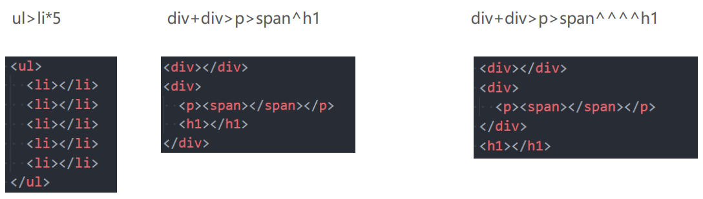

## 1. （了解）认识 `Emmet`

- `Emmet`（前身为 `Zen Coding`）是一个能大幅度**提高前端开发效率**的工具

  - 在前端开发的过程中，一大部分的工作是**写 `HTML`、`CSS` 代码**，如果手动来编写效率会非常低；
  - `VS Code` 内置了 **`Emmet` 语法**，在后缀为 `.html`/`.css` 的文件中输入缩写后按 `Tab`/`Enter` 键就能**自动生成相应代码**；

- `!` 和 `html:5` 可以快速生成完整结构的 `HTML5` 代码：

  

- 注意，新版的 `VS Code` 需要在设置中开启行内模式来获得原来的 `Emmet` 提示：

  

## 2. （了解）常见 `Emmet` 语法

### `>`（子代）和 `+`（兄弟）

### `*`（多个）和 `^`（上一级）

### `()`（分组）

### 属性（`id`、`class`、普通属性）和 `{}`（内容）

### `$`（数字）

### 隐式标签

### `CSS Emmet`

