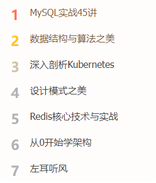

# Day07 作业布置

## 一. 完成课堂所有的代码

见 `Learn_HTML_CSS`

## 二. 自己查一个列表并且完成

比如极客时间首页的学习榜：



```html
<!DOCTYPE html>
<html lang="en">
<head>
  <meta charset="UTF-8">
  <meta http-equiv="X-UA-Compatible" content="IE=edge">
  <meta name="viewport" content="width=device-width, initial-scale=1.0">
  <title>Document</title>
  <style>
    body, ul {
      margin: 0;
      font: 400 1em/1.8 PingFang SC,Avenir,Tahoma,Arial,Lantinghei SC,Microsoft Yahei,Hiragino Sans GB,Microsoft Sans Serif,WenQuanYi Micro Hei,Helvetica,sans-serif;
    }

    ul {
      padding: 0;
    }

    ul, li {
      list-style: none;
    }

    a {
      text-decoration: none;
      color: #333;
    }


    .ranking {
      box-sizing: border-box;
      margin: 0 auto;
      padding: 0 12px 0 18px;
      width: 264px;
      height: 312px;
    }

    ul > li {
      margin-top: 8px;
    }

    ul > li:nth-child(1) {
      margin-top: 0;
    }

    ul > li:nth-child(1) .num {
      color: #ff7155;
    }

    ul > li:nth-child(2) .num {
      color: #ffc51d;
    }

    ul > li:nth-child(3) .num {
      color: #cfc5a7;
    }

    ul > li > a {
      display: inline-block;
      width: 100%;
    }

    ul > li .num {
      color: #b2b2b2;
      font-size: 23px;
      font-weight: 700;
    }

    ul > li .name {
      display: inline-block;
      margin-left: 18px;
      font-size: 16px;
      color: #404040;
    }

    ul > li .name:hover {
      color: #fa8919;
    }
  </style>
</head>
<body>

  <div class="ranking">
    <ul>
      <li>
        <a href="https://time.geekbang.org/column/100020801" target="_blank">
          <span class="num">1</span>
          <div class="name">MySQL实战45讲</div>
        </a>
      </li>
      <li>
        <a href="https://time.geekbang.org/column/100017301" target="_blank">
          <span class="num">2</span>
          <div class="name">数据结构与算法之美</div>
        </a>
      </li>
      <li>
        <a href="https://time.geekbang.org/column/100015201" target="_blank">
          <span class="num">3</span>
          <div class="name">深入剖析Kubernetes</div>
        </a>
      </li>
      <li>
        <a href="https://time.geekbang.org/column/100020801" target="_blank">
          <span class="num">4</span>
          <div class="name">MySQL实战45讲</div>
        </a>
      </li>
      <li>
        <a href="https://time.geekbang.org/column/100020801" target="_blank">
          <span class="num">5</span>
          <div class="name">MySQL实战45讲</div>
        </a>
      </li>
      <li>
        <a href="https://time.geekbang.org/column/100020801" target="_blank">
          <span class="num">6</span>
          <div class="name">MySQL实战45讲</div>
        </a>
      </li>
      <li>
        <a href="https://time.geekbang.org/column/100020801" target="_blank">
          <span class="num">7</span>
          <div class="name">MySQL实战45讲</div>
        </a>
      </li>
    </ul>
  </div>

</body>
</html>
```

## 三. 完成table的作业内容


```html
<!DOCTYPE html>
<html lang="en">
<head>
  <meta charset="UTF-8">
  <meta http-equiv="X-UA-Compatible" content="IE=edge">
  <meta name="viewport" content="width=device-width, initial-scale=1.0">
  <title>Document</title>
  <style>
    table {
      margin: 0 auto;
      border-collapse: collapse;
    }

    table > caption {
      margin-bottom: 20px;
      font-size: 26px;
      font-weight: 700;
    }

    table tr:nth-child(2n+1) {
      background-color: rgb(250, 231, 225);
    }

    table > thead > .head-row,
    table tr:nth-child(2n) {
      background-color: #eee;
    }

    th, td {
      /* border: 1px solid #000; */
      padding: 10px 70px;
      text-align: center;
    }

    th {
      font-size: 20px;
    }

    td {
      font-size: 18px;
    }

    td .play-time {
      font-weight: bold;
    }

    td .end-time {
      font-size: 14px;
    }

    td.price {
      font-weight: 700;
      color: red;
    }

    td span {
      display: inline-block;
      border-radius: 20px;
      padding: 8px 20px;
      background-color: #f00;
      color: #fff;
      cursor: pointer;
    }
  </style>
</head>
<body>

  <table>
    <caption>影院电影放映列表</caption>
    <thead>
      <tr class="head-row">
        <th>放映时间</th>
        <th>语言版本</th>
        <th>放映厅</th>
        <th>售价（元）</th>
        <th>选座购票</th>
      </tr>
    </thead>
    <tbody>
      <tr>
        <td>
          <div class="play-time">13:15</div>
          <div class="end-time">15:00散场</div>
        </td>
        <td>国语3D</td>
        <td>2号厅</td>
        <td class="price">¥48.5</td>
        <td>
          <span>选座购票</span>
        </td>
      </tr>
      <tr>
        <td>
          <div class="play-time">13:15</div>
          <div class="end-time">15:00散场</div>
        </td>
        <td>国语3D</td>
        <td>2号厅</td>
        <td class="price">¥48.5</td>
        <td>
          <span>选座购票</span>
        </td>
      </tr>
      <tr>
        <td>
          <div class="play-time">13:15</div>
          <div class="end-time">15:00散场</div>
        </td>
        <td>国语3D</td>
        <td>2号厅</td>
        <td class="price">¥48.5</td>
        <td>
          <span>选座购票</span>
        </td>
      </tr>
      <tr>
        <td>
          <div class="play-time">13:15</div>
          <div class="end-time">15:00散场</div>
        </td>
        <td>国语3D</td>
        <td>2号厅</td>
        <td class="price">¥48.5</td>
        <td>
          <span>选座购票</span>
        </td>
      </tr>
      <tr>
        <td>
          <div class="play-time">13:15</div>
          <div class="end-time">15:00散场</div>
        </td>
        <td>国语3D</td>
        <td>2号厅</td>
        <td class="price">¥48.5</td>
        <td>
          <span>选座购票</span>
        </td>
      </tr>
    </tbody>
  </table>

</body>
</html>
```

## 四. 说出表单元素什么情况下使用name和value？

- 同一组的单选框、复选框；
  - `name` 值相同的 `radio` 才具备单选功能；
  - 属于同一类型的 `checkbox`，`name` 值要保持一致；
- 表单提交数据给服务器时，相关的表单元素需要使用 `name` 和 `value`，`name` 值和 `value` 值分别作为请求地址中查询（`query`）字符串中的 `key` 和 `value`

## 五. 说出form提交时的属性作用

* action
  * 处理表单提交数据的 `URL`

* method
  * 设置请求的方式（`get`、`post`），默认是 `get`

* target
  * 在什么地方打开 `URL`（类似于 `a` 元素的 `target`），有四个值：
    * `_self`（默认值）：在当前页面中加载
    * `_blank`：在新页面中加载
    * `_parent`：在当前页面的父页面中加载
    * `_top`：在顶层页面中加载


