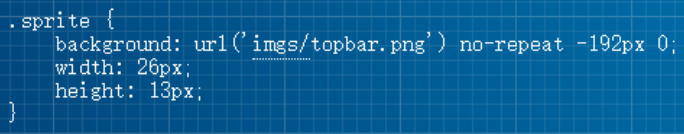

## 1. （掌握）使用 `border` 实现图形

- `border` 主要是用来给盒子增加边框的，但是在开发中我们也可以利用边框的特性来实现一些形状：

  

- 在上图中，假如我们将 `border` 宽度设置为 `50px` 会是怎么样呢？

  - 如果我们进一步，将另外三边的颜色去除呢？
  - 如果我们再对这个盒子做旋转呢？

- 所以利用 `border` 或者 `CSS` 的特性我们可以做出很多图形：

  - https://css-tricks.com/the-shapes-of-css/

## 2. （掌握）`Web` 网络字体

### 认识 `Web` 字体

- 在之前我们有设置过页面使用的字体：`font-family`

  - 我们需要提供**一个或多个字体种类名称**，浏览器会**在列表中搜寻**，直到找到它**所运行的系统上可用的字体**；
  - 这样的方式完全没有问题，但是对于传统的 `Web` 开发人员来说，**字体选择是有限的**；
  - 只有少数几种字体可以保证兼容所有流行的操作系统，这就是所谓的 **`Web-safe` 字体**；
  - 并且这种默认可选的字体**并不能进行一些定制化的需求**；

- 比如下面的字体样式，系统的字体肯定是不能实现的：

  

- 那么我们是否依然可以在网页中使用这些字体呢？**使用 `Web Fonts` 即可**。

### `Web fonts` 的工作原理

- 首先，我们需要通过一些渠道**获取到希望使用的字体**（不是开发来做的事情）：
  - 对于**某些收费的字体**，我们需要获取到**对应的授权**；
  - 对于某些**公司定制的字体**，需要**设计人员来设计**；
  - 对于某些**免费的字体**，我们需要**获取到对应的字体文件**；
- 其次，在我们的 `CSS` 代码中**使用该字体**（重要）：
  - 具体的过程看后面的操作流程；
- 最后，在**部署静态资源**时，将 **`HTML`、`CSS`、`JavaScript`、`Font` 一起部署在静态服务器**中；
- 用户的角度：
  - 浏览一个网页时，因为代码中有引入字体文件，**字体文件会被一起下载下来**；
  - 浏览器会根据使用的字体**在下载的字体文件中查找、解析、使用对应的字体**；
  - **在浏览器中使用对应的字体显示内容**；

### 使用 `Web fonts`

- 为了演示，这里通过如下方式获取到了字体文件：

  - 第一步：在字体天下网站中下载一个字体
    - https://www.fonts.net.cn/
    - 默认下载下来的是 `ttf` 文件
  - 第二步：使用字体

- 使用过程如下：

  1. 将**字体放到对应的目录**下；
  2. **通过 `@font-face` 引入字体**，并且**设置格式**
  3. **使用字体**

  

- 注意：`@font-face` 用于加载一个自定义的字体；

### `Web fonts` 的兼容性

- 我们刚才使用的字体文件是 `.ttf`，它是 `TrueType` 字体

  - 在开发中某些浏览器可能不支持该字体，所以考虑到浏览器的兼容性问题，我们需要有对应的其它格式的字体；

- `TrueType` 字体：扩展名是 `.ttf`

  - `OpenType/TrueType` 字体：扩展名是 `.ttf`、`.otf`，建立在 `TrueType` 字体之上
  - `Embedded OpenType` 字体：扩展名是 `.eot`，`OpenType` 字体的压缩版
  - `SVG` 字体：扩展名是 `.svg`、`.svgz`
  - `WOFF` 表示 `Web Open Font Format`，`Web` 开发字体格式，扩展名是 `.woff`，建立在 `TrueType` 字体之上

  

- 这里提供一个网站来生产对应的字体文件：

  - https://font.qqe2.com/ 暂时可用

### `Web fonts` 兼容性写法

- 如果我们具备很强的兼容性，那么可以按如下格式编写：

  

- 这被称为“`bulletproof @font-face syntax`（刀枪不入的 `@font-face` 语法）”

  - 这是 `Paul Irish` 早期的一篇文章提及后 `@font-face` 开始流行起来（[Bulletproof @font-face Syntax](https://www.paulirish.com/2009/bulletproof-font-face-implementation-syntax/)）

- `src` 用于指定字体资源

  - `url` 指定资源的路径
  - `format` 用于帮助浏览器快速识别字体的格式（这里指编码格式，而文件的扩展名指的是封装格式）

## 3. （掌握）`Web` 字体图标

### 认识字体图标

- 思考：字体可以**设计成各式各样的形状**，那么**能不能把字体直接设计成图标的样子**呢？
  - **当然可以**，这个就叫做**字体图标**
- 因为字体图标本质上是字体（只不过样子像图标），所以它有以下好处：
  - 放大不会失真
  - 可以任意切换颜色
  - 用到很多个图标时，字体文件大小相对于图片文件大小较小
- 字体图标的使用：
  - 登录阿里 [iconfont](https://www.iconfont.cn/)
  - 搜索想要的图标字体，添加入库后下载代码，然后拷贝到项目中进行使用
- 将字体文件和默认的 `CSS` 文件导入到项目中进行使用

### 字体图标的使用

- 字体图标的使用步骤：

  1. 通过 `link` 引入 `iconfont.css` 文件
  2. 使用字体图标

- 使用字体图标常见的两种方式：

  1. 直接使用对应字体图标的 `Unicode`
  2. 使用已经编写好的 `class`

  

## 4. （掌握）`CSS` 精灵图

### 认识精灵图 `CSS Sprite`

- 什么是 `CSS Sprite`
  - 是一种 **`CSS` 图像合成技术**，将**各种小图片合并到一张图片**上，然后**利用 `CSS` 的背景定位来显示对应的图片部分**
  - 有人翻译为：**`CSS` 雪碧**、**`CSS` 精灵**
- 使用 `CSS Sprite` 的好处
  - 减少网页的 **`http` 请求数量**，**加快网页响应速度**，**减轻服务器压力**；
  - 减小**图片总大小**；
  - 解决了**图片命名的困扰**，只需要针对一张集合的图片命名；
- `Sprite` 图片制作（雪碧图、精灵图）
  - 方法 `1`：`Photoshop`，设计人员提供
  - 方法 `2`：https://www.toptal.com/developers/css/sprite-generator

### 精灵图的使用

- 精灵图如何使用呢？

  - 精灵图的原理是通过只显示图片的很小一部分来展示的；

  - 通常使用背景：

    1. 设置对应元素的宽度和高度
    2. 设置精灵图作为背景图片
    3. 调整背景图片的位置来展示

  - 如何获取精灵图的位置

    - http://www.spritecow.com/

      

## 5. （掌握）`cursor` 属性

- `cursor` 可以设置鼠标指针（光标）在元素上面时的显示样式
- `cursor` 常见的取值有：
  - `auto`：浏览器根据上下文决定指针的显示样式，比如根据文本和非文本切换指针样式
  - `default`：由操作系统决定，一般就是一个小箭头
  - `pointer`（掌握）：一只小手，鼠标指针挪动到链接上面默认就是这个样式
  - `text`：一条竖线，鼠标指针挪动到文本输入框上面默认就是这个样式
  - `none`：没有任何指针显示在元素上面

