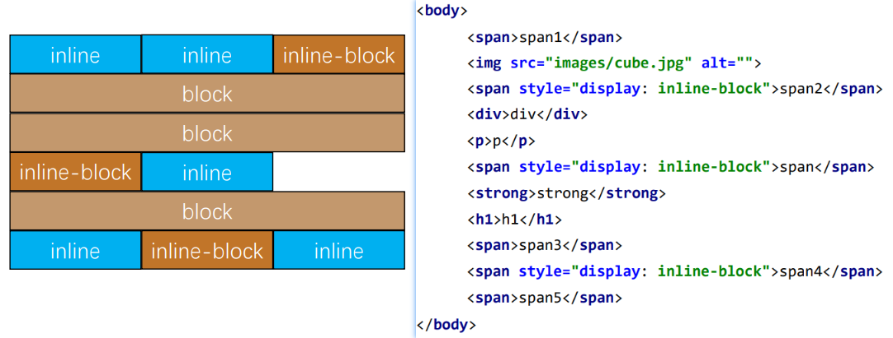
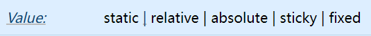
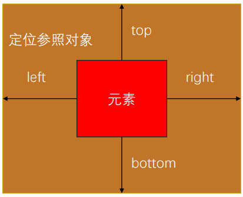
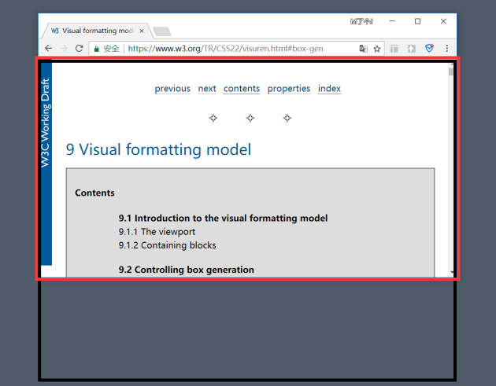

## 1. （掌握）标准流布局

### 标准流（`Normal Flow`）

- 默认情况下，元素都是按照 **`normal flow`**（标准流、常规流、正常流、文档流【`document flow`】）进行排布

  - **从左到右，从上到下**按顺序摆放好
  - 默认情况下，**互相之间不存在层叠现象**

  

### `margin`、`padding` 调整位置

- 在标准流中，可以使用 **`margin`、`padding`** 对元素进行定位
  - 其中 `margin` 还可以设置负数
- 比较明显的缺点是：
  - 设置一个元素的 **`margin` 或者 `padding`**，通常会**影响到标准流中其它元素**的定位；
  - **不便于实现元素层叠的效果**；
- 如果我们希望一个元素可以跳出标准流，单独进行定位呢？
  - 可以通过 `position` 属性来进行设置；

### 认识元素的定位

- 定位允许你**从正常的文档流布局中取出元素**，使他们具有不同的行为：

  - 例如**放在另一个元素的上面**；
  - 或者**始终保持在浏览器视窗内的同一位置**；

- 定位在开发中非常常见：

  

### 认识 `position` 属性

- `position` 属性可以对元素进行定位，取值有 `5` 个：

  

- 默认值：

  - `static`：默认值，静态定位

- 使用下面的值，可以让元素变成定位元素（`positioned element`）

  - `relative`：相对定位
  - `absolute`：绝对定位
  - `fixed`：固定定位
  - `sticky`：粘性定位

### 静态定位 - `static`

- `position` 属性的默认值
  - 元素按照 `normal flow` 布局
  - 此时设置 `left`、`right`、`top`、`bottom`、`z-index` 没有任何作用

## 2. （掌握）相对定位 - `relative`

- 元素按照 **`normal flow`** 布局

- 可以通过 **`left`、`right`、`top`、`bottom`** 进行定位

  - 定位**参照对象**是元素**自己原来的位置**

- `left`、`right`、`top`、`bottom` 用来设置元素的具体位置，对元素的作用如下图所示：

  

- 相对定位的应用场景：

  - 在**不影响其它元素位置的前提**下，对**当前元素的位置进行微调**

### （了解）相对定位练习

## 3. （掌握）固定定位 - `fixed`

- 元素**脱离 `normal flow`**（脱离标准流、脱标）
- 可以通过 **`left`、`right`、`top`、`bottom`** 进行定位
- 定位参照对象是**视口（`viewport`）**
- 当画布滚动时，元素固定不动

### 画布和视口

- 视口（`Viewport`）
  - 文档的可视区域
  - 如下图**红框**所示
- 画布（`Canvas`）
  - 用于渲染文档的区域
  - 文档内容超出视口范围，可以通过滚动查看
  - 如下图**黑框**所示
- 宽高对比
  - **画布 >= 视口**

