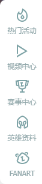

# Day08 作业布置

## 一. 完成课堂所有的代码

见 `Learn_HTML_CSS`

## 二. 说出结构伪类的nth-child和nth-of-type的区别，并且写出案例练习

- `:nth-child()` 是选择兄弟元素中的第几个/前几个元素（父元素的第几个/前几个子元素）；
- `:nth-of-type()` 是选择**同种类型的**兄弟元素中的第几个/前几个元素（父元素的**同种类型的**第几个/前几个子元素）；

```html
<!DOCTYPE html>
<html lang="en">
<head>
  <meta charset="UTF-8">
  <meta http-equiv="X-UA-Compatible" content="IE=edge">
  <meta name="viewport" content="width=device-width, initial-scale=1.0">
  <title>Document</title>
  <style>
    /* 选中的是“列表内容 2”而不是“列表内容 3” */
    .box .item:nth-child(3) {
      color: red;
    }

    /* 选中的是“列表内容 3” */
    .box .item:nth-of-type(3) {
      color: pink;
    }
  </style>
</head>
<body>

  <div class="box">
    <div class="item">列表内容 1</div>
    <p>我是 p 元素</p>
    <div class="item">列表内容 2</div>
    <div class="item">列表内容 3</div>
    <div class="item">列表内容 4</div>
    <div class="item">列表内容 5</div>
  </div>

</body>
</html>
```

## 三. 自己练习使用字体图标

* 从iconfont中下载图标练习

```html
<!DOCTYPE html>
<html lang="en">
<head>
  <meta charset="UTF-8">
  <meta http-equiv="X-UA-Compatible" content="IE=edge">
  <meta name="viewport" content="width=device-width, initial-scale=1.0">
  <title>Document</title>
  <link rel="stylesheet" href="./fonts/font_h3ah90aaz56/iconfont.css">
  <style>
    /* @font-face {
      font-family: "my-iconfont";
      src: url("./fonts/font_h3ah90aaz56/iconfont.ttf") format("truetype");
    }

    body {
      font-family: "my-iconfont";
    }

    .icon {
      font-style: normal;
      color: skyblue;
    } */

    .icon-tijian {
      color: green;
    }
  </style>
</head>
<body>

  <!-- <i class="icon">&#xe73e;</i> -->
  <i class="iconfont icon-tijian"></i>

</body>
</html>
```

## 四. 自己找精灵图进行练习

比如英雄联盟官网有使用精灵图：

```html
<!DOCTYPE html>
<html lang="en">
<head>
  <meta charset="UTF-8">
  <meta http-equiv="X-UA-Compatible" content="IE=edge">
  <meta name="viewport" content="width=device-width, initial-scale=1.0">
  <title>Document</title>
  <style>
    .icon {
      display: inline-block;
      width: 189px;
      height: 34px;
      /* background-color: skyblue;
      background-image: url("./images/topfoot-spr.png");
      background-position: -216px 0;
      background-repeat: no-repeat; */
      background: skyblue url("./images/topfoot-spr.png") -216px 0 no-repeat;
      font-style: normal;
    }
  </style>
</head>
<body>

  <i class="icon"></i>

</body>
</html>
```

## 五. 结合CSS元素定位，并且找出对应的练习案例（2个）

案例 `1`：京东官网的“我的购物车”（绝对定位/相对定位）：


- 方式一：相对定位：

  ```html
  <!DOCTYPE html>
  <html lang="en">
  <head>
    <meta charset="UTF-8">
    <meta http-equiv="X-UA-Compatible" content="IE=edge">
    <meta name="viewport" content="width=device-width, initial-scale=1.0">
    <title>Document</title>
    <link rel="stylesheet" href="./fonts/font_rgj3qdw8q3/iconfont.css">
    <style>
      a {
        color: #333;
        text-decoration: none;
      }
  
      .shopping-cart {
        /* box-sizing: border-box; */
        margin: 100px auto;
        border: 1px solid #eee;
        width: 130px;
        height: 34px;
        /* background-color: skyblue; */
        text-align: center;
        line-height: 34px;
        color: #e1251b;
      }
  
      .shopping-cart:hover {
        border-color: #c81623;
        cursor: default;
      }
  
      .icon-cart, .num {
        /* display: inline-block; */
        /* background-color: #f66; */
        font-style: normal;
      }
  
      .icon-cart {
        font-size: 16px;
        font-weight: 700;
      }
  
      .num-box {
        display: inline-block;
        line-height: 12px;
      }
  
      .num {
        position: relative;
        left: -8px;
        top: -8px;
        display: inline-block;
        /* border: 1px solid #000; */
        border-radius: 7px;
        padding: 1px 3px;
        width: 12px;
        height: 12px;
        background-color: #e1251b;
        font-size: 12px;
        color: #fff;
      }
  
      .text {
        margin-left: -10px;
        font-size: 12px;
        color: #e1251b;
        cursor: default;
      }
    </style>
  </head>
  <body>
  
    <div class="shopping-cart">
      <i class="iconfont icon-cart"></i>
      <!-- 这里包了一个盒子，以便在使用相对定位时，由于元素未脱标导致设置高度及行高进行垂直居中时因文本对齐造成内容显示不全的问题 -->
      <div class="num-box">
        <i class="num">0</i>
      </div>
      <a class="text" href="https://cart.jd.com/cart.action" target="_blank">我的购物车</a>
    </div>
  
  </body>
  </html>
  ```

- 方式二：相对定位 + 绝对定位：

  ```html
  <!DOCTYPE html>
  <html lang="en">
  <head>
    <meta charset="UTF-8">
    <meta http-equiv="X-UA-Compatible" content="IE=edge">
    <meta name="viewport" content="width=device-width, initial-scale=1.0">
    <title>Document</title>
    <link rel="stylesheet" href="./fonts/font_rgj3qdw8q3/iconfont.css">
    <style>
      a {
        color: #333;
        text-decoration: none;
      }
  
      .shopping-cart {
        position: relative;
        /* box-sizing: border-box; */
        margin: 100px auto;
        border: 1px solid #eee;
        width: 130px;
        height: 34px;
        /* background-color: skyblue; */
        text-align: center;
        line-height: 34px;
        color: #e1251b;
      }
  
      .shopping-cart:hover {
        border-color: #c81623;
        cursor: default;
      }
  
      .icon-cart, .num {
        /* display: inline-block; */
        /* background-color: #f66; */
        font-style: normal;
      }
  
      .icon-cart {
        margin-right: 12px;
        font-size: 16px;
        font-weight: 700;
      }
  
      .num-box {
        display: inline-block;
        line-height: 12px;
      }
  
      .num {
        position: absolute;
        left: 31px;
        top: 3px;
        /* border: 1px solid #000; */
        border-radius: 7px;
        padding: 1px 3px;
        width: 12px;
        height: 12px;
        background-color: #e1251b;
        font-size: 12px;
        line-height: 12px;
        color: #fff;
      }
  
      .text {
        font-size: 12px;
        color: #e1251b;
        cursor: default;
      }
    </style>
  </head>
  <body>
  
    <div class="shopping-cart">
      <i class="iconfont icon-cart"></i>
      <i class="num">0</i>
      <a class="text" href="https://cart.jd.com/cart.action" target="_blank">我的购物车</a>
    </div>
  
  </body>
  </html>
  ```

案例 `2`：英雄联盟官网首页右侧的悬浮菜单（固定定位）：



```html
<!DOCTYPE html>
<html lang="en">
<head>
  <meta charset="UTF-8">
  <meta http-equiv="X-UA-Compatible" content="IE=edge">
  <meta name="viewport" content="width=device-width, initial-scale=1.0">
  <title>Document</title>
  <link rel="stylesheet" href="./css/reset.css">
  <style>
    body {
      background-color: #eee;
    }

    .right-nav {
      position: fixed;
      right: 0;
      bottom: 140px;
      box-sizing: border-box;
      border-radius: 10px 0 0 10px;
      padding-left: 4px;
      width: 70px;
      height: 304px;
      background-color: #fff;
    }

    .right-nav li {
      margin-bottom: 6px;
      height: 53px;
    }

    .right-nav li:nth-child(1) {
      margin-top: 5px;
    }

    .right-nav li a {
      display: inline-block;
      font-size: 12px;
      color: rgb(146, 168, 171);
      text-align: center;
    }

    .right-nav li span:first-child {
      display: block;
      width: 66px;
      height: 35px;
      /* background-color: skyblue; */
      text-align: center;
      line-height: 35px;
    }

    .right-nav li i {
      display: inline-block;
      /* background-color: #f66; */
      background-image: url("./images/comm-spr.png");
      background-repeat: no-repeat;
      vertical-align: middle;
    }

    .right-nav .hot-activities i {
      width: 18px;
      height: 22px;
      background-position: -239px -99px;
    }

    .right-nav .video-center i {
      width: 18px;
      height: 22px;
      background-position: -262px -99px;
    }

    .right-nav .competition-center i {
      width: 22px;
      height: 21px;
      background-position: -220px -46px;
    }

    .right-nav .hero-data i {
      width: 19px;
      height: 22px;
      background-position: -269px -72px;
    }

    .right-nav .fanart i {
      width: 24px;
      height: 20px;
      background-position: -287px -12px;
    }
  </style>
</head>
<body>

  <div class="right-nav">
    <ul>
      <li class="hot-activities">
        <a href="#">
          <span>
            <i></i>
          </span>
          <span>热门活动</span>
        </a>
      </li>
      <li class="video-center">
        <a href="#">
          <span>
            <i></i>
          </span>
          <span>视频中心</span>
        </a>
      </li>
      <li class="competition-center">
        <a href="#">
          <span>
            <i></i>
          </span>
          <span>赛事中心</span>
        </a>
      </li>
      <li class="hero-data">
        <a href="#">
          <span>
            <i></i>
          </span>
          <span>英雄资料</span>
        </a>
      </li>
      <li class="fanart">
        <a href="#">
          <span>
            <i></i>
          </span>
          <span>FANART</span>
        </a>
      </li>
    </ul>
  </div>

  <br><br><br><br><br>
  <br><br><br><br><br>
  <br><br><br><br><br>
  <br><br><br><br><br>
  <br><br><br><br><br>
  <br><br><br><br><br>
  <br><br><br><br><br>
  <br><br><br><br><br>
  <br><br><br><br><br>
  <br><br><br><br><br>
  <br><br><br><br><br>
  <br><br><br><br><br>
  <br><br><br><br><br>
  <br><br><br><br><br>
  <br><br><br><br><br>
  <br><br><br><br><br>
  <br><br><br><br><br>
  <br><br><br><br><br>
  <br><br><br><br><br>
  <br><br><br><br><br>

</body>
</html>
```


