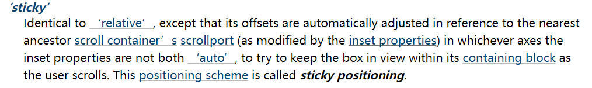

## 1. （掌握）绝对定位 - `absolute`

- 元素脱离 `normal flow`（脱离标准流、脱标）
- 可以通过 `left`、`right`、`top`、`bottom` 进行定位
  - 定位参照对象是**最邻近的定位祖先元素**
  - 如果**找不到这样的祖先元素，参照对象是视口**[^1]
- 定位元素（`positioned element`）
  - `position` 值**不为 `static`** 的元素
  - 也就是 `position` 值为 **`relative`、`absolute`、`fixed`、`sticky`** 的元素

### 子绝父相

- 在绝大多数情况下，子元素的**绝对定位都是相对于父元素进行定位**
- 如果希望子元素相对于父元素进行定位，又不希望父元素脱标，常用的解决方案是：
  - **父元素设置 `position: relative;`**（让父元素成为定位元素的同时不脱离标准流）
  - **子元素设置 `position: absolute;`**
  - 简称为**“子绝父相”**
- 当然，因为绝对定位的参照对象是最邻近的定位祖先元素，所以不仅可以“子绝父相”，也可以“子绝父绝”、“子绝父固”、“子绝父粘”

### 绝对定位元素的特点

- 绝对定位元素（`absolutely positioned element`）

  - **`position` 的值为 `absolute` 或者 `fixed` 的元素**

- 有以下几个特点：

  - 可以随意设置宽高

  - 宽高默认由内容决定

  - 脱离标准流，不再受标准流的约束

    - **不再严格按照从上到下、从左到右**排布
    - **不再严格区分块级（`block`）、行内级（`inline`）、行内块级（`inline-block`）**元素

  - 不再给父元素汇报宽高数据

  - 脱标元素内部默认还是按照标准流布局

  - 定位参照对象的宽高分别会根据两条公式[^2]进行计算：

    - 定位参照对象的宽度 = `left` + `right` + `margin-left` + `margin-right` + 绝对定位元素实际占用的宽度

      

    - 定位参照对象的高度 = `top` + `bottom` + `margin-top` + `margin-bottom` + 绝对定位元素实际占用的高度

      

    - 如果希望绝对定位元素的**宽高和定位参照对象一样**，可以**给绝对定位元素设置**以下属性：

      - ```css
        left: 0;
        right: 0;
        top: 0;
        bottom: 0;
        margin: 0;
        ```

    - 如果希望绝对定位元素**在定位参照对象中居中显示**，可以**给绝对定位元素设置**以下属性：

      - ```css
        left: 0;
        right: 0;
        top: 0;
        bottom: 0;
        margin: auto;
        ```

      - 同时，还得**设置具体的宽高值**（宽高小于定位参照对象的宽高）

### `auto` 到底是什么

- 800 = 200 + margin-left(0) + margin-right(0) + left(auto) + right(auto)
- auto -> 交给浏览器来处理
- `width: auto;`：
  - 对于**行内非替换元素**而言，`width` 包裹内容
  - 对于**块级元素**而言，`width` 是包含块的宽度
  - 对于**绝对定位元素**而言，`width` 包裹内容

## 2. （掌握）粘性定位 - `sticky`

- 还有一个定位值是 `position: sticky;`，比起其它定位值要新一些；

  - `sticky` 是一个大家期待已久的属性；
  - 可以看做是**相对定位和固定（绝对）定位的结合体**；
  - 它允许被定位的元素**表现得像相对定位一样**，直到它滚动到某个阈值点；
  - 当**达到这个阈值点**时，就会**变成固定（绝对）定位**；

- `sticky` 是相对于**最近的祖先滚动容器的滚动视口（the nearest ancestor scroll container's scrollport）**来自动调整定位偏移的；

  

## 3. （掌握）`position` 值对比


## 4. （掌握）`CSS` 属性 - `z-index`

- `z-index` 属性用来设置定位元素的**层叠顺序**（仅对定位元素有效）
  - 取值可以是**正整数、负整数、0**
- 比较原则
  - 相对于定位参照对象，如果是**兄弟关系**
    - `z-index` 越大，层叠在越上面
    - `z-index` 相等，写在后面的那个元素层叠在上面
  - 如果**不是兄弟关系**
    - 各自从元素自己以及祖先元素中，找出最邻近的 `2` 个定位元素进行比较
    - 而且这 `2` 个定位元素必须有设置 `z-index` 的具体数值


[^1]: 1 https://drafts.csswg.org/css-position/#position-property:~:text=Instead%2C%20the%20box%20is%20positioned%20and%20sized%20solely%20in%20reference%20to%20its%20absolute%20positioning%20containing%20block%2C、https://drafts.csswg.org/css-position/#absolute-positioning-containing-block:~:text=If%20no%20ancestor%20establishes%20one%2C%20the%20absolute%20positioning%20containing%20block%20is%20the%20initial%20containing%20block.、https://www.w3.org/TR/CSS2/visudet.html#containing-block-details:~:text=The%20containing%20block%20in,for%20the%20root%20element、https://github.com/w3c/csswg-drafts/issues/6528. ↩
[^2]: https://www.w3.org/TR/CSS2/visudet.html#blockwidth:~:text=%27left%27%20%2B%20%27margin%2Dleft%27%20%2B%20%27border%2Dleft%2Dwidth%27%20%2B%20%27padding%2Dleft%27%20%2B%20%27width%27%20%2B%20%27padding%2Dright%27%20%2B%20%27border%2Dright%2Dwidth%27%20%2B%20%27margin%2Dright%27%20%2B%20%27right%27%20%3D%20width%20of%20containing%20block、https://www.w3.org/TR/CSS2/visudet.html#abs-non-replaced-height:~:text=%27top%27%20%2B%20%27margin%2Dtop%27%20%2B%20%27border%2Dtop%2Dwidth%27%20%2B%20%27padding%2Dtop%27%20%2B%20%27height%27%20%2B%20%27padding%2Dbottom%27%20%2B%20%27border%2Dbottom%2Dwidth%27%20%2B%20%27margin%2Dbottom%27%20%2B%20%27bottom%27%20%3D%20height%20of%20containing%20block
