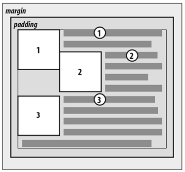

## 1. （掌握）认识浮动

- `float` 属性可以指定一个元素应**沿其容器**的**左侧**或**右侧**放置，允许**文本和内联元素环绕它**
  - `float` 属性最初只用于在一段文本内**浮动图像**，**实现文字环绕的效果**
  - 但是早期的 `CSS` 标准中并没有提供好的**左右布局方案**，因此在一段时间里面它成为**网页多列布局的最常用工具**
- 绝对定位、浮动都会让元素脱离标准流，以达到灵活布局的效果
- 可以通过 `float` 属性让元素产生浮动效果，`float` 的常用取值有：
  - `none`：不浮动，默认值
  - `left`：向左浮动
  - `right`：向右浮动

## 2. （掌握）浮动的常见规则

### 浮动规则一

- 元素一旦浮动后，会脱离标准流

  - **朝着向左或向右方向移动**，直到**自己的边界紧贴着包含块**（一般是父元素）或者**其它浮动元素的边界**为止

  - **定位元素会层叠在浮动元素上面**

    

### 浮动规则二

- 如果元素是向左（右）浮动，浮动元素的左（右）外边界不能超过**包含块**的左（右）内边界

  

### 浮动规则三

- 浮动元素之间不能层叠

  - 如果一个元素浮动，另一个浮动元素已经在那个位置了，后浮动的元素将紧贴着前一个浮动元素（左浮找左浮，右浮找右浮）
  - 如果水平方向剩余的空间不够显示浮动元素，浮动元素将向下移动，直到有充足的空间为止

  

### 浮动规则四

- 浮动元素不能与行内级内容层叠，行内级内容将会被浮动元素推出

  - 比如行内级元素、`inline-block` 元素、块级元素的文字内容

  

### 浮动规则五

- 行内级元素、`inline-block` 元素浮动后，其顶部将与所在行的顶部对齐

  - 浮动只能左右浮动，不能超出本行的高度
  
  

## 3. （掌握）浮动的案例

### 浮动练习一

- 浮动常用的场景：

  - 解决行内级元素、`inline-block` 元素的**水平间隙问题**

    

### 浮动练习二

- 浮动布局方案：

  - 实现京东页面下面的布局：

    

