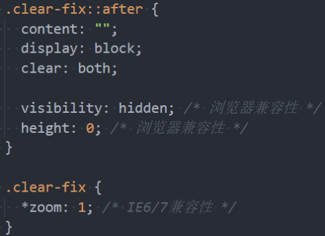
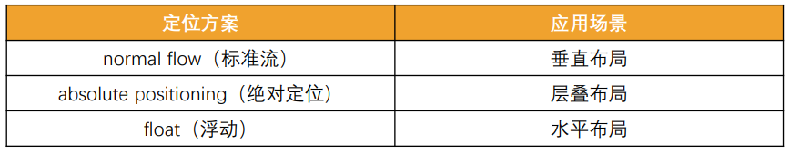

## 1. （掌握）浮动的案例

### 浮动练习三

- 浮动布局方案：

  - 实现京东页面下面的布局：

    

### （理解）浮动练习四（边框问题）

- 浮动布局方案：

  - 实现考拉页面下面的布局：

    

  - 关键问题：

    1. 边框给谁加？
    2. 加上边框之后，宽度如何计算？

## 2. （掌握）浮动的问题 - 高度塌陷

- 由于浮动元素脱离了标准流，变成了脱标元素，所以**不再向父元素汇报高度**
  - 父元素**计算总高度**时,就**不会计算浮动子元素的高度**，导致了**高度塌陷**的问题
- 解决父元素高度塌陷问题的过程，一般叫做**清浮动（清理浮动、清除浮动）**
- 清浮动的目的是
  - 让**父元素计算总高度的时候**，把**浮动子元素的高度算进去**
- 如何清除浮动呢？使用 `clear` 属性

### `CSS` 属性 - `clear`

- `clear` 属性是做什么的呢？
  - `clear` 属性可以指定一个元素**是否必须移动（清除浮动后）到在它之前的浮动元素下面**
- `clear` 的常用取值
  - `left`：要求元素的顶部低于之前生成的所有左浮动元素的底部
  - `right`：要求元素的顶部低于之前生成的所有右浮动元素的底部
  - `both`：要求元素的顶部低于之前生成的所有浮动元素的底部
  - `none`：默认值，无特殊要求
- 那么我们可以利用这个特性来清除浮动

### 清除浮动的方法

- 事实上我们有很多方法可以清除浮动
- 方法一：给父元素设置固定高度
  - 扩展性不好（不推荐）
  - 实际开发中高度很有可能是不固定的
- 方法二：在父元素最后增加一个空的块级子元素，并给这个块级子元素设置 `clear: both;`
  - 会**增加很多无意义的空标签**，维护麻烦
  - 通过增加 `HTML` 元素来解决 `CSS` 中的浮动产生的高度塌陷问题，违反了结构和样式分离的原则（不推荐）
- 方法三：给父元素添加一个伪元素
  - **推荐**
  - 编写好以后可以轻松实现清除浮动

### 方法三 - 伪元素清除浮动

- **给父元素添加 `::after` 伪元素**

  - 纯 `CSS` 样式解决，结构与样式分离（推荐）

  

## 3. （理解）布局方案总结

