## 1. （掌握）`transform`

- `CSS transform` 属性允许对某一个元素进行某些形变，包括**旋转、缩放、倾斜、平移等**

- `transform` 是**形变**的意思，`transformer` 就是变形金刚；

- 注意，并非所有的盒子都可以进行 `transform` 的转换（通常行内级元素不能进行形变）

  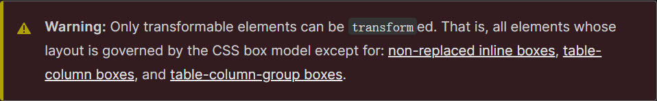

- 所以，`transform` 对于行内非替换元素是无效的

  - 比如对 `span`、`a` 元素等等

### `transform` 的用法

- `transform` 属性的语法如下：

  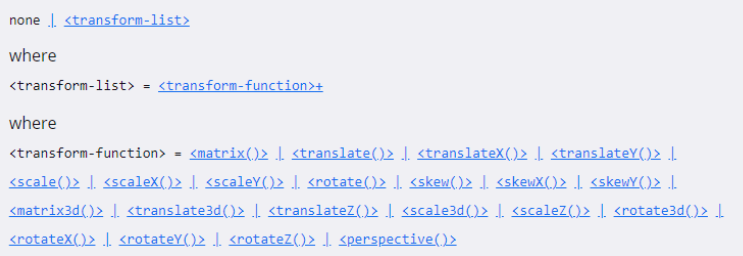

  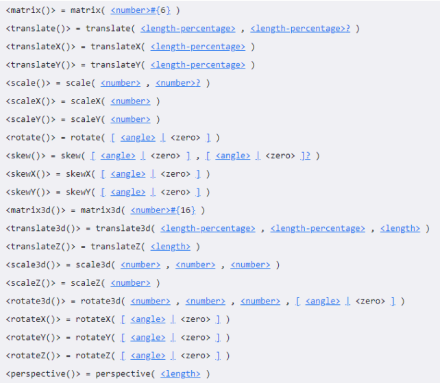

- 常见的 `transform` 函数有：

  - **平移**：`translate(x, y)`
  - **缩放**：`scale(x, y)`
  - **旋转**：`rotate(deg)`
  - **倾斜**：`skew(deg, deg)`

- 通过上面的几个函数，我们可以让某个元素发生形变

### 位移 - `translate`

- 平移：`translate(x, y)`
  - 这个 `CSS` 函数用于移动元素在平面上的位置
  - `translate` 本身可以表示”翻译“的意思，在物理上也可以表示”平移“
- 值个数
  - 一个值时，设置 `x` 轴上的位移
  - 两个值时，设置 `x` 轴和 `y` 轴上的位移
- 值类型：
  - **`<length>`**：如 `100px`
  - **百分比**：参照元素本身（`A percentage as first value refers to the width, as second part to the height of the reference box defined by the transform-box property.`）

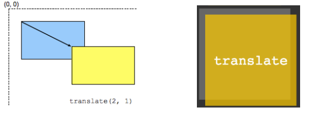

#### 补充

1. `translate()` 是 `translateX()` 和 `translateY()` 函数的简写

   - `translate3d()` 后续了解

2. `translate()` 的百分比可以完成一个元素的水平和垂直居中：

   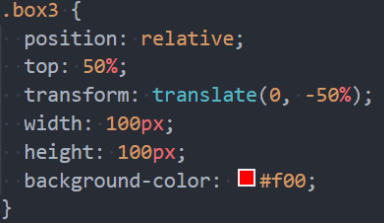

3. `translate()` 函数相对于 `flex` 布局的兼容性会好一点点

   - `translate()` 可以兼容到 `IE9`，而 `flex` 只能兼容到 `IE10`
   - 不过目前 `flex` 布局已经非常普及，直接使用 `flex` 布局即可；

### 缩放 - `scale`

- 缩放：`scale(x, y)`
  - `CSS` 函数 `scale()` 用于修改元素的大小；
- 值个数：
  - 一个值时，同时设置 `x` 轴和 `y` 轴上的缩放；
  - 两个值时，分别设置 `x` 轴和 `y` 轴上的缩放；
- 值类型：
  - **数字**：
    - `1`：保持不变
    - `2`：放大一倍
    - `0.5`：缩小一半
  - **百分比**：百分比不常用
- `scale()` 函数是 `scaleX()` 和 `scaleY()` 的缩写：
  - `scale3d()` 后续再了解；

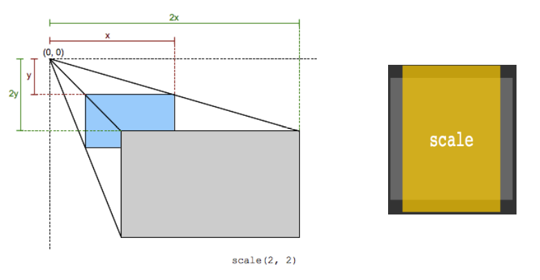

### 旋转 - `rotate`

- 旋转：`rotate(<angle>)`
- 值个数：
  - 一个值，表示旋转的角度；
- 值类型：
  - 常用单位 `deg`：旋转的角度（`degrees`）
  - 正数为顺时针
  - 负数为逆时针

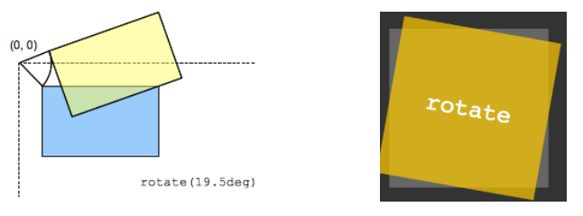

#### 补充

- `rotate()` 函数是 `rotateZ()` 函数的简写写法
  - `rotate3d` 后续再了解
- `rotate()` 的其它单位：
  - 事实上 `rotate()` 支持的单位是很多的：`deg`（`degrees`，度）、`grad`（`gradians`，百分度）、`rad`（`radians`，弧度）、`turn`（`turns`，圈数）

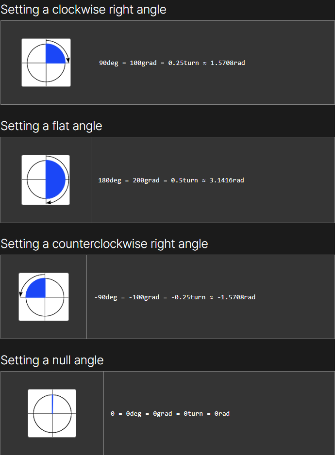

### 倾斜 - `skew`

- 倾斜：`skew(x, y)`
  - **`skew()`** 函数定义了一个元素在二维平面上的倾斜转换。
- 值个数
  - 一个值时，表示 `x` 轴上的倾斜
  - 两个值时，表示 `x` 轴和 `y` 轴上的倾斜
- 值类型：
  - `deg`：倾斜的角度
- 注意：倾斜的原点受 `transform-origin` 的影响

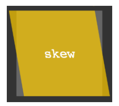

### `transform-origin`

- `transform-origin`：变形的原点
  - 比如在进行 `scale` 缩放或 `rotate` 旋转时，都会有一个原点；
- 一个值：
  - 设置 `x` 轴的原点
- 两个值：
  - 设置 `x` 轴和 `y` 轴的原点
- 必须是 `<length>`、`<percentage>` 或 `left`、`center`、`right`、`top`、`bottom` 关键字中的一个
  - `left`、`center`、`right`、`top`、`bottom` 关键字
  - `length`：从左上角开始计算
  - 百分比：参考元素本身的大小

## 2. （掌握）水平和垂直居中方案总结

### 水平居中方案

1. 行内（块）级元素水平居中：
   - 设置其父元素的 `text-align: center;`
2. 块级元素水平居中：
   - 指定其宽度的情况下，设置其 `margin: 0 auto;`
3. 绝对定位：
   - 指定宽度的情况下，设置其 `left: 0; right: 0; margin: 0 auto;`
4. `flex` 布局：
   - 设置其父元素的 `justify-content: center;`

### 垂直居中方案

1. 绝对定位：
   - 元素在具有高度的情况下，设置其 `top: 0; bottom: 0; margin: auto 0;`
   - 缺点：
     1. 绝对定位的元素会脱离标准流，这会导致元素不再占据空间，后面的元素会跑上来；
     2. 必须给元素设置高度（否则默认高度为 `auto` 时元素会占满包含块的高度）
2. `flex` 布局：
   - 给元素的父元素设置 `display: flex; align-items: center;`
   - 缺点：
     1. 当前的 `flex` 布局中所有的元素都会被垂直居中；
     2. 相对来说，兼容性差一点点（基本可以忽略）
3. （个人推荐）定位 + 变形（平移）：
   - 比如设置其相对定位，`top: 50%; transform: translate(0, -50%);`
     - `top` 百分比相对于父元素的高度；
     - `transform: translate();` 百分比相对于元素自身的宽高；
     - 注意：`margin-top/margin-bottom` 设置百分比时，相对的是其包含块（父元素）的**宽度**；

## 3. （掌握）`transition` 动画

### 认识 `transition` 动画

- 什么是 `transition` 动画呢？

  - `CSS transitions` 提供了一种在更改 `css` 属性时控制动画速度的方法；
  - 可以让 `css` 属性变化成为一个**持续一段时间的过程**，而**不是立即生效**的；
  - 比如将一个元素从**一个位置移动到另一位置**，默认在修改完 `CSS` 属性后会立即生效；
  - 但是我们可以通过 `CSS transition`，让**这个过程加上一定的动画效果**，包括**一定的曲线速率变化**；

- 通常将这两个状态之间的过渡称为隐式过渡（`implicit transitions`），因为开始与结束之间的状态**由浏览器决定**；

  

- `CSS transitions` 可以决定

  - 哪些属性发生动画效果（明确地列出这些属性）
  - 何时开始（设置 `delay`）
  - 持续多久（设置 `duration`）
  - 如何动画（定义 `timing function`，比如匀速地或先快后慢）

### 哪些 `CSS` 属性可以做动画呢？

- 并非所有的 `CSS` 属性都可以执行动画的，那么我们如何知道哪些属性支持动画呢？
- 方法一：在 `MDN` **可执行动画的 `CSS` 属性**中查询
  - https://developer.mozilla.org/zh-CN/docs/Web/CSS/CSS_animated_properties
- 方法二：阅读 `CSS` 属性的文档说明
  - 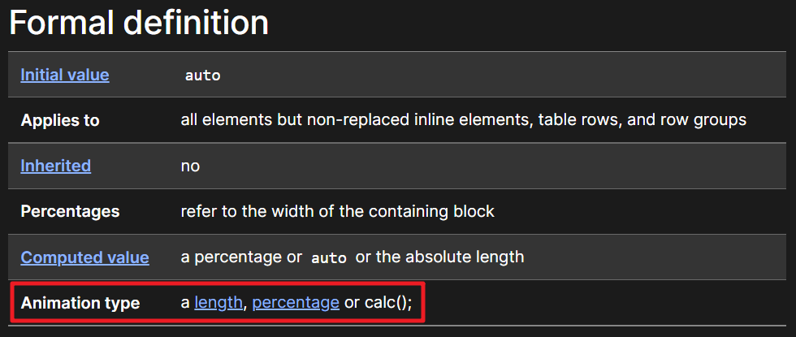

### 过渡动画 - `transition`

- `transition CSS` 属性是 `transition-property`、`transition-duration`、`transition-timing-function` 和 `transition-delay` 的一个简写属性；
- **`transition-property`**：指定应用过渡属性的名称
  - `all`：所有属性都执行过渡动画；
  - `none`：所有属性都不执行过渡动画；
  - `CSS` 属性名称：要执行动画的 `CSS` 属性名称，比如 `width`、`left`、`transform` 等；
- **`transition-duration`**：指定过渡动画所需的时间
  - 单位可以是秒（`s`）或毫秒（`ms`）
- **`transition-timing-function`**：指定动画的变化曲线
  - https://developer.mozilla.org/zh-CN/docs/Web/CSS/transition-timing-function
- **`transition-delay`**：指定过渡动画执行之前的等待时间

### 几个英语词汇的区分

- **`transform`** 是形变：
  - 一个 `CSS` 属性，该 `CSS` 属性用于设置形变；
  - 后面的值是形变的函数，比如 `translate()`、`scale()`、`rotate()` 等等；
- **`translate`** 是众多 `transform-function` 中的一个
  - 用于对元素进行平移；
- **`transition`** 是过渡的意思：
  - 也是一个 `CSS` 属性，用来设置过渡动画；
  - 它本身也有转变的含义，但是更多表示的是过渡的过程；
- 如果从范围的角度来看，`transition > transform > translate`

## 4. （掌握）`animation` 动画

### 认识 `CSS animation`

- 之前我们学习了 `transition` 来进行过渡动画，但是过渡动画有如下的缺点：
  - `transition` **只能定义开始状态和结束状态**，不能定义中间状态，也就是说只有两个状态；
  - `transition` **不能重复执行**，除非一再触发动画；
  - `transition` 需要在**特定状态下触发才能执行**，比如某个属性被修改了；
- 如果我们希望可以有更多状态的变化，我们可以使用 **`CSS animation`**
- `CSS animation` 的使用分成两个步骤：
  1. 使用 `keyframes` 定义动画序列（每一帧动画如何执行）
  2. 配置动画执行的名称、持续时间、动画曲线、延迟、执行次数、方向等等

### `@keyframes` 规则

- 可以使用 `@keyframes` 来定义多个变化的状态，并且使用 `animation-name` 来声明匹配
  - 关键帧使用 **`percentage`** 来指定动画发生的时间点；
  - **`0%`** 表示动画的第一时刻，**`100%`** 表示动画的最终时刻；
  - 因为这两个时间点十分重要，所以还有特殊的别名：**`from`** 和 **`to`**；
    - 也就是说还可以使用 `from` 和 `to` 关键字：
      - `from` 相当于 `0%`
      - `to` 相当于 `100%`
  
  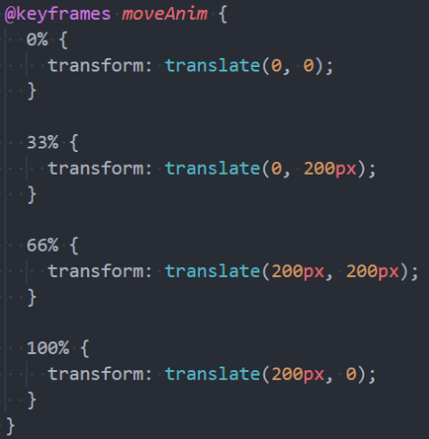

### `animation` 属性

- `CSS animation` 属性是 `animation-name`、`animation-duration`、`animation-timing-function`、`animation-delay`、`animation-iteration-count`、`animation-direction`、`animation-fill-mode` 和 `animation-play-state` 属性的一个简写属性
  - **`animation-name`**：指定执行哪一个关键帧动画
  - **`animation-duration`**：指定动画的持续时间
  - **`animation-timing-function`**：指定动画的变化曲线
  - **`animation-delay`**：指定延迟执行的时间
  - **`animation-iteration-count`**：指定动画执行的次数，设置为 `infinite` 表示无限动画
  - **`animation-direction`**：指定方向，常用值有 `normal`、`reverse`
  - **`animation-fill-mode`**：执行动画最后保留哪一个值
    - `none`：回到没有执行动画的位置
    - `forwards`：动画最后一帧的位置
    - `backwards`：动画第一帧的位置
  - **`animation-play-state`**：指定动画运行或暂停（在 `JavaScript` 中使用，用于暂停动画）

## 5. （理解）`vertical-align`

### `CSS` 属性 - `vertical-align`

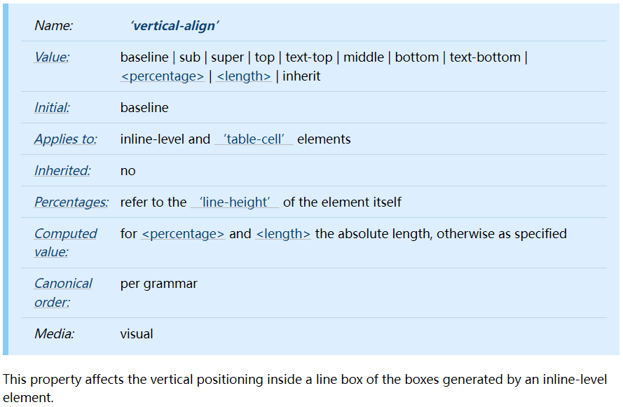

官方文档中有这样一句话：`This property affects the vertical positioning inside a line box of the boxes generated by an inline-level element.`，翻译过来就是：这个属性影响在一个行盒中由行内级元素生成的盒子的垂直定位。也就是说，`vertical-align` 会影响**行内（块）级元素**在一个**行盒**[^1]中垂直方向的位置。

- 思考：一个 `div` 元素没有设置高度的时候，会不会有高度？

  - 没有内容，没有高度
  - 有内容，内容撑起来高度

- 但是内容撑起来高度的本质是什么呢？

  - 内容有行高（`line-height`），行高撑起来了 `div` 的高度

- 行高为什么可以撑起 `div` 的高度？

  - 这是因为有行盒（`line box`）的存在，并且 `line box` 有一个特性，就是它会包裹每行的 `inline-level` 元素；
  - 而其中的文字是有行高的，必须将整个行高包裹进去，才算包裹这个 `inline-level` 元素；

- 那么，进一步思考：

  - 如果这个 `div` 中有图片，文字，`inline-block`，甚至它们设置了 `margin` 这些属性呢？

    - 情况一：只有文字时，`line box` 如何包裹内容？（注意：红色是包裹的 `div`，下面几种情况也一样，此处只有一行文本，所以只生成了一个 `line box`）

      

    - 情况二：有文字，也有图片时，`line box` 如何包裹内容？

      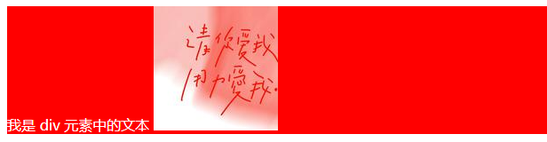

    - 情况三：有文字，也有图片，还有 `inline-block` 元素（比图片的高度还高）时，`line box` 如何包裹内容？

      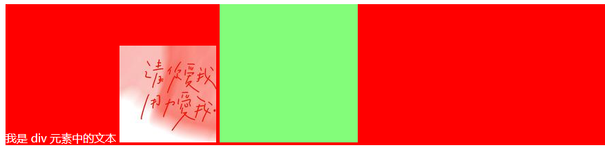

    - 情况四：有文字，也有图片，还有 `inline-block` 元素（比图片的高度还高）而且设置了 `margin-bottom` 时，`line box` 如何包裹内容？

      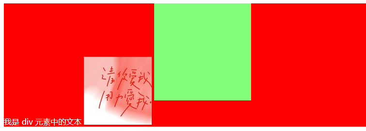

    - 情况五：有文字，也有图片，还有 `inline-block` 元素（比图片的高度还高）而且设置了 `margin-bottom` 并且有文字时，`line box` 如何包裹内容？

      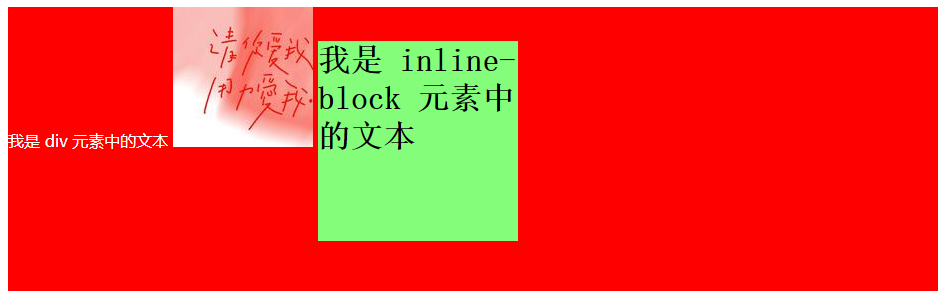

### `vertical-align` 的 `baseline`

- 结论：`line box` 一定会想办法包裹住当前行中所有的内容。

- 但是，为什么对齐方式千奇百怪呢？

  - 你认为的千奇百怪，其实有它的内在规律
  - 答案就是 `baseline` 对齐

- 我们来看官方文档中 `vertical-align` 的初始值（即当元素没有设置该属性时的默认值），没错，就是 `baseline`：

  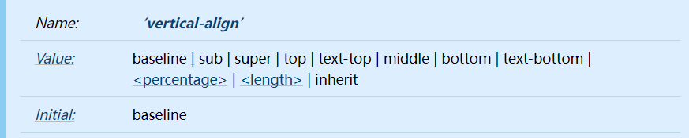

- 但是，`baseline` 都是谁呢？

  - 文本的 `baseline` 是字母 `x` 的下方
  - `inline-block` 元素默认的 `baseline` 是 `margin-bottom` 的底部（没有，就是盒子的底部）
  - `inline-block` 元素中有文本时，`baseline` 是最后一行文本的 `x` 的下方

- 一切都解释通了

[^1]: https://w3c.github.io/csswg-drafts/css2/#line-box:~:text=In%20an%20inline%20formatting%20context%2C%20boxes,is%20called%20a%20line%20box.
