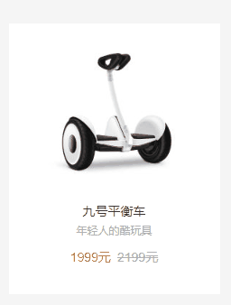

# Day11 作业布置

## 一. 完成课堂所有的代码练习

见 `Learn_HTML_CSS`

## 二. 说出常见的CSS Transform形变有哪些

- 常见的 `transform` 形变有：
  - 位移（`translate`）
  - 缩放（`scale`）
  - 旋转（`rotate`）
  - 倾斜（`skew`）

### 补充: 说出transform/translate/transition分别的作用

- 在 `CSS` 中，`transform`、`translate` 和 `transition` 都是用来控制元素外观和动画效果的属性；

- `transform` 属性可以用来改变元素的形状、大小和方向。它可以通过形变函数（`transform-function`）进行平移（`translate`）、缩放（`scale`）、旋转（`rotate`）、倾斜（`skew`）等操作来达到这个目的。例如：

  ```css
  div {
    transform: rotate(45deg); /* 将 div 元素顺时针旋转 45 度 */
  }
  ```

- `translate` 属性可以用来移动元素的位置。它可以在水平方向和垂直方向上移动元素，从而改变元素在页面中的位置。但它的兼容性不是很好，我们一般使用转换函数（`transform-function`） `translate()`，例如：

  ```css
  div {
    transform: translate(50px, 100px);  /* 将 div 元素在水平方向上向右移动 50 像素，在垂直方向上向下移动 100 像素 */
  }
  ```

- `transition` 属性可以用来设置元素在某些属性（[可动画的属性](https://developer.mozilla.org/zh-CN/docs/Web/CSS/CSS_animated_properties)）发生变化时的过渡效果。它可以让元素的属性改变时平滑地过渡到新的值，而不是突然发生变化。例如：

  ```css
  div {
    transition: width 0.5s;  /* 当 div 元素的 width 属性发生变化时，元素会在 0.5 秒内平滑地过渡到新的宽度值 */
  }
  ```

## 三. 说出CSS Transition和Animation动画的区别

`CSS` `transition` 和 `CSS` `animation` 都是用来在 `CSS` 中创建动画效果的技术。但它们有一些区别：

1. 用法不同：`transition` 是一个 `CSS` 属性，可以用来在某些属性发生变化时平滑地过渡到新的值；`animation` 是一种 `CSS` 规则，可以用来设置元素的多个动画效果，每个动画效果由一系列的帧组成。

   - `transition` 的语法如下：

     ```css
     transition: <single-transition>#
     
     <single-transition> = [ none | <single-transition-property> ] || <time> || <easing-function> || <time>
     ```

     `transition` 其实是 `4` 个属性的简写属性：

     ```css
     transition: <transition-property> <transition-duration> <transition-timing-function> <transition-delay>
     ```

     其中，`transition-property` 表示需要过渡的属性；`transition-duration` 表示过渡效果持续的时间；`transition-timing-function` 表示过渡效果的速度曲线；`transition-delay` 表示过渡效果延迟的时间。

     例如：

     ```css
     div {
       width: 100px;
       transition: width 0.5s ease-in-out 0.2s;  /* 当 div 元素的 width 属性发生变化时，元素会在 0.2 秒后开始过渡，并在 0.5 秒内平滑地过渡到新的宽度值，使用 ease-in-out 速度曲线 */
     }
     ```

   - `animation` 的语法如下：

     ```css
     @keyframes <keyframes-name> { <rule-list> }
     
     <keyframes-name> = <custom-ident> | <string>
     
     <keyframe-block> = <keyframe-selector># { <declaration-list> }
     
     <keyframe-selector> = from | to | <percentage [0,100]>
     ```

     转化一下也就是：

     ```css
     @keyframes <keyframes-name> {
       <keyframe-selector> {
         <property>: <value>;
       }
     }
     ```

     其中，`keyframes-name` 是动画的名称；`keyframe-selector` 是帧的选择器，表示帧在动画过程中的位置（可以是百分比或关键字 `from` 和 `to`）；`property` 和 `value` 则是在这一帧中需要改变的属性和值。

     `CSS animation` 的使用分成两个步骤：

     1. 使用 `@keyframes` 定义动画序列（每一帧动画如何执行）
     2. 使用该动画，配置动画执行的名称、持续时间、动画曲线、延迟、执行次数、方向等等

     举个例子：

     ```css
     @keyframes fadeIn {
       0% {
         opacity: 0;
       }
       100% {
         opacity: 1;
       }
     }
     
     div {
       animation: fadeIn 2s;  /* 应用名为 fadeIn 的动画，持续 2 秒 */
     }
     ```

2. 控制粒度不同：`transition` 的控制粒度较大，它只能控制整个过渡过程的总体信息，包括过渡的时长、加速度、延迟时间等。而 `animation` 的控制粒度则要细得多，它可以控制每一帧动画的具体信息。

3. 触发方式不同：`transition` 是在属性发生变化时自动触发的；而 `animation` 不需要属性发生变化就能触发执行，我们还可以通过 `JavaScript` 来控制动画的开始和结束，也可以设置动画在特定条件下触发。

4. 兼容性不同：`transition` 在所有主流浏览器中都有很好的支持；`animation` 在早期的浏览器中的支持较差，但现在已经得到了很好的改进。

因此，`transition` 动画有以下缺点：

1. `transition` 只能定义开始状态和结束状态，不能定义中间状态；
2. `transition` 不能重复执行，除非再次触发动画；
3. `transition` 需要在特定状态下触发才能执行，比如某个属性被修改了；

如果我们希望控制动画的中间状态，可以使用 `animation`。

此外，`animation` 相较于 `transition` 多了 `4` 个属性：`animation-iteration-count`、`animation-direction`、`animation-fill-mode`、`animation-play-state`

## 四. 理解vertical-align的作用和行盒的理解

`vertical-align` 是一个 `CSS` 属性，它影响行内级元素在行盒中垂直方向上的位置，也就是说，`vertical-align` 可以帮助我们控制元素在父元素或行内的垂直对齐方式。

`vertical-align` 的默认值是 `baseline`，也就是按照基线对齐，常用的值还有：`top`、`middle`、`bottom` 等。


在 `CSS` 中，行盒（`line box`）是指文本或其他内联元素所在的一行的矩形区域。行盒有一个特性，就是它会包裹这一行中的所有 `inline-level` 元素（包括元素的 `line-height` 和 `margin`）。

## 五. 完成小米布局中的动画效果



代码如下：

```html
<!DOCTYPE html>
<html lang="en">
<head>
  <meta charset="UTF-8">
  <meta http-equiv="X-UA-Compatible" content="IE=edge">
  <meta name="viewport" content="width=device-width, initial-scale=1.0">
  <title>Document</title>
  <style>
    body {
      background-color: #f5f5f5;
    }

    a {
      color: #616161;
      text-decoration: none;
    }

    h3, p {
      margin: 0;
    }


    .item {
      position: absolute;
      top: 0;
      right: 0;
      bottom: 0;
      left: 0;

      display: flex;
      flex-direction: column;
      justify-content: center;
      align-items: center;

      margin: auto;

      width: 234px;
      height: 300px;
      background-color: #fff;

      transition: transform .2s linear, box-shadow .2s linear;
    }

    .item:hover {
      transform: translate(0, -3px);
      box-shadow: 0 15px 30px rgba(0, 0, 0, .1);
    }

    .item .img img {
      width: 160px;
    }

    .item .title {
      margin-top: 10px;
      font-size: 14px;
      font-weight: 400;
      color: #333;
    }

    .item .desc {
      margin: 5px 0 15px;
      font-size: 12px;
      color: #b0b0b0;
    }

    .item .price {
      display: flex;
      font-family: Arial;
      font-size: 14px;
    }

    .item .price .new {
      color: #ff6700;
    }

    .item .price del {
      margin-left: 0.5em;
      color: #b0b0b0;
    }

    .item .price .old {
      /* color: #b0b0b0; */
      /* text-decoration: line-through; */
    }
  </style>
</head>
<body>

  <a class="item" href="https://www.mi.com/scooter/" target="_blank">
    <div class="img">
      
    </div>
    <h3 class="title">九号平衡车</h3>
    <p class="desc">年轻人的酷玩具</p>
    <p class="price">
      <span class="new">1999元</span>
      <del>
        <span class="old">2199元</span>
      </del>
    </p>
  </a>

</body>
</html>
```

## 六. 自己找一个包含动画的网页案例(比如考拉页面)


代码如下：

```html
<!DOCTYPE html>
<html lang="en">
<head>
  <meta charset="UTF-8">
  <meta http-equiv="X-UA-Compatible" content="IE=edge">
  <meta name="viewport" content="width=device-width, initial-scale=1.0">
  <title>Document</title>
  <style>
    body, p {
      margin: 0;
    }

    a {
      color: #333;
      text-decoration: none;
    }


    body {
      /* display: flex;
      justify-content: center;
      align-items: center; */
      height: 100vh;

      background-color: #f5f5f5;
    }

    .item {
      position: relative;
      top: 50%;
      left: 50%;
      transform: translate(-50%, -50%);

      width: 219px;
      height: 176px;

      background-color: #fff;
    }

    .item .info {
      display: flex;
      flex-direction: column;
      justify-content: center;
      align-items: center;
      height: 100%;
    }

    .item .info .img {
      position: relative;
      top: 0;
      width: 120px;
      height: 120px;
      transform: scale(1);
      transition: top .3s ease, transform .3s ease;
    }

    .item:hover .info .img {
      top: -20px;
      transform: scale(.66);
      /* transform-origin: top; */
    }

    .item .info .desc {
      margin-top: 10px;
      font-size: 14px;
      font-weight: 700;

      opacity: 1;

      transition: opacity .2s ease 0.08s;
    }

    .item:hover .info .desc {
      opacity: 0;
    }

    .item .action {
      position: absolute;
      top: 0;
      right: 0;
      bottom: 0;
      left: 0;

      display: flex;
      flex-direction: column;
      align-items: center;

      opacity: 0;

      transition: opacity .3s ease;
    }

    .item:hover .action {
      opacity: 1;
    }

    .item .action .followers {
      margin: 99px 0 8px;
      font-size: 12px;
      color: #999;
    }

    .item .action .enter {
      border: 2px solid #ff1e3c;
      border-radius: 32px;
      padding: 8px 12px;
      font-size: 14px;
      color: #ff1e3c;
    }

  </style>
</head>
<body>

  <div class="item">
    <div class="info">
      
      <p class="desc">国际知名母婴用品品牌</p>
    </div>
    <div class="action">
      <p class="followers">928764人关注该品牌</p>
      <a class="enter" href="https://search.kaola.com/brand/1112.html" target="_blank">进入品牌</a>
    </div>
  </div>

</body>
</html>
```


