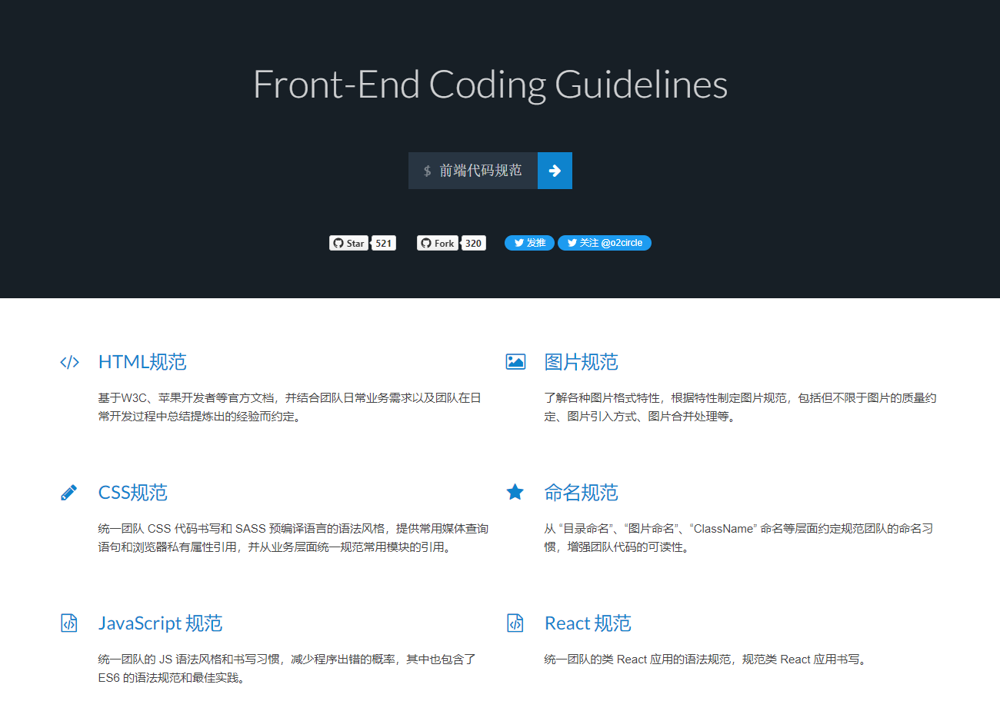
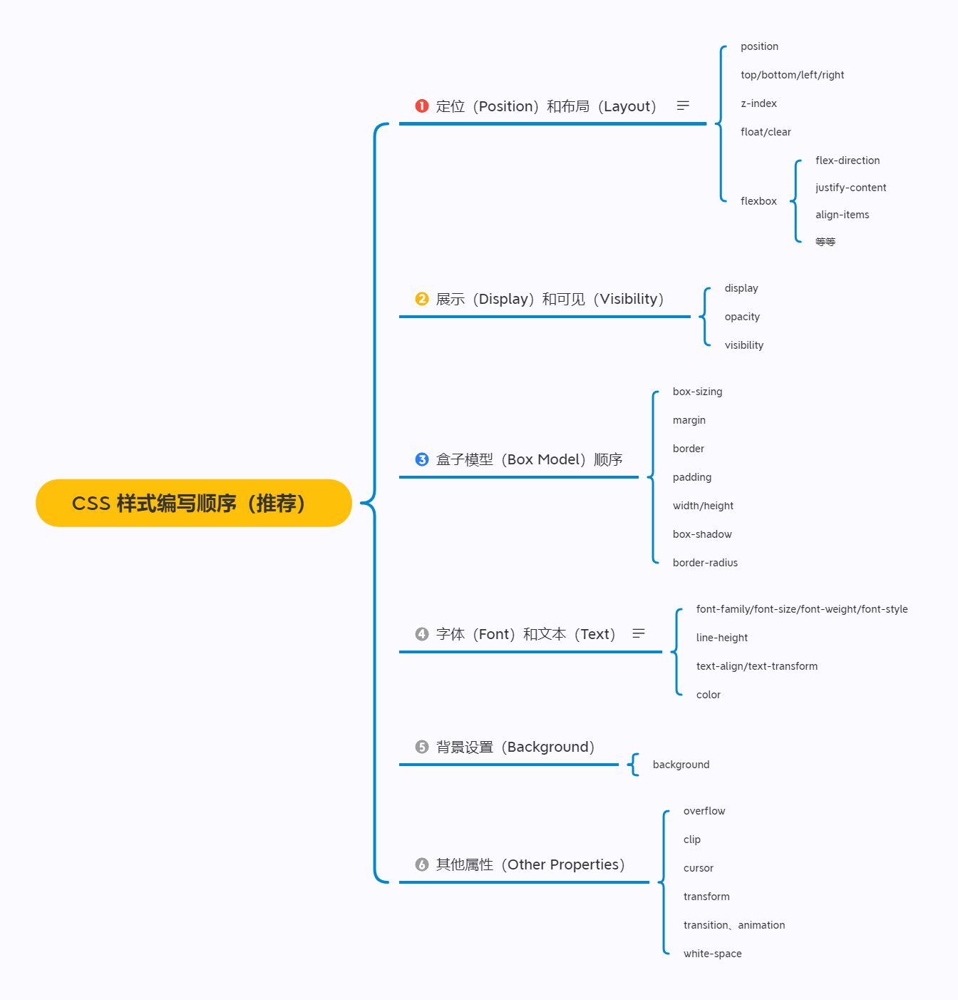
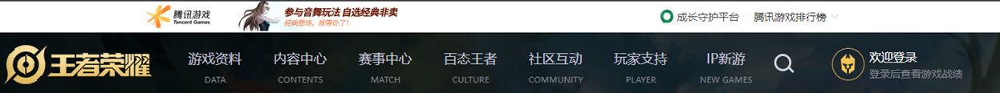
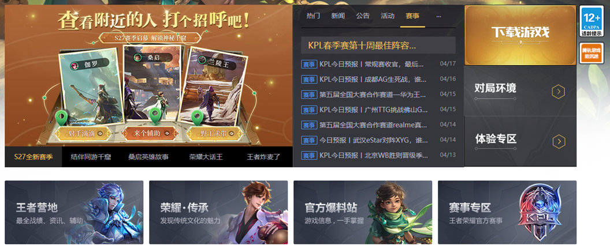
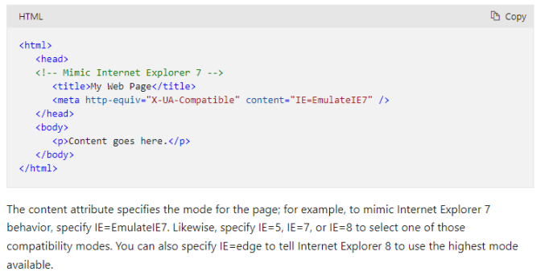
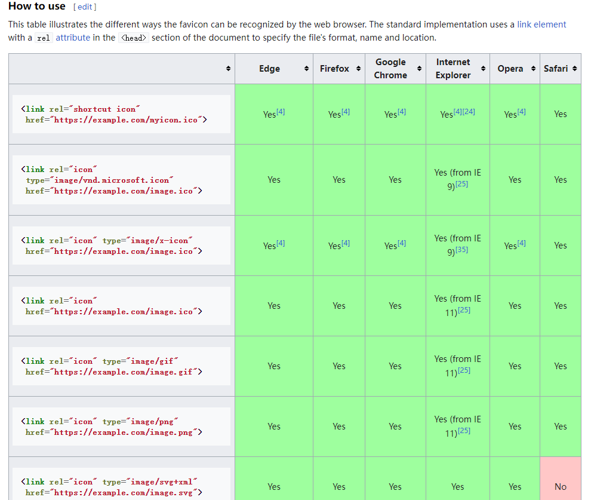
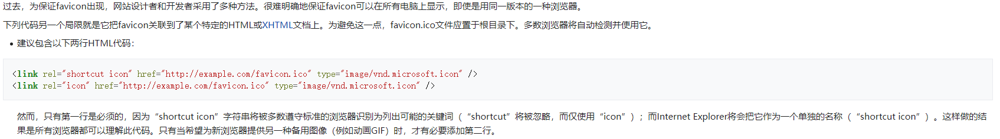

## 1. （掌握）代码规范（推荐）

- 遵守 `coderwhy` 课上的代码规范；

- 参考凹凸实验室的代码规范：

  - https://guide.aotu.io/

    

## 2. （掌握）`CSS` 编写顺序（推荐）



## 3. （掌握）组件化开发思想

### 组件化开发思路

事实上，目前 `Vue`、`React`、小程序采用的都是组件化开发思路


### 项目整体思路——各个击破





## 4. （掌握）`<meta>` 元素

- `<meta>` 元素用于定义元数据：
  - 在之前讲解 `<head>` 的时候说过，`<head>` 中用于定义文档的**元数据**；
  - 比如标题（`title`）、样式（`style`）、外部资源链接（`link`）等；
  - `<meta>` 用来定义那些不能用其它 `HTML` 元相关（`meta-related`）的元素进行表示的元数据信息；
- `<meta>` 元素定义的元数据的类型包括以下几种：
  - 如果设置了 **`charset`** 属性，`<meta>` 元素是一个字符集声明，告诉文档使用哪种字符编码；
  - 如果设置了 **`http-equiv`** 属性，`<meta>` 元素则是编译指令；
  - 如果设置了 **`name`** 属性，`<meta>` 元素提供的是文档级别（`document-level`）的元数据，应用于整个页面；
- 下面我们介绍一下 `http-equiv` 和 `name` 的作用

### `<meta>` 元素的 `http-equiv` 属性

- 我们会发现，无论是默认创建的 `html` 页面，还是王者荣耀官网页面，都有类似的如下代码：

  ```html
  <meta http-equiv="X-UA-Compatible" content="IE=edge">
  ```

- 它的作用到底是什么呢？网上众说纷纭，我们直接看官方文档的解释：

  

  - 告知 `IE` 浏览器去模仿哪一个浏览器的行为；
  - `IE=edge`，告知 `IE8` 使用可用的最高模式来模仿；

### `<meta>` 元素的 `name` 属性

- `name` 属性的值非常多，具体的内容可以查看文档：
  - https://developer.mozilla.org/en-US/docs/Web/HTML/Element/meta/name
- 我们介绍几个常用的：
  - **`robots`**：爬虫、协作搜寻器，或者“机器人”，对此页面的处理行为，或者说，应当遵守的规则；
  - **`author`**：文档作者的名字；
  - **`Copyright`**：版权声明；
  - **`description`**：一段简短而精确的、对页面内容的描述
    - 一些浏览器，比如 `Firefox` 和 `Opera`，将其用作书签的默认描述
    - 可以用来做 `SEO` 优化
  - **`keywords`**：与页面内容相关的关键词，使用逗号分隔。某些搜索引擎会进行收录（`SEO` 优化）；

## 5. （掌握）`favicon` 网站图标

- `favicon` 是 `favorite icon` 的缩写，亦被称为 `website icon`（站点图标）、`page icon`（页面图标）；

- 前面我们已经学习了它的用法：

  ```html
  <link rel="icon" href="https://pvp.qq.com/favicon.ico">
  ```

- 事实上它还有很多兼容性的写法[^1]：

  

- 这里有一个疑惑？

  - 为什么王者荣耀没有 `<link>` 元素也可以正常显示网站图标呢？

  - 因为王者荣耀把 `favicon.ico` 文件放在了根目录下，多数浏览器将自动检测并使用它[^2]。

    

- 下面的 `<link>` 使用方法表示有另一个可替换的网站供选择：

  ```html
  <link rel="alternate" href="https://pvp.qq.com/m/">
  ```


[^1]: https://en.wikipedia.org/wiki/Favicon#:~:text=.%5B34%5D-,How%20to%20use,-%5Bedit%5D
[^2]: https://zh.wikipedia.org/wiki/Favicon#:~:text=%E4%B8%8B%E5%88%97%E4%BB%A3%E7%A0%81%E5%8F%A6%E4%B8%80%E4%B8%AA%E5%B1%80%E9%99%90%E5%B0%B1%E6%98%AF%E5%AE%83%E6%8A%8Afavicon%E5%85%B3%E8%81%94%E5%88%B0%E4%BA%86%E6%9F%90%E4%B8%AA%E7%89%B9%E5%AE%9A%E7%9A%84HTML%E6%88%96XHTML%E6%96%87%E6%A1%A3%E4%B8%8A%E3%80%82%E4%B8%BA%E9%81%BF%E5%85%8D%E8%BF%99%E4%B8%80%E7%82%B9%EF%BC%8Cfavicon.ico%E6%96%87%E4%BB%B6%E5%BA%94%E7%BD%AE%E4%BA%8E%E6%A0%B9%E7%9B%AE%E5%BD%95%E4%B8%8B%E3%80%82%E5%A4%9A%E6%95%B0%E6%B5%8F%E8%A7%88%E5%99%A8%E5%B0%86%E8%87%AA%E5%8A%A8%E6%A3%80%E6%B5%8B%E5%B9%B6%E4%BD%BF%E7%94%A8%E5%AE%83%E3%80%82
