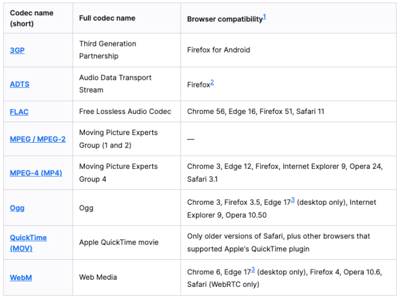
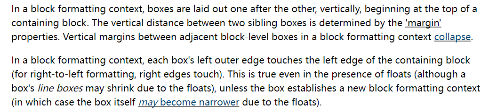
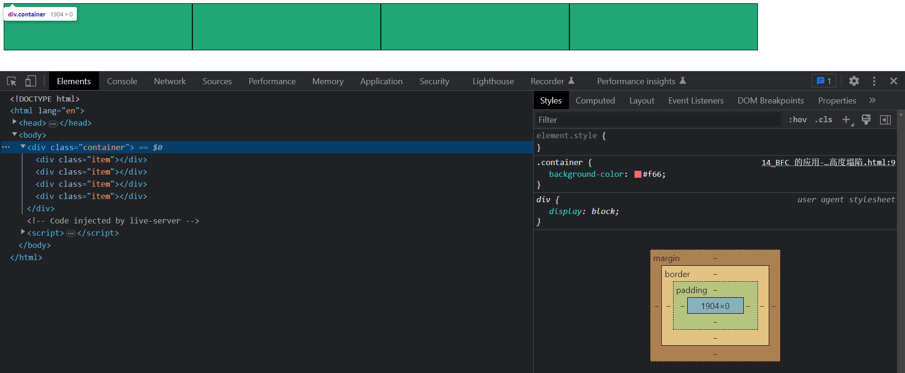
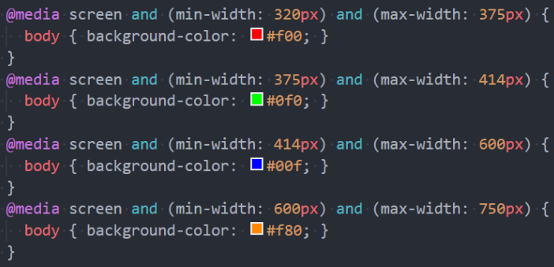

## 1. （掌握）`HTML5` 新增元素

### `HTML5` 语义化元素

- 在 `HTML5` 之前，我们的网站分布层级通常包括哪些部分呢？

  - `header`、`nav`、`main`、`footer`

- 但是这样做有一个弊端：

  - 我们往往**过多地使用 `div`**，通过 `id` 或 `class` 来区分元素；
  - 对于浏览器来说，这些元素**不够语义化**；
  - 对于搜索引擎来说，**不利于 `SEO` 的优化**；

- `HTML5` 新增了语义化的元素：

  - **`<header>`**：头部元素
  - **`<nav>`**：导航元素
  - **`<section>`**：定义文档某个区域的元素
  - **`<article>`**：内容元素
  - **`<aside>`**：侧边栏元素
  - **`<footer>`**：尾部元素

  

### `HTML5` 其它新增元素

- `Web` 端事实上一直希望可以**更好地嵌入音频和视频**，特别是 `21` 世纪以来，用户带宽的不断提高，浏览器播放音频和视频变得非常容易
  - 在 `HTML5` 之前是通过 `flash` 或者其它插件实现的，但是会有很多问题；
  - 比如**无法很好地支持 `HTML/CSS` 特性、兼容性问题**等等；
- `HTML5` 增加了对媒体类型的支持：
  - 音频：**`<audio>`**
  - 视频：**`<video>`**
- `<audio>` 和 `<video>` 的使用方式有两个：
  - 一方面我们可以直接通过元素使用 `<audio>` 和 `<video>`；
  - 另一方面我们可以通过 `JavaScript` 的 `API` 对其进行控制；

#### `<video>`

- `HTML` `<video>` 元素用于在 `HTML` 或者 `XHTML` 文档中嵌入媒体播放器，用于支持文档内的视频播放

  ```html
  <video src="./assets/fcrs.mp4" controls>
  ```

- `<video>` 常见的属性：

  | 常见属性   | 值的方式                                        | 属性作用                                                     |
  | ---------- | ----------------------------------------------- | ------------------------------------------------------------ |
  | `src`      | `URL` 地址                                      | 视频播放的 `URL` 地址                                        |
  | `width`    | `pixels`（像素）                                | 设置 `video` 的宽度                                          |
  | `height`   | `pixels`（像素）                                | 设置 `video` 的高度                                          |
  | `controls` | `Boolean` 类型（只要加上了该属性即表示 `true`） | 是否显示控制栏，包括音量、跨帧、暂停/恢复播放                |
  | `autoplay` | `Boolean` 类型（只要加上了该属性即表示 `true`） | 是否自动播放视频（某些浏览器需要添加 `muted`，比如 `Chrome`） |
  | `muted`    | `Boolean` 类型（只要加上了该属性即表示 `true`） | 是否静音播放                                                 |
  | `preload`  | `none`/`metadata`/`auto`                        | 是否需要预加载视频，`metadata` 表示预加载元数据（比如视频时长等） |
  | `poster`   | `URL` 地址                                      | 一海报帧的 `URL`，用于在视频处于下载中的状态时显示的图像     |

- `<video>` 支持的视频格式

  - 每个视频都会有自己的格式，浏览器的 `<video>` 并非支持所有的视频格式[^1]

    

- `<video>` 的兼容性写法

  - 在 `<video>` 元素中间的内容，是针对浏览器不支持此元素时的降级处理

    - 内容一：通过 `<source>` 元素指定更多视频格式的源；
    - 内容二：通过 `<p>`、`<div>` 等元素指定在浏览器不支持 `<video>` 元素的情况下显示的内容；

    ```html
    <video src="./assets/fcrs.mp4" width="800" controls>
      <source src="./assets/fcrs.webm">
      <source src="./assets/fcrs.ogg">
    
      <p>您的浏览器不支持 HTML5 的 video 元素，请更换浏览器查看！</p>
    </video>
    ```

#### `<audio>`

- `HTML` `<audio>` 元素用于在文档中嵌入音频内容，和 `<video>` 的用法非常类似

  ```html
  <audio src="./assets/yhbk.mp3" controls autoplay muted></audio>
  ```

- 常见属性：

  | 常见属性   | 值的方式                                        | 属性作用                                                     |
  | ---------- | ----------------------------------------------- | ------------------------------------------------------------ |
  | `src`      | `URL` 地址                                      | 音频播放的 `URL` 地址                                        |
  | `controls` | `Boolean` 类型（只要加上了该属性即表示 `true`） | 是否显示控制栏，包括音量、进度、暂停/恢复播放                |
  | `autoplay` | `Boolean` 类型（只要加上了该属性即表示 `true`） | 是否自动播放音频（某些浏览器需要添加 `muted`，比如 `Chrome`） |
  | `muted`    | `Boolean` 类型（只要加上了该属性即表示 `true`） | 是否静音播放                                                 |
  | `preload`  | `none`/`metadata`/`auto`                        | 是否需要预加载音频，`metadata` 表示预加载元数据（比如音频时长等） |
  
- `<audio>` 支持的音频格式

  - 每个音频都会有自己的格式，浏览器的 `<audio>` 并非支持所有的音频格式

  - 具体的支持的格式可以通过下面的链接查看：

    - https://developer.mozilla.org/en-US/docs/Web/Media/Formats/Audio_codecs

      

  - 在 `<audio>` 元素中间的内容，是针对浏览器不支持此元素时候的降级处理：

    ```html
    <audio src="./assets/yhbk.mp3" controls>
      <source src="./assets/yhbk.ogg">
      <p>您的浏览器不支持 HTML5 的 audio 元素，请更换浏览器查看！</p>
    </audio>
    ```


## 2. （掌握）`<input>` 元素的扩展内容

- `HTML5` 对 **`<input>` 元素**也进行了扩展，在之前我们已经学习过的其中几个属性也是 `HTML5` 的新特性：
  - **`placeholder`**：输入框的占位文字
  - **`multiple`**：多个值
  - **`autofocus`**：自动获取焦点
- 另外对于 `<input>` 的 `type` 属性的值也有很多扩展：
  - **`date`**
  - **`time`**
  - **`number`**
  - **`tel`**
  - **`color`**
  - **`email`**
  - 等等
- 更多内容可以查阅 `MDN` 文档：
  - https://developer.mozilla.org/zh-CN/docs/Web/HTML/Element/Input

## 3. （掌握）全局属性 `data-*`

- 在 `HTML5` 中，新增了种个全局属性：`data-*`，用于自定义数据属性：

  - `data` 设置的属性可以在 `JavaScript` 的 `DOM` 操作中通过 **`dataset`** 轻松获取到；
  - 通常**用于 `HTML` 和 `JavaScript` 之间的数据传递**；

  ```html
  <div class="box" age="20" data-name="zhj" data-age="20" data-height="1.88">
    box
  </div>
  
  <script>
    const divEl = document.querySelector('.box')
    console.log('divEl.dataset', divEl.dataset)
  </script>
  ```

- 在**小程序**中，就是**通过 `data-` 来传递数据**的，所以该全局属性必须要掌握。

## 4. （了解）`CSS` 属性 `white-space`、`text-overflow` 的补充

### `white-space`

- `white-space` 用于设置**空白处理**和**换行规则**

  - **`normal`**：合并所有连续的空白，**允许**单词超屏时自动换行
  - **`nowrap`**：合并所有连续的空白，**不允许**单词超屏时自动换行
  - **`pre`**：**阻止**合并所有连续的空白，**不允许**单词超屏时自动换行
  - **`pre-wrap`**：**阻止**合并所有连续的空白，**允许**单词超屏时自动换行
  - **`pre-line`**：**合并**所有连续的空白（但保留换行），**允许**单词超屏时自动换行


### `text-overflow`

- `text-overflow` 通常用来设置文字溢出时的行为

  - **`clip`**：溢出的内容直接裁剪掉（字符可能会显示不完整）
  - **`ellipsis`**：溢出那行的结尾处用省略号表示

- `text-overflow` 生效的前提是 `overflow` 不为 `visible`

- 常见的是将 `white-space`、`text-overflow`、`overflow` 一起使用：

  - ```css
    white-space: nowrap;
    text-overflow: ellipsis;
    overflow: hidden;
    ```

## 5. （掌握）`CSS` 中常见的函数

- 在前面我们有使用过很多个 `CSS` 函数：
  - 比如 **`rgb()`、`rgba()`、`translate()`、`rotate()`、`scale()`** 等等；
  - `CSS` 函数通常可以帮助我们**更加灵活**地编写**样式的值**；
- 下面我们再学习几个非常好用的 `CSS` 函数：
  - **`var()`**：使用 `CSS` 定义的变量；
  - **`calc()`**：计算 `CSS` 值，通常用于计算元素的大小或位值；
  - **`blur()`**：毛玻璃（高斯模糊）效果；
  - **`gradient()`**：颜色渐变函数；

### `var()`

- `CSS` 中可以自定义属性

  - **属性名**需要以**两个减号（`--`）**开始；
  - **属性值**则可以是**任何有效的 `CSS` 值**；

  

- 然后可以通过 `var()` 函数来使用它：

  

- 规则集定义的选择器，是自定义属性的可见作用域（只在选择器内部有效）：

  - 所以推荐将**自定义属性定义在 `html`** 中，也可以使用 [**`:root` 选择器**](https://developer.mozilla.org/zh-CN/docs/Web/CSS/:root#:~:text=%3Aroot%20%E8%BF%99%E4%B8%AA%20CSS%20%E4%BC%AA%E7%B1%BB%E5%8C%B9%E9%85%8D%E6%96%87%E6%A1%A3%E6%A0%91%E7%9A%84%E6%A0%B9%E5%85%83%E7%B4%A0%E3%80%82%E5%AF%B9%E4%BA%8E%20HTML%20%E6%9D%A5%E8%AF%B4%EF%BC%8C%3Aroot%20%E8%A1%A8%E7%A4%BA%20%3Chtml%3E%20%E5%85%83%E7%B4%A0%EF%BC%8C%E9%99%A4%E4%BA%86%E4%BC%98%E5%85%88%E7%BA%A7%E6%9B%B4%E9%AB%98%E4%B9%8B%E5%A4%96%EF%BC%8C%E4%B8%8E%20html%20%E9%80%89%E6%8B%A9%E5%99%A8%E7%9B%B8%E5%90%8C%E3%80%82)；

### `calc()`

- `calc()` 函数允许在声明 `CSS` 属性值时执行一些计算

  - 计算支持**加减乘除**的运算；
    - `+` 和 `-` 运算符的**两边必须要有空白字符**
  - 通常用来**设置一些元素的尺寸或者位置**；

  

### （理解）`blur()`

- `blur()` 函数将**高斯模糊**应用于输出图片或元素；

  - **`blur(radius)`**
  - **`radius`**：模糊的半径，用于定义高斯函数的偏差值，偏差值越大，图片越模糊；

- 通常会和两个属性一起使用：

  - **`filter`**：将模糊或颜色偏移等图形效果应用于元素；
  - **`backdrop-filter`**：为元素后面的区域添加模糊或者其它效果；

  

### （理解）`gradient()`

- `<gradient>` 是一种 **`<image>` `CSS` 数据类型的子类型**，用于表现两种或多种颜色的过渡转变
  - `CSS` **`<image>` 数据类型**描述的是 **`2D` 图形**；
  - 比如 `background-image`、`list-style-image`、`border-image`、`content` 等；
  - `<image>` 常见的方式是**通过 `url` 来引入一个图片资源**；
  - 但也可以**通过 `CSS` 的 `<gradient>` 函数**来设置颜色的渐变；
- `<gradient>` 常见的函数实现有下面几种：
  - **`linear-gradient()`**：创建一个表示两种或多种颜色线性渐变的**图片**；
  - **`radial-gradient()`**：创建一个图像，该图像是由从原点辐射的两种或多种颜色之间的渐进过渡组成；
  - **`repeating-linear-gradient()`**：创建一个由重复线性渐变组成的 `<image>`；
  - **`repeating-radial-gradient()`**：创建一个从原点辐射的重复渐变组成的 `<image>`；
  - 等等

#### `linear-gradient()` 的使用

- `linear-gradient()`：创建一个表示两种或多种颜色线性渐变的图片：

  - ```css
    background-image: linear-gradient(red, blue);
    /* 可以改变线性渐变的方向 */
    background-image: linear-gradient(to right, red, blue);
    background-image: linear-gradient(to right bottom, red, blue);
    background-image: linear-gradient(-45deg, red, blue);
    background-image: linear-gradient(to right, red, blue 40%, orange 120px, green 100%);
    ```

- `radial-gradient()`：创建一个图像，该图像是由从原点辐射的两种或多种颜色之间的渐进过渡组成：

  - ```css
    background-image: radial-gradient(red, blue);
    background-image: radial-gradient(at 0 50%, red, blue);
    ```

## 6. （理解）浏览器前缀

- 有时候可能会看到有些 `CSS` 属性名前面带有：**`-o-`、`-xv-`、`-ms-`、`mso-`、`-moz-`、`-webkit-`**

  

- 官方文档专业术语叫做：`vendor-specific extensions`（供应商特定扩展）

- 为什么需要浏览器前缀呢？

  - `CSS` 属性刚开始**并没有成为标准**，浏览器为了**防止某个属性后续可能会修改名字或者甚至有一天被否定掉**，给新的属性添加了浏览器前缀；
  - 主要是涉及到三者之间的关系：`W3C`（制定标准）、浏览器厂商、开发者，对于一个还未进入 `W3C` 正式标准的 `CSS` 属性，开发者想要使用它，浏览器厂商就提供了添加浏览器前缀这一方案；

- 上述前缀叫做浏览器私有前缀，只有对应的浏览器才能解析使用

  - `-o-`、`-xv-`：`Opera` 等
  - `-ms-`、`mso-`：`IE` 等
  - `-moz-`：`Firefox` 等
  - `-webkit-`：`Safari`、`Chrome` 等

- 注意：不需要手动添加，后面学习了模块化打包工具会自动添加浏览器前缀

总之，浏览器前缀相当于是浏览器为了对某些还没有成为标准的 `CSS` 属性，给出的一种过渡方案。当然，现在已经不需要我们手动去添加浏览器前缀了，我们用到的打包工具会自动添加浏览器前缀。

## 7. （理解）深入理解 `BFC`

### `FC` - `Formatting Context`

- 什么是 `FC` 呢？

  - `FC` 的全称是 `Formatting Context`，元素在标准流里面都属于一个 `FC`[^2]：

    

    比如下面代码中的 `<body>`、`<div>`、`<p>`、`<span>`、`<a>` 元素，它们默认情况下都在标准流中，都属于 `<html>` 元素创建出来的这个 `BFC` 中：

    ```html
    <!DOCTYPE html>
    <html lang="en">
    <head>
      <meta charset="UTF-8">
      <meta http-equiv="X-UA-Compatible" content="IE=edge">
      <meta name="viewport" content="width=device-width, initial-scale=1.0">
      <title>Document</title>
    </head>
    <body>
    
      <div></div>
      <p>
        <span></span>
        <a href=""></a>
      </p>
    
    </body>
    </html>
    ```
  
  - 块级元素的布局属于 `Block Formatting Context`（`BFC`）
  
    - 也就是说 **`block level box`** 都是在 **`BFC`** 中布局的，`BFC` 是块级元素的布局环境
    - `display` 属性值为 `block`、`list-item`、`table` 的元素会生成 `block-level box`，并且参与 `block formatting context`[^7]
  
  - 行内级元素的布局属于 `Inline Formatting Context`（`IFC`）
  
    - 即 **`inline level box`** 都是在 **`IFC`** 中布局的
    - `display` 属性值为 `inline`、`inline-table`、`inline-block` 的元素会生成 `inline-level box`，并且参与 `inline formatting context`[^8]

### `BFC` - `Block Formatting Context`

- `block level box` 都是在 `BFC` 中布局的，那么这个 `BFC` 在哪里呢？我们来看官方文档的定义[^3	]：

  

  翻译一下就是，浮动元素，绝对定位元素，非块级盒子的块容器（如内联块、表格单元格和表格标题）以及具有除 `visible` 以外的 `overflow` 属性值（当该值未传播到视口时）的块级盒子，都会为它们的内容建立新的块级格式化上下文。

- `MDN` 上有整理出在哪些具体的情况下会创建 `BFC`：

  - 文档的根元素（`<html>`）
  
  - 浮动元素（即 `float` 属性值不为 `none` 的元素）
  
  - 绝对定位元素（元素的 `position` 属性值为 `absolute` 或 `fixed`）
  
  - 行内块元素（元素的 `display` 为 `inline-block`）
  
  - 表格单元格（元素的 `display` 为 `table-cell`，`HTML` 表格单元格默认为该值），表格标题（元素的 `display` 为 `table-caption`，`HTML` 表格标题默认为该值）
  
  - 匿名表格单元格元素（元素的 `display` 为 `table`、`table-row`、`table-row-group`、`table-header-group`、`table-footer-group`（分别是 `HTML` `table`、`row`、`tbody`、`thead`、`tfoot` 的默认属性）或 `inline-table`）
  
  - `overflow` 的值不为 `visible`、`clip` 的块元素
  
    - 比如下面的代码中，当我们给 `class` 为 `box` 的 `<div>` 元素设置了 `overflow: auto;` 时，就会触发这个 `<div>` 元素创建一个 `BFC`，但需要注意，这个 `<div>` 元素本身依然属于原来 `<html>` 元素创建的那个 `BFC`，要想让这个 `<div>` 元素属于一个新的 `BFC`，可以再用一个 `<div>` 包裹它，然后给外层的这个 `<div>` 设置 `overflow: auto;`；
  
      ```html
      <!DOCTYPE html>
      <html lang="en">
      <head>
        <meta charset="UTF-8">
        <meta http-equiv="X-UA-Compatible" content="IE=edge">
        <meta name="viewport" content="width=device-width, initial-scale=1.0">
        <title>Document</title>
        <style>
          .box {
            overflow: auto;
          }
        </style>
      </head>
      <body>
      
        <div class="box"></div>
        <p>
          <span></span>
          <a href=""></a>
        </p>
      
      </body>
      </html>
      ```
  
  - 弹性元素（`display` 为 `flex` 或 `inline-flex` 元素的直接子元素）
  
  - 网格元素（`display` 为 `grid` 或 `inline-grid` 元素的直接子元素）
  
  - `display` 值为 `flow-root` 的元素
  
  - 等等

### `BFC` 有什么作用呢

- 我们来看一下官方文档对 `BFC` 作用的描述[^4]：

  

- 简单概括如下：

  - 在 `BFC` 中，`box` 会在**垂直方向上一个挨着一个**地排布；

  - **垂直方向的间距由 `margin` 属性**决定；

  - **在同一个 `BFC` 中**，**相邻两个块级盒子之间垂直方向上的 `margin` 会折叠（`collapse`）**；

    - ```html
      <!DOCTYPE html>
      <html lang="en">
      <head>
        <meta charset="UTF-8">
        <meta http-equiv="X-UA-Compatible" content="IE=edge">
        <meta name="viewport" content="width=device-width, initial-scale=1.0">
        <title>Document</title>
        <style>
          .box1 {
            margin-bottom: 50px;
            height: 100px;
            background-color: #f66;
          }
      
          .box2 {
            margin-top: 30px;
            height: 200px;
            background-color: #00e079;
          }
        </style>
      </head>
      <body>
      
        <div class="box1"></div>
        <div class="box2"></div>
      
      </body>
      </html>
      ```

      

  - 在 `BFC` 中，**每个元素的左边缘是紧挨着包含块的左边缘**的（对于从右到左的格式，则是紧挨着右边缘）；

    - 比如我们给上面代码中的 `.box1` 中添加 `width: 300px;`，效果如下：

      

      可以看到，默认情况下，元素的左边缘会靠着其包含块的左边缘；

- 那么这个东西有什么用呢？

  - 解决 `margin` 的折叠问题；
  - 解决浮动高度塌陷问题；
  - 实现自适应多栏布局；

#### `BFC` 的作用一：解决上下 `margin` 的折叠问题

- 在同一个 `BFC` 中，相邻两个 `box` 之间的 `margin` 会折叠（`collapse`）

  - 这在官方文档有明确地说明（见上图）：
    - `The vertical distance between two sibling boxes is determined by the 'margin' properties. Vertical margins between adjacent block-level boxes in a block formatting context collapse.`

- 那么如果我们让两个 `box` 是不同的 `BFC` 呢？那么就可以解决折叠问题了

  
  
- 举个例子：

  ```html
  <!DOCTYPE html>
  <html lang="en">
  <head>
    <meta charset="UTF-8">
    <meta http-equiv="X-UA-Compatible" content="IE=edge">
    <meta name="viewport" content="width=device-width, initial-scale=1.0">
    <title>Document</title>
    <style>
      .container {
        overflow: auto;
      }
  
      .box1 {
        margin-bottom: 50px;
        width: 300px;
        height: 100px;
        background-color: #f66;
      }
  
      .box2 {
        margin-top: 30px;
        height: 200px;
        background-color: #00e079;
      }
    </style>
  </head>
  <body>
  
    <div class="container">
      <div class="box1"></div>
    </div>
    <div class="box2"></div>
  
  </body>
  </html>
  ```

  通过给 `div.box1` 包裹一个外层的 `div.container`，然后给这个外层的 `div` 设置 `overflow` 的值不为 `visible` 和 `clip`，让它创建出一个新的 `BFC`，使得 `div.box1` 属于这个 `div.container` 创建出来的 `BFC`，而不再是原来 `<html>` 创建出来的 `BFC` 中，最终实现 `div.box1` 和 `div.box2` 属于两个不同的 `BFC`，也就不会出现在同一个 `BFC` 中才会出现的上下 `margin` 折叠的问题了。

#### `BFC` 的作用二：解决浮动高度塌陷

- 我们知道，浮动元素会脱离标准流，变成“脱标元素”，并不再向其父元素汇报高度，这就可能导致父元素的高度为 `0`：

  - ```html
    <!DOCTYPE html>
    <html lang="en">
    <head>
      <meta charset="UTF-8">
      <meta http-equiv="X-UA-Compatible" content="IE=edge">
      <meta name="viewport" content="width=device-width, initial-scale=1.0">
      <title>Document</title>
      <style>
        .container {
          background-color: #f66;
        }
    
        .item {
          float: left;
          box-sizing: border-box;
          border: 1px solid #000;
          width: 400px;
          height: 100px;
          background-color: #21a675;
        }
      </style>
    </head>
    <body>
    
      <div class="container">
        <div class="item"></div>
        <div class="item"></div>
        <div class="item"></div>
        <div class="item"></div>
      </div>
    
    </body>
    </html>
    ```

    

    可以看到，`div.container` 中的元素浮动后，它的高度变成了 `0`（因此我们也看不到它的背景），这就是我们所说的“浮动高度塌陷”问题（子元素浮动导致其父元素的高度塌陷）；

- 通常，我们会使用 `CSS` 的 `clear` 属性来实现清除浮动的效果：

  - ```css
    .clearfix::after {
      content: "";
      display: block;
      clear: both;
    
      height: 0;
      visibility: hidden;
    }
    ```

    ```html
    <div class="container clearfix">
      <div class="item"></div>
      <div class="item"></div>
      <div class="item"></div>
      <div class="item"></div>
    </div>
    ```

    

- 其实，`BFC` 也可以解决浮动高度塌陷，实现清除浮动的效果：

  - ```css
    .container {
      background-color: #f66;
    
      overflow: auto;
    }
    
    .item {
      float: left;
      box-sizing: border-box;
      border: 1px solid #000;
      width: 600px;
      height: 100px;
      background-color: #21a675;
    }
    ```

    ```html
    <div class="container">
      <div class="item"></div>
      <div class="item"></div>
      <div class="item"></div>
      <div class="item"></div>
    </div>
    ```

    

- 对此，网上有很多说法

  - 但是**鲜有人给出过 `BFC` 可以解决高度塌陷的原理或者权威的文档说明**；

  - 也没有办法解释，为什么可以解决浮动时的高度塌陷问题，却**不能解决绝对定位时的高度塌陷问题**呢？

    - ```css
      .container {
        position: relative;
        background-color: #f66;
      }
      
      .item {
        position: absolute;
        /* float: left; */
        box-sizing: border-box;
        border: 1px solid #000;
        width: 400px;
        height: 100px;
        background-color: #21a675;
      }
      ```

      

    - ```css
      .container {
        position: relative;
        background-color: #f66;
      
        overflow: auto;
      }
      
      .item {
        position: absolute;
        /* float: left; */
        box-sizing: border-box;
        border: 1px solid #000;
        width: 600px;
        height: 100px;
        background-color: #21a675;
      }
      ```

      

- 事实上，`BFC` 解决高度塌陷需要满足两个条件：

  - 浮动元素的父元素触发 `BFC`，形成独立的块级格式化上下文（`Block Formatting Context`）；
  - 浮动元素的父元素的高度是 `auto`（当然，`height` 属性的默认值就是 `auto`）；

- `BFC` 的高度是 `auto` 的情况下，会按照如下方式计算高度[^5]：

  - 如果只有行内级子元素，则创建这个 `BFC` 的元素的高度是最高行盒的顶部到最低行盒的底部的距离；
  - 如果有块级子元素，高度由最顶层的块的上边缘和最底层的块的下边缘之间的距离；
  - 如果有**绝对定位的子元素，将被忽略**；
  - **如果有浮动的子元素，那么会增加高度以包括这些浮动元素的下边缘**（而不是说是向父元素（`BFC`）汇报高度，虽然这么理解看起来也没错）；

  

#### `BFC` 的作用三：实现自适应的多栏布局

- 这里以两栏布局为例：

  - ```html
    <!DOCTYPE html>
    <html lang="en">
    <head>
      <meta charset="UTF-8">
      <meta http-equiv="X-UA-Compatible" content="IE=edge">
      <meta name="viewport" content="width=device-width, initial-scale=1.0">
      <title>Document</title>
      <style>
        .aside {
          float: left;
          border: 1px solid #000;
          width: 300px;
          height: 400px;
          background-color: rgba(255,255,255,.75);
        }
    
        .main {
          border: 5px solid rebeccapurple;
          height: 500px;
          background-color: rgb(224,206,247);
        }
      </style>
    </head>
    <body>
    
      <div class="aside"></div>
      <div class="main"></div>
    
    </body>
    </html>
    ```

    

    这里，我们对侧边栏做了浮动，根据前面我们提到的 `BFC` 的一个特性：在 `BFC` 中，**每个元素的左边缘是紧挨着包含块的左边缘**的（对于从右到左的格式，则是紧挨着右边缘），即使存在浮动也是如此。因此，虽然 `div.aside` 是浮动元素，但是它的左边缘以及 `div.main` 的左边缘都是紧挨着包含块的左边缘。

    如果能让 `div.main` 的左边缘不再紧挨着包含块的左边缘，而是紧挨着 `div.aside` 这个浮动元素的左边缘，不就实现两栏布局了吗？

    事实上，官方文档中有提到：

    

    翻译过来就是，表格的边框盒子、块级替换元素、在标准流中建立了新的 `BFC` 的元素（比如 `overflow` 不为 `visible` 的元素）不得与该元素本身所在的同一个 `BFC` 中的浮动元素的 `margin` 盒子重叠。

    这可以简单理解为，同一个 `BFC` 下，新创建的 `BFC` 的区域不会与浮动元素重叠。

    那么，我们就可以通过触发 `div.main` 生成一个新的 `BFC`，来实现自适应的两栏布局：

    ```css
    .main {
      border: 5px solid rebeccapurple;
      height: 500px;
      background-color: rgb(224,206,247);
      overflow: auto;
    }
    ```

    效果如下：

    

    这时，`div.main` 创建的新的 `BFC` 不会和 `div.aside` 这个浮动元素重叠，因此会根据包含块的宽度和 `div.aside` 的宽度，自动变窄。

  - 可以看到，`BFC` 元素特性表现原则就是，内部子元素再怎么变都不会影响外部的元素。所以，避免 `margin` 穿透啊，清除浮动什么的也好理解了。


- 参考链接：

  - https://developer.mozilla.org/en-US/docs/Web/Guide/CSS/Block_formatting_context#exclude_external_floats

  - https://www.zhangxinxu.com/wordpress/2015/02/css-deep-understand-flow-bfc-column-two-auto-layout/

  - https://vue3js.cn/interview/css/BFC.html#%E8%87%AA%E9%80%82%E5%BA%94%E5%A4%9A%E6%A0%8F%E5%B8%83%E5%B1%80

  - https://github.com/zuopf769/notebook/blob/master/fe/BFC%E5%8E%9F%E7%90%86%E5%89%96%E6%9E%90/README.md#43-%E8%87%AA%E9%80%82%E5%BA%94%E5%A4%9A%E6%A0%8F%E5%B8%83%E5%B1%80%E7%9A%84

## 8. （掌握）媒体查询

- 媒体查询是一种提供给**开发者**针对**不同设备需求**进行**定制化开发**的一个接口；

  - 可以理解成给特定的设备在特定的特性下专门设置的 `CSS` 样式；

- 你可以根据**设备的类型（比如屏幕设备、打印机设备）或者特定的特性（比如屏幕的宽度）**来修改你的页面；

- 媒体查询的使用方式主要有三种：

  - 方式一：通过 **`@media` 或 `@import`** 使用不同的 `CSS` 规则（常用）[^6]：

    

  - 方式二：使用 **`media` 属性为 `<style>`、`<link>`、`<source>` 和其它 `HTML` 元素指定特定的媒体类型**：

    

  - 方式三：使用 `Window.matchMedia()` 和 `MediaQueryList.addListener()` 方法来测试和监控媒体状态；

- 比较常用的是通过 `@media` 来使用不同的 `CSS` 规则，目前掌握这个即可；

### 媒体类型（`Media types`）

- 在使用媒体查询时，你必须指定要使用的媒体类型
  - 媒体类型是可选的，并且会（隐式地）应用 `all` 类型；
- 常见的媒体类型值如下：
  - **`all`**：适用于所有设备
  - **`print`**：适用于在打印预览模式下在屏幕上查看的分页材料和文档
  - **`screen`**（掌握）：主要用于屏幕
  - **`speech`**：主要用于语音合成器
- 被废弃的媒体类型：
  - `CSS2.1` 和 `Media Queries 3` 定义了一些额外的媒体类型（`tty`、`tv`、`projection`、`handheld`、`braille`、`embossed` 以及 `aural`）；
  - 但是它们在 `Mdedia Queries 4` 中已经被废弃，并且不应该被使用；
  - `aural` 类型被替换为具有相似效果的 `speech`；

### 媒体特性（`Media features`）

- 媒体特性（`Media features`）描述了浏览器、输出设备，或是预览环境的具体特征；
  - 通常会将媒体特性描述为一个表达式；
  - 每条媒体特性表达式都必须用括号括起来；

| 特征                           | 值                                | 最小/最大 | 描述               |
| ------------------------------ | --------------------------------- | --------- | ------------------ |
| **宽度 `width`**               | 长度                              | 支持      | 视口的宽度         |
| **高度 `height`**              | 长度                              | 支持      | 视口的高度         |
| 颜色 `color`                   | 整数                              | 支持      | 每个颜色分量的位数 |
| 设备比例 `device-aspect-ratio` | 整数/整数                         | 支持      | 长宽比             |
| 设备宽度 `device-width`        | 长度                              | 支持      | 输出设备的宽度     |
| 设备高度 `device-height`       | 长度                              | 支持      | 输出设备的高度     |
| 方向 `orientation`             | `portrait` 或 `landscape`         | 不支持    | 屏幕方向           |
| 分辨率 `resolution`            | 分辨率（`dpi`、`dpcm` 或 `dppx`） | 支持      | 解析度             |

### 逻辑操作符（`logical operators`）

- 媒体查询的表达式最终会获得一个 `Boolean` 值，也就是真（`true`）或者假（`false`）

  - 如果结果为真（`true`），那么就会生效；
  - 如果结果为假（`false`），那么就不会生效；

- 如果有多个条件，我们可以通过逻辑操作符联合构造复杂的媒体查询：

  - `and`：`and` 操作符用于将多个媒体查询规则组合成单条媒体查询；
  - `not`：`not` 运算符用于否定媒体查询，如果不满足这个条件则返回 `true`，否则返回 `false`；
  - `only`：`only` 运算符仅在整个查询匹配时才用于应用样式；
  - `,`（逗号）：逗号用于将多个媒体查询合并为一个规则；

- 比如下面的媒体查询，表示：屏幕宽度大于 `600`，小于 `800` 的时候，`body` 背景颜色为红色；

  ```css
  @media screen and (min-width: 600px) and (max-width: 800px) {
    body {
      background-color: #f00;
    }
  }
  ```

### 常见的移动端设备

- 这里我们以 `iPhone` 为例：

  | 手机机型（`iPhone`） | 屏幕尺寸（`inch`） | 逻辑分辨率（`pt`） | 设备分辨率（`px`） | 缩放因子（`Scale Factor`） |
  | -------------------- | ------------------ | ------------------ | ------------------ | -------------------------- |
  | 3G(s)                | 3.5                | 320x480            | 320x480            | @1x                        |
  | 4(s)                 | 3.5                | 320x480            | 640x960            | @2x                        |
  | 5(s/se)              | 4                  | 320x568            | 640x1136           | @2x                        |
  | 6(s)/7/8             | 4.7                | 375x667            | 750x1334           | @2x                        |
  | X/Xs/11 Pro          | 5.8                | 375x812            | 1125x2436          | @3x                        |
  | 6(s)/7/8 Plus        | 5.5                | 414x736            | 1242x2208          | @3x                        |
  | Xr/11\|6.1           | 6.1                | 414x896            | 828x1792           | @2x                        |
  | Xs Max/11 Pro Max    | 6.5                | 414x896            | 1242x2688          | @3x                        |

- 

  


[^1]: https://developer.mozilla.org/en-US/docs/Web/Media/Formats/Containers#index_of_media_container_formats_file_types
[^2]: https://www.w3.org/TR/CSS22/visuren.html#normal-flow:~:text=Boxes%20in%20the%20normal%20flow%20belong%20to%20a%20formatting%20context
[^3	]: https://www.w3.org/TR/CSS22/visuren.html#normal-flow:~:text=chapter%20on%20tables.-,9.4.1%20Block%20formatting%20contexts,to%20the%20viewport)%20establish%20new%20block%20formatting%20contexts%20for%20their%20contents.,-In%20a%20block
[^4]: https://www.w3.org/TR/CSS22/visuren.html#normal-flow:~:text=In%20a%20block%20formatting%20context%2C%20boxes,become%20narrower%20due%20to%20the%20floats).
[^5]: https://www.w3.org/TR/CSS22/visudet.html#Computing_heights_and_margins:~:text=the%20line%20box.-,10.6.7%20%27Auto%27%20heights%20for%20block%20formatting%20context%20roots,-In%20certain%20cases
[^6]: https://developer.mozilla.org/en-US/docs/Web/CSS/Media_Queries#:~:text=In%20CSS%2C%20use%20the%20%40media%20at%2Drule%20to%20conditionally%20apply%20part%20of%20a%20style%20sheet%20based%20on%20the%20result%20of%20a%20media%20query.%20To%20conditionally%20apply%20an%20entire%20style%20sheet%2C%20use%20%40import.
[^7]: https://www.w3.org/TR/CSS22/visuren.html#block-boxes:~:text=and%20block%20boxes-,Block%2Dlevel%20elements%20%E2%80%93%20those%20elements%20of%20the%20source%20document%20that%20are,level%20boxes%20are%20boxes%20that%20participate%20in%20a%20block%20formatting%20context.,-In%20CSS%C2%A02.2
[^8]: https://www.w3.org/TR/2016/WD-CSS22-20160412/visuren.html#inline-boxes:~:text=Inline%2Dlevel%20elements%20are,an%20inline%20formatting%20context.
