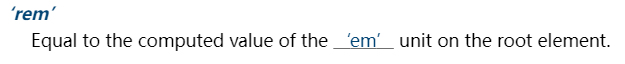

## 1. （掌握）`CSS` 常见单位详解

### `CSS` 中的单位

- 前面编写的 `CSS` 中，我们经常会使用 `px` 来表示一个长度（大小），比如 `width` 设置为 `100px`，`font-size` 设置为 `18px`；
- **`px` 是一个长度（`length`）单位，事实上 `CSS` 中还有非常多的长度单位；**
- 整体可以分成两类：
  - **绝对长度单位（`absolute length units`）**
  - **相对长度单位（`relative length units`）**

### `CSS` 中的绝对长度单位（`absolute length units`）

- 绝对长度单位[^1]：

  - 它们**与其它任何东西都没有关系**，通常**被认为总是相同的大小**；
  - 这些值中的大多数在**用于打印时**比用于屏幕输出时更有用，例如，我们通常不会在屏幕上使用 `cm`；
  - 唯一一个你经常使用的值，就是 `px`（像素）；

  | 绝对单位 | 名称         | 等价换算            |
  | -------- | ------------ | ------------------- |
  | `cm`     | 厘米         | 1cm = 96px/2.54     |
  | `mm`     | 毫米         | 1mm = 1/10th of 1cm |
  | `Q`      | 四分之一毫米 | 1Q = 1/40th of 1cm  |
  | `in`     | 英寸         | 1in = 2.54cm = 96px |
  | `pc`     | 十二点活字   | 1pc = 1/6th of 1in  |
  | `pt`     | 点           | 1pt = 1/72th of 1in |
  | `px`     | 像素         | 1px = 1/96th of 1in |

### `CSS` 中的相对长度单位（`relative length units`）

- 相对单位长度：

  - 相对单位长度**相对于其它的一些东西**；
  - 比如**父元素的字体大小**，或者**视图端口的大小**；
  - 使用相对单位的好处是，经过一些**仔细的规划**，你可以**使文本或其它元素的大小与页面上的其它内容**相对应；

- `em`[^3]：

  

- `rem`：

  

- `vw`/`vh`：

  

| 相对单位 | 相对于                                                       |
| -------- | ------------------------------------------------------------ |
| `em`     | 在 font-size 中使用是相对于父元素的字体大小，在其他属性中使用是相对于自身的字体大小，如 width |
| `ex`     | 字符“x”的高度                                                |
| `ch`     | 数字“0”的宽度                                                |
| `rem`    | 根元素的字体大小                                             |
| `lh`     | 元素的 line-height                                           |
| `vw`     | 视窗宽度（viewport width）的 1%                              |
| `vh`     | 视窗高度（viewport height）的 1%                             |
| `vmin`   | 视窗较小尺寸的 1%                                            |
| `vmax`   | 视图大尺寸的 1%                                              |

补充：一般来说，你会使用不同的单位来在屏幕上显示或在纸上打印。以下表格提供了推荐的用法[^2]：


## 2. （理解）深入理解 `pixel`、`DPR`、`PPI`

### 当我们聊 `pixel` 时，到底在聊些什么？

- 前面我们已经一直在使用 `px` 单位了，`px` 是 `pixel` 单词的缩写，翻译为像素；
- 那么像素到底是什么呢？
  - **像素是影像显示的基本单位**（比如屏幕上看到的画面、一幅图片）；
  - `pix` 是英语单词 `picture` 的常用简写，加上英语单词 `element`（元素），就得到 `pixel`；
  - ”像素“表示”画像元素“之意，有时亦被称为 `pel`（**p**icture **el**ement）；


### 像素的不同分类

- 那么 `100` 个 `pixel` 到底是多少呢？

  - 我们确实可以在屏幕上看到一个大小，但是这个大小代表的真实含义是什么呢？

  - 我们经常说的电脑的分辨率、手机的分辨率，它们和 `CSS` 当中的像素又是什么关系呢？

    

- 这就需要我们深入到不同的像素概念中，来理解 `CSS` 中的 `pixel` 到底代表什么含义。

- 像素概念常见的有三种：

  - **设备像素**（也称之为**物理像素**）；
  - **设备独立像素**（也称之为**逻辑像素**）；
  - **`CSS` 像素**；

### 物理像素和逻辑像素

- 设备像素，也叫物理像素；

  - 设备像素指的是显示器上的真实像素，每个像素的大小是屏幕固有的属性，屏幕出厂以后就不会改变了；
  - 我们在购买显示器或手机的时候，提到的设备分辨率就是设备像素的大小；
  - 比如 `iPhone X` 的分辨率 `1125 x 2436`，指的就是设备像素；

- 设备独立像素，也叫逻辑像素；

  - 如果面向开发者，我们使用设备像素显示一个 `100px` 的宽度，那么在不同屏幕上显示效果会是不同的；
  - 开发者针对不同的屏幕很难进行较好的适配，编写程序必须了解用户设备的分辨率来进行开发；
  - 所以在设备像素之上，操作系统为开发者进行抽象，提供了逻辑像素的概念；
  - 比如你购买了一台显示器，在操作系统上是以 `1920 x 1080` 设置的显示器分辨率，那么无论你购买的是 `2k`、`4k` 显示器，对于开发者来说，都是 `1920 x 1080` 的大小；

- `CSS` 像素；

  - `CSS` 中我们经常使用的单位也是 `pixel`，它在默认情况下等同于设备独立像素（也就是逻辑像素）；
  - 毕竟逻辑像素才是面向我们开发者的；

- 我们可以通过 `JavaScript` 中的 `screen.width` 和 `screen.height` 获取到电脑的逻辑分辨率：

  

### `DPR`、`PPI`

- `DPI`：`device pixel ratio`

  - `2010` 年，`iPhone 4` 问世，不仅仅带来了移动互联网，还带来了 `Retina` 屏幕；
  - `Retina` 屏幕翻译为**视网膜显示屏**，可以为用户带来**更好的显示**；
  - 在 `Retina` 屏幕中，**一个逻辑像素在长度上**对应**两个物理像素**，这个比例称之为**设备像素比**（`device pixel ratio`）；
  - 我们可以通过 `window.devicePixelRatio` 获取到当前屏幕上的 `DPR` 值；

  

  

- `PPI`（了解）：每英寸像素（英语：Pixels Per Inch，缩写：PPI）

  - 通常用来表示一个打印图像或者显示器上像素的密度；
  - 前面我们提过 `1` 英寸 = `2.54` 厘米，在工业领域被广泛应用；

## 3. （掌握）`CSS` 预处理器 `Less`、`Scss`

### `CSS` 编写的痛点

- `CSS` 作为一种**样式语言**，本身用来**给 `HTML` 元素添加样式**是没有问题的；
- 但是目前前端项目已经越来越复杂，不再是简简单单的几行 `CSS` 就可以搞定的，我们需要几千行甚至上万行的 `CSS` 才能完成页面的美化工作；
- 随着代码量的增加，必然会造成很多的编写不便：
  - 比如大量的重复代码，虽然可以**用类来勉强管理和抽取**，但是**使用起来依然不方便**；
  - 比如**无法定义变量（当然 `CSS` 目前已经支持）**，如果一个值（比如主题颜色）被修改，那么可能需要**修改大量代码，可维护性很差**；
  - 比如**没有专门的作用域和嵌套**，需要**定义大量的 `id/class` 来保证选择器的准确性**，避免样式混淆；
  - 等等一系列的问题；
- 所以有一种对 `CSS` 的称呼是“**面向命名编程**”；
- 社区为了解决 `CSS` 面临的大量问题，出现了一系列 **`CSS` 预处理器（`CSS preprocessor`）**：
  - `CSS` 预处理器是一个能让你通过**预处理器自己独有的语法**来生成 `CSS` 的程序；
  - 市面上有很多 `CSS` 预处理器可供选择，且绝大多数 `CSS` 预处理器会**增加一些原生 `CSS` 不具备的特性**；
  - 代码最终**会转化为 `CSS` 来运行**，因为**对于浏览器来说只识别 `CSS`**；

### 常见的 `CSS` 预处理器

常见的 `CSS` 预处理器有哪些呢？目前使用较多的有以下三种：

- `Sass/SCSS`：
  - `2007` 年诞生，最早也是最成熟的 `CSS` 预处理器，拥有 `ruby` 社区的支持，是属于 `Haml`（一种模板系统）的一部分；
  - 目前受 `LESS` 影响，已经进化到了全面兼容 `CSS` 的 `SCSS`；
- `Less`：
  - `2009` 年出现，受 `Sass` 的影响较大，但又**使用 `CSS` 的语法**，让大部分**开发者更容易上手**；
  - 比起 `Sass` 来，可编程功能不够，不过优点是使用方式简单、便捷，兼容 `CSS`，并且已经足够使用；
  - 另外反过来也影响了 `Sass` 演变到了 `SCSS` 时代；
  - 著名的 `Twitter Bootstrap` 就是采用 `LESS` 做底层语言的，也包括 `React` 的 `UI` 框架 `AntDesign`；
- `Stylus`：
  - `2010` 年产生，来自 `Node.js` 社区，主要用来给 `Node` 项目进行 `CSS` 预处理支持；
  - 语法偏向于 `Python`，使用率相对于 `Sass/Less` 少很多；

### 认识 `Less`

- 什么是 `Less` 呢？我们来看官方的介绍：

  - `It's CSS, with just a little more.`

    

- `Less`（`Leaner Style Sheets` 的缩写）是一门 `CSS` 扩展语言，并且兼容 `CSS`；

  - `Less` 增加了很多**相比于 `CSS` 更好用的特性**（比如**定义变量、混入、嵌套、计算**等等）；
  - **`Less` 最终需要被编译成 `CSS` 运行于浏览器中**（包括部署到服务器中）；

### 编写 `Less` 代码

我们可以编写如下的 `Less` 代码：

```less
@mainColor: #fa0112;

.box {
  color: @mainColor;

  .desc {
    font-size: 12px;
  }

  .info {
    font-size: 18px;
  }

  &:hover {
    background-color: #6f6;
  }
}
```

### `Less` 代码的编译

`Less` 代码如何被编译成 `CSS` 代码运行呢？

- 方式一：安装 `Node` 环境，通过 `npm` 包管理工具下载 `less` 工具，使用 `less` 工具对 `Less` 代码进行编译；

  - 因为我们目前还没有学习过 `Node`，更没有学习过 `npm` 工具；
  - 所以现阶段不推荐大家使用 `less` 本地工具来编译 `Less` 代码；
  - 后续我们学习了 `Webpack`，其实可以用 `Webpack` 自动完成这些操作的；

- 方式二：通过 `VS Code` 插件（如 `Easy LESS`）来编译成 `CSS`，或者在线编译；

  - https://lesscss.org/less-preview/

- 方式三：引入 `CDN` 的 `less` 编译代码，对 `Less` 进行实时的处理；

  

  ```html
  <script src="https://cdn.jsdelivr.net/npm/less@4"></script>
  ```

- 方式四：将编译 `less` 的 `js` 代码下载到本地，执行本地的 `js` 代码对 `less` 代码进行编译；

  - 方式三使用的是远程的 `CDN` 上的 `js` 代码，这意味着执行 `js` 代码前需要先将代码下载到本地，效率会有一点点低，所以我们可以手动将这份 `js` 代码下载到本地，直接使用本地的代码；

### `Less` 语法一：`Less` 兼容 `CSS`

- `Less` 是兼容 `CSS` 的

  - 所以我们可以在 `less` 文件中编写所有的 `CSS` 代码；
  - 只是将**扩展名 `.css` 改成了 `.less`** 而已；

  

### `Less` 语法二：变量（`Variables`）

- 在一个大型的网页项目中，我们 `CSS` 使用到的某几种属性值往往是特定的；

  - 比如我们使用到的主题颜色值，那么每次编写类似于 `#f3c258` 格式的语法；
  - 一方面是记忆不太方便，需要重新编写或者拷贝样式；
  - 另一方面如果有一天主题颜色改变，我们需要修改大量的代码；
  - 所以，我们可以将常见的颜色或字体等定义为变量来使用；

- 在 `Less` 中使用如下的格式来定义变量：

  `@变量名: 变量值;`

  

### `Less` 语法三：嵌套（`Nesting`）

- 在之前的项目中，当我们需要找到一个内层的元素时，往往需要嵌套很多层的选择器：

  

- `Less` 提供了选择器的嵌套：

  

- 特殊符号：`&`

  - 表示当前选择器的父级

### `Less` 语法四：运算（Operations）

- 在 `Less` 中，算术运算符 `+`、`-`、`*`、`/` 可以对任何数字、颜色或变量进行运算；

  - 算术运算符在加、减或比较之前会进行单位换算，计算的结果**以最左侧操作数的单位类型**为准；
  - 如果**单位换算无效或失去意义，则忽略单位**[^4]；

  

### `Less` 语法五：混入（`Mixins`）

- 在原来的 `CSS` 编写过程中，多个选择器中可能会有大量相同的代码

  - 我们希望可以**将这些代码进行抽取，抽取到一个独立的地方，任何选择器都可以进行复用**；
  - 在 `less` 中提供了**混入（`Mixins`）**来帮助我们完成这样的操作；

- **混入（`Mixin`）是一种将一组属性从一个规则集添加（混入）进另一个规则集中的方法**

  

- 注意：混入在没有参数的情况下，**小括号可以省略，但是不建议这样使用**[^5]；

- 混入也可以传入变量（暂时了解）

  

- `Less` 语法六：映射（`Maps`）

  

- 混入和映射（`Maps`）结合使用：混入也可以当做一个自定义函数来使用（暂时了解）

  

### `Less` 语法七：继承（`extend`）

- 和 `mixins` 作用类似，用于复用代码；

- 和 `mixins` 生成的 `CSS` 代码是不一样的，相比于 `mixins`，**继承的代码最终会转化成并集选择器**；

  - `mixins` 的效果是直接将代码插入到混入的位置：

    

  - 而 `extend` 的效果是将代码转化成并集选择器：

    

- 那么在开发中，我们到底用 `mixins` 还是 `extend` 呢？

  - 一般我们更多地会使用 `mixins`，原因如下：
    - `mixins` 更灵活，它还可以传参数；
    - `mixins` 的语法更加的简洁；
    - 使用 `mixins` 将代码直接插入选择器中，最终生成的 `CSS` 代码相较于使用 `extend` 生成的并集选择器代码来说，阅读性更强；

### `Less` 语法八：`Less` 支持的内置函数（`Functions`）

- `Less` 内置了多种函数用于转换颜色、处理字符串、算术运算等；
- 内置函数手册：https://lesscss.org/functions/


### `Less` 语法九：作用域（`Scope`）

- 在查找一个变量时，首先**在本地查找变量（variables）和混入（mixins）**；
- 如果**找不到，则从“父”作用域继承**；


### `Less` 语法十：注释（`Comments`）

在 `Less` 中，**块注释和行注释**都可以使用。

### `Less` 语法十一：导入（`Importing`）

- **导入的方式和 `CSS` 的用法**是一致的；
- 导入**一个 `.less` 文件，此文件中的所有变量就可以全部使用**了；
- 如果**导入的文件是 `.less` 扩展名**，则**可以将扩展名省略掉**；

### 认识 `Sass` 和 `SCSS`

- 事实上，最初 `Sass` 是 `Haml` 的一部分，`Haml` 是一种模板系统，由 `Ruby` 开发者设计和开发；

- 所以，`Sass` 的语法使用的是**类似于 `Ruby` 的语法，没有花括号，没有分号，具有严格的缩进**；

  

- 我们会发现它的语法和 `CSS` 区别很大，后来官方推出了全新的语法 `SCSS`，即 `Sassy CSS`，它完全兼容 `CSS`；

- 目前在前端学习 `Sass`，直接学习 `SCSS` 即可：

  - `SCSS` 的语法也包括**变量、嵌套、混入、函数、操作符、作用域**等；
  - 通常也包括**更为强大的控制语句、更灵活的函数、插值语法**等；
  - 大家可以根据之前学习的 `less` 语法来学习一些 `SCSS` 语法；
  - https://sass-lang.com/guide

- 目前大家掌握 `Less` 的使用即可；

## 4. （理解）移动端适配

- 移动互联网的快速发展，让人们已经越来越习惯于使用手机来完成大部分日常的事务；

  - 我们已经学习了大量 `HTML`、`CSS` 的前端开发知识，并且也进行了项目实战；
  - 这些知识也同样**适用于移动端开发**，但是如果想让一个页面**真正适配移动端，我们最好多了解一些移动端的知识**；

- 移动端开发目前主要包括三类：

  - **原生 `App` 开发**（`iOS`、`Android`、`RN`、`uniapp`、`Flutter` 等）；
  - **小程序开发**（原生小程序、`uniapp`、`Taro` 等）；
  - **`Web` 页面**（移动端的 `Web` 页面，可以使用浏览器或者 `webview` 浏览）；

- 因为目前移动端设备较多，所以我们需要对其进行一些适配；

  

- 这里有两个概念：

  - **自适应**：根据不同的设备屏幕大小来**自动调整尺寸、大小**；
  - **响应式**：会**随着屏幕的实时变动而自动调整，是一种自适应**；

## 5. （掌握）视口 `Viewport`

### 认识 `viewport`（视口）

- 前面我们已经简单了解过视口的概念了：

  - 在一个浏览器中，我们可以**看到的区域就是视口（`viewport`）**；
  - 我们说过 **`fixed` 就是相对于视口来进行定位**的；
  - 在 **`PC` 端的页面**中，我们是**不需要对视口进行区分**的，因为我们的**布局视口和视觉视口**是同一个；

- 但是在移动端，不太一样，你布局的视口和你可见的视口是不太一样的；

  - 这是因为**移动端的网页窗口往往比较小**，我们可能会**希望一个大的网页在移动端可以完整地显示**；
  - 所以在默认情况下，**移动端的布局视口是大于视觉视口**的；

- 所以在移动端，我们可以将视口划分为三种情况：

  - **布局视口**（`layout viewport`）
  - **视觉视口**（`visual viewport`）
  - **理想视口**（`ideal viewport`）

- 这些概念的区分，事实上来自 `ppk`，他也是对前端贡献比较大的一个人（特别是在移动端浏览器）

  - https://www.quirksmode.org/mobile/viewports2.html

  - https://www.quirksmode.org/mobile/metaviewport/

    

### 布局视口和视觉视口

- 布局视口（`layout viewport`）

  - 默认情况下，一个在 `PC` 端的网页在移动端会如何显示呢？
    - 第一，它会**按照宽度为 `980px` 来布局一个页面的盒子和内容**；
    - 第二，为了**使内容可以完整地显示在页面中，会对整个页面进行缩小**；
  - 我们相对于 `980px` 布局的这个视口，称之为**布局视口（`layout viewport`）**；
    - （大多数浏览器）布局视口的默认宽度是 **`980px`**；

  

- 视觉视口（`visual viewport`）

  - 如果默认情况下，我们按照 `980px` 显示内容，那么**右侧有一部分区域就会无法显示**，所以**手机端浏览器会默认对页面进行缩放以显示到用户的可见区域**中；
  - 那么**显示在可见区域的这个视口**，就是**视觉视口（`visual viewport`）**

  

- 在 `Chrome` 上按 `Shift` + 鼠标左键可以进行缩放；

### 理想视口（`ideal viewport`）

- 如果所有的网页都按照 `980px` 在移动端布局，那么最终页面都会被缩放显示

  - 事实上这种方式是不利于我们进行移动的开发的，我们希望的是设置 `100px`，那么显示的就是 `100px`；
  - 如何做到这一点呢？通过设置理想视口（`ideal viewport`）；

  

- 理想视口（`ideal viewport`）：

  - 默认情况下的 **`layout viewport` 并不适合我们进行布局**；
  - 我们可以**对 `layout viewport` 进行宽度和缩放的设置**，以满足**正常在一个移动端窗口的布局**；
  - 这个时候可以设置 **`meta` 中的 `viewport`**[^6]；

  | 值              | 可能的附加值                           | 描述                                                         |
  | --------------- | -------------------------------------- | ------------------------------------------------------------ |
  | `width`         | 一个正整数，或者字符串 `device-width`  | 定义 viewport 的宽度，如果值为正整数，则单位为像素。         |
  | `height`        | 一个正整数，或者字符串 `device-height` | 定义 viewport 的高度。未被任何浏览器使用。                   |
  | `initial-scale` | 一个 `0.0` 和 `10.0` 之间的正数        | 定义设备宽度（宽度和高度中更小的那个：如果是纵向屏幕，就是 `device-width`，如果是横向屏幕，就是 `device-height`）与 viewport 大小之间的缩放比例。 |
  | `maximum-scale` | 一个 `0.0` 和 `10.0` 之间的正数        | 定义缩放的最大值，必须大于等于 `minimum-scale`，否则表现将不可预测。**浏览器设置可以忽略此规则**；iOS 10 开始，Safari iOS 默认忽略此规则。 |
  | `minimum-scale` | 一个 `0.0` 和 `10.0` 之间的正数        | 定义缩放的最小值，必须小于等于 `maximum-scale`，否则表现将不可预测。**浏览器设置可以忽略此规则**；iOS 10 开始，Safari iOS 默认忽略此规则。 |
  | `user-scalable` | `yes` 或者 `no`                        | 默认为 `yes`，如果设置为 `no`，用户将无法缩放当前页面。**浏览器设置可以忽略此规则**；iOS 10 开始，Safari iOS 默认忽略此规则。 |


[^1]: https://developer.mozilla.org/zh-CN/docs/Learn/CSS/Building_blocks/Values_and_units
[^2]: https://www.w3.org/Style/Examples/007/units.en.html
[^3]: https://w3c.github.io/csswg-drafts/css-values/#em
[^4]: https://lesscss.org/#operations
[^5]: https://lesscss.org/features/#mixins-feature:~:text=Historically%2C%20the%20parentheses%20in%20a%20mixin%20call%20are%20optional%2C%20but%20optional%20parentheses%20are%20deprecated%20and%20will%20be%20required%20in%20a%20future%20release
[^6]: https://developer.mozilla.org/en-US/docs/Web/HTML/Viewport_meta_tag、https://developer.mozilla.org/en-US/docs/Web/HTML/Element/meta/name#standard_metadata_names_defined_in_other_specifications