## 1. （掌握）移动端适配方案

- 移动端的屏幕尺寸通常是非常繁多的，很多时候我们希望在不同的屏幕尺寸上显示不同的大小；
  - 比如我们设置一个 `100x100` 的盒子；
    - 在 `375px` 的屏幕上显示是 `100x100`；
    - 在 `320px` 的屏幕上显示是 `90+x90+`；
    - 在 `414px` 的屏幕上显示是 `100+x100+`；
  - 其它尺寸也是类似，比如 `padding`、`margin`、`border`、`left`，甚至是 `font-size` 等等；
- 这个时候，我们可能可以想到一些方案来处理尺寸：
  - **方案一：百分比设置；**
    - 因为不同属性的百分比值，相对的可能是不同的参照物，所以百分比往往很难统一；
      - 比如，`width` 属性设置百分比值时，相对的是包含块的宽度；
      - 而 `font-size` 属性设置百分比值时，相对的是父元素的 `font-size`；
      - 还有一些属性的百分比值相对的对象可能有违直觉，比如 `margin-top`、`margin-bottom`、`padding-top`、`padding-bottom`，这些属性设置百分比值时，相对的是包含块的宽度，而不是包含块的高度；
    - 所以百分比在移动端适配中使用得是非常少的；
  - **方案二：`rem` 单位 + 动态 `<html>` 的 `font-size`；**
  - **方案三：`vw` 单位；**
  - **方案四：`flex` 的弹性布局；**

### `rem` + 动态 `<html>` 的 `font-size` 方案

- `rem` 单位是相对于 `<html>` 元素的 `font-size` 来设置的，那么如果我们需要在不同的屏幕下有不同的尺寸，可以动态地修改 `<html>` 的 `font-size` 值；

- 比如以下案例：

  1. 设置一个**盒子的宽度是 `2rem`**；
  2. 设置**不同的屏幕上 `<html>` 不同的 `font-size`**；

  | 屏幕尺寸 | `<html>` 的 `font-size` | 盒子设置的宽度 | 盒子最终的宽度 |
  | -------- | ----------------------- | -------------- | -------------- |
  | 375px    | 37.5px                  | 1rem           | 37.5px         |
  | 320px    | 32px                    | 1rem           | 32px           |
  | 414px    | 41.4px                  | 1rem           | 41.4px         |

- 这样，开发中我们只需要考虑两个问题：

  1. 针对**不同的屏幕，给 `<html>` 设置不同的 `font-size`**；
  2. 将**原来要设置的尺寸，转换成以 `rem` 为单位的值**；

#### `rem` 的 `font-size` 尺寸

- 方案一：媒体查询

  - 可以通过媒体查询来设置不同尺寸范围内的屏幕 `<html>` 的 `font-size` 尺寸；
  - 缺点：
    1. 需要**针对不同的屏幕编写大量的媒体查询**；
    2. 如果**动态改变屏幕尺寸，`<html>` 的 `font-size` 不会实时地进行更新**；

  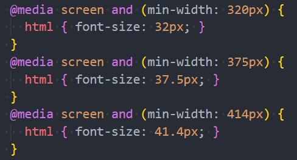

- 方案二：编写 `js` 代码

  - 如果希望实时改变屏幕尺寸时，`font-size` 也能实时更改，可以通过 `js` 代码来实现；
  - 实现方式：
    1. 根据 `<html>` 的宽度计算出 **`font-size` 的大小**，并**设置到 `<html>` 上**；
    2. 监听**页面的实时改变**，当页面尺寸发生改变时**重新计算 `font-size` 的大小并设置到 `<html>` 上**；

  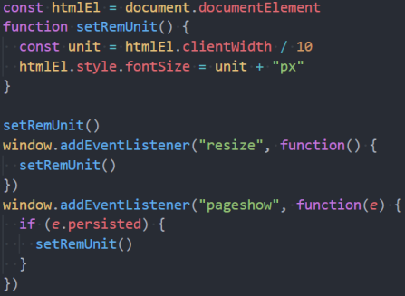

- 方案三：`lib-flexible` 库

  - 事实上，**`lib-flexible` 库做的事情是相同的**，你也可以直接引入它；

#### `rem` 的单位换算

- 方案一：手动换算

  - 比如有一个在宽 `375px` 的屏幕上，宽高均为 `100px` 的盒子；
  - 我们需要将 `100px` 转化成对应的 `rem` 值；
  - 如果 `<html>` 的 `font-size` 为 `375px/10=37.5px`，则 `100/37.5=2.6667`，即 `2.6667rem`，其它换算也是相同的计算方法；

- 方案二：`less` 混入/`SCSS` 函数

  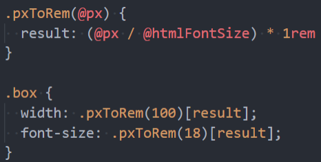

- 方案三：`postcss-pxtorem` 插件（后续学习）

  - 目前在前端的工程化开发中，我们可以借助于 `webpack` 的工具来完成自动的转化；

- 方案四：`VS Code` 插件

  - 使用 `px to rem` 的插件，在编写时自动转换；

    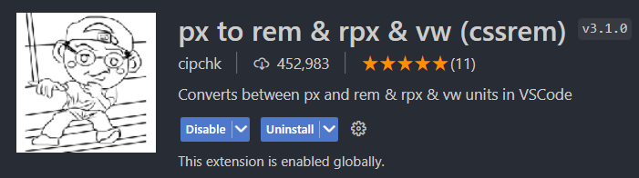

    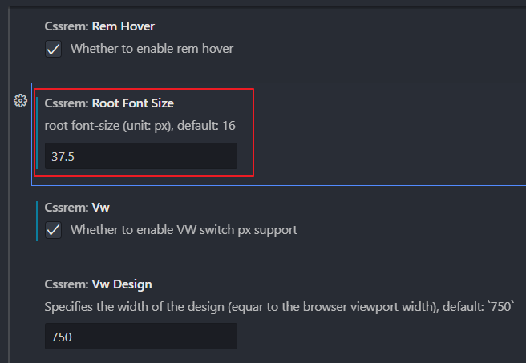

#### 考拉海购设计稿

### `vw` 方案

- 在 `lib-flexible` 库[^1]的 `README.md` 文档中已经有这样一句话：

  

- 所以它更推荐使用 `viewport` 的两个单位 `vw`、`vh`；

- `VW` 的兼容性如何呢？

  - 我们可以去 `caniuse` 网站上查阅：

    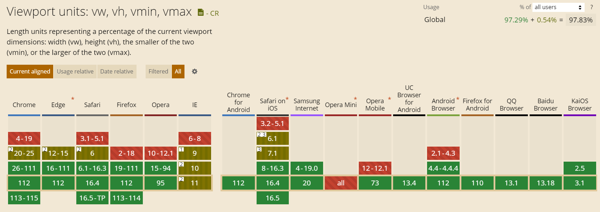

  - 可以看到，`vw` 的兼容性已经可以了。

- 当然，`vw` 也存在一个弊端，由于 `vw` 是相对于视口的宽度进行计算的，那么当我们需要指定一个最大值时，就不好实现了（比如要求视口宽度超过 `800px` 后相应的属性值就不再继续变大，这时如果使用 `vw`，则依然会继续变大），而如果是使用 `rem`，那么我们可以通过媒体查询，在视口宽度达到某个范围时，给相应的属性设置规定的最大值（比如 `html { font-size: 100px; }`）即可实现，这也是 `rem` 相比于 `vw` 的一个优势。

- 如果我们不需要设置最大值，就可以选择不使用 `rem`，直接使用 `vw` 即可。

### `vw` 和 `rem` 的对比

- `rem` 事实上是作为一种过渡的方案，它利用的也是 `vw` 的思想；
  - 前面不管是我们**自己编写的 `js`，还是 `lib-flexible` 的源码**；
  - 都是将 **`1rem` 等同于设计稿的 `1/10`**，再利用 **`1rem` 计算相对于整个屏幕尺寸的大小**；
  - 那么你会发现，**`1vw` 刚好等于屏幕的 `1/100`**；
  - 而且**相对于 `rem` 更有优势**；
- **`vw` 相对于 `rem` 的优势**：
  1. 不需要去计算 `<html>` 的 `font-size` 大小，也不需要给 `<html>` 设置这样一个 `font-size`；
  2. 因为不需要设置 `<html>` 的 `font-size`，也就不需要再去给 `body` 设置一个 `font-size`，以防止其它元素继承 `<html>` 的 `font-size`；
  3. 因为不依赖 `font-size` 的尺寸，所以不用担心由于某些原因 `<html>` 的 `font-size` 值被篡改，导致页面尺寸混乱；
  4. `vw` 相比于 `rem` 更加语义化，`1vw` 刚好是 `1/100` 的 `viewport` 的大小；
  5. 具备 `rem` 所有的优点（比如屏幕尺寸改变时，元素的大小也可以自动改变）；
- 目前使用 `vw`，我们只面临一个问题，将尺寸换算成 `vw` 的单位即可；
- 所以，目前相比于 `rem`，更**推荐大家使用 `vw`**（但是理解 `rem` 依然很重要）；

### `vw` 的单位换算

- 方案一：手动换算

  - 比如有一个在宽 `375px` 的屏幕上，宽高均为 `100px` 的盒子；
  - 我们需要将 `100px` 转化成对应的 `vw` 值；
  - 因为视口宽 `375px`，所以 `1vw = 3.75px`，则 `100/3.75=26.667`，即 `26.667vw`，其它换算也是相同的计算方法；

- 方案二：`less` 混入/`SCSS` 函数

  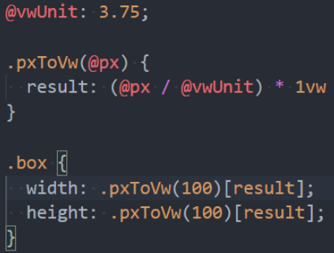

- 方案三：`postcss-px-to-viewport-8-plugin`（后续学习）

  - 和 `rem` 一样，在前端的工程化开发中，我们可以借助于 `webpack` 的工具来完成自动的转化；

- 方案四：`VS Code` 插件

  - `px to vw` 的插件，在编写时自动转化；

    

    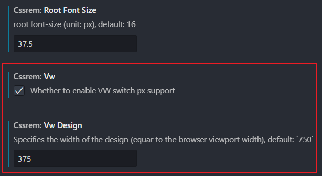

## 2. （暂时了解）认识 `grid` 布局

- 目前对于界面布局，我们已经学习了多种方式：定位、浮动、`flex` 布局；

- `flex` 布局相对于前面的布局来说更加的强大，并且目前对于我们的需求都是可以很好的完成；

  - 但是 `flex` 是一个一维的布局方案（`one-dimensional layout`）；
  - 它主要的布局是在主轴（`main axis`）上进行操作，当然也提供了一些交叉轴（cross axis）属性；

- `CSS` 为了进一步增强自己的布局能力，提供了 `grid` 布局；

  - `CSS Grid Layout`（又名“Grid”或“CSS Grid”）是一种基于二维的布局系统（`two-dimensional layout`）；
  - 它更加强大，同时也更加复杂；

- 目前公司生产环境的项目基本都是使用 `flex` 布局为主，因为 `grid` 布局兼容性比 `flex` 布局差一些，所以 `grid` 布局暂时作为了解即可。

  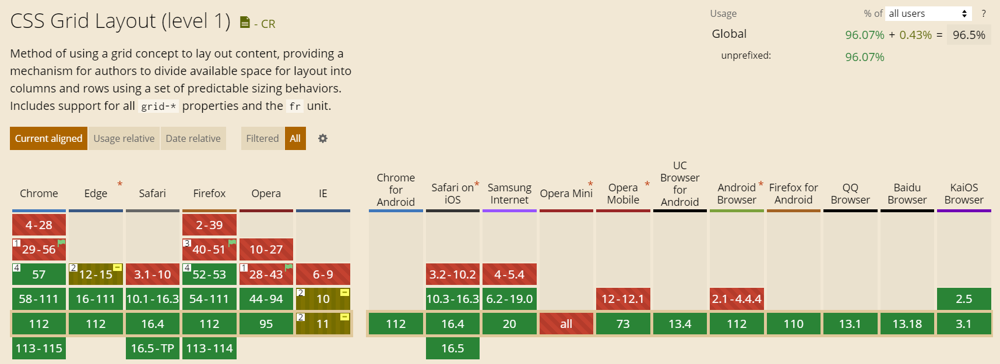

  可以看到，`Grid` 布局的兼容性相对来说还可以，但是这是 `Grid` 布局中最基本的一些属性的兼容性，而有一些属性的兼容性其实是比较差的。

### `grid` 布局中的重要概念

- `Grid Container`

  - 元素设置了 `display` 为 `grid` 的盒子；

- `Grid Item`，单元格称为 `grid cell`

  - `grid container` 的直接子项（必须是直接子代）

- `Grid Line`

  - 构成网格结构的分割线；

  - 它们可以是垂直的（“列网格线”）或水平的（“行网格线”）；

    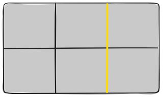

- `Grid Track`

  - 两条相邻网格线之间的空间；

  - 可以看成是网格的行或列；

    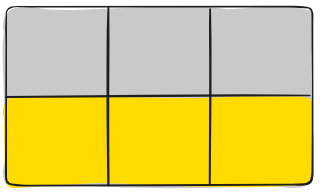

- `Grid Area`

  - 由四条网格线包围的总空间；

  - 一个网格区域可以由任意数量的网格单元组成；

    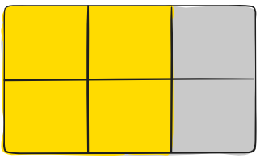

### `grid` 布局常见属性

- `grid container` 常见属性：
  - `display`
  - `grid-template-columns`
  - `grid-template-rows`
  - `grid-template-areas`
    - `grid-template`
  - `grid-column-gap`
  - `grid-row-gap`
    - `grid-gap`
  - `justify-items`
  - `align-items`
    - `place-items`
  - `justify-content`
  - `align-content`
    - `place-content`
  - `grid-auto-columns`
  - `grid-auto-rows`
    - `grid-auto-flow`
  - `grid`
- `grid item` 常见属性：
  - `grid-column-start`
  - `grid-column-end`
  - `grid-row-start`
  - `grid-row-end`
  - `grid-column`
  - `grid-row`
  - `grid-area`
  - `justify-self`
  - `align-self`
  - `place-self`
- https://css-tricks.com/snippets/css/complete-guide-grid/

[^1]: https://github.com/amfe/lib-flexible
