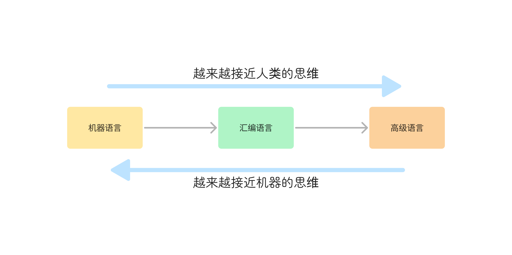

## 1. （理解）认识编程语言

### 前端的三大核心

- 前端开发最主要需要掌握的是三个知识点：`HTML`、`CSS`、`JavaScript`。

### 计算机语言

- 前面我们已经学习了 `HTML` 和 `CSS` 很多相关的知识；

  - 我们提到过，`HTML` 是一种**标记语言**，`CSS` 是一种**样式语言**；

- 它们本身都属于**计算机语言**，因为它们都在和计算机沟通交流；

  - 生活中的两个人想要沟通，必然是通过某一种语言（比如中文、英文）；
  - 而计算机语言就是我们**人和计算机进行交流**要学习的语言；

- 网页三大组成部分的另一个核心就是 `JavaScript`，`JavaScript` 也必然是一种计算机语言；

  

  

### 编程语言

- 事实上，对于 `JavaScript` 还有更加精确的说法：一种编程语言；
- 我们先搞清楚计算机语言和编程语言的关系和区别：
  - 计算机语言：**计算机语言**（`computer language`）指用于人与计算机之间通讯的语言，是人与计算机之间传递信息的介质。但其概念比通用的**编程语言**要更广泛，例如，**`HTML` 是标记语言**，也是**计算机语言**，但**并不是编程语言**；
  - 编程语言：**编程语言**（`programming language`）是用来**定义计算机程序的形式语言**。它是一种被**标准化**的交流技巧，用来**向计算机发出指令**，一种能够让**程序员**准确地**定义计算机所需要使用数据**的**计算机语言**，并精确地定义**在不同情况下所应当采取的行动**。
- 很抽象，我们来说明一下编程语言的特点：
  - **数据和数据结构**
  - **指令和流程控制**
  - **引用机制和重用机制**
  - **设计哲学**
- 这样的区分是否有意义呢？
  - 我们这里不做讨论，只是把最专业的定义告诉大家；

### 常见的编程语言

## 2. （了解）编程语言的发展历史

### 机器语言

- 阶段一：机器语言

  - 计算机的存储单元只有 **`0` 和 `1` 两种状态**，因此一串代码要让计算机“读懂”，这串代码只能由数字 `0` 和 `1` 组成；

  - 像这种由数字 `0` 和 `1` 按照一定的规律组成的代码就叫**机器码**，也叫**二进制编码**；

  - 一定长度的机器码组成了**机器指令**，**用这些机器指令所编写的程序就称为机器语言**；

    

    

- 优点：

  - 代码能**被计算机直接识别，不需要经过编译解析**；
  - 直接对硬件产生作用，**程序的执行效率非常高**；

- 缺点：

  - 程序**全是 `0` 和 `1` 组成的指令代码，可读性差，还容易出错**；
  - **不易编写**（目前没有人这样开发）；

### 汇编语言

- 阶段二：汇编语言

  - **为了解决机器语言的缺陷**，人们发明了另外一种语言——**汇编语言**；

  - 这种语言用**符号**来**代替冗长的、难以记忆的 `0`、`1` 代码**；

    - 比如 `mov/push` 指令，经过**汇编器**，汇编代码再进一步转成机器码；

      

- 优点：

  - 像机器语言一样，**可以直接访问，控制计算机的各种硬件设备**；
  - **占用内存少，执行速度快**；

- 缺点：

  - **不同的机器有不同的汇编语言语法和编译器，代码缺乏可移植性**；
    - 也就是说，一个程序只能在一种机器上运行，换到其它机器上可能就不运行；
  - **符号非常多，难记**；
    - 即使是完成简单的功能也需要大量的汇编语言代码，很容易产生 `BUG`，难以调试；

- 应用场景：

  - 操作系统内核、驱动程序、单片机程序；

### 高级语言

- 阶段三：高级语言

  - 最好的编程语言应该是什么？**自然语言**；
  - 而高级语言，就是**接近自然语言**，更符合**人类的思维方式**；
  - 跟和人交流的方式很相似，但大多数编程语言都是国外发明的，因此更接近**英文的交流方式**；

  

  

- 优点：

  - **简单、易用、易于理解**，语法结构类似于普通英文；
  - **远离对硬件的直接操作**，使得**一般人经过学习之后都可以编程**，而不用熟悉硬件知识；
  - 一个程序还可以在不同的机器上运行，具有**可移植性**；

- 缺点：

  - 程序**不能直接被计算机识别**，需要**经编译器翻译成二进制指令**后，才能运行到计算机上；
  - 种类繁多：`JavaScript`、`C`、`C++`、`C#`、`Java`、`Objective-C`、`Python` 等；

### 机器语言和高级语言

在前端，我们需要学好的只有一门高级语言：`JavaScript`

## 3. （掌握）`JavaScript` 的历史

### 认识 `JavaScript`

- 维基百科对 `JavaScript` 的定义：
  - `JavaScript`（通常缩写为 `JS`）是一种高级的、解释型的编程语言；
  - `JavaScript` 是一门基于原型、头等函数的语言，是一门多范式的语言，它支持面向对象程序设计、指令式编程和函数式编程；
- 从上面的定义中，我们会发现很多关键词：
  - **解释型语言？原型？头等函数？多范式？面向对象程序设计？指令式编程？函数式编程？**
  - 这些改变往往会让人不知所云，需要我们**完全掌握 `JavaScript` 后再回过头来看**，每一个词语都描述得非常准确；

- 我们现在只需要知道，通俗的说法：
  - `JavaScript` 是**一门高级编程语言**，是**前端开发的重要组成部分**；

- `HTML` 和 `CSS` 也是前端开发的重要组成部分，而 `JavaScript` 是前端开发的灵魂；

### `JavaScript` 的历史

`JavaScript` 的历史是相当有趣和丰富多彩的。

- `1994` 年，网景公司（`Netscape`）发布了 `Navigator` 浏览器 `0.9` 版；

  - 这是历史上**第一个比较成熟的网络浏览器**，轰动一时；
  - 但是，这个版本的浏览器只能用来浏览，不具备与访问者互动的能力；
  - 网景公司急需一种网页脚本语言，使得浏览器可以与网页互动；

  

  

- 网景公司当时想要选择一种语言来嵌入到浏览器中：

  - **采用现有的语言**，比如 `Perl`、`Python`、`Tcl`、`Scheme` 等等，允许它们直接嵌入网页；
  - `1995` 年，网景公司招募了**程序员 `Brendan Eich`**，目标是把 **`Scheme` 语言**嵌入到 `Netscape Navigator` 浏览器中；

- 就在这时，发生了另外一件大事：`1995` 年 `Sun` 公司将 `Oak` 语言改名为 `Java`，正式向市场推出；

  - `Java` 推出之后立马在市场上引起了轰动，`Java` 当初有一个口号：*write once, run anywhere*；
  - 网景公司动了心，决定**与 `Sun` 公司结成联盟**，希望**将 `Java` 嵌入到网页**中来运行；
  - `Brendan Eich` 本人非常热衷于 `Scheme`，但是管理层那个时候有点倾向于 `Java`，希望可以简化 `Java` 来适应网页脚本的需求；

  

- 但是 `Brendan Eich` 对 `Java` 并不感兴趣，为了应付上级的命令，他用 `10` 天时间设计出来了 `JavaScript`；

  - 最初这门语言的名字是 **`Mocha`**（摩卡）；
  - 在 `Navigator2.0 beta` 版本更名为 **`LiveScript`**；
  - 在 `Navigator2.0 beta 3` 版本正式重命名为 **`JavaScript`**，当时是为了给这门语言搭上 `Java` 这个热词；

- 当然 `10` 天设计出来语言足够说明 `Brendan Eich` 是天才，但是这门语言当时更像是一个多钟语言的大杂烩；

  - 借鉴 **`C` 语言**的基本语法；
  - 借鉴 **`Java` 语言**的数据类型和内存管理；
  - 借鉴 **`Scheme` 语言**，将函数提升到"第一等公民"（`first class`）的地位；
  - 借鉴 **`Self` 语言**，使用基于原型（`prototype`）的继承机制；

- `Brendan Eich` 曾经这样描述过 `JavaScript`：

  - 与其说我爱 `JavaScript`，不如说我恨它，它是 `C` 语言和 `Self` 语言一夜情的产物；
  - 十八世纪英国文学家约翰逊博士说得好：**'它的优秀之处并非原创，它的原创之处并不优秀。'**
  - (the part that is good is not original, and the part that is original is not good.)

- 微软公司于 `1995` 年首次推出 `Internet Explorer`，从而引发了与 `Netscape` 的浏览器大战；

  - 微软对 `Netscape Navigator` 解释器进行了逆向工程，创建了 **`JScript`**，以与处于市场领导地位的网景产品同台竞争；
  - 这个时候对于开发者来说是一场噩耗，因为需要针对不同的浏览器进行不同的适配；

- `1996` 年 `11` 月，网景正式向 `ECMA`（欧洲计算机制造商协会）提交语言标准；

  - `1997` 年 `6` 月，`ECMA` 以 `JavaScript` 语言为基础制定了 `ECMAScript` 标准规范 `ECMA-262`；
  - `ECMA-262` 是一份标准，定义了 **`ECMAScript`**；
  - **`JavaScript`** 成为了 **`ECMAScript`** 最著名的实现之一；
  - 除此之外，**`ActionScript`** 和 **`JScript`** 也都是 `ECMAScript` 规范的实现语言；

- 所以说，`ECMAScript` 是一个规范，而 `JavaScript` 是这一规范的一种实现。

  

简单总结一下就是，在最早的时候，网景公司发布了自己的浏览器，它想要一种网页脚本语言，使得浏览器可以与网页互动，在选择某一种语言嵌入到浏览器中时，网景公司招聘了 `Brendan Eich`，目标是把 **`Scheme` 语言**嵌入到 `Netscape Navigator` 浏览器中。但那个时候，由于 `Java` 非常火，`Java` 一经推出就引起了整个市场的轰动，所以管理层就想要和 `Sun` 公司合作，希望将 `Java` 嵌入到网页中来运行。但 `Brendan Eich` 对 `Java` 并不感兴趣，为了应付上级的命令，他用 `10` 天时间设计出来了 `JavaScript`，并且管理层也认可了 `JavaScript`，不过最开始它并不叫这个名字，为了蹭一下 `Java` 的热度，网景公司就把它命名为了 `JavaScript`。但由于 `JavaScript` 设计的时候时间过于紧迫，很多问题没有考虑进去，存在很多语言上的设计缺陷，也包括它借鉴了很多其它的语言，所以我们在 `JavaScript` 中可以看到很多其它语言的影子。那个时候，微软公司为了和网景公司竞争，逆向工程了 `Netscape Navigator` 浏览器的解释器，发明了 `JScript`。所以当时就存在两种语言来编写网页的脚本，没有统一的语言标准，所以在 `1996` 年 `11` 月，网景公司向 `ECMA` 这个组织提交了语言标准，`1997` 年 `6` 月，`ECMA` 以 `JavaScript` 语言为基础制定了 `ECMAScript` 语言规范 `ECMA-262`，`JavaScript` 就是这一规范的一种实现。

## 4. （掌握）`JavaScript` 的组成

- `ECMAScript` 是 `JavaScript` 的标准，描述了该语言的语法和基本对象；

  - `JavaScript` 是 `ECMAScript` 的语言层面的实现；
  - 因为除了语言规范之外，**`JavaScript` 还需要对页面和浏览器进行各种操作**；
  - 除了基本实现之外，还包括 **`DOM` 操作和 `BOM` 操作**；

- 目前我们会针对性地学习 `ECMAScript`，也就是语言层面的内容，特别是 `ES5` 之前的语法；

  

  

## 5. （掌握）`JavaScript` 的运行引擎

### `JavaScript` 由谁来运行

- 我们经常会说：不同的浏览器由不同的内核组成
  - **`Gecko`**：早期被 `Netscape` 和 `Mozilla Firefox` 浏览器使用；
  - **`Trident`**：微软开发，被 `IE4 ~ IE11` 浏览器使用，但是 `Edge` 浏览器已经转向 `Blink`；
  - **`WebKit`**：苹果基于 `KHTML` 开发、开源的，用于 `Safari`，`Google Chrome` 之前也在使用；
  - **`Blink`**：是 `Webkit` 的一个分支，`Google` 开发，目前应用于 `Google Chrome`、`Edge`、`Opera` 等；
  - 等等
- 事实上，我们经常说的浏览器内核指的是浏览器的排版引擎：
  - 排版引擎（`layout engine`），也称为浏览器引擎（`browser engine`）、页面渲染引擎（`rendering engine`）或样板引擎。
- 那么，`JavaScript` 代码由谁来执行呢？
  - `JavaScript` 引擎

### 认识 `JavaScript` 引擎

- 为什么需要 `JavaScript` 引擎呢？
  - 我们前面说过，**高级的编程语言**都是需要**最终转成机器指令来执行**的；
  - 事实上我们编写的 `JavaScript` 无论你交给**浏览器或者 `Node` 执行**，最后都是需要被 **`CPU` 执行**的；
  - 但是 `CPU` 只认识自己的指令集，实际上是机器语言，才能被 `CPU` 所执行；
  - 所以我们需要 **`JavaScript` 引擎**帮助我们**将 `JavaScript` 代码翻译成 `CPU` 指令**来执行；
- 比较常见的 `JavaScript` 引擎有哪些呢？
  - `SpiderMonkey`：第一款 `JavaScript` 引擎，由 `Brendan Eich` 开发（也就是 `JavaScript` 的作者）；
  - `Chakra`：微软开发，用于 `IE` 浏览器；
  - `JavaScriptCore`：`Webkit` 中的 `JavaScript` 引擎，`Apple` 公司开发；
  - `V8`：`Google` 开发的强大的 `JavaScript` 引擎，也帮助 `Chrome` 从众多浏览器中脱颖而出；
  - 等等

### 浏览器内核和 `JS` 引擎的关系

- 这里我们以 `WebKit` 为例，`WebKit` 事实上由两部分组成：

  - **`WebCore`**：负责 `HTML` 解析、布局、渲染等相关的工作；

  - **`JavaScriptCore`**：负责解析、执行 `JavaScript` 代码；

    

- 小程序中也是这样的划分：

  - 在小程序中编写的 `JavaScript` 代码就是被 `JSCore` 执行的；

    

## 6. （掌握）`JavaScript` 的应用场景

### 著名的 `Atwood` 定律

- **`Stack Overflow` 的创立者之一**的 `Jeff Atwood` 在 `2007` 年提出了著名的 **`Atwood` 定律**：

  - Any application that can be written in JavaScript, will eventually be written in JavaScript.
  - 任何可以使用 `JavaScript` 来实现的应用最终都会使用 `JavaScript` 实现；

  

### `JavaScript` 的应用越来越广泛

