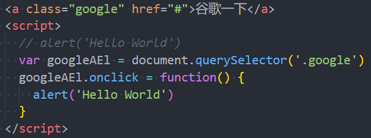

## 1. （掌握）`JavaScript` 的编写方式

- 位置一：`HTML` 代码行内（不推荐）

  

- 位置二：`script` 标签中

  

- 位置三：外部的 `script` 文件中
  - 需要通过 **`<script>` 元素**的 **`src` 属性**来**引入 `JavaScript` 文件**

  

  

## 2. （掌握）`noscript` 元素的使用

- 如果运行的浏览器不支持 `JavaScript`，那么我们如何给用户更好的提示呢？

  - 针对早期浏览器不支持 `JavaScript` 的问题，需要一个页面**优雅降级的处理方案**；

  - 最终，**`<noscript>` 元素**出现，被用于给不支持 `JavaScript` 或者关闭了 `JavaScript` 功能的浏览器提供替代内容；

    

- 下面的情况下，浏览器将显示包含在 `<noscript>` 中的内容：

  - 浏览器不支持脚本；

  - 浏览器对脚本的支持被关闭；

    


## 3. （掌握）`JavaScript` 编写的注意事项

- 注意事项一：`<script>` 元素**不能写成单标签**
  - 在引用外部 `js` 文件时，`script` 标签中不可以写 `JavaScript` 代码（写了会被覆盖），并且 `script` 标签不能写成单标签[^1]（如：`<script src="index.js" />`）；
  
- 注意事项二：省略 `type` 属性

  - 在以前的代码中，`<script>` 元素中会使用 `type="text/javascript"`；
  - 现在可以不写这个代码了，因为 **`JavaScript` 是所有现代浏览器以及 `HTML5` 中的默认脚本语言**；

- 注意事项三：加载顺序

  - `JavaScript` 是**作为 `HTML` 文档的一部分**的，它默认遵循 **`HTML` 文档的加载顺序**，即**自上而下的加载顺序**；

  - 推荐**将 `JavaScript` 代码（`script` 元素）编写在 `body` 元素中的最后，作为 `body` 元素的最后一个子元素**；

    - 因为在 `JavaScript` 中，我们经常需要去操作上面已经加载过的元素，如果 `JavaScript` 的代码写在了 `HTML` 元素代码的上面，那么在执行 `JavaScript` 代码时，元素还没有进行加载，就无法在 `JavaScript` 中对其进行操作；

    - ```html
      <body>
        <!-- 其它 html 元素 -->
        
        <script>
        	// JavaScript 代码推荐编写位置
        </script>  
      </body>
      ```

    - 之前我们在学习 `Less` 时，将 `js` 代码在 `head` 中引入了，那是为了用它解析上面导入的 `less` 代码，上面的 `less` 已经加载完了，下面就可以用 `js` 进行解析了，所以我们可以直接将 `js` 代码放在 `head` 中：

      

      但是，正常的常见的 `JavaScript` 代码都是放到 `<body>` 元素中的最后位置的。

- 注意事项四：`JavaScript` 代码严格区分大小写

  - **`HTML` 元素和 `CSS` 属性不区分大小写**，但是 **`JavaScript` 中严格区分大小写**；

- 后续补充：`<script>` 元素还有 `defer`、`async` 属性，我们后续再详细讲解；

## 4. （掌握）`JavaScript` 的交互方式

- `JavaScript` 有如下和用户交互的手段：

  - 最常见的是通过 `console.log`，目前大家掌握这个即可：

    | 交互方法                                       | 方法说明                                      | 效果查看                                            |
    | ---------------------------------------------- | --------------------------------------------- | --------------------------------------------------- |
    | `alert`                                        | 接受一个参数                                  | 弹窗查看                                            |
    | <span style="color: red;">`console.log`</span> | <span style="color: red;">接受多个参数</span> | <span style="color: red;">在浏览器控制台查看</span> |
    | `document.write`                               | 接受多个字符串                                | 在浏览器页面查看                                    |
    | `prompt`                                       | 接受一个参数                                  | 在浏览器接受用户输入                                |

### `Chrome` 的调试工具

- 前面我们利用了 `Chrome` 的调试工具来调试了 `HTML`、`CSS`，它也可以帮助我们调试 `JavaScript`；

- 当我们在 `JavaScript` 中通过 `console.log` 函数显示一些内容时，可以使用 `Chrome` 浏览器来查看：

  

- 补充：

  1. 如果在代码中**出现了错误**，那么可以在浏览器的 **`Console` 面板中显示错误**；
  2. `Console` 中有个 **`>` 标志，它表示控制台的命令行**
     - 在命令行中我们可以直接编写 `JavaScript` 代码，按下 `Enter` 键会执行代码；
     - 如果希望编写多行代码，可以按下 `Shift + Enter` 键来进行换行编写；
  3. 后续我们还会学习**如何通过 `debug` 方式来调试、查看代码的执行过程**；

## 5. （掌握）`JavaScript` 的语句和分号

- **语句**是**向浏览器发出的指令**，通常表示一个**操作或行为（`Action`）**；

  - 语句的英文是 `Statement`；

  - 比如我们前面编写的每一行代码都是一条语句，用于告知浏览器一条执行的命令；

    

- 通常每条语句的后面我们会添加一个**分号（semicolon）**，表示语句的结束：

  - 分号的英文是 **`semicolon`**；
  - 当存在换行符（`line break`）时，在**大多数情况下可以省略分号**；
  - `JavaScript` **将换行符理解成“隐式”的分号**；
  - 这也被称为**自动插入分号**（an automatic semicolon）；

- 推荐：

  - 前期在对 `JavaScript` 语法**不熟悉**的情况下**推荐添加分号**；
  - 后期对 `JavaScript` 语法**熟练**了，**随意**；

## 6. （掌握）`JavaScript` 的注释方式

- 在 `HTML`、`CSS` 中我们都添加过注释，`JavaScript` 中也可以添加注释；

- `JavaScript` 中的注释主要分为三种：

  - **单行注释**
  - **多行注释**
  - **文档注释**（`VS Code` 中需要在单独的 `JavaScript` 文件中编写才有效）

  > 还有一种区域注释[^2]：
  >
  > ```js
  > //#region 这块区域的代码说明
  > 
  > //#endregion
  > ```

- 注意：`JavaScript` 也不支持（多行、文档）注释的嵌套

## 7. `VS Code` 的插件和配置

- 推荐一个个人常用的 `VS Code` 的插件：

  - `ES7+ React/Redux/React-Native snippets`
  - 这个插件是在 `react` 开发中会使用到的，但是我经常用到它里面的打印语句（输入 `clg` 生成 `console.log()` 语句）；

- 再推荐一个插件：

  - `Bracket Pair Colorizer 2`，但是该插件已经不再推荐使用了；

  - 因为 `VS Code` 已经内置了该功能，我们可以直接通过 `VS Code` 的配置来达到插件的效果；

  - 在 `VS Code` 的配置文件（`settings.json`）中添加如下两行代码即可开启该功能：

    ```json
        "editor.bracketPairColorization.enabled": true,
        "editor.guides.bracketPairs":"active"
    ```


[^1]: https://developer.mozilla.org/en-US/docs/Web/HTML/Element/script#:~:text=Tag%20omission,tag%20are%20mandatory.
[^2]: https://code.visualstudio.com/docs/editor/codebasics#_folding:~:text=TypeScript/JavaScript,//%23endregion
