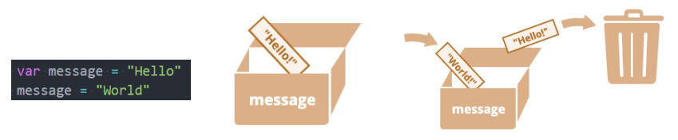

## 1. （掌握）认识 `JavaScript` 变量

### 程序中变化的数据

- 在我们平时的开发中，使用最多的并不是固定的数据，而是会变化的数据，比如：
  - 购物车商品的数量、价格的计算；
  - 一首歌曲播放的时间、进度条、歌词的展示；
  - 微信聊天中的消息条数、发送时间、语音的长度、头像、名字；
  - 游戏中技能的冷却时间、血量、蓝量、`buff` 时间、金币数量；
  - 等等

### 记录变化的数据——变量

- 如果希望记录某一个之后会变化的数据，在 `JavaScript` 中我们可以定义一个变量：

  - 一个**变量**，就是一个用于**存放数据的容器**；
  - 这个数据可能是一个用于计算的**数字**，或者是一个句子中的**字符串**，或者**其它任意的数据**；
  - 变量的独特之处在于**它存放的数据是可以改变的**；

- 我们可以把变量想象成一个盒子，盒子里面装着我们的数据，我们需要给盒子标记一个名字：

  - 例如，**变量 `message`** 可以被想象成一个**标有“message”的盒子**，盒子里面的**值为 “Hello!”**；
  - 并且，这个盒子的值，我们想改变多少次，就可以改变多少次；

  

## 2. （掌握）变量的定义、规范等

### 变量的命名格式

- 在 `JavaScript` 中如何命名一个变量呢？包含两部分：

  - 变量的声明：在 `JavaScript` 中声明一个变量使用 `var` 关键字（variable 单词的缩写）（后续学习 `ES6` 时还有 `let`、`const` 声明方式）；
  - 变量的赋值：使用 `=` 给变量进行赋值；

  ```javascript
  var name = "wy";
  ```

- 这个过程也可以分开操作：

  ```javascript
  var name;
  name = "wy";
  ```

- 可以同时声明多个变量：

  ```js
  var name, age, height
  name = "wy"
  age = 18
  height = 1.88
  console.log(name, age, height)
  ```

  多个变量也可以在声明的同时进行赋值：

  ```js
  var name = "wy", age = 18, height = 1.88
  console.log(name, age, height)
  ```

### 变量的命名规范

- 变量的命名规则（必须遵守）：
  1. **第一个字符**必须是**字母**或**下划线（`_`）**或**美元符号（`$`）**；
  2. 其它字符可以是**字母、下划线、美元符号或数字**；
  3. **不能使用关键字和保留字命名**：
     - 什么是关键字，什么是保留字？
       - 关键字：表示这个东西对于 `JavaScript` 引擎在解析程序的时候，它有特殊的含义；
       - 保留字：表示目前还没有成为关键字，但将来有一天可能会变成关键字的词，比如 `interface`；
     - https://developer.mozilla.org/zh-CN/docs/web/javascript/reference/lexical_grammar
  4. 变量**严格区分大小写**
  
- 变量的命名规范（建议遵守）：
  - 多个单词使用**驼峰标识**；
    - 如 `userName`、`currentTime` 等等
    
      
    
  - **赋值 = 两边都加上一个空格**；
    - 如 `var name = "wy";`
    
  - **一条语句结束后加上分号**（也有很多人的习惯是不加）；
  
  - 变量名应该做到**见名知意**；

### 使用变量的注意事项

- 注意一：如果一个变量未声明（declaration）就直接使用，那么会报错；

  

  - 但也有一个例外，如果使用的变量名是全局对象 `window` 上的属性名，则不会报错，比如 `name`：

    

- 注意二：如果一个变量有声明，但是没有赋值，那么默认值是 `undefined`；

  

- 注意三：如果没有使用 `var` 声明变量也可以，但是不推荐（事实上会被添加到 `window` 对象上）

  

## 3. （掌握）数据类型和 `typeof`

### `JavaScript` 的数据类型

- `JavaScript` 中的**值**都具有特定的类型；
  - 例如，字符串或数字；
  - 我们可以将**值赋值给一个变量**，那么这个变量就**具备了特定的类型**；
  - 一个变量可以在**前一刻是个字符串**，**下一刻就存储一个数字**；
  - 允许这种操作的编程语言，例如 `JavaScript`，被称为**“动态类型”（dynamically typed）**的编程语言；
- 在 `JavaScript` 中有 `8` 种基本的数据类型（`7` 种原始类型和 `1` 种复杂类型）
  - **`Number`**
  - **`String`**
  - **`Boolean`**
  - **`Undefined`**
  - **`Null`**
  - **`Object`**
  - `Symbol`（后续了解）
  - `BigInt`（后续了解）


### `typeof` 操作符

- 因为 `ECMAScript` 的类型系统是**松散的**，所以需要一种手段来**确定任意变量的数据类型**；
  - `typeof` 操作符就是为此而生的；
- 对一个值使用 `typeof` 操作符会返回下列字符串之一：
  - "number"：表示值为数值；
  - "string"：表示值为字符串；
  - "boolean"：表示值为布尔值；
  - "undefined"：表示值未定义；
  - "object"：表示值为对象（而不是函数）或 `null`；
  - "function"：表示值为函数；
  - "symbol"：表示值为符号；
  - "bigint"：表示值为任意精度整数；
- `typeof()` 的用法：
  - 你可能还会遇到另一种语法：**`typeof(x)`**，它**与 `typeof x` 相同**；
  - `typeof` 是一个**操作符，并非是一个函数，() 只是将后续的内容当做一个整体而已**；

