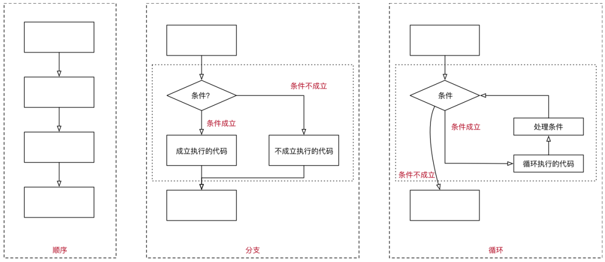
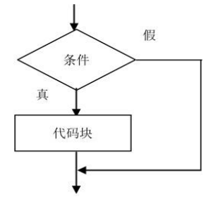

## 1. （掌握）if 分支语句

### 程序的执行顺序

- 在程序开发中，程序有三种不同的执行方式：
  - 顺序：**从上向下**，顺序执行代码；
  - 分支：根据**条件判断**，决定执行代码的**分支**；
  - 循环：让**特定代码重复**执行；



### 代码块的理解

- **代码块**是多行执行代码的集合，通过一个**花括号 {}** 放到了一起；

  - 在开发中，一行代码很难完成某一个特定的功能，我们就会将这些代码放到一个**代码块**中；

    ```js
    {
      var name = 'wy'
      var message = 'my name is ' + name
      console.log(message)
    }
    ```

- 在 JavaScript 中，我们可以通过流程控制语句来决定如何执行一个代码块：

  - 通常会**通过一些关键字来告知 js 引擎**，代码要如何被执行；
  - 比如**分支语句、循环语句对应的关键字**等；

### 生活中的条件判断

- 现实生活中有很多情况，需要我们**根据条件来做一些决定**：

  - 小明妈妈说：如果小明**考了 100 分**，就**去游乐场**（判断分数等于 100 分）；
  - 网吧**禁止未成年人入内**（判断年龄大于等于 18 岁，是否带身份证，是否带钱；
  - 开发中，**登录成功**：账号和密码正确或扫描二维码成功；

  

### 什么是分支结构

- 程序是生活的一种抽象，只是我们用代码表示了出来
  - 在开发中，我们经常需要根据**一定的条件**，来决定代码的**执行方向**；
  - 如果**条件满足**，才能**做某件事情**；
  - 如果**条件不满足**，就**做另外一件事情**；
- 分支结构
  - 分支结构的代码就是让我们**根据条件**来**决定代码的执行**；
  - 分支结构的语句被称为**判断结构**或者**选择结构**；
  - 几乎**所有的编程语言都有分支结构**（C、C++、OC、JavaScript 等等）；
- JavaScript 中常见的分支结构有：
  - **if** 分支结构
  - **switch** 分支结构

### if 分支语句

- if 分支结构有 3 种：
  - 单分支结构：
    - **if...**
  - 多分支结构：
    - **if...else...**
    - **if...else if...else...**

### 单分支结构

- 单分支语句：if

  - `if(...)` 语句计算括号里的条件表达式，如果计算结果是 `true`，就会执行对应的代码块。

    ```js
    // 如果条件成立，那么执行代码块
    if (条件判断) {
      // 执行代码块
    }
    ```

    

- 案例一：如果小明考试超过 90 分，就去游乐场

  - “如果”相当于 JavaScript 中的关键字 if；
  - 分数超过 90 分是一个条件（可以使用  > 符号）；

- 案例二：5 元/斤的苹果，如果购买超过 5 斤，那么立减 8 元

  - 注意：这里我们让用户输入购买的重量，计算出最后的价格并且弹出结果；

### if 语句的细节补充

- 补充一：如果代码块中只有一行代码，那么 {} 可以省略；
- 补充二：`if(...)` 语句会计算圆括号内的表达式，并将计算结果转换为布尔型（Boolean）；
  - 转换规则和 Boolean 函数的规则一致；
  - **数字 0、空字符串 ""、null、undefined 和 NaN** 都会被转换成 **false**；
    - 因为它们被称为“**假值（falsy）**”；
  - **其它值**被转换为 **true**，所以它们被称为“**真值（truthy）**”；

