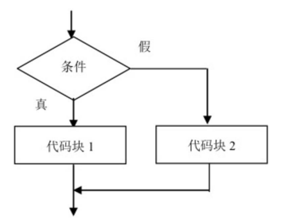
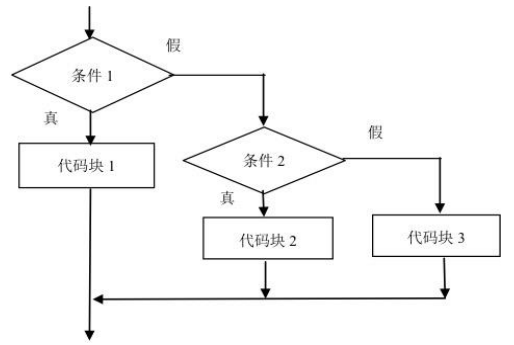

## 1. （掌握）if...else... 语句

- 多分支语句：if...else...

  - if 语句有时会**包含一个可选的“else”块**；

  - 如果判断条件不成立，就会执行它内部的代码；

    ```js
    // 如果条件成立，那么执行代码块
    // 如果条件不成立，那么执行另一段代码块
    if (条件判断) {
      // 条件成立，执行的代码块
    } else {
      // 条件不成立，执行的代码块
    }
    ```

    

- 案例一：如果分数超过 90 分，就可以去游乐场，否则去上补习班

  - 满足条件时，做某些事情；
  - 不满足（else），去做另外一些事情；

- 案例二：m = 20，n = 30，比较两个数的大小，获取较大的那个数字；

## 2. （掌握）if...else if...else... 语句

- 多分支结构：if...else if...else...

  - 有时候我们需要判断多个条件；

  - 我们可以通过使用 else if 子句实现；

    ```js
    if (条件 1) {
      // 代码块 1
    } else if (条件 2) {
      // 代码块 2
    } else if (条件 3) {
      // 代码块 3
    } else {
      // 代码块 4（所有条件不成立时执行）
    }
    ```

    

- 案例：分数评级：

  - 考试分数大于 90：优秀；
  - 大于 80 小于等于 90，良好；
  - 大于 60 小于等于 80，合格；
  - 小于 60 分：不及格；

## 3. （掌握）三元运算符

- 有时我们需要根据一个条件去赋值一个变量；

  - 比如**比较数字大小**的时候，**获取较大的数字**；
  - 这个时候 **if...else... 语句就会显得有点臃肿**，有没有更加简洁的方法呢？

- 条件运算符：'?'

  - 这个运算符通过**问号 ?** 表示；
  - 有时它被称为**三元运算符**，被称为“三元”是因为该运算符中有**三个操作数（运算元）**；
  - 实际上它是 JavaScript 中唯一一个有这么多操作数的运算符；

- 使用格式如下：

  ```js
  var result = condition ? value1 : value2;
  ```

  计算条件（condition）的结果，如果结果为真，则返回 value1，否则返回 value2；

- 案例一：m = 20，n = 30，比较两个数字的大小，获取较大的那个数字；

- 案例二：判断一个人是否是成年人了；

## 4. （掌握）逻辑运算符

### 认识逻辑运算符

- 逻辑运算符，主要有三个：

  - **&&（与）、||（或）、!（非）**
  - 它可以将**多个表达式或者值**放到一起来获取到一个**最终的结果**；

  | 运算符 | 运算规则           | 范例            | 结果  |
  | ------ | ------------------ | --------------- | ----- |
  | &&     | 与：同时为真才为真 | false && true   | false |
  | \|\|   | 或：一个为真就为真 | false \|\| true | true  |
  | !      | 非：取反           | !false          | true  |

- 有了逻辑运算符，我们就可以在判断语句中编写多个条件；

### 逻辑或的本质

- ||（或）两个竖线符号表示“或”运算符（也称为短路或）：

  ```js
  result = a || b;
  ```

  - **从左到右**依次计算操作数；
  - 处理**每一个操作数时**，都将其转化为**布尔值（Boolean）**；
  - 如果结果是 **true**，就**停止计算，返回这个操作数的计算值**；
  - 如果**所有的操作数都被计算过**（也就是，转换结果都是 false），则**返回最后一个操作数的计算值**；

- 注意：返回的值是操作数的**计算值**，不会转换为 Boolean 类型；

- 换句话说，一个或运算 || 的链，将返回第一个真值，如果不存在真值，就返回该链的最后一个值；

  ```js
  var showName = name || nickname || defaultName
  ```

### 逻辑与的本质

- &&（与）两个 & 符号表示“与”运算符（也称为短路与）：

  ```js
  result = value1 && value2 && value3
  ```

  - **从左到右**依次计算操作数；
  - 在处理**每一个操作数**时，都将其转化为**布尔值（Boolean）**；
  - 如果结果是 **false**，就**停止计算**，并**返回这个操作数的计算值（一般不需要获取到这个值）**；
  - 如果**所有的操作数都被计算过**（例如都是真值），则**返回最后一个操作数**；
  
- 换句话说，**与运算**返回第一个假值，如果没有假值就返回最后一个值；

  ```js
  info && info.friend && info.friend.running()
  ```

### 逻辑非

- 逻辑非运算符接受一个参数，并按如下运算：
  - 步骤一：将**操作数转化为布尔类型**：true/false；
  - 步骤二：**返回相反的值**；
- 两个非运算 `!!` 有时候用来将某个值转化为布尔类型；
  - 也就是，第一个**非运算将该值转化为布尔类型并取反，第二个非运算再次取反**；
  - 最后我们就得到了**一个任意值到布尔值的转化**；

## 5. （掌握）switch 语句

- switch 是分支结构的一种语句：

  - 它是通过判断**表达式（或者变量）的结果**是否等于 **case 语句的常量**，来执行相应的分支体的；

- 与 if 语句不同的是，switch 语句**只能做值的相等判断（使用全等运算符 ===）**，而 **if 语句可以做值的范围判断**；

- switch 的语法：

  - switch 语句有至少一个 case 代码块和一个可选的 default 代码块；

    ```js
    switch(变量) {
      case 常量1:
        // 语句一
        break
      case 常量2:
        // 语句二
        break
      default:
        // 语句三
    }
    ```

### switch 语句的补充

- case 穿透问题：
  - 一条 case 语句结束后，**会自动执行下一个 case 语句**；
  - 这种现象被称为 **case 穿透**；
- break 关键字
  - 通过在每个 case 的代码块后添加 **break 关键字**来解决这个问题；
- 注意事项：这里的相等是严格相等；
  - 被比较的值必须是相同的类型才能进行匹配；
- 案例练习：播放模式（单曲循环、循环播放、随机播放）
