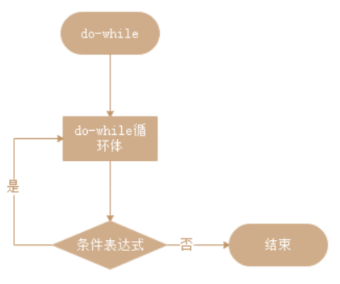
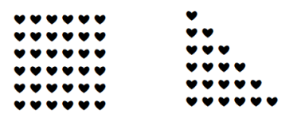
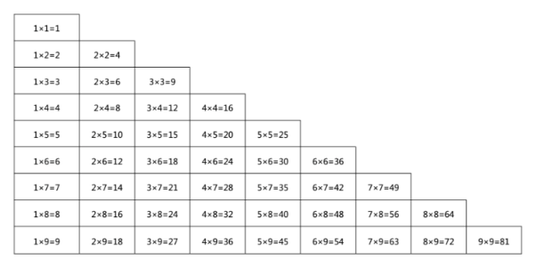

## 1. （掌握）认识循环语句

- 在开发中我们经常需要做各种各样的循环操作：
  - 比如把**一个列表中的商品、歌曲、视频**依次输出进行展示；
  - 比如对**一个列表进行累加计算**；
  - 比如**运行相同的代码将数字 1 到 10 逐个输出**；
- 循环是一种重复运行同一代码的方法；
  - 如果是对某一个列表进行循环操作，我们通常也会称之为**遍历（traversal）或者迭代（iteration）**
- 在 JavaScript 中支持三种循环方式：
  - **while 循环**
  - **do...while 循环**
  - **for 循环**

## 2. （掌握）while 循环

- while 循环的语法如下：

  - 当**条件成立**时，**执行代码块**；
  - 当**条件不成立**时，**跳出代码块**；

  ```js
  while (循环条件) {
  	// 循环代码块
  }
  ```

  

- 如果条件一直成立（为 true），那么会产生**死循环**

  - 这个时候必须通过**关闭页面来停止死循环**；
  - 开发中一定**要避免死循环**的产生；

### while 循环的练习

- while 循环的练习题目：
  - 练习一：打印 10 次 Hello World
  - 练习二：打印 0~99 的数字
  - 练习三：计算 0~99 的数字和
  - 练习四：计算 0~99 所有奇数的和
  - 练习五：计算 0~99 所有偶数的和


## 3. （了解）do...while 循环

- do...while 循环和 while 循环非常像，二者经常可以相互替代**（不常用）**

  - 但是 do...while 的特点是不管条件成不成立，do 循环体都会**先执行一次**；

  ```js
  do {
    // 循环代码块
  } while (循环条件)
  ```

  

- 通常我们更倾向于使用 while 循环。

## 4. （掌握）for 循环（循环嵌套）

- for 循环更加复杂，但它是**最常使用的循环形式**。

  ```js
  for (begin; condition; step) {
    // 循环代码块
  }
  ```

  ```js
  for (var i = 0; i < 3; i++) {
  	alert(i)
  }
  ```

  | 语句段         | 例子      | 执行过程                                         |
  | -------------- | --------- | ------------------------------------------------ |
  | begin          | var i = 0 | 进入循环时执行一次。                             |
  | condition      | i < 3     | 在每次循环迭代之前检查，如果为 false，停止循环。 |
  | body（循环体） | alert(i)  | 条件为真时，重复运行。                           |
  | step           | i++       | 在每次循环体迭代后执行。                         |

- begin 执行一次，然后进行迭代：每次检查 condition 后，执行 body 和 step；

### for 循环的练习

- 利用 for 循环实现之前的案例：
  - 练习一：打印 10 次 Hello World
  - 练习二：打印 0~99 的数字
  - 练习三：计算 0~99 的数字和
  - 练习四：计算 0~99 所有奇数的和
  - 练习五：计算 0~99 所有偶数的和

### for 循环的嵌套

- 什么是循环的嵌套呢？（日常开发使用不算多，在一些算法中比较常见）

  - 在开发中，某些情况下一次循环是无法达到目的的，我们需要循环中嵌套循环；

- 我们通过 for 循环的嵌套来完成一些案例：

  - 案例一：在屏幕上显示包含很多 ❤ 的矩形；

  - 案例二：在屏幕上显示一个三角的 ❤ 的图像；

    

  - 案例三：在屏幕上显示一个九九乘法表；

    

## 5. （掌握）循环控制（break、continue）

- 循环的跳转（控制）：
  - 在执行循环的过程中，**遇到某一个条件**时，我们可能想要**做一些事情**；
  - 比如**循环体不再执行（即使没有执行完），跳出循环**；
  - 比如**本次循环循环体不再执行，执行下一次的循环体**；
- 有两个关键字可以控制循环的跳转：
  - **break**：直接跳出循环，循环结束；
    - break 某一条件满足时，退出循环，不再执行后续重复的代码；
  - **continue**：跳过本次循环体，执行下一次循环体；
    - continue 指令式 break 的“轻量版”。
    - continue 某一条件满足时，不执行后续重复的代码。

## 6. （掌握）综合案例练习

- 猜数字游戏规则：
  - 电脑**随机生成一个 0~99 之间的数字**；
  - 玩家有 **7 次猜测的机会**；
  - 玩家**猜测一个数字**，输入到程序中；
  - 电脑根据输入的数字打印：**猜大了/猜小了/猜对了**的情况；
  - **猜对了**，那么**游戏结束，显示恭喜您**；
  - **7 次机会用完**，打印：**您的次数用完了**o(╥﹏╥)o；

### 循环的总结

- 我们学习了三种循环：
  - **while**：每次迭代之前都要检查条件；
  - **do...while**：每次迭代后都要检查条件；
  - **for(;;)**：每次迭代之前都要检查条件，可以使用其它设置；
- break/continue 可以对循环进行控制。
