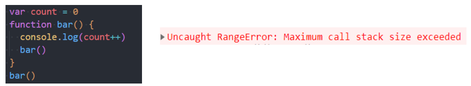
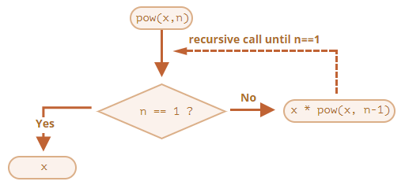

## 1. （掌握）认识 JavaScript 函数

### 程序中的 foo、bar、baz

- 在学习编程的过程中，你可能会经常看到 foo、bar、baz 这些名词：
  - 它们通常被用来作为**函数、变量、文件**的名词；
  - 目前已经变成了计算机**编程术语**的一部分；
  - 但是它们本身**并没有特别的用途和意义**；
  - 常被称之为**“伪变量”**（metasyntactic variable）；
- 那么它们有什么由来吗？
  - 事实上，foo、bar 这些名词最早从什么时候、什么地方流行起来的一直是有争论的；
  - 一种说法是通过 Digital（迪吉多，数字设备公司，成立于 1957 年的美国电脑公司）的手册说明流行起来的；
  - 一种说法是说源自于电子学中的反转 foo 信号；
  - 也有一种说法是 foo 因为出现在了一个漫画中，漫画中 foo 代表“好运”，与中文的福读音类似；
- 总之，foo、bar、baz 已经是编程领域非常常用的名词；
  - 我个人也比较习惯在定义一些**变量、函数名称**时使用这些词汇，大家做一个了解。

### 认识函数

- 什么是函数呢？
- 目前，我们已经接触过几个函数了：
  - alert() 函数
    - 浏览器弹出一个弹窗
  - prompt() 函数
    - 在浏览器弹窗中接收用户的输入
  - console.log() 函数
    - 在控制台输出内容
  - String()/Number()/Boolean() 函数等
- 当我们在谈函数时，我们到底谈些什么？
  - **函数**其实就是**某段代码的封装**，这段代码帮助我们完成某一个功能；
  - 默认情况下，JavaScript 引擎或者浏览器会给我们**提供一些已经实现好的函数**；
  - 我们也可以**编写属于自己的函数**；

### 函数的使用步骤

- 函数的使用包含两个步骤：
  - **声明函数**：封装独立的功能；
  - **调用函数**：享受封装的成果；
- **声明函数**，在 JavaScript 中也可以称为**定义函数**：
  - 声明函数的过程是**对某些功能的封装过程**；
  - 在之后的开发中，我们会**根据自己的需求定义很多自己的函数**；
- 调用函数，也可以称为函数调用：
  - **调用函数**是让已存在的函数为我们所用；
  - 这些函数**可以是刚刚自己封装好的某个功能函数**；
  - 当然，我们**也可以去使用默认提供的或者其他三方库定义好的函数**；
- 函数的作用：
  - 在开发程序时，**使用函数可以提高编写的效率以及代码的重用**；

## 2. （掌握）函数的声明和调用

### 声明和调用函数

- 声明函数使用 function 关键字，这种写法称为函数的定义：

  ```js
  function 函数名() {
    函数封装的代码
    ...
  }
  ```

- 注意：

  - **函数名的命名规则**和前面**变量名的命名规则**是**相同**的；
  - 函数要尽量做到**见名知意**（并且函数通常是一些行为（action），所以使用动词会更多一些）；
  - 函数**定义完后里面的代码是不会执行**的，**函数必须调用才会执行**；

- 调用函数通过 `函数名()` 即可，比如：`test()`。

- 函数的练习：

  - 练习一：定义一个函数，打印一个人的个人信息；
  - 练习二：定义一个函数，函数中计算 10 和 20 的和，并且打印出结果；

### 函数的参数

- 函数的参数：

  - **函数**，把**具有独立功能的代码块**组织为一个小模块，在需要的时候**调用**；

  - **函数的参数**，增加函数的**通用性**，针对**相同的数据处理逻辑**，能够**适应更多的数据**

    - 在函数**内部**，把参数当做**变量**使用，进行需要的数据处理；
    - 函数调用时，按照函数定义的**参数顺序**，把**希望在函数内部处理的数据，通过参数**传递；

    

- 形参和实参

  - 形参（参数 parameter）：**定义**函数时，小括号中的参数，是用来接收参数用的，在函数内部作为变量使用；
  - 实参（参数 argument）：**调用**函数时，小括号中的参数，是用来把数据**传递到函数内部**用的；

### 有参数的函数练习

- 一个参数的函数练习:
  - 练习一：传入一个名字，对这个人 say Hello；
  - 练习二：为某个朋友唱生日快乐歌；
- 两个参数的函数练习：
  - 练习三：传入两个数字，计算两个数字的和，并且打印结果；

### 函数的返回值

- 回想我们之前使用的 prompt() 函数，函数可以接收参数，并且会返回用户的输入：

- 所以说，函数不仅仅可以有参数，也可以有**返回值**：

  - 使用 **return 关键字**来返回结果；
  - 一旦在函数中**执行 return 操作**，那么**当前函数会终止**；
  - 如果函数中**没有使用 return 语句**，那么函数有**默认的返回值：undefined**；
  - 如果函数使用 return 语句，但是 return 后面没有任何值，那么**函数的返回值也是：undefined**；

  

### 函数的练习

- 练习一：实现一个加法计算器；
- 练习二：定义一个函数，传入宽高，计算矩形区域的面积；
- 练习三：定义一个函数，传入半径，计算圆形的面积；
- 练习四：定义一个函数，传入 n（n 为正整数），计算 1~n 数字的和；
- 实战函数练习：
  - 传入一个数字，可以根据数字转化成显示为“亿”、“万”为单位的文本。


### arguments 对象

- 事实上，在函数内部有一个特别的对象：arguments 对象；
  - 默认情况下，**arguments 对象**是所有（非箭头）函数中都可用的**局部变量**；
  - 该对象中存放着**调用者传入的所有的参数，从 0 位置开始，依次存放**；
  - arguments 变量的类型是**一个 object 类型（array-like），不是一个数组**，但是和数组的用法看起来很相似；
  - 如果**调用者传入的参数多于函数接收的参数**，可以**通过 arguments 去获取所有的参数**；
- 因为这里涉及到数组、对象等概念，目前大家了解有这么一个参数即可；
  - 后续我们会对其专门进行学习，**包括和数组之间的转化**；

## 3. （掌握）函数的递归调用

### 函数中调用函数

- 在开发中，函数内部是可以调用另外一个函数的。

  ```js
  function foo() {
    console.log('foo 函数被调用了')
  }
  
  function bar() {
    foo()
  }
  
  bar()
  ```

- 既然函数中可以调用另外一个函数，那么函数是否可以调用自己呢？

  - 当然是可以的；

  - 但是函数调用自己**必须有结束条件，否则会产生无限调用，造成报错**；

    

### 函数的递归

- 事实上，函数调用自己还有一个专业的名词，叫做递归（recursion）

- 在语言学方面，我们也可以描述为递归：

  - 从前有座山，山上有座庙，庙里有个老和尚，正在给小和尚讲故事呢！故事是什么呢？
  - 递归读取上面的话；

- 递归是一种重要的编程思想：

  - 将一个复杂的任务，转化为可以重复执行的相同任务；

- 案例：实现一个自己的幂函数 pow（pow 单词可以表示指数的意思）：

  - 我们可以先用 for 循环来实现：

    ```js
    function pow(x, n) {
      var result = 1
      for (var i = 0; i < n; i++) {
        result *= x
      }
      return result
    }
    ```
    

### 递归的实现思路

- 另一种实现思路是递归实现：

  - 这是因为在数学上：**x^n^ = x * x^n-1^**

  - 那么对于函数的调用，我们也可以进行划分：

    ```js
    function pow(x, n) {
      return x * pow(x, n - 1)
    }
    ```

  - 这里需要有一个结束的条件，就是当 n 已经等于 1 的时候就不需要拆分了；

- 所以最终的代码如下：

  ```js
  function pow(x, n) {
    if (n === 1) return x
    return x * pow(x, n - 1)
  }
  ```

  

- 递归的代码第一次接触会有点绕，对于初次接触函数的同学，可以先跳过去；

  - 后续我们讲解数据结构与算法时，会使用递归来解决一些算法问题；

## 4. （掌握）局部和全局变量

- 在 JavaScript（ES5 及之前）中没有块级作用域的概念，但是函数可以定义自己的作用域。
  - **作用域（Scope）**表示**一些标识符的作用有效范围**（所以也有被翻译为有效范围的）；
  - **函数的作用域**表示**在函数内部定义的变量，只有在函数内部可以被访问到**；
- 外部变量和局部变量的概念：
  - 定义在函数内部的变量，被称之为**局部变量（local variables）**；
  - 定义在函数外部的变量，被称之为**外部变量（outer variables）**；
- 什么是全局变量？
  - 在函数之外声明的变量（在 script 中声明的），称之为**全局变量**；
  - 全局变量**在任何函数中都是可见**的；
  - 通过 **var 声明的全局变量会在 window 对象**上添加对应的属性（了解）；
- 在函数中，访问变量的顺序是什么呢？
  - 优先访问自己函数中的变量，没有找到时，在外部中访问。
- 关于块级作用域、作用域链、变量提升、AO、VO、GO 等概念我们后续将进行学习；

## 5. （掌握）函数表达式的写法

- 在 JavaScript 中，函数并不是一种神奇的语法结构，而是**一种特殊的值**；

  - 前面定义函数的方式，我们称之为**函数的声明（Function Declaration）**；

- 还有另外一种写法是函数表达式（Function Expressions）：

  ```js
  var foo = function() {
    console.log('foo 函数')
  }
  ```

- 注意，function 关键字后面没有函数名

  - 函数表达式**允许省略函数名**

- 无论函数是如何创建的，函数都是一个值（这个值的类型是一个对象，对象的概念后面会讲到）

- 在 JavaScript 开发中，我们可以将函数作为**头等公民**。

### 函数声明 vs 函数表达式

- 在开发中，函数的声明和函数表达式有什么区别，以及如何选择呢？
- 首先，语法不同：
  - 函数声明：在主代码流中声明为单独的语句的函数；
  - 函数表达式：在一个表达式中或另一个语法结构中创建的函数；
- 其次，JavaScript 创建函数的时机是不同的：
  - 函数表达式是在代码**执行到达时**被创建，并且**仅从那一刻起可用**；
  - 而对于**函数声明，在其被定义之前，它就可以被调用**；
    - 这是**内部算法的缘故**；
    - 当 JavaScript **准备**运行脚本时，首先会在脚本中**寻找全局函数声明，并创建这些函数**；
- 开发中如何选择呢？
  - 当我们需要**声明一个函数**时，**首先考虑函数声明语法**；
  - 它能够为组织代码提供**更多的灵活性**，因为我们可以**在声明这些函数之前调用这些函数**。

## 6. （掌握）函数作为头等公民

- 头等函数（first-class function，第一级函数）是指在程序设计语言中，函数被当作头等公民；
  - 这意味着，函数可以**像其它变量一样进行操作和传递**，函数可以**作为别的函数的参数**、**函数的返回值**、**赋值给变量**或**存储在数据结构中**；
  - 有人主张也应包括支持匿名函数（待会儿会讲到）；
  
- 通常我们对函数作为头等公民的编程方式，称之为函数式编程；

  - JavaScript 就是符合函数式编程的语言，这个也是 JavaScript 的一大特点；

- 比如：函数可以在变量和变量之间进行赋值；

  ```js
  function foo() {
    console.log('foo 函数执行')
  }
  
  var bar = foo
  bar()
  ```

### 回调函数（callback function）

- 既然函数可以作为一个值相互赋值，那么也可以传递给另外一个函数：

  ```js
  function foo(fn) {
    fn()
  }
  
  function bar() {
    console.log('bar 函数被调用')
  }
  
  foo(bar)
  ```

- 将一个函数（fn1）作为另外一个函数（fn2）的参数传入到另外一个函数（fn2）中，在另外一个函数（fn2）中，对于传入的函数（fn1）进行调用的过程，就叫做**函数的回调**。

- foo 这种函数我们也可以称之为**高阶函数（higher-order function）**；

- 高阶函数必须**至少满足两个条件之一**：

  - 接收**一个或多个函数**作为输入；
  - **输出一个函数**；

- **匿名（anonymous）函数**的理解：

  - 如果在传入一个函数时，我们没有指定这个函数的名字或者通过函数表达式指定函数对应的变量，那么这个函数称之为匿名函数。

