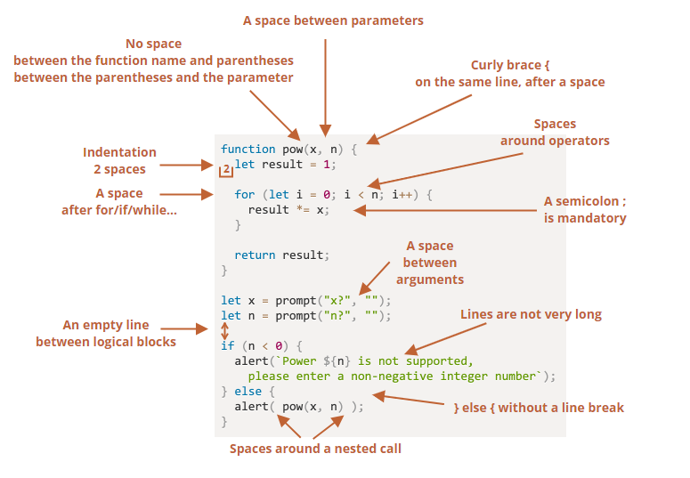

## 1. （掌握）立即执行函数

- 什么是立即执行函数？

  - 专业名字：**Immediately-Invoked Function Expression**（IIFE，立即调用的函数表达式）

  - 表达的含义是：**一个函数定义完后被立即执行**；

    - 第一部分是定义了一个匿名函数，这个函数有自己独立的作用域；
    - 第二部分是后面的 ()，表示这个函数被执行了；

    ```js
    (function() {
      console.log('立即执行函数')
    })()
    ```

- 这个东西有什么用？

  - 会创建一个独立的执行上下文环境，可以避免外界访问或修改内部的变量，也避免了对内部变量的修改；

    ```js
    var btns = document.querySelectorAll('.btn')
    for (var i = 0; i < btns.length; i++) {
    	(function(m) {
        btn[m].onclick = function() {
          console.log(`第${m}个按钮被点击了`)
        }
      })(i)
    }
    ```

### 立即执行函数的其它写法

- 立即执行函数必须是一个表达式（整体），不能是函数声明（了解即可）：

  - 下面的这种写法会报错，因为**是一个函数声明，不是一个函数表达式**；
  - 当圆括号出现在匿名函数的末尾想要调用函数时，它会默认将函数当成是函数声明。

  ```js
  function foo() {
    console.log('立即执行函数')
  }()
  ```

- 当圆括号包裹函数时，它会默认将函数作为表达式去解析，而不是函数声明；

  ```js
  (function foo() {
    console.log('立即执行函数')
  })()
  ```

- 下面是一个函数表达式，所以可以执行

  ```js
  +function foo() {
    console.log('立即执行函数')
  }()
  ```

  ```js
  (function foo() {
    console.log('立即执行函数')
  }())
  ```

## 2. （掌握）代码规范（风格）



## 3. （掌握）Chrome 的 debug 调试技巧


