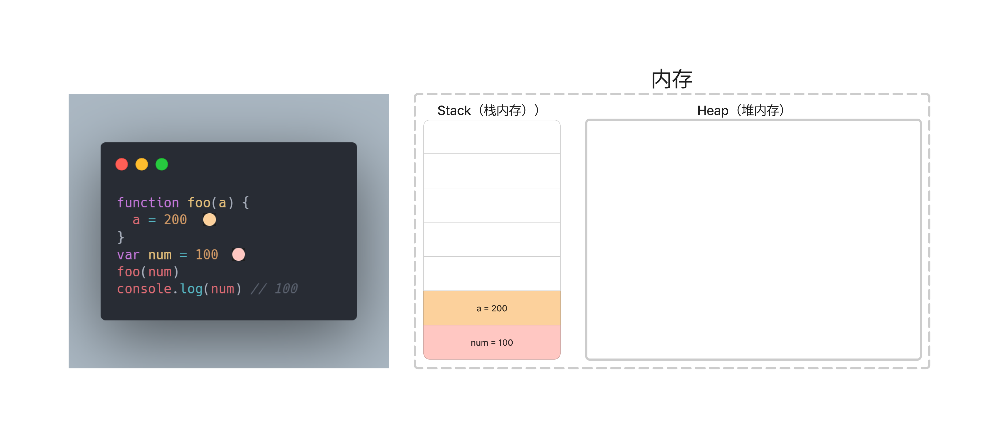
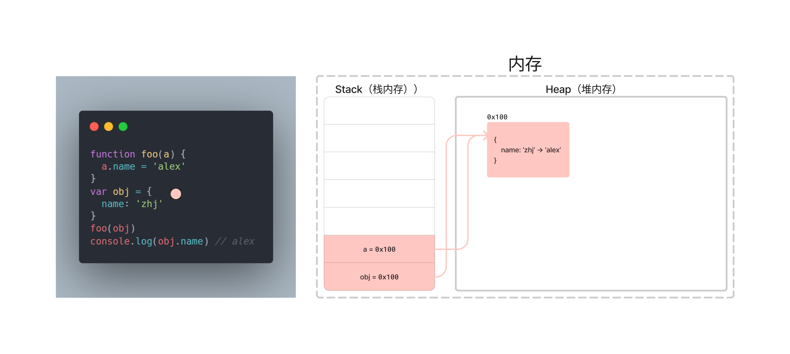

## 1. （掌握）对象类型的使用

### 认识对象类型

- 在数据类型中我们提到还有一种特别的类型：对象类型。
  - 对象类型涉及到 JavaScript 的各个方面，所以**掌握对象类型非常重要**；
  - 对象类型是一种**存储键值对（key-value）**的更复杂的数据类型；
- 为什么需要对象类型呢？
  - 基本数据类型可以存储一些简单的值，但是现实世界的事物抽象成程序时，往往比较复杂；
  - 比如**一个人**，**有自己的特性**（比如姓名、年龄、身高），**有一些行为**（比如跑步、学习、工作）；
  - 比如**一辆车**，**有自己的特性**（比如颜色、重量、速度），**有一些行为**（比如行驶）；
- 这个时候，我们需要一种新的类型将这些特性和行为组织在一起，这种类型就是对象类型。
  - 对象类型是**可以使用 {…} 来创建**的复杂类型，里面包含的是**键值对（key: value）**；
  - **键值对**可以是**属性和方法（在对象中的函数称之为方法）**；
  - 其中 **key 是字符串**（也叫做属性名（property name），ES6 之后也可以是 Symbol 类型，后续学习）；
  - 其中 **value 可以是任意类型**，包括基本数据类型、函数类型、对象类型等；

### 创建对象和使用对象

- 对象的创建方法有很多，包括（但不限于）以下三种：
  - **对象字面量（Object Literal）**：通过 `{}`；
  - **new Object** + 动态添加属性；
  - **new 其他类**；
- 目前我们主要掌握对象字面量的方式，后续我们学习其他两种方式。
  - 属性之间是以**逗号（comma）分隔**的；
- 对象的使用过程包括如下操作：
  - **访问**对象的属性；
  - **修改**对象的属性；
  - **添加**对象的属性；
  - **删除**对象的属性；

### 对象的常见操作

- 访问对象的属性：

  ```js
  // 访问对象的属性
  console.log(info.name)
  var age = info.age
  ```

- 修改对象的属性：

  ```js
  // 修改对象的属性
  info.name = "alan"
  info.age = 20
  ```

- 添加对象的属性：

  ```js
  // 添加对象的属性
  info.height = 1.88
  info.address = "北京"
  ```

- 删除对象的属性：delete 操作符

  ```js
  // 删除对象的属性
  delete info.age
  ```

### 方括号和引号的使用

- 为什么需要使用方括号呢？

  - 对于多词属性，点操作就不能用了：

    ```js
    // 无法理解的属性
    info.good friend = "Jack"
    ```

- 这是因为**点符号**要求 key 是**有效的变量标识符**

  - 这意味着**不包含空格，不以数字开头，也不包含特殊字符**（允许使用 $ 和 _）

- 这个时候我们可以使用**方括号**：

  - 方括号使得我们在定义或操作属性时更加的灵活：

    ```js
    var message = "Hello World"
    var obj = {
      "good friend": "Jack",
      [message]: "你好"
    }
    
    console.log(obj["good friend"])
    console.log(obj[message])
    ```

### 对象的练习

- 练习一：商品对象

  ```js
  var product = {
    name: '鞋子',
    desc: '男士运动鞋',
    price: 99.8,
    brand: '安踏'
  }
  ```

- 练习二：手机对象

  ```js
  var phone = {
    name: 'iPhone 14',
    desc: '对 iPhone 的描述信息',
    price: 888,
    callPhone: function(phoneNumber) {
      console.log('打电话给某人:', phoneNumber)
    },
    playMusic: function(songName) {
      console.log('播放音乐:', songName)
    }
  }
  ```

- 练习三：用户对象

  ```js
  var user = {
    id: 11111,
    account: 'sjj',
    nickname: 'alan',
    password: 'xxxxxxxx',
    avatarURL: '头像图片地址',
    role: {
      id: 2313,
      name: '管理员',
      createTime: '2027-10-01'
    }
  }
  ```

- 思考日常生活或者开发中都会有哪些对象？

### 对象的遍历

- 对象的遍历（迭代）：表示获取对象中所有的属性和方法。

  - **`Object.keys()`** 方法会返回一个由一个给定对象的自身可枚举的字符串属性名组成的数组。

- 遍历方式一：普通 for 循环

  ```js
  var infoKeys = Object.keys(info)
  for (var i = 0; i < infoKeys.length; i++) {
    var key = infoKeys[i]
    var value = info[key]
    console.log(`key: ${key}, value: ${value}`)
  }
  ```

- 遍历方式二：for...in 语句

  ```js
  for (var key in info) {
    var value = info[key]
    console.log(`key: ${key}, value: ${value}`)
  }
  ```

  需要注意的是，for...in 语句会遍历对象的所有（自有或继承）可枚举的字符串属性名字。如果不想枚举继承的属性，可以在循环体内添加一个显式测试：

  ```js
  for (var key in info) {
    if (!info.hasOwnProperty(key)) continue
    var value = info[key]
    console.log(`key: ${key}, value: ${value}`)
  }
  ```

## 2. （掌握）值类型和引用类型

### 栈内存和堆内存

- 我们知道程序时需要加载到内存中来执行的，我们可以将内存划分为两个区域：**栈内存**和**堆内存**。

  - **原始类型**占据的空间是在**栈内存**中分配的；
  - **对象类型**占据的空间是在**堆内存**中分配的；
    - 函数本身是放在堆内存中的，但函数的执行是在栈内存中的；


  

- 后续我们会学习图中的其它知识，目前我们先掌握堆和栈的概念即可。

### 值类型和引用类型

- 原始类型的保存方式：在变量中保存的是值本身
  - 所以原始类型也被称为**值类型**；
- 对象类型的保存方式：在变量中保存的是对象的“引用”
  - 所以对象类型也被称为**引用类型**；


### 思考下面的现象

- 现象一：两个对象的比较

  ```js
  var num1 = 123
  var num2 = 123
  console.log(num1 === num2) // true
  
  var obj1 = {}
  var obj2 = {}
  console.log(obj1 === obj2) // false
  ```

  

- 现象二：引用传递和值传递的内存区别

  ```js
  // 值传递
  function foo(a) {
    a = 200
  }
  var num = 100
  foo(num)
  console.log(num) // 100
  ```

  

  ```js
  // 引用传递，但在函数中创建了一个新对象，没有对传入的对象进行修改
  function foo(a) {
    a = {
      name: 'alex'
    }
  }
  var obj = {
    name: 'zhj'
  }
  foo(obj)
  console.log(obj.name) // zhj
  ```

  

  ```js
  // 引用传递，对传入的对象进行修改
  function foo(a) {
    a.name = 'alex'
  }
  var obj = {
    name: 'zhj'
  }
  foo(obj)
  console.log(obj.name) // alex
  ```

  

## 3. （掌握）函数的 this 指向

### 为什么需要 this

- 在常见的编程语言中，几乎都有 this 这个关键字（Objective-C），但是 JavaScript 中的 this 和常见的面向对象语言中的 this 不太一样：

  - 常见的面向对象的编程语言中，比如 java、C++、Swift、Dart 等等一系列语言中，**this 通常只会出现在类的方法中**；
  - 也就是你需要有一个类，类中的方法（特别是实例方法）中，**this 代表的是当前调用该方法的对象**；

- 但是 JavaScript 中的 this 更加灵活，无论是它出现的位置还是它代表的含义；

- 我们来看编写一个 obj 对象，有 this 和没有 this 的区别：

  

  

### this 指向什么

- 目前掌握两个 this 的判断方法：

  - 以**默认的方式**（函数名前面没有加别的东西）调用一个函数，this 指向 **window**；

    ```js
    function foo() {
      console.log(this) // window
    }
    foo()
    ```

  - 通过**对象调用**，this 指向这个**发起调用的对象**；

    ```js
    var obj = {
      bar: function() {
        console.log(this) // obj
      }
    }
    obj.bar()
    ```

- 后续我们还会学习其它，也会给大家总结 this 的规律；

